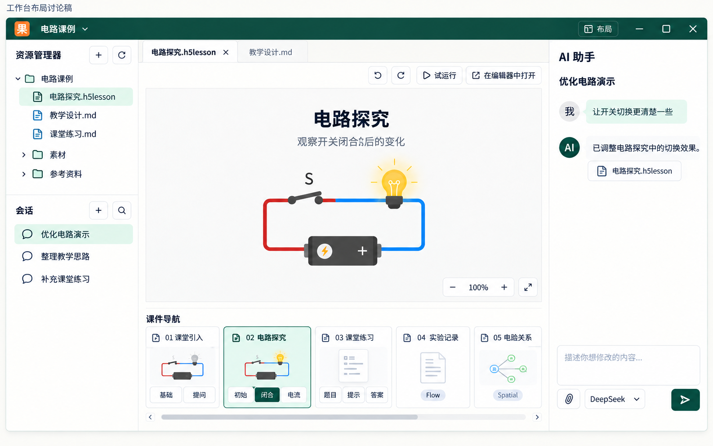

# 工作台与专业编辑器布局、日常编辑收敛

**决定日期：2026-09-23。** Owner 已确认本页主要布局与交互方向；尺寸和局部控件细节在实现时用真实截图与操作收敛。本次只更新方案，不表示功能已经实现或完成验收。对应现有 M01/M03/M04/M07/M10，不新增实施任务或改变依赖批次。

## 1. 产品目标与对象归属

工作台承担便利的多文件管理、内容生成、常见手动编辑和人机共编。用户应能在这里补文字、换图片、插入视频/音频、调整对象、就地要求 AI 修改；不能把“轻量”做成只能浏览和替换少数属性。专业编辑器继续承担精细图层、复杂交互、动画、组件与 Runtime 等深入编辑。

沿用左上角现有工作空间新建/切换入口。文件和会话属于工作空间并保持正交，不再叠加一个与工作空间同义的强制“项目”导航层级。这不删除 `.h5lesson` 内部 Course Project 身份、页面结构或场景树。

工作空间导航只组织文件和会话；场景、页面与其状态属于当前课件，显示在文档内容区内。切换文件不自动创建或切换会话；切换会话不自动替换当前文档。

## 2. 工作台默认布局

| 区域 | 默认内容 | 行为 |
|---|---|---|
| 左侧 | 资源管理器在上，会话列表在下 | 两者默认可见，资源管理器优先获得空间；用户可主动隐藏或调整大小，不靠频繁开关抽屉完成日常多文件管理 |
| 中间 | 文档标签、简洁工具栏、主要画布/正文；课件底部固定导航 | 画布优先获得空间，课件导航属于当前文档，不夹在工作空间文件和会话之间 |
| 右侧 | AI 助手，包含当前会话记录和输入区 | 工作台默认常驻；保留模型、发送、停止和必要上下文，详细配置及诊断按需进入 |

```text
工作空间新建/切换                                      布局与窗口控制
┌────────────────┬────────────────────────────────┬───────────────┐
│ 资源管理器     │ 文档标签 / 插入及常用工具       │ AI 助手       │
│ 文件与文件夹   │                                │ 当前会话记录  │
│                │          主要画布              │               │
├────────────────┤                                │               │
│ 会话列表       ├────────────────────────────────┤               │
│ 新建/搜索/管理 │ 场景 01      场景 02      场景 03│               │
│                │ [状态][状态] [状态][状态] [状态]│ 输入与发送    │
└────────────────┴────────────────────────────────┴───────────────┘
```

界面名称使用“资源管理器”，不简化成含义模糊的“文件”。会话列表标题、当前项、新建和搜索可发现；重命名、删除可从对应项菜单进入。顶部布局菜单区分资源管理器、会话列表、AI 助手等显示入口，避免“会话”同时指左侧列表和右侧聊天而无法辨认。

资源管理器沿用 Windows 常见操作习惯：单击选择、双击/Enter 打开、右键菜单、拖拽、F2 和复制/剪切/粘贴等快捷键。标题区只保留少量高频入口，如新建、刷新；不把整套文件操作铺成常驻按钮排。树、画布、聊天三个拖放目标分别承担文件操作、内容插入与附件添加，必须有清楚的落点反馈。

面板收展、尺寸与偏好遵循 M01。正常桌面默认保留上述三栏，打开课件或发起 AI 修改不自动隐藏文件/会话。窄窗口适配仍可按 M01 降级，但不把窄窗口策略当成常规多文件工作流。浮层、标签和内容不能因布局切换重建文档或任务。

## 3. 底部场景与状态导航

场景切换是高频行为。课件打开期间，底部场景/页面导航固定可见，不需要先展开目录浮层才能切场。

- 场景以横向紧凑卡片排列；每张卡片包含序号、名称和可压缩的小缩略图，其下直接显示该场景自己的小状态按钮。
- 场景为一级，场景的呈现状态为二级；当前场景卡片和该场景当前状态分别有明确选中样式。状态按钮不独立成脱离父场景的全局长条，也不与场景做互斥标签页。
- 点击场景切换目标场景；点击其状态按钮直接进入对应场景及状态。仅导航不产生正式内容变更或无意义的撤销记录；沿用已有导航和 ViewState 语义。
- 控制底栏高度、缩略图与按钮尺寸，把主要高度留给画布。场景多时横向滚动并让当前项可见，不随场景数量堆叠多行挤压画布。状态过多时的局部滚动/展开方式在真实样本中细化，不能失去状态的父场景标识。
- 场景/页面的增删、重命名、排序等既有能力仍须可达，具体低频操作可通过卡片菜单或既有编辑入口提供。

**保留完整课件导航语义。** Slides 的页面/场景及 presentation state、Flow 的页面/标题/章节、Spatial 的页面/世界与相机导航各自保留；Mix 只是已有表面的组合，不创建第四套内容模型。底部卡片是表现方式，不意味着把场景树数据扁平化或只保留 Slides。

Flow、Spatial 页面同样在底部有可直接切换的入口；没有场景呈现状态的对象不显示伪造的状态按钮。已有复杂层级如何在横向导航内展开，由实现时样例细化，验收必须证明分组/子项仍可定位、高频页面切换不依赖另开专业编辑器。这里的“状态”指场景呈现状态，不是任务运行状态或全局变量。

## 4. 插入与选中后的就地编辑

内容工具栏提供紧凑的“插入”入口，至少包含文字、图片、视频、音频。文字插入后可以直接输入；图片/视频/音频可以选择本地文件，也可从资源管理器拖入。插入明确作用于当前文档和合法的页面/内容位置，素材经已有资源导入与文档事务处理，不能只显示预览或临时路径。

选择对象后出现快捷工具条及按需属性浮层，而非再增加一整列常驻属性面板。讨论中的 `paragraphs` 在本方案统一表述为这组就地编辑控件，不新增内容类型。

| 选中对象 | 工作台内可直接完成的常见编辑 |
|---|---|
| 文字 | 直接输入/双击编辑；字体、字号、颜色、段落与适用的对齐设置 |
| 图片 | 替换、裁剪、适配，以及所属表面支持的位置/尺寸修改 |
| 视频、音频 | 替换媒体、既有公开播放设置；视频等可视对象支持合法的位置/尺寸修改 |
| 单个或多个画布对象 | 移动、缩放、必要对齐、适用的层级操作、删除；保持选区和撤销语义 |

无选中对象时不堆大量禁用属性；选择后优先显示常用项，详细项按需展开。已有元素、手动插入元素和 AI 生成的原生可编辑元素使用同一套入口。Runtime/Component 只开放已有合法属性与能力，不假称可以任意拆解其内部元素。

各表面保持自身对象模型。Flow 正文使用正文排版与合法媒体块，不能为复用拖动工具条把段落伪造成自由画布元素；Flow overlay、Slides 和 Spatial 各按既有 placement/selection 规则接入。工作台入口接已有领域能力，不能复制第二套 writer、资源系统或 History。撤销、保存、重开须保留内容和素材。

## 5. 元素级 AI 修改：保留快捷工具条内的原处入口

**保留 M04 已有的原处 AI 修改交互。** 用户点选元素或选择正文后，可以直接在弹出的快捷工具条内使用“AI 修改”，在其就地浮层输入要求、提交并观察原处结果。不能将该按钮改成只能聚焦右侧聊天、必须去右侧补输/发送；右侧助手被用户收起时，此入口也应可用。

右侧 AI 助手继续承担持续对话、生成和较大范围的任务；用户也可以主动在主输入框引用选择。两个入口提交到同一执行系统，复用连接、目标、授权、反馈和文档事务，不另造一套 AI 流程或独立内容副本；同一个请求不能被两处重复提交。

沿用 M04 的选择/pin/发送规则：已输入的要求不因焦点、文档或场景切换丢失；发送后的目标固定；空选区、已删除目标或不支持的多选明确处理，不悄悄扩大范围。结果仍可手动继续修改并统一撤销。将本项记录为保留能力及新增元素接入，不列成全新 Agent 子系统。

## 6. 专业编辑器

保留原有专业编辑器主体布局：课程结构/场景树、主要画布和场景状态区域继续服务深入编辑。工作台的新底部导航不要求专业编辑器同步重排。

进入专业编辑器后，工作台的全局顶栏、文件标题/模式切换行和文件标签栏均退出画面，专业编辑器自身工具栏贴顶并占满可用工作区；不能仅用遮挡保留三层空白高度。“返回工作台”放在专业编辑器自身工具栏中，不再在工作台外壳另设“返回轻量编辑”。返回后恢复工作台三栏、文件标签及进入前的文档和会话状态。

主要调整是把原有常驻右侧工具面板改为 WPS 式侧边按钮按需展开，元素、组件、图层、属性、互动、开发等既有工具按实际能力保留，AI 也位于侧边按钮组。默认只占窄按钮栏，点击展开对应面板并可收起；进入面板不得丢失选择、输入或正在进行的任务。

工作空间资源管理器与会话在专业编辑器中默认收起；如保留入口则浮出访问，不复制为常驻管理栏。工作台和专业编辑器编辑同一 DocumentSession，保持内容、资源、History、保存和任务连续，不能复制一个“编辑器专用工程”。

**待定：** 类似浏览器标签分离的独立编辑器窗口。本轮不将它列为实现或发布前置；若后续批准，仍共享同一文档权威，不以复制文档实现分窗。

## 7. 实施归属与剩余细节

| 既有任务 | 本次明确的职责 |
|---|---|
| M01 | 工作台三栏与左侧上下分区、可达收展入口、画布空间和模式布局偏好 |
| M03 | 底部场景/状态导航、四类基础元素插入、选择属性浮层、专业编辑器右侧按需面板 |
| M04 | 保留原处快捷工具条 AI 修改，复用四表面选区、固定目标和统一执行路径 |
| M07 / S10 | 左侧可管理的会话列表与右侧当前会话呈现，文件/会话正交 |
| M10 | 资源管理器名称、Windows 常见操作与简洁工具区 |
| M11 / M13 / M14 | 复用保存/撤销/高级能力保全与真实使用验证；不因本页新增另一套内核或验收体系 |

正常桌面布局、底部场景归属、原处 AI 修改和插入能力已经确定。具体像素尺寸、缩略图大小、属性控件次序、复杂导航的展开细节，在上述约束内由开发结合真实样本细化，不必反复重开整体布局选择。

保留正在推进的内核、harness、MCP、文件服务与媒体工作，按现有依赖和写域把这些界面要求纳入相关任务。已经实现的同源能力优先复用；若当前 UI 与本页不一致，在对应界面集成时调整，不要求停下全部开发或整体推倒重来。本页是当前 2.0 产品体验的细化，不是转入长期的路线。

## 8. 本次补充的检查点：待验证

以下细化既有验收项的执行场景，不是本次已运行的测试，也不新建第二份任务状态表。`acceptance_cases.json` 与 `task_registry.json` 仍由正在开发的集成会话维护；原有 passed/verified 仅覆盖各自已记录的定义与证据，不自动证明本页新布局已经完成。集成会话按实际差异决定补充验证与登记，仅在正式定义确需扩展时同步 JSON 和派生视图，保留仍有效的旧证据。

| 检查主题 | 对应既有用例 | 本次待验证内容 |
|---|---|---|
| 常驻三栏与文件/会话管理 | M01-T01/T02/T04、M07-T05、M10-T01/T03 | 正常桌面和 Windows 缩放下，左资源/会话、中内容、右 AI 可辨认；不用反复收展完成多文件工作；右键/拖拽/快捷键可用，未堆满操作按钮 |
| 场景与状态归属 | M03-T01/T02、M13-T01、M14-T01 | 连续切场、跨场景直接点状态、较多场景/状态及混合表面；底栏稳定，当前项可见，层级/Flow/Spatial 定位可达，画布有可用空间 |
| 插入、属性与资源 | M03-T01/T02、M11-T01、M13-T02 | 在工作台分别插入文字、图片、视频、音频并修改；资源树拖入内容有效，手动/AI 生成的合法元素使用同一入口；撤销重做、保存重开后内容与素材一致 |
| 就地 AI 入口保留 | M04-T01/T02/T03/T04/T05 | 收起右侧助手后仍能从选中快捷工具条输入并提交 AI 修改；目标高亮/固定正确，换选区不串写，两个入口共用执行和 History |
| 专业编辑器与返回 | M03-T03/T04、M01-T04 | 原有主体布局和高级操作保留；右侧工具/AI 按需展开；返回工作台保持同一文档、选择与任务，没有第二副本 |

视觉用真实窗口截图检查，操作用对应实际路径验证。既有通过证据在相关实现、条件与定义未变时继续有效；只补本次影响的验证，不凭示意图或文档校验标记产品通过。

## 9. 布局参考图



此图是 Owner 选定的布局方向参考，不是像素定稿或产品截图。它尚未画出随后确认的“插入”入口、选中后的属性浮层和快捷工具条内 AI 修改；以本页正文补齐。画布内教学内容仅为占位，不作为课件内容验收依据。
