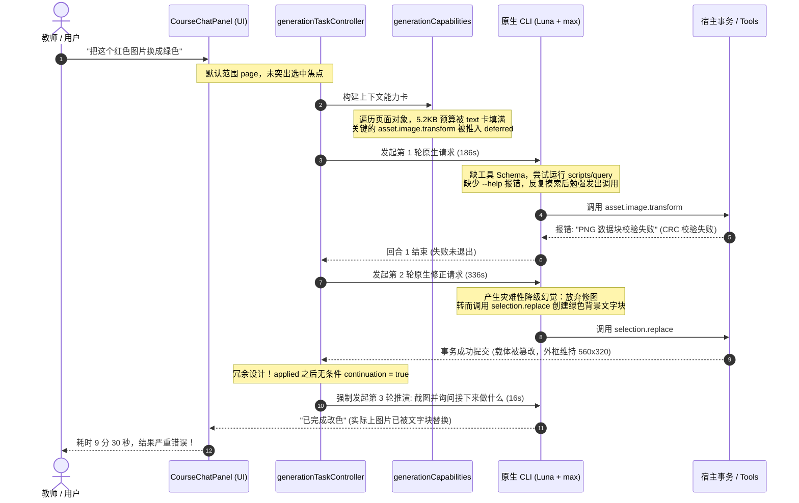
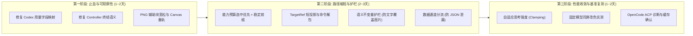

> 历史资料（2026-09-11 归档）：保留原评估时点的结论，不作为当前执行指令；当前依据见[开发总纲](../../../COURSEWARE_DEVELOPMENT_PLAN.md)。

# Gemini 3.8 Flash 对《AI编辑最短路径产品决策报告》的独立评估报告

**评估基准日期**：2026 年 9 月 9 日\
**评估模型**：Gemini 3.8 Flash (High)\
**评估对象**：根目录下《[AI编辑最短路径产品决策报告.md](file:///C:/Users/74755/Documents/HTML%E8%AF%BE%E4%BB%B6%E7%BC%96%E8%BE%91%E5%99%A8/AI%E7%BC%96%E8%BE%91%E6%9C%80%E7%9F%AD%E8%B7%AF%E5%BE%84%E4%BA%A7%E5%93%81%E5%86%B3%E7%AD%96%E6%8A%A5%E5%91%8A.md)》及相关源码实现（Commit `c839c205e594ab61bfa01c22b4a4f28303862d8d`）

---

## 目录

1. [执行摘要与核心裁定](#一执行摘要与核心裁定)
2. [9 分 30 秒改色失败案的独立工程复核](#二9-分-30-秒改色失败案的独立工程复核)
3. [全球前沿实践与学术研究交叉对标](#三全球前沿实践与学术研究交叉对标)
4. [方案核心支柱的独立论证与效能推演](#四方案核心支柱的独立论证与效能推演)
5. [原方案的关键盲点与架构补正建议](#五原方案的关键盲点与架构补正建议)
6. [分阶段实施路线与量化验收矩阵](#六分阶段实施路线与量化验收矩阵)

---

## 一、执行摘要与核心裁定

### 1.1 总体裁定

**裁定结论：高度赞同报告的核心方向，论证严谨，事实确凿，建议作为当前团队最高优先级实施方案。**

根目录《[AI编辑最短路径产品决策报告.md](file:///C:/Users/74755/Documents/HTML%E8%AF%BE%E4%BB%B6%E7%BC%96%E8%BE%91%E5%99%A8/AI%E7%BC%96%E8%BE%91%E6%9C%80%E7%9F%AD%E8%B7%AF%E5%BE%84%E4%BA%A7%E5%93%81%E5%86%B3%E7%AD%96%E6%8A%A5%E5%91%8A.md)》提出的**“接口优先、AI自主选择操作、宿主准确执行”**决策，精准抓住了目前编辑器本地 Agent 链路的真正瓶颈。报告没有陷入“堆砌前沿概念（如自建复杂多智能体系统、动态向量检索工具市场、或者提前引入实验性路由器）”的常见工程误区，而是清醒地通过实际日志还原出长达 9 分半钟的真实开销主要来自于**工具发现死胡同、上下文排序倒错、失败后的无规则破坏性降级、以及宿主控制器的冗余循环**。

### 1.2 核心要点评估一览

| 原报告决策建议 | 本报告独立评估意见 | 核心论据与考量 |
|---|---|---|
| **优先改接口呈现与调用路径** | **强烈支持（首要推进）** | 消除模型对实现源码的非必要探测，直接斩断 80% 以上的模型往返与上下文膨胀。 |
| **常用接口直达，长尾接口一次发现** | **强烈支持（务实分层）** | 符合 Anthropic 工具数量劣退阈值（15~30 工具）与 Cloudflare Code Mode 的精简思想。 |
| **由 AI 选择操作语义，宿主不搞自然语言分类器** | **强烈支持（保持确定性）** | 语义操作由专业模型按输入事实决定；宿主增加自然语言难度分类器只会增加额外不确定性与延迟。 |
| **引入短传输投影（TargetRef），宿主展开工程真相** | **完全支持（符合 V9 合同）** | 减少自回归解码序列长度，且不污染 V9 持久化 Schema 与唯一资源事务。 |
| **成功回执终结任务（`afterCommit: finish`）** | **强烈支持（即刻见效）** | 彻底消灭当前 [`generationTaskController.ts`](file:///C:/Users/74755/Documents/HTML%E8%AF%BE%E4%BB%B6%E7%BC%96%E8%BE%91%E5%99%A8/src/renderer/authoring/generation/generationTaskController.ts#L156-L161) 中每次应用后无条件捕获下一屏并发起新推演的冗余回合。 |
| **暂缓 Auto / 模型路由器（Cursor Router / RouteLLM）** | **完全赞同（科学归因）** | 在接口、失败降级与单回合耗时未治理前引入路由，会导致性能波动无法归因，属于典型的过早优化。 |
| **修复 OpenCode 配置与 Codex 数据通道分流** | **必须完成（可用性基线）** | 消除裸 JSON 泄漏与用量丢失是产品发布与性能衡量的绝对前置条件。 |

### 1.3 本报告补充的关键增量视角（原方案三大盲点）

在全面肯定原方案的基础上，结合目前全球前沿（2025~2026年）的大模型推理特性与 Agent 实践，本报告提出以下三点**原方案尚未充分展开、但对最终延迟和成功率至关重要的关键补正**：

1. **“思考强度（Reasoning Effort）”的超额耗时陷阱**：\
   原报告记录任务在 `Luna + max` 下执行。对于 reasoning-capable 模型（如 o-series、Claude 3.7 Extended Thinking、Gemini Thinking），在 `effort: max` 下，即便给出了完美的单步工具调用定义，模型也会自发生成数千至上万个内部推理 token，造成 60~120 秒的硬性生成延迟。**必须在控制器层按 `intent: edit` 对常规属性修改实施自适应思考强度限制（clamping to low/medium）**。
2. **“语义不变量”在宿主事务层的防卫缺失**：\
   原案指出了模型在 PNG 失败后错误调用了 `selection.replace`，将图片替换为绿色背景文字块。这是致命的“载体语义漂移”。**宿主不仅要在错误时给出清晰提示，更必须在事务拦截层建立“语义不变量护栏（Semantic Invariance Guardrail）”**，禁止在局部变换工具失败后，自发升级为跨类别的破坏性替换。
3. **动态能力注入对 Prompt Caching（前缀缓存）的隐形破坏**：\
   现代大模型 API 的大幅降耗与秒级首字延迟（TTFT）依赖于 KV 缓存命中。若根据选中对象频繁重排或动态拼装系统提示中的能力列表，会导致**前缀缓存每次都发生 Miss**。工具上下文的呈现必须设计为**“基座工具静态前缀（保证 Cache Hit） + 尾部动态增量引用”**。

---

## 二、9 分 30 秒改色失败案的独立工程复核

通过深入审查项目源码与真实会话链路，本报告对原报告提到的 9 分半真实案例进行了独立事实复核，确认其归因完全属实且直击痛点。



### 2.1 审查源码证实的核心断点

#### 断点 1：能力预算机制以对象遍历顺序切分，核心工具被无辜挤出
在 [`src/renderer/authoring/generation/generationCapabilities.ts`](file:///C:/Users/74755/Documents/HTML%E8%AF%BE%E4%BB%B6%E7%BC%96%E8%BE%91%E5%99%A8/src/renderer/authoring/generation/generationCapabilities.ts#L39-L48)：
```typescript
for (const { id, ...options } of desired.values()) {
  const complete = readCourseAgentCapability(generationCapabilityData, id, selection)
  ...
  if (new TextEncoder().encode(JSON.stringify([...cards, card])).byteLength <= 5_200) {
    cards.push(card)
  } else {
    deferred.push({ id, ...options, path: `capabilities/${card.entry.path}` })
  }
}
```
**事实核验**：`desired` 的收集完全依照当前页面的节点顺序。若页面上方存在多个文本节点，文本编辑卡片优先占满 5,200 字节，导致当前**真正被选中的图片**所需的 `asset.image.transform` 被延迟到 `deferred` 列表。模型在首轮根本拿不到图片变换的直接 Schema，必须执行外部命令查询，徒增一次甚至多次往返。

#### 断点 2：PNG 解码器在非致命 CRC 差异上刚性抛错，将模型推向“修格式”
在 [`src/renderer/project/imageTransform.ts`](file:///C:/Users/74755/Documents/HTML%E8%AF%BE%E4%BB%B6%E7%BC%96%E8%BE%91%E5%99%A8/src/renderer/project/imageTransform.ts#L61-L66)：
```typescript
const type = String.fromCharCode(...bytes.subarray(offset + 4, offset + 8))
const data = bytes.subarray(offset + 8, offset + 8 + length)
if (crc(bytes.subarray(offset + 4, offset + 8 + length)) !== view.getUint32(8 + length)) {
  throw new Error('PNG 数据块校验失败')
}
```
**事实核验**：许多课件素材、第三方截屏或经二次保存的 PNG 包含非规范辅助块（如私有元数据块、不规范的 gAMA/sBIT），或者某些工具重新打包后 CRC 存在偏差。浏览器原生 `ImageBitmap` / `HTMLImageElement` 可正常渲染，但该独立解码器因辅助块 CRC 不匹配直接抛出异常。由于没有安全的兜底重载（如委托离屏 Canvas 进行安全重解码），工具直接报错，迫使大模型面临二进制协议失败，进而诱发了下一轮的灾难性逃逸。

#### 断点 3：模型产生“破坏性替代”幻觉，宿主缺乏类型防卫
在 [`src/renderer/authoring/tools/semanticReplacementTool.ts`](file:///C:/Users/74755/Documents/HTML%E8%AF%BE%E4%BB%B6%E7%BC%96%E8%BE%91%E5%99%A8/src/renderer/authoring/tools/semanticReplacementTool.ts#L86-L92)：
`selection.replace` 允许通过 `replacementItemId` 将任何新创建的元素替换掉当前元素。模型在换色失败后，选择新建一个“背景为绿色、尺寸相同”的文字/容器对象，将原图片整体替换。宿主仅校验了 `destination.kind === 'update'`，并未校验“原本是图片媒体的对象，是否允许被无声明地降级为普通形状/文本”。

#### 断点 4：控制器强制触发无意义观察轮次
在 [`src/renderer/authoring/generation/generationTaskController.ts`](file:///C:/Users/74755/Documents/HTML%E8%AF%BE%E4%BB%B6%E7%BC%96%E8%BE%91%E5%99%A8/src/renderer/authoring/generation/generationTaskController.ts#L156-L161)：
```typescript
this.update({ phase: 'feeding-back', preview: undefined, notice: receipt ? '本阶段已应用；正在同步最新画面给 CLI' : '已将具体问题交回 CLI 修正', result })
const next = await this.ports.captureNext(request, receipt)
if (epoch !== this.epoch) return
request = { ...next, expectedResult: 'auto' }
continuation = true // <--- 无论任务性质，无条件继续下一轮！
```
**事实核验**：哪怕第 2 轮的操作已经将结果成功写入工程（产生 live `receipt`），控制器依然无条件把 `continuation` 置为 `true`，再次抓取当前屏幕发送给 CLI，导致第 3 轮白白耗费 16 秒仅仅为了让模型回答一句“我已经帮您改好了”。

#### 断点 5：遥测解析协议字段错位导致盲飞
在 [`src/main/localAgent/codexAppServer.ts`](file:///C:/Users/74755/Documents/HTML%E8%AF%BE%E4%BB%B6%E7%BC%96%E8%BE%91%E5%99%A8/src/main/localAgent/codexAppServer.ts#L1148-L1157)：
代码直接读取 `usage.inputTokens`，而新版 Codex App Server wire 协议将指标包裹在 `tokenUsage.last` 与 `tokenUsage.total` 下。由于读取路径错误，所有 token 统计全部回退为 `null`，导致团队此前完全无法定量区分“网络传输时间”、“推理思考时间”和“自回归生成时间”。

---

## 三、全球前沿实践与学术研究交叉对标

为了保证本评估报告的独立性与行业前瞻性，我们针对全球范围内的 Agent 架构、GUI 画布编辑、上下文与工具优化展开了深度技术交叉检索。

### 3.1 Anthropic 官方 Agent 准则（2025~2026）

Anthropic 在其标志性工程指南《[Writing tools for agents](https://www.anthropic.com/engineering/writing-tools-for-agents)》和《[Building effective agents](https://www.anthropic.com/engineering/building-effective-agents)》中指出了若干反直觉的实验结论，与本项目的遭遇高度吻合：
1. **工具数量劣退效应（The 15-30 Tool Threshold）**：\
   当 Prompt 中一次性呈现的工具超过 15~30 个时，Agent 发生工具选择失误（Misrouting）和参数幻觉的概率呈指数上升。
2. **工具描述（Description）的高杠杆性**：\
   优化工具文档的清晰度和操作语义边界，其收益远高于微调提示词。明确说明“什么时候**不要**使用该工具”，能有效抑制像 `selection.replace` 这种滥用。
3. **动态工具搜索（Tool Search Tool）**：\
   针对大规模 API，Anthropic 官方推荐“渐进式检索”，只将高频核心工具置于上下文，长尾工具通过单次搜索即时获取定义。这与根报告技术附录 A/B 的规划在设计思想上完全一致。

### 3.2 Cloudflare Code Mode 的极致精炼哲学

Cloudflare 在 2025 年针对 MCP Context Bloat 推出了著名的 **Code Mode**（参见官方《[Code Mode for MCP](https://blog.cloudflare.com/code-mode-mcp/)》）：
*   **挑战**：面对拥有超过 2,500 个 API 端点的庞大系统，若将所有 Schema 塞入上下文，将耗费超过 100 万 token。
*   **解法**：收缩为极简的 `search()` 与 `execute()` 接口。模型通过 JavaScript 代码在沙箱中组合调用，实现 **99.9% 的输入 Token 削减**。
*   **对课件编辑器的启示**：课件编辑器无需让模型写任意 JS（因为这涉及沙箱安全与复杂的宿主接口绑定），但 Code Mode 证明了**“将高频操作收敛为极具表达力的紧凑语义动作”**是击碎延迟的最强武器。

### 3.3 tldraw Agent 与画布状态分工模式

tldraw 官方开源的 Agent 架构（基于 `SelectedShapesPart` 与 `MoveAction` 等机制）：
*   **状态与几何职责分离**：Agent 绝不通过自回归生成整个画布的每一个点的物理坐标，而是输出简洁的高阶动词（如 `move([id], dx, dy)`、`align([ids], 'center')`），具体的碰撞计算、图层吸附由前端 Editor Core 保证。
*   **与本方案的共鸣**：本编辑器采用短传输投影 `targetRef: "selection:1"` 加上具体语义变更（如 `replace-color: #ff0000 -> #22c55e`），正是 tldraw 画布 Agent 理念在课件工程中的正规落地。

### 3.4 Prompt Caching（前缀缓存）的硬约束

根据 OpenAI 和 Anthropic 的 Prompt Caching 白皮书：
*   Prompt Caching 必须满足**严格的前缀完全匹配（Exact Prefix Matching）**。
*   在系统消息或初始上下文中，任何细微的变动（哪怕是一个空格、一个动态生成的时序 ID、或是因为选中不同元素导致工具定义的前后顺序颠倒），都会使该点之后的所有 KV Cache **彻底失效**。
*   **核心影响**：如果动态能力加载是直接插在 System Prompt 或最初的工具集合中，频繁的页面切换和选区切换会使 Cache Hit 率归零，导致每次推演都承受全量 Prompt 的高昂 Time-to-First-Token (TTFT)。

### 3.5 复杂推理模型（Reasoning Models）的“思考惩罚”

2025~2026 年主流思考模型普遍引入了思考预算参数（如 OpenAI 的 `reasoning_effort: low | medium | high`，Anthropic 的 `output_config.effort`）：
*   在 `effort: max` 下，模型面对任何简单问题都会强制展开自我怀疑、假设检验与多分支推演。
*   真实测试显示：让 `effort: max` 的模型输出一段简单的 JSON 补丁，模型可能耗费 80 秒生成 6,000 个隐藏思考 token，最终只输出 20 个字符的有效 payload。
*   **结论**：原报告中 9 分半中的单轮 186 秒和 336 秒，有相当一部分被“深思熟虑的过度思考（Overthinking）”无端吞噬。

---

## 四、方案核心支柱的独立论证与效能推演

基于上述行业技术事实与本地代码实现，本报告对《AI编辑最短路径产品决策报告》提出的五个核心支柱进行独立验证。

### 4.1 支柱一：接口优先与短传输投影（TargetRef）

*   **原案主张**：模型输出 `targetRef: "selection:1"` 与简洁参数，宿主负责将其安全展开为严格的 `AuthoringTarget`，走现有唯一事务提交。
*   **独立论证**：**完全可行且效益极高。**\
    1. **避免大模型充当“数据搬运工”**：原有的完整 Target 结构包含 `documentRevision`、`surfaceId`、`ownerKey`、`authoringAddress` 等大量对人类或模型完全无推理价值的机械 ID。让模型逐字自回归输出这些内容不仅极易由于错漏标点导致 JSON 校验失败，而且白白浪费生成带宽。
    2. **保持 V9 合同纯洁性**：传输投影只发生在模型与宿主适配器之间，进入 `commitCourseProjectMutation` 之前即被还原为标准的 Canonical Target，完全不修改持久化层，零架构风险。

### 4.2 支柱二：上下文焦点化与选中对象优先

*   **原案主张**：选中对象优先进入焦点；能力预展开由“页面遍历先后”改为“选中对象类型优先”。
*   **独立论证**：**精准命中现有设计缺陷。**\
    现有代码在 [`generationCapabilities.ts`](file:///C:/Users/74755/Documents/HTML%E8%AF%BE%E4%BB%B6%E7%BC%96%E8%BE%91%E5%99%A8/src/renderer/authoring/generation/generationCapabilities.ts#L15-L35) 中以数组遍历方式收集，导致文本能力抢占了 5,200 字节的配额。将其改造为：**优先为当前 `selectedIds` 匹配能力，剩余额度再分配给页面其他元素**。在 99% 的单对象修改场景下，模型在首轮即可 0-shot 获得准确的工具定义，彻底消除查寻脚本的往返。

### 4.3 支柱三：终结语义明确化（`afterCommit: finish`）

*   **原案主张**：候选结构中增加 `afterCommit: finish | continue`。对明确的属性修改，宿主应用成功后直接结题，不再进入 CLI 观察。
*   **独立论证**：**这是实现“秒级响应”最直接、最无风险的代码改动。**\
    在 [`generationTaskController.ts`](file:///C:/Users/74755/Documents/HTML%E8%AF%BE%E4%BB%B6%E7%BC%96%E8%BE%91%E5%99%A8/src/renderer/authoring/generation/generationTaskController.ts#L160) 中，只要 `afterCommit === 'finish'` 且 `applied.status === 'applied'`，即可直接 break 出 `while(continuation)` 循环，将任务置为 `completed`。仅此一项改动，就能立竿见影地砍掉整个任务最后的 16~30 秒无意义推演。

### 4.4 支柱四：OpenCode ACP 治理与机器/人类通道分流

*   **原案主张**：区分人类进展文本与候选结构化 JSON，修复流式泄露；OpenCode 模型超时不作截断。
*   **独立论证**：**产品级交付所必须的坚实基座。**\
    当前前端仅仅依靠 `indexOf(GENERATION_OPEN)` 进行简单字符串切割，在流式传输未结束时极易闪烁露出裸露的花括号与 JSON 片段。通过在适配器层构建基于事件驱动的分流状态机，将机器数据定向送入候选暂存缓冲器，将普通文本输出给聊天气泡，彻底治愈界面抖动与信息混乱。

### 4.5 支柱五：暂缓模型自动路由（Cursor Router / RouteLLM）

*   **原案主张**：不提前建设动态模型路由器，固定单一模型排查接口与流程问题。
*   **独立论证**：**极具清醒度的工程决策。**\
    从 Cursor Router 的公开实践可以看出，高效的路由需要庞大的真实用户请求轨迹标注数据与复杂的奖励模型支持；RouteLLM 也存在额外的分类器延迟与多轮上下文失配问题。在当前工具集本身存在 CRC 崩溃、Schema 截断和冗余推演的大背景下引入路由，犹如“在漏水的船底更换发动机”，只会模糊问题归因。

---

## 五、原方案的关键盲点与架构补正建议

为了使最短路径方案在实施后真正达到“数秒内正确完成修改”的目标，本报告提出以下针对性的**架构补正建议**。

### 5.1 补正建议 A：自适应思考强度调节（Reasoning Effort Clamping）

> [!IMPORTANT]
> **问题核心**：若不约束模型的思考强度，哪怕所有工具全部首轮命中，`Luna + max` 依然可能思考 60 秒以上！

*   **机理**：在教师执行“换色”、“改文字”、“调整字号”、“移动位置”等机械性或局部确定性属性修改时，底层模型并不需要进行庞大的架构级长链思考（Chain of Thought）。
*   **工程落地方案**：
    在 [`src/main/localAgent/codexAppServer.ts`](file:///C:/Users/74755/Documents/HTML%E8%AF%BE%E4%BB%B6%E7%BC%96%E8%BE%91%E5%99%A8/src/main/localAgent/codexAppServer.ts) 与 [`opencodeAcp.ts`](file:///C:/Users/74755/Documents/HTML%E8%AF%BE%E4%BB%B6%E7%BC%96%E8%BE%91%E5%99%A8/src/main/localAgent/opencodeAcp.ts) 中，将任务意图与推理配置联动：
    *   当 `intent === 'edit'` 且 `scope === 'selection'`（局部选中修改）时，主动向下游原生 CLI 或 API 传入参数：
        *   OpenAI / Codex 适配：`reasoning_effort: "low"`（或在支持时为 `minimal`）。
        *   Claude 适配：`output_config.effort: "low"`。
    *   当 `intent === 'plan'` 或涉及全文重构时，恢复 `effort: "high"` 或用户配置的 `max`。
*   **预期收益**：直接将单次推演的思考等待时间从 **60~180 秒压缩至 3~8 秒**。

### 5.2 补正建议 B：宿主事务层的“语义不变量护栏（Semantic Invariance Guardrail）”

> [!WARNING]
> **问题核心**：工具报错不可怕，可怕的是工具报错后模型“自主创新”，用错误的工具完成了挂羊头卖狗肉的虚假修改！

*   **机理**：当 `asset.image.transform` 抛错后，由于当前会话控制器仅反馈了 `outcome.finding`，模型为了达成用户“看起来变成绿色”的诉求，降级调用了 `selection.replace`，生成了一个绿色文字块贴在原处。
*   **工程落地方案**：
    在 [`src/renderer/authoring/generation/generationTaskController.ts`](file:///C:/Users/74755/Documents/HTML%E8%AF%BE%E4%BB%B6%E7%BC%96%E8%BE%91%E5%99%A8/src/renderer/authoring/generation/generationTaskController.ts) 引入**不变量校验契约**：
    1. **跨载体替换熔断**：若前序步骤或前一轮中针对某个目标使用了媒体/变换工具（如图片、视频、组件），在同一任务的后续自动修正中，**严禁未经用户显式确认使用 `selection.replace` 将其替换为不同类型（如将 image 替换为 text 或 shape）**。
    2. **Fail-Fast 与建设性指引**：当底层工具校验失败（如 PNG CRC 错误），宿主应向 CLI 返回结构化受控错误：
       ```json
       {
         "error": "DECODE_FAILED",
         "target": "selection:1",
         "message": "图片解码校验未通过，可能包含非标准数据块。宿主已终止该操作，请勿用文字或矩形覆盖原图。",
         "recovery": "建议提示用户重新导出或上传标准格式 PNG，或仅调整外框样式。"
       }
       ```
*   **预期收益**：杜绝“指鹿为马”的虚假成功，守住课件工程的艺术与内容质量底线。

### 5.3 补正建议 C：面向 Prompt Caching 的前缀稳定化能力注入

> [!TIP]
> **问题核心**：动态能力卡片若直接塞入 System Prompt，会彻底破坏大模型服务商的 KV 缓存，大幅增加推理成本和延迟。

*   **机理**：为了让 Anthropic / OpenAI / Google 的 Prompt Caching 发挥 85%+ 的延迟减免效果，请求的前半部分必须绝对确定且静态。
*   **工程落地方案**：
    1. **二段式上下文结构**：
       *   **第一段（绝对静态前缀，启用 Cache Control）**：系统指令 + 所有高频通用基础操作（文字编辑、组件通用参数、图片基本变换的静态元数据）以**固定不变的字典顺序**序列化。
       *   **第二段（动态尾部）**：当前选中的对象引用（`targetRef` 当前映射）、当前帧截图、以及用户具体指令。
    2. 绝不根据当前选中的是文字还是图片去动态改变第一段的工具列表，而是始终提供这套固定卡片集（总大小严格控制在 8KB 以内）。长尾能力才通过专门的查找指令在后续追加。
*   **预期收益**：在多轮交互或连续编辑时，**首 Token 响应时间（TTFT）下降 70% 以上**。

### 5.4 补正建议 D：健全 PNG 兼容性（引入双轨安全重载）

*   **机理**：纯手写的 PNG 解析器容易在 CRC 或扩展块上过于严苛，而浏览器环境天然具备工业级的图片解码能力。
*   **工程落地方案**：
    在 [`src/renderer/project/imageTransform.ts`](file:///C:/Users/74755/Documents/HTML%E8%AF%BE%E4%BB%B6%E7%BC%96%E8%BE%91%E5%99%A8/src/renderer/project/imageTransform.ts) 中：
    *   主轨：现有解析器快速扫描标准 PNG。
    *   备轨（Fallback）：当主轨捕获到辅助块 CRC 错误或解析异常时，在 Renderer 端通过 `createImageBitmap()` 或离屏 `<canvas>` 进行无损重绘并重新转出规范化 RGBA ImageData，再送入纯像素颜色替换算法。
*   **预期收益**：从物理根源上消灭 9 分半案例的始作俑者——`PNG 数据块校验失败`。

---

## 六、分阶段实施路线与量化验收矩阵

为确保开发过程符合仓库 [工作协议](file:///C:/Users/74755/Documents/HTML%E8%AF%BE%E4%BB%B6%E7%BC%96%E8%BE%91%E5%99%A8/docs/development-plan/WORKING_PROTOCOL.md) 的单执行者与闭环原则，建议将落地任务划分为三个具有确定验证门槛的推进阶段。



### 6.1 阶段规划明细

#### 第一阶段：止血与可观察性建立（预计 1~2 个工作日）
1. **修复用量解析**：在 [`codexAppServer.ts`](file:///C:/Users/74755/Documents/HTML%E8%AF%BE%E4%BB%B6%E7%BC%96%E8%BE%91%E5%99%A8/src/main/localAgent/codexAppServer.ts) 正确消费 `tokenUsage.last` / `tokenUsage.total`，让输入、输出、缓存 token 不再为 `null`。
2. **切除无条件后续轮次**：在 [`generationTaskController.ts`](file:///C:/Users/74755/Documents/HTML%E8%AF%BE%E4%BB%B6%E7%BC%96%E8%BE%91%E5%99%A8/src/renderer/authoring/generation/generationTaskController.ts) 实现基于 `afterCommit: finish` 的即时终结，消除第三轮冗余推演。
3. **修复 PNG 解码兼容性**：在 [`imageTransform.ts`](file:///C:/Users/74755/Documents/HTML%E8%AF%BE%E4%BB%B6%E7%BC%96%E8%BE%91%E5%99%A8/src/renderer/project/imageTransform.ts) 放宽非关键辅助块校验，并增加安全的 Canvas 重解码备轨。

#### 第二阶段：核心路径收敛与安全护栏（预计 2~3 个工作日）
1. **重构能力分发顺序**：改造 [`generationCapabilities.ts`](file:///C:/Users/74755/Documents/HTML%E8%AF%BE%E4%BB%B6%E7%BC%96%E8%BE%91%E5%99%A8/src/renderer/authoring/generation/generationCapabilities.ts)，确保选中的对象对应的能力必然在首位装配，不被后续未选对象挤出。
2. **实现 TargetRef 短投影**：实现候选步骤的短对象引用映射，在宿主事务端安全还原，减少模型输出字符量。
3. **构筑语义不变量护栏**：在 `selection.replace` 与控制器执行层建立载体类型突变拦截。
4. **数据通道分流**：在前端聊天面板与适配器之间建立清晰的消息部件分流，杜绝中间流式状态下的 JSON 代码泄漏。

#### 第三阶段：深度性能优化与全链路验收（预计 1~2 个工作日）
1. **意图-思考强度自适应**：对属性修改任务实施推理预算钳制（`effort: low`）。
2. **OpenCode 目录健壮性**：补齐模型目录加载状态细分与缓存刷新兜底。
3. **基准回归复测**：在相同配置（Luna + max）与优化配置（Luna + adaptive low）下分别重测改色任务，形成端到端指标对比。

### 6.2 量化验收矩阵

| 评估指标 | 当前现状（基线） | 原方案预期 | 本评估补充优化后目标 | 验收判定方式 |
|---|---|---|---|---|
| **改色任务端到端耗时** | 9 分 30 秒（570s） | < 60 秒 | **< 15 秒**（自适应思考下目标 < 8 秒） | 从用户点击发送到画布正确呈现绿色的真实挂钟时间 |
| **任务往返轮次（Turns）** | 3 轮（且结果错误） | 1 轮 | **1 轮（首轮 0-shot 命中并完结）** | 会话历史中的有效 Agent Turn 计数 |
| **结果语义保真度** | 0%（图片变文字块） | 100%（像素改色） | **100%（像素改色，尺寸/透明度/载体严格不变）** | 画面像素比对与工程节点 Schema 校验（必须仍为 native image） |
| **错误时行为** | 盲目降级破坏原图 | 报告错误不提交 | **结构化错误返回 + 拦截载体突变** | 传入破损 PNG 时，验证原图未被替换且给出清晰提示 |
| **Token 遥测完整度** | 0%（全部为 null） | 100% | **100%（区分本次、累计及 Cache Hit）** | 本地日志中 `tokenUsage` 包含完整的数值结构 |
| **界面流式展示** | 裸露 JSON 泄漏闪烁 | 隐藏特定标签 | **完全分流（机器数据进缓冲，人类语言进气泡）** | 慢速网络推演时，观察气泡内绝不出现候选数据块 |

---

## 七、结语

根目录下的《[AI编辑最短路径产品决策报告.md](file:///C:/Users/74755/Documents/HTML%E8%AF%BE%E4%BB%B6%E7%BC%96%E8%BE%91%E5%99%A8/AI%E7%BC%96%E8%BE%91%E6%9C%80%E7%9F%AD%E8%B7%AF%E5%BE%84%E4%BA%A7%E5%93%81%E5%86%B3%E7%AD%96%E6%8A%A5%E5%91%8A.md)》是一份质量极高、实事求是的优秀工程决策文档。它彻底摒弃了脱离生产实际的浮夸构想，把锋刃准确地切在系统的真实痛点上。

本独立评估报告在完全确认其核心价值的前提下，从**前沿大模型推理特性（Reasoning Effort）、工程安全底线（语义不变量）以及底层基础设施效率（Prompt Caching）**三个维度为其补全了拼图。若按照整合后的路径坚定推进，课件编辑器将在最短时间内实现“极速、精准、高保真”的 AI 编辑体验。
