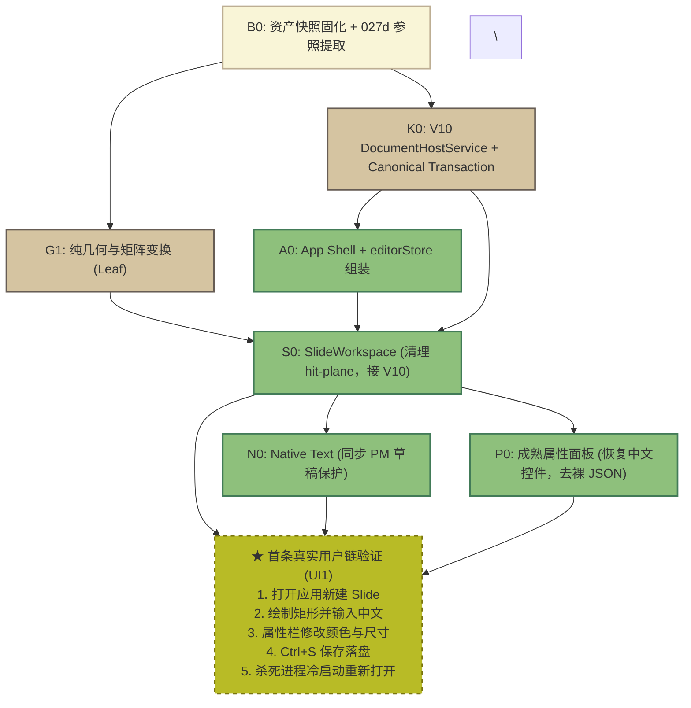

# 《稳定基线恢复与 V10 渐进替换：完整并发开发计划》深度审查与评估报告

- **评估方**：Antigravity（独立只读审查）
- **审查对象**：`docs/development-plan/component-platform-refactor/BASELINE_FIRST_V10_EXECUTION_PLAN.md`（由主执行者 Root 撰写、Astra 审阅）
- **候选代码仓库**：`D:/果铃恢复候选/20261005-authoring`（分支 `codex/authoring-recovery-20261005`，HEAD `b0076bc0`）
- **历史关键提交节点**：`64d97fa2` -> `5f6fa9d7` -> `027d588a` -> `6d93aca0`（V10 巨提交）
- **审查性质**：只读全维度深度审查（无代码修改、未执行回退、未运行构建与模型调用）

---

## 一、 审查结论与裁决依据

### 裁决结论：【修正后可实施】

### 核心判定依据：
1. **战略路线正确且不可逆转**：方案确立的“放弃全量重写、以 V9 成熟完整前端为交互与视觉底座、沿解耦端口渐进将后端数据替换为 V10”的路线，完全符合工业界大型重构的最佳实践（如 GitHub 渐进解耦 jQuery、VS Code Notebooks 迁移），能从根本上遏制过去数天“越修回退越多、丢弃成熟手感与交互细节”的恶性循环。
2. **计划存在多处致命的可执行性断层与阻断缺陷**：方案虽然宏观方向正确，但在**基线定性、独占写域划分、底层异步时序设计、依赖图（DAG）编排**上存在多处致命漏洞。如果直接按原文档派发执行，**必然在第 1 天引发 Git 资产丢失、写域死锁、键盘打字吃字以及 Flow 递归死循环**。
3. **必须修正而非推倒重来**：缺陷集中在任务划分与局部契约衔接，无需推翻“基线优先”的整体路线。只要将本报告指出的 **10 项硬阻断缺口** 修正闭合，该计划完全足以指导平稳落地。

---

## 二、 逐项审查：具体缺陷、证据链与失败推演

### 维度 1：基线与保全（候选定性、资产固化与环境隔离）

#### 问题 1.1：盲目将未经验收的 `027d588a` 定性为“成熟稳定完整软件”
- **计划章节**：第 1 节（L11）、第 2.1 节（L30）、第 11 节（L304）
- **直接源码与 Git 证据**：
  1. `git show 027d588a` 显示该提交仅修改了 4 个 Markdown 文件，代码与父提交 `5f6fa9d7` 100% 相同；
  2. 查阅其自带的 `TAKEOVER_2026-10-04.md`，明确记载：键盘/翻页笔验收**“待做”**、实际创作与体验**“待做”**、真实模型作品验收**“待做”**。仅 4.5 小时后主线就合入了 V10 巨提交 `6d93aca0`，`027d588a` **从未经历过实机发行或完整验收**；
  3. `027d588a` 的 Slide 模块高达 3976 行，充斥着 Phaser 节点、iframe postMessage 与 Native 的混合临时状态；Flow 自身存在未定位的 Max-depth 递归死循环；Spatial 仅在 2 个提交前才紧急修补保存崩溃。
- **具体失败链**：计划将 `027d588a` 视为零缺陷基准 -> E3 按照第 9.2 节实测 UI3（Flow）等短链时必然复现原版自带 bug -> 触发步骤 4“参照失败时先定位具体原版缺陷” -> 开发者被迫陷入排查与修复已废弃的 V9 原版缺陷中 -> V10 替换主线彻底停滞。
- **最小充分修正**：
  - 将 `027d588a` 定位降级为“**V9 历史功能与交互行为参考源（含已知未决缺陷）**”；
  - 明确 E3 的原版运行仅用于**提取预期交互规范与行为快照**，严禁在 V9 上做逆向修复。

#### 问题 1.2：计划引用的“成熟基线写域”在 `027d588a` 中根本不存在
- **计划章节**：第 6.1 节表内 T0（L154）、N0（L149）及各表面平台路径（L147、L148、L151、L152）
- **直接源码与 Git 证据**：
  - `git ls-tree 027d588a src/components/teacher-controller` 输出为空！该目录是在 `6d93aca0`（V10）巨提交中首次创建的；
  - `src/renderer/componentPlatform/` 同样在 `027d588a` 中完全不存在；
  - `027d588a` 上的控制器真实路径为 `src/shared/defaultTeacherControllerSource.ts`（一段打包后的原生 JS 字符串）。
- **具体失败链**：派发 T0 时指示开发者“以 027d 原纯 Teacher UI 为输入，输出到 components/teacher-controller/” -> 开发者在 `027d588a` 上找不到源文件 -> 任务阻塞或误判代码丢失，盲目新建空文件或胡乱 cherry-pick -> 合同与文件拓扑彻底错乱。
- **最小充分修正**：在第 6.1 节纠正定义：明确标出 `src/components/teacher-controller/`、`src/components/text/` 和 `src/renderer/componentPlatform/` 是 **V10 目标结构**，T0 的原版参照输入是 `src/shared/defaultTeacherControllerSource.ts`，而非虚构的原版 React 目录。

#### 问题 1.3：25+2 个未提交修改与 40+ 个已有 V10 恢复成果缺乏原子保全操作
- **计划章节**：第 2.1 节（L32）、第 2.2 节（L37 步骤 1、L41 步骤 5）
- **直接源码与 Git 证据**：
  - `D:/果铃恢复候选/20261005-authoring` 实际存在 **25 个 tracked 修改与 2 个 untracked 文件**；
  - 分支 `codex/authoring-recovery-20261005` 包含从 `a8929873` 到 `c1b44439` 共 **40+ 个提交**（覆盖了 P1–P6b、R1–R5、文字原生编辑恢复、属性面板恢复等核心逻辑）。
- **具体失败链**：计划仅口头指示“用户无关修改保留原位”，未作 Git commit 固化 -> 执行其他 git 操作或切换分支时发生冲突，或误执行 `git clean` 导致 25+2 个修改永久丢失；步骤 5 企图“从 027d 基线重新逐模块提取 V10”，会导致已在候选分支上完成的 40+ 个提交成果被全盘弃置。
- **最小充分修正**：
  - 在候选工作树立即创建原子快照分支并提交：`git checkout -b codex/snapshot-20261005-authoring-dirty && git add -A && git commit -m "snapshot: freeze 25 tracked and 2 untracked files"`；
  - 修正迁移策略：不以 `027d588a` 为底重新手抄 V10，而应以 **`codex/authoring-recovery-20261005` 为主干**，将 `027d588a` 作为**外部行为比对源与缺失 UI 提取源**。

#### 问题 1.4：工具调用指令错误且缺少多实例运行环境隔离
- **计划章节**：第 2.2 节（L38 步骤 2、L39 步骤 3）
- **直接源码证据**：
  - 计划指示调用 `list_artifacts` 查找 Git 工作树。`list_artifacts` 是副会话 Markdown 文档查询工具，完全不支持 Git 操作；
  - Electron 默认共享 `%APPDATA%/guoling-authoring` 下的 LocalStorage、IndexedDB 和最近项目列表。
- **具体失败链**：开发者调用错误工具导致自动化脚本报错中断；E3 启动未加隔离参数的 027d 原版实例，直接读写并覆盖 Owner 在主工作区正在编辑的真实工程与最近记录。
- **最小充分修正**：
  - 将步骤 2 的命令修正为标准命令 `git worktree list`；
  - 步骤 3 启动 Electron 必须显式添加隔离参数：`--user-data-dir="<临时独立目录>"`，并指定独立端口（如 `--port=5174`）。

---

### 维度 2：前端保全与伪适配隐患（交互细节、事件穿透与时序冲突）

#### 问题 2.1：S0（Slide）宣称“保 DOM 和事件”，实际引入全屏指针拦截与透明遮罩
- **计划章节**：第 6.1 节（L148 S0）、第 7 节（L195）
- **直接源码证据**：
  - `src/renderer/ui/workspaces/SlideLocationWorkspace.tsx` 第 362–378 行：`onPointerDownCapture` 无条件执行 `stop(event)` 并强行调用 `setPointerCapture`；
  - 同文件第 544 行：在画布编辑模式上方硬塞了一个覆盖全屏的透明层：`{snapshot.canvasMode === 'edit' && 
}`。
- **具体失败链**：用户在编辑模式下点击 TeacherController 的 52px 圆形按钮、点击文字徽章或右键菜单 -> 事件被全屏 hit-plane 顶层劫持 -> 内部控件完全无法接收点击 -> 画布误将点击识别为 Stage 框选拖拽。为掩盖该缺陷，代码甚至在第 516 行临时在外部视口工具栏加了个 `data-teacher-controller-authoring-collapse` 按钮来代为折叠。
- **最小充分修正**：
  - 废除粗暴的全屏 `data-slide-authoring-hit-plane`，恢复基线基于真实目标与 DOM 边界的局部 hit-test；
  - 在 `outsideStage` 中加入 `[data-teacher-controller]`、`.canvas-authoring-target`，恢复事件自然穿透；
  - 从 S0 写域中剔除 6d93 的简化产物 `SlideSurfaceView.tsx`。

#### 问题 2.2：F0 / N0 异步 Promise ACK 与 ProseMirror 同步状态机严重冲突
- **计划章节**：第 6.1 节（L150 F0）、第 10 节（L297）
- **直接源码证据**：
  - `src/renderer/document/SharedDocumentEditor.tsx` 第 471–475 行：`latest.current.onChange` 返回 Promise；
  - `src/renderer/document/editorSession.ts` 第 474–496 行：`update(next)` 计算新旧文档差异并调用 `view.state.tr.replace(...)` 强制覆盖。
- **具体失败链**：用户在打字输入时，ProseMirror 同步推进本地状态 `A -> AB`；而字符 A 派发的落盘 Promise 仍在异步进行中。当字符 A 的 ACK 返回触发 React 重新渲染时，`editorSession.update` 计算 diff 并强行调用 `tr.replace` 回灌旧快照 -> 用户刚输入的字符 B 被硬生生冲掉，光标跳回前一个位置。
- **最小充分修正**：
  - 明确 PM 会话持有本地权威草稿与历史，Promise ACK 仅确认提交版本 Epoch，严禁在会话处于活动编辑态时用远程过时快照反向覆盖本地 PM 状态；
  - 仅在明确收到“拒绝 ACK”或“切换外部文档”时执行全量替换；
  - 对齐微任务与宏任务时序，统一使用 `queueMicrotask` 阻断 IME 结算期的数据污染。

#### 问题 2.3：P0 属性面板严重退化为裸 JSON textarea，NodesTab 图层面板被阉割 74%
- **计划章节**：第 6.1 节（L153 P0）、第 7 节（L200）
- **直接源码证据**：
  - `src/renderer/ui/ComponentPropertiesEditor.tsx` 第 14–28 行：定义了 `StructuredField`，直接渲染 `<textarea rows={5}>`，要求用户手写原始 JSON 字符串；
  - `src/renderer/ui/properties/componentDefinitionPresentation.ts` 第 11–20 行：仅硬编码了 5 个内置组件（导航、音频、视频、web、html-program）。其余内置专业组件（shape, table, chart, input 等）全部无法获取元数据，一律退化为手写 JSON！
  - `src/renderer/ui/properties/tabs/NodesTab.tsx` 从基线 1488 行删减至 385 行，删除了 `groupedVisualRows`、`groupedFlowVisualRows`、`FlowBodyBoundaryRow`。
- **具体失败链**：用户在画布中选中图表或形状，右侧属性栏不再显示中文配置项和调色板，而是弹出一个纯文本框要求输入 JSON；用户在图层面板中无法看清全局 Overlay、本页正文与 Underlay 的分层结构，无法跨边界拖拽。
- **最小充分修正**：
  - 从 `027d588a` 完整搬回成熟的 `ComponentPropertiesEditor.tsx`（包含预设、变体、多页及按中文 PropertyField 渲染体系），彻底移除 `StructuredField`；
  - 在 `componentDefinitionPresentation.ts` 中补齐全部内置组件（shape, chart, table, input 等）的 schema 元数据映射；
  - 完整恢复 `NodesTab.tsx` 的场景与层级分组渲染器，仅将数据读取端从旧 `LayerItem` 适配为 V10 `ComponentInstance`。

#### 问题 2.4：F1（Flow）Max-depth 递归死循环未在架构上设立防御屏障
- **计划章节**：第 1 节（L22）、第 6.1 节（L151 F1）、第 10 节（L290）
- **直接源码证据**：
  - 计划第 22 行和第 290 行承认“实机标题/Enter/body 触到 Store.patch、Shared.stateChanged 和 PM 插件更新”，但仅给出了“不用 memo/timeout 猜修”的否定性禁令；
  - 静态调用链明确显示闭环回路：Flow 中按 Enter -> PM 提交事务 -> Store 更新版本 -> FlowWorkspace 重绘重新生成 `document` -> SharedDocumentEditor `useEffect` 调 `layout.update` -> PM 插件 `update` 钩子调 `options.stateChanged` -> React `setActiveBlock` -> FlowWorkspace 再次重绘 -> 递归 100 次触发 React `Maximum update depth exceeded`。
- **具体失败链**：开发者接线 F1 时，一在 Flow 中敲回车即白屏崩溃，反复在 UI 层尝试加 memo 无济于事，任务阻塞。
- **最小充分修正**：
  - **切断外部更新的自激震荡**：在 `editorSession.ts` 中，当更新由外部 `layout.update` 注入时，设置 `isExternalUpdate = true`，在此期间抑制插件的 `stateChanged` 向 React 反向派发 setState；
  - **输入引用稳定化**：在 `projectFlowDocument` 中增加浅层比较，未发生实质变化的 Block 不产生新对象引用。

#### 问题 2.5：T0（Teacher Console）52px 圆形入口被遮蔽且模式语义混淆
- **计划章节**：第 6.1 节（L154 T0）、第 7 节（L201）、第 10 节（L295）
- **直接源码证据**：
  - `src/components/teacher-controller/defaultController.ts` 第 22 行：收起状态为 52px 圆按钮；
  - `defaultController.ts` 第 84 行：拖动调用 `host.moveBy(dx, dy)`，仅改变运行时临时偏移；
  - 在 Author 模式下，拖动应当修改 formal `frame` 并提交正式 CAS 事务。
- **具体失败链**：Author 模式下圆按钮被 S0 全屏 hit-plane 阻挡无法点击展开；用户拖动控制台后按 Ctrl+S，重开后控制台位置复原（因为拖动只改了 session 偏移，没写 formal `frame`）。
- **最小充分修正**：
  - 针对控制台 52px 区域设置命中判定穿透，恢复画布内的点击折叠/展开；
  - 明确模式职责：Author 拖动写入 `frame` CAS 事务（支持 Undo/Redo），Play 拖动仅调用 `host.moveBy` 改变临时视口。

---

### 维度 3：并发执行性与依赖 DAG 缺口（写域冲突、瓶颈与孤儿文件）

#### 问题 3.1：`editorStore.ts` 划归 K0 违反架构合同且产生跨包写域冲突
- **计划章节**：第 5 节（L124）、第 6.1 节（L144 K0）
- **合同与源码证据**：
  - `ARCHITECTURE_CONTRACT.md` 条款 5.1 明文规定：“Core 不持有 Composition Root / Store，Store 仅位于 Renderer”；
  - `editorStore.ts` 聚合了多个功能切片：`createSlideAuthoringSlice`（属 S0）、`createFlowAuthoringSlice`（属 F1）、`createSpatialAuthoringSlice`（属 W0）、`editorShellSlice`（属 A0）。
- **具体失败链**：K0 独占 `editorStore.ts` -> S0/F1/W0 在为各自工作区添加状态时无法修改 Store -> 各包同时发起 PR 导致严重 Git 冲突。
- **最小充分修正**：
  - 将 `editorStore.ts` 移出 K0，划归 App 装配包 **A0**；
  - 各表面的 authoringSlice（如 `slideAuthoringSlice.ts`）严格交由对应表面包（S0/F1/W0）独占拥有。

#### 问题 3.2：`crossSurfaceCommands.ts` 全盘划归 C0 导致 S0 基础操作被阻断
- **计划章节**：第 6.1 节（L146 C0）
- **直接源码证据**：
  - `src/renderer/composition/crossSurfaceCommands.ts` 包含两类性质截然不同的代码：
    1. 跨表面剪贴板与克隆（`cloneComponentToSurface`、`copySelection`）；
    2. Slide 基础节点创建与对齐（`createSlideShapeInstance`、`alignSelectedComponents`、`componentIsLocked`）。
- **具体失败链**：S0 需要调用并调整节点创建与对齐逻辑，但该文件被 C0 独占写锁锁定 -> S0 被迫停工等待 C0。
- **最小充分修正**：
  - 将基础节点创建/对齐/锁定命令拆出或留在 `src/renderer/composition/slideCommands.ts`，归属 S0；
  - C0 仅独占跨表面剪贴板与克隆逻辑。

#### 问题 3.3：存在未分配写域的孤儿文件（Orphaned Files）
- **计划章节**：第 6.1 节表内所有工作包
- **源码证据**：
  - 检查代码库，以下与编辑流强相关的关键文件未出现在任何工作包的独占写域中：
    - `src/renderer/store/slices/editorShellSlice.ts`
    - `src/renderer/store/slices/courseStructureSlice.ts`
    - `src/renderer/editing/actions/designProductionActions.ts`
    - `src/renderer/editing/commands/slideOwnedCommands.ts`
- **具体失败链**：在实施菜单、全屏切换和对象编组时，开发者发现这些文件无主，随意修改引发未记录的副作用或被合规检查拦截。
- **最小充分修正**：明确分配所有孤儿文件：`editorShellSlice.ts`、`courseStructureSlice.ts` 归 A0；`designProductionActions.ts`、`slideOwnedCommands.ts` 归 S0。

#### 问题 3.4：X3（DOCX）与 X4（PDF）因 33 行纸型 helper 产生人造死锁
- **计划章节**：第 6.1 节（L160 X3、L161 X4）、第 8 节（L225）
- **直接源码证据**：
  - `src/core/document/flowPageBox.ts` 仅有 33 行，负责 A4/Letter 纸张尺寸与 CSS pt 计算；
  - 计划让 X3 输出 `flowPageBox` 给 X4，又让 X4 输出阅读流给 X3，形成双向等待。
- **具体失败链**：两个独立的导出格式因为一个微型纯数学 helper 互相等待，无法并发。
- **最小充分修正**：将 `flowPageBox.ts` 划归 G1（纯算法叶子）或单向直接归属 X3，X4 仅单向只读引用，解除交接死锁。

#### 问题 3.5：首条真实用户链被不必要地阻塞在 R0（运行时引擎）和 Q1（编译器）之后
- **计划章节**：第 8 节（L213）、第 13.1 节（L366）
- **直接源码证据**：
  - 首条用户链的目标是：“在 Slide 中新建页面、创建矩形/文本、修改填充色、按 Ctrl+S 保存并重开验证”；
  - Slide 画布在编辑模式下只依赖 React 纯组件渲染（`SlideLocationWorkspace`）与 Main 进程的文件落盘（`DocumentHostService`），根本不运行 Phaser，也不调用真实 HTML 模块编译器（Q1）。
- **具体失败链**：首条真实用户链被排在全套运行时（R0）和编译器（Q1）就绪之后，导致验证周期被拉长数天，无法及早暴露底层存储与前端绑定的真实问题。
- **最小充分修正**：重构依赖拓扑，让 Slide MVP 仅依赖 `B0 -> K0 -> A0/S0 -> 存储落盘`，直接形成第一条闭环验证链。

---

### 维度 4：正式内容生命周期与架构合同（单写入者、CAS 与生命周期清理）

#### 问题 4.1：双轨状态与第二 History 隐患（旧 Bridge 与 V10 Bridge 混杂）
- **计划章节**：第 3.1 节（L63）、第 10 节（L291）
- **直接源码与合同证据**：
  - 源码中同时存在 `CourseDocumentBridge`（V9）与 `CourseV10DocumentBridge`（V10）；
  - `ARCHITECTURE_CONTRACT.md` 条款 1.2 明确规定：“同一文档同时只有一个正式 writer 和一个 History 根”。
- **具体失败链**：若在渐进替换期间，Slide 接入了 V10 Bridge，而尚未迁移的 Flow 或 Spatial 仍保留旧版 V9 会话，会导致同一工程在内存中同时被两个 Bridge 写入，产生第二 History 导致 Undo 错乱、存盘覆写。
- **最小充分修正**：在计划中设立硬性约束：**以工程为单位单向切换 Bridge**。一旦工程以 V10 打开，全表面统一走 `CourseV10DocumentBridge`；未迁移的表面以只读预览模式展示，绝对禁止拉起 V9 写入会话。

#### 问题 4.2：`DocumentHostService.dispatch` 提前校验破坏 CAS 原子性
- **计划章节**：第 3.1 节（L66）、第 10 节（L293）
- **直接源码证据**：
  - `src/main/workbench/documentHostService.ts` 在分发事务前调用了 `checkComponentExpectations`；若校验中发生异常或修改了内部 revision，会导致正式提交的 `baseRevision` 与客户端传入的不一致。
- **具体失败链**：客户端发起带 revision: 5 的更新，Main 进程在预校验中擅自推进了内部版本，导致真正的 CAS 比对失败报冲突，合法的用户编辑被无故拒绝。
- **最小充分修正**：严格遵循 CAS 原则：`baseRevision` 校验必须作为事务进入的第一道原子屏障，校验失败立即返回拒绝 ACK；严禁在事务确认前执行带有副作用的预检。

#### 问题 4.3：切页时非活动表面组件生命周期未隔离，后台沙箱持续运行
- **计划章节**：第 3.2 节（L82）
- **直接源码证据**：
  - 在当前多表面切换实现中，切页仅对容器设置了 CSS `hidden` 或 `display: none`；
  - 组件内部挂载的 iframe、Web Worker 或 `setInterval` 依然在后台存活，持续监听全局 MessagePort。
- **具体失败链**：用户在 Slide 页面运行带有计时的互动组件，随后切到 Flow 讲义页面；后台组件仍在触发定时器并试图调用 `host.moveBy`，导致当前讲义页面的视口被后台组件恶意篡改。
- **最小充分修正**：在表面切换生命周期中，显式向非活动表面的 MountedComponent 发送 `suspend` 挂起信号，暂停其定时器与事件监听；切回时发送 `resume` 恢复。

---

### 维度 5：验证与目标覆盖（假重开、微抖动盲区与全目标核对）

#### 问题 5.1：“独立重开”验证存在同进程内存缓存冒充磁盘落盘的漏洞
- **计划章节**：第 9.1 节（L242）、第 9.2 节（UI1~UI6）
- **直接源码证据**：
  - 主进程内的 `DocumentHostService` 内部维护了 `activeSessions: Map<string, Session>`；
  - 如果测试用例仅执行“关闭 Tab -> 重新打开 Tab”，主进程直接从 Map 中取出缓存实例，根本没有触发真正的从磁盘 `.guoling` 读取 JSON、反序列化和重建。
- **具体失败链**：某些字段在内存中存在，但根本没有写入持久化 Schema；测试由于命中了内存缓存而误判通过（Green），用户重启软件后数据彻底丢失。
- **最小充分修正**：在第 9 节增加硬性验证断言：**所有“独立重开”验证必须包含真实的进程冷启动或显式销毁主进程 Session 缓存（`session.dispose()`）后再从磁盘物理路径重新读取**。

#### 问题 5.2：自动化双击跳过 1~3px 物理微抖动，掩盖手势冲突
- **计划章节**：第 9.2 节（UI1）
- **直接源码证据**：
  - 真实用户在鼠标双击文本进入编辑时，两次点击之间必然存在 1~3 像素的微小位移；
  - 自动化脚本通常在相同坐标 `(x, y)` 瞬间触发两次 click。但在带有 `pointerCapture` 的画布中，1 像素的移动就会被判定为 `isDragging = true`，从而吞掉紧随其后的双击事件。
- **具体失败链**：自动化测试显示双击进入文字编辑 100% 成功，用户在实机上双击却频频被判定为画框拖拽，无法进入打字态。
- **最小充分修正**：在 E3 的自动化双击测试用例中，注入 1~3px 的随机位移抖动，确保 `pointerDown` 手势机具备合法的死区阈值（如 4~6px 内不触发 drag）。

#### 问题 5.3：白底米色光标（Caret Contrast）缺乏量化计算断言
- **计划章节**：第 9.2 节（UI1）、第 10 节（L297）
- **源码证据**：历史曾出现白底画布上光标呈现浅米色导致用户根本看不见插入点的真实缺陷。计划虽然提到了光标对比度，但仅凭肉眼或 DOM 存在判定。
- **具体失败链**：文本编辑框能聚焦，但光标与背景对比度低于 WCAG 标准，实机体验极差。
- **最小充分修正**：在 UI1 验收中加入具体的 CSS 计算属性断言：测量编辑框 background 与 caret-color 的相对亮度差，断言对比度比值 $\ge 4.5:1$。

#### 问题 5.4：原目标（N00~N10、L01~L26）覆盖度核实
- **核实结果**：计划第 12 节对历史所有 N/L 任务进行了映射，**目标全集没有遗漏**。
- **警惕点**：虽然映射全集存在，但 Player（R1）、MCP（H1）、素材库（L0）被排在了极后阶段，方案中缺乏各表面的消费证据链，需防止实施后期因进度压力将非核心表面降级为空壳。

---

## 三、 必须修正项清单（Top 10 阻断项）

在正式启动任何开发或回退操作前，主执行者必须对计划文档实施以下 **10 项硬性修正**：

1. **【基线定性降级】** 将 `027d588a` 由“成熟稳定完整软件”降级为“**V9 历史功能与交互参考源（含已知未决缺陷）**”，原版运行仅作规范提取，严禁反向修复 V9 原版 bug。
2. **【25+2 资产原子固化】** 在 B0 步骤 1 补齐 Git 固化指令，立即对候选承载的 25 个 tracked 修改与 2 个 untracked 文件建立快照分支并提交。
3. **【更正基线文件路径】** 修正第 6.1 节表内 T0、N0 的输入源，移除不存在的 `src/components/teacher-controller/` 描述，纠正为 V10 目标结构。
4. **【清除 S0 全屏指针拦截】** 废除 `SlideLocationWorkspace.tsx` 中的全屏 `data-slide-authoring-hit-plane` 遮罩与盲目 `setPointerCapture`，恢复局部 DOM hit-test。
5. **【建立 PM 同步草稿防护墙】** 确立 ProseMirror 状态机为本地权威草稿，Promise ACK 仅确认版本 Epoch，严禁在用户键入期间用远程 diff 强行覆盖本地 PM 状态。
6. **【设立 Flow Max-depth 阻断屏障】** 在 `editorSession.ts` 中引入外部更新抑制标记，阻断 `layout.update` 触发 `stateChanged` 进而引发 React setState 的自激死循环。
7. **【重划 `editorStore.ts` 权责】** 撤销将 `editorStore.ts` 划给 K0 的安排，移交 A0（App 装配）；各表面切片归属对应表面包，彻底消除写域冲突。
8. **【彻底恢复中文属性面板与 NodesTab】** 明确 P0 从基线搬回成熟的 `ComponentPropertiesEditor.tsx`，补齐全部内置组件 schema 映射，严禁在业务层渲染裸 JSON textarea。
9. **【解除 X3 与 X4 的人造死锁】** 将 33 行纸型 helper `flowPageBox.ts` 划归 G1 或单向归属 X3，解除 DOCX 与 PDF 之间的双向交接依赖。
10. **【硬化冷启动重开验证】** 在第 9 节断言中明令禁止“同进程内存缓存切 Tab”充当重开，必须显式销毁内存 Session 或冷启动进程读取物理磁盘。

---

## 四、 修正后首条真实用户链的关键依赖拓扑（DAG）

为避免将首条可用链拖延到庞大的全套系统（编译器、运行时、全格式导出）完成之后，修正后的**首条真实用户链（Slide MVP: 新建 -> 编辑文字与矩形 -> 属性修改 -> Ctrl+S -> 进程退出冷启动重开）**应按下述最短关键路径滚动释放：

### 关键路径说明：
1. **纯叶子包并行起跑**：在 B0 完成后，G1（纯数学矩阵几何）与 K0（主进程事务引擎）立即并发起跑，互不等待；
2. **解耦运行时（R0）与编译器（Q1）**：首条链路验证的是“作者态编辑与磁盘落盘”，根本不依赖复杂的播放态沙箱与真实 HTML 模块编译器，无需等待 R0 和 Q1；
3. **闭环交付验证**：一旦 S0、N0、P0 完成在 A0 上的接线，立即执行带**冷启动断言**的 UI1 全流程实机验证。通过后，成熟稳定的前端交互底座即告确立，后续的 Flow（F0/F1）、Spatial（W0）、TeacherController（T0）及多格式导出（X1~X4）便可在此坚实基础上安全、放心地并发展开。
