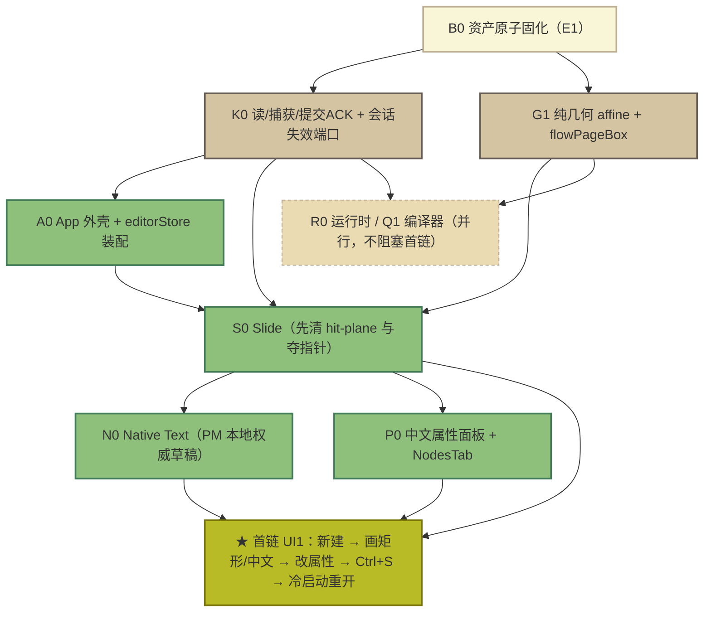

# 《稳定基线恢复与 V10 渐进替换：完整并发开发计划》评估报告（DeepSeek）

- **评估方**：DeepSeek（DSH 会话，独立评估）
- **评估对象**：`D:/果铃恢复候选/20261005-authoring/docs/development-plan/component-platform-refactor/BASELINE_FIRST_V10_EXECUTION_PLAN.md`（388 行；Root 撰写、Astra 审阅）
- **候选代码承载**：`D:/果铃恢复候选/20261005-authoring`，分支 `codex/authoring-recovery-20261005`，HEAD `b0076bc018643802119bdb6826aa883f00bb6bf4`
- **评估性质**：只读实测评估。**未修改产品源码、未回退、未提交 Git、未创建 worktree、未运行构建或产品测试、未调用真实模型。**
- **评估边界**：结论分三级——【实测】＝本轮用 git／文件读取直接核对；【推断】＝由源码静态链推出；【未核实】＝本文明确标注、需下轮取证。**未实机运行产品**，"体验是否已保全"类判断一律不下最终结论。
- **本报告自足**：第八至十节给出**可直接粘贴进计划正文的替换文本、写域修正总表与首链任务卡**，采纳时不需要额外附件。

---

## 一、裁决

> ### 【方向正确，现文本不可直接派发；须先闭合 6 项阻断级修正】

方案的**战略路线、证据纪律、写域制度设计**质量高，属于少见的可执行工程方案，不是空泛规划。但方案在**基线定性、资产保全、写域归属、若干真实缺陷的落点**上存在会立刻造成损失或停摆的错误：若按现文本派发，**第一天就会同时发生"55 个提交的恢复成果被路线性弃置"与"25+2 个未提交文件的保全动作缺位"**。缺陷集中在可执行性层面，不需要推翻"基线优先＋渐进替换"的路线，因此裁决为"修正后可实施"，与另一份独立评估（Antigravity）的大方向一致；**但两份评估在最关键的保全部署上结论不同**（见第五节）。

| 评估维度 | 评分 | 结论 |
|---|---|---|
| 战略路线与架构方向 | **A** | 基线优先、单一 writer、沿既有解耦端口渐进替换，符合大型重构实践，无可替代的更优路线 |
| 证据纪律与验收标准（§9） | **A** | 全文最有价值部分：明确"后端 green 不等于 UI 通过"、独立重开、六类真实短链、IME 不可伪造 |
| 制度设计（写域唯一 owner、动机评估、失败 owner、滚动释放） | **A−** | 制度完备；但**写域表本身与真实文件不匹配**，制度落不到地上 |
| 基线定性与主干判断 | **D** | 把仅改文档、从未验收的 `027d588a` 当"成熟稳定基线"，并把候选分支 55 个提交的成果置于被弃置风险中 |
| 资产保全（B0） | **D** | 唯一有丢失风险的资产没有原子固化动作；另一份报告给出的固化命令本身会造成数据丢失 |
| 写域/路径可执行性 | **D+** | 至少 4 处路径不存在、3 处归属违反架构合同、5 个文件无主、1 个关键引擎未入域 |
| 依赖 DAG 与首链设计 | **C+** | 结构正确，但首链被不必要地挡在 R0/Q1 之后；存在一对人造双向等待 |
| 对已知缺陷的处置充分性 | **C** | 承认了 Flow 死循环、属性面板退化等现象，但**没有给出可层层落地的断点**，"不用 memo 猜修"是禁令不是方案 |

---

## 二、评估方法与实测事实

### 2.1 方法

| 手段 | 覆盖内容 |
|---|---|
| Git 实测 | `git show --stat 027d588a`、`git rev-list --count`、`git ls-tree`、`git status --porcelain=v1`、`git worktree list`、分支/HEAD 核对 |
| 逐文件读取 | 方案点名的近 40 个文件全部打开核对行数与真实符号；另核对方案未点名但在链上的文件 |
| 交叉验证 | 用"方案声称的写域"对比"目录里真实存在的文件"，逐一确认存在性 |
| 未做 | 未启动 Electron、未构建、未跑测试、未实机复现缺陷 |

**为什么必须先做这层核查**：方案的写域表是派发指令。写域错一个路径，执行者要么找不到文件而自行发明占位层，要么改错文件造成跨包冲突。这类错误的代价远高于文风或结构问题，因此本文把"路径与归属真实性"作为首要评估项。

### 2.2 实测事实清单（本文结论的事实基础，全部可复现）

| 项 | 实测结果 | 证据 |
|---|---|---|
| 候选承载 | `D:/果铃恢复候选/20261005-authoring`；`codex/authoring-recovery-20261005`；HEAD `b0076bc0` | `git rev-parse HEAD` |
| 与基线关系 | 领先 `027d588a` **55 个提交**；`6d93aca0`（V10 巨提交）是 HEAD 祖先，其后另有 **54 个**提交 | `git rev-list --count 027d588a..HEAD`＝55；`6d93aca0..HEAD`＝54 |
| 恢复成果节点 | `c1b44439 / 3b702fb6 / 2d00a838 / be881d66 / 61800376 / 55d7902f / 216d4579 / 67ec81a4` 等承载 P1–P6b 与成熟 UI 恢复 | `git log --oneline` |
| 冻结材料 | **25 个 tracked 修改 ＋ 2 个 untracked 代码文件**未入库 | `git status --porcelain=v1` |
| `027d588a` 真实内容 | `git show --stat` ＝ **4 个 Markdown**（`TASK_BOARD.md`、`creation-restructure/README.md`、`TAKEOVER_2026-10-04.md`、`tasks/g20/creation-restructure.md`），42+/39-，**无任何代码**；`git ls-tree 027d588a -- src/components` 为空；`src/renderer/componentPlatform/` 同样不存在 | `git show --stat 027d588a` |
| `027d` 上 Teacher 来源 | 控制器 UI 目录不存在；来源为 `src/shared/defaultTeacherControllerSource.ts`(75) 及同目录 5 个模块（`defaultTeacherControllerComponent / teacherControllerConfig / teacherControllerConsistency / teacherControllerItem / teacherControllerRole`） | `git ls-tree 027d588a -- src/shared/` |
| 计划文件归属 | 本计划仅存在于候选分支（`b0076bc0` 引入），`D:/果铃工作台` 上无此文件 | `git log --oneline -- <path>` |
| 兄弟文档一致性 | `EXECUTION_PLAN.md` 两份副本不同（候选仓库 56589 B / 工作台 59033 B）；其余兄弟文档字节一致 | 目录清单比对 |

**一句话结论**：候选分支是唯一可承载主干，`027d588a` 只是行为比对与缺失 UI 提取源。

---

## 三、成立且应当保留的部分

1. **路线正确且不可逆**：放弃全量重写、保留成熟前端作交互底座、只把读写实现换成 V10——这是唯一能同时保住"手感"与"新数据模型"的路径。计划明确禁止 V9Like 影子工程、第二 History、按 surface 混用 writer，这些禁则都应原样保留。
2. **§9 证据纪律是全文最高价值**：把"提交/类型/build/后端 unit/DOM case"与"真实交互、独立落盘重开"分开，并点名 IME 不能用合成 composition 冒充、画布点击要用真实 role/name 或当下坐标重算、零匹配不算通过。这套标准直接决定后面所有验收是否可信，建议**一字不改**。
3. **制度设计完备**：同一文件同一时刻一个 writer；整模块重写必须先证明原位适配不可行；每包写五项动机说明；失败切片保留、失败 owner 唯一；模型/强度按包指定。制度本身没有问题。
4. **五端口抽象抓住了真实耦合**：读取 snapshot / 捕获 captured target / 提交＋真实 Promise ACK / 资源同批 / 几何与运行。特别是"异步开始时就捕获目标，不能混用文档 A 的 snapshot 与文档 B 的 state"，这是对真实并发缺陷的正确抽象。
5. **覆盖完整**：§12 对 N00–N10、L01–L26 全量映射，无目标遗漏。
6. **工作量划分的意图正确**：拆包的目的是降低共享写冲突、尽早形成真实用户链，不是重开发全部功能——这个自我约束是对的，落实时不能走样。

---

## 四、致命问题

### 4.1 阻断级（未闭环不得派发）

#### P0-1 基线定性与主干路线错误——会弃置 55 个提交的恢复成果【实测】

**事实**：`027d588a` 实测只改 4 个 Markdown、无代码（见 2.2）；其自带的 `TAKEOVER_2026-10-04.md` 记载键盘/翻页笔、真实创作、真实模型验收均为"待做"，4.5 小时后即被 `6d93aca0` 覆盖。候选分支领先它 **55 个提交**。

**方案的问题**：§2.2 步骤 5 写"从已观察的成熟基线建立迁移候选，逐模块提取现 V10 backend、算法和必要 adapter"。这句话把 `027d588a` 当成迁移**起点**，而真正的成果在候选分支上。按此执行，54 个提交的恢复工作会被路线性绕过。

**修正**：主干＝`codex/authoring-recovery-20261005`；`027d588a` 只作外部行为比对源与缺失 UI 提取源；定性改为"**V9 行为参照源（含已知未决缺陷）**"；参照运行只产出行为规范与缺陷记录，命中 V9 原版缺陷时记录并绕过，不进入修复队列。

#### P0-2 B0 缺原子固化；另一份报告给出的固化命令本身会丢数据【实测】

**事实**：工作树现有 **25 个 tracked 修改 ＋ 2 个 untracked 代码文件**未入库。这是全项目唯一"一旦误操作即永久消失"的资产。方案 §2.2 只说"形成可恢复 Git 切片""用户无关修改保留原位"，**没有具体命令与顺序**。

**必须指出**：另一份评估建议的 `git checkout -b codex/snapshot-… && git add -A && git commit` **顺序是错的**——这些修改只存在于新分支，切回 `codex/authoring-recovery-20261005` 时工作树会被清空回 HEAD，现场 25 个文件当场消失，与"资产保全"完全相反。

**修正（应写入 B0，且在任何 git 操作之前执行）**：

```
git add -A
git commit -m "snapshot: freeze <当次实测数量> recovery files (pre-B0)"
git branch codex/snapshot-20261005-authoring-dirty
git tag snapshot-20261005-pre-b0
```

"原地提交＋分支/标签指针"使工作树**逐字节不变**，同时 25+2 可从快照恢复。禁止 `reset`、`stash`、`git clean`。清单以当次 `git status --porcelain=v1` 重取，不沿用历史数字。

#### P0-3 写域表与真实文件不符——派发即指错文件【实测】

三类错误同时存在：

**(a) 违反架构合同**：合同 `ARCHITECTURE_CONTRACT.md` **L172（§4 表行）＋ L190（段）** 规定 Core 不持有 composition root/Store。方案 §5 却把 `src/renderer/store/editorStore.ts`(192) 与 `editorStoreKernel.ts`(78) 划归 K0。真实聚合关系：`editorStore.ts` 装配 `editorStoreKernel`(L7)、`editorShellSlice`(L8)、`courseLifecycleSlice`(L9)、`courseStructureSlice`(L10)、`slideAuthoringSlice`(L11)、`flowAuthoringSlice`(L12)、`spatialAuthoringSlice`(L13)、`designProductionActions`(L14)、`crossSurfaceCommands`(L15)、`flushPropertiesDrafts`(L16)，实例化 L66–73、合并 L111。**修正**：`editorStore.ts`/`editorStoreKernel.ts` 与外壳/结构/生命周期切片归 **A0**；`slideAuthoringSlice`(276)→S0、`flowAuthoringSlice`(185)→F1（已正确）、`spatialAuthoringSlice`(144)→W0（已正确）。

**(b) 路径不存在（4 处）**：

| 方案写的路径 | 实测 |
|---|---|
| `renderer/components/text/editor.tsx` | 不存在；真实为 `src/components/text/editor.tsx`(75)（另一份评估称其"不存在"同样不准确，是根目录写错） |
| `ui/properties/tabs/NodesTab.tsx` | 不存在；真实为 `src/renderer/ui/NodesTab.tsx`(384) |
| `editing/actions/designProductionActions.ts` | 不存在；真实为 `src/renderer/composition/designProductionActions.ts`(32) |
| `editing/commands/slideOwnedCommands.ts` | 不存在；真实为 `src/renderer/store/slices/slideOwnedCommands.ts`(35) |

**(c) 孤儿文件无主**：`editorShellSlice.ts`(71)、`courseStructureSlice.ts`(167)、`courseLifecycleSlice.ts`(106)、`designProductionActions.ts`(32)、`slideOwnedCommands.ts`(35) 未出现在任何包写域。§5 L134 有"现路径缺失时先核对基线再绑定"的兜底句，但把兜底当常态等于派发时现场发明写域。

**(d) 写锁粒度错误**：`renderer/composition/crossSurfaceCommands.ts`(462) 被整体划给 C0，但该文件混着两类东西——跨表面剪贴板/克隆族（`prepareCourseObjectPaste:106`、`COURSE_OBJECT_CLIPBOARD_MIME:245`、`captureClipboard:282`/`paste:286`、`copySelectedNodes:382`…`duplicateNode:407`）与 **Slide 基础操作**（`alignSelectedNodes:380`、`distributeSelectedNodes:381`、内部 `layout:298-315`）。把后者锁在 C0 名下，等于 S0 的日常对齐/分布操作要等剪贴板包。**修正**：基础操作迁出到 S0 独占模块（建议落在既有 `slideOwnedCommands.ts`，不新建平行平台），`editorStore.ts` 装配处分别注入两个端口。

**(e) 关键引擎未入域**：真正的 ID 重绑引擎是 `src/core/tools/slideClipboard.ts`（**644 行**），**不在方案 C0 的写域里**。§6.1 要求"复制软件重绑 ID"，却没把执行这件事的文件交给任何 owner。派发 C0 前必须先定它的 owner（C0 独占，或"引擎归 K0 共享核、C0 只消费"），并确认它当前是否已被 V10 consumer 使用。

#### P0-4 S0/T0 的真实缺陷落点不精确，按方案的修法修不好【实测】

**S0 的指针问题不是一个缺陷，是两个互相独立的缺陷**：

1. **hit-plane 覆盖**：`SlideLocationWorkspace.tsx:544` 在编辑模式插入全屏 `data-slide-authoring-hit-plane`（`inset:0, zIndex:10, pointerEvents:'auto'`），盖住 stage 内所有 z<10 的内部控件。
2. **授权目标按钮被手势机夺走指针**：真正需要点击的授权目标层在 `:545-552`（`className="canvas-authoring-targets"`，zIndex **12**，按钮 `.canvas-authoring-target`，样式 `globals.css:1168-1245`）——**它在 hit-plane 之上，根本不受 hit-plane 阻挡**，却仍然点不动。原因是 `:111` 的 `controls` 允许列表（`.canvas-mode-switch,.canvas-view-controls,.canvas-label,.live-scene-bar,.command-menu,.selection-quick-bar,.text-edit-overlay,.text-edit-toolbar,[data-component-professional-editor]`）**不含** `.canvas-authoring-target` 与教师控制台，于是 `:363` 的守卫 `outsideStage(event.target) || canvasMode !== 'edit'` 放行，`:378` 执行 `stop(event)`＋`setPointerCapture`，把指针夺到 stage。

**这直接推翻两处外部结论**：方案与另一份评估都把 `:362-378` 描述为"**无条件**执行 stop+capture"（实测有守卫），也都以为"拆掉 hit-plane 就好了"（对第 2 个缺陷无效）。另外，另一份评估建议加入 `outsideStage` 的选择器 `[data-teacher-controller]` 在全仓**不存在**；真实可用的锚点是 `.guoling-controller`（`src/components/teacher-controller/defaultController.ts:22`，收起态 52×52 圆钮）与作者态外壳 `[data-controller-preview-collapsed]`（`src/renderer/ui/TeacherControllerAuthoringChrome.tsx:49`）。

**T0 的模式语义错误**：`defaultController.ts:84` 调 `host.moveBy`，宿主实现 `src/player/teacherControllerComponentHost.ts:58-70` **只改 session 偏移，不写 formal frame、不经 CAS**。方案 §6.1 T0 只要求"保圆入口、目录、进度、zoom、背景、弹层"，没有规定 Author 拖动必须落 formal frame。结果是：作者拖完控制台按 Ctrl+S，重开后位置复原。

#### P0-5 F0/N0 缺"PM 本地权威草稿"的机制级设计【实测】

**实测闭环**（方案与另一份评估都只说"存在递归"，未给准确环）：
`editorSession.ts:64`（plugin `update` → `stateChanged`）→ `SharedDocumentEditor.tsx:453`（`setFormat`/`updateActiveBlock` 即 React setState）→ `:521`（`useEffect` 调 `layout.current.update`）→ `editorSession.ts:474 update()` → `:483` diff → `:490/:491 tr.replaceWith/tr.replace` → `:492 setMeta('canonicalUpdate')` → `:493 applyState` → 回到 `:64`。

**关键否定事实**：该目录**没有** `isExternalUpdate`、没有重入计数、没有深度上限、没有 in-flight 标记；唯一抑制是 `composing`＋单槽 `deferred`（`:52/:144/:145/:475`）。另一份评估所称"经 `flowDocumentResources.ts` 成环"**不成立**——该文件对 `stateChanged|layout.update|editorSession|setState` 零命中。

**方案的问题**：§6.1 F0 只写了"反馈环需定位，不能 memo/timeout 猜修"——这只是一条禁令，不是可执行设计。开发者拿到这张卡仍然不知道断点在哪。

#### P0-6 "独立重开"断言可被缓存冒充，而销毁 API 并不存在【实测】

方案 §9.1 已强调独立重开，但没有堵住"切 Tab／刷新／复用同一 Session"这条捷径，也没有指出缓存位置。实测：Session 缓存在 **`src/core/documents/DocumentRegistry.ts:14`**（不是 `DocumentHostService`；同文件另有 `bindings:15/opening:16/saving:17/savingBindings:18/restoring:19/fileBarriers:20/documentSaves:21`）。**全仓没有 `dispose()`**——唯一命中 `DocumentExportPort.ts:49`，与文档会话无关；最近等价物是 `DocumentSession.ts:110 unsubscribe` 与 `:408 commitListeners.clear()`。

### 4.2 重要但不阻断首日

| # | 问题 | 实测依据 | 修正 |
|---|---|---|---|
| A | X3/X4 人造双向等待 | `flowPageBox` 真实位置是 `src/renderer/export/flowPageBox.ts`（**32 行**，导出 `resolveFlowDocxPageBox:13`），**不在** `core/document/`；另一份评估的"33 行"与路径均有误 | 该文件为纯纸型数学叶子，**划归 G1**，X3/X4 只读消费；`reading` 投影与 index 中性类型由 X3 **单向**提前交付，解除双向等待 |
| B | 非活动表面无挂起 | `ComponentPlatformApp.tsx:160`、`CourseV10DocumentView.tsx:59/:78`、`SlideLocationWorkspace.tsx:104` 仅用 `hidden`；`composition/surfaceRouter.ts:186-188 exclusiveInactiveSurfaces` 只是把字段置 `null`，**无 suspend/resume 钩子** | 明确 suspend（暂停定时器/监听/MessagePort）/resume；禁止后台表面触发 `host.moveBy` 或写当前视口。owner：R0＋A0，K0 提供文档级校验 |
| C | CAS 表述错误 | 方案把它当"预检会推进 revision 的现网 bug"。实测 `DocumentHostService.ts:174 checkComponentExpectations` 是**纯校验**（只抛 `ComponentOperationConflict`），revision 只在提交路径 `:216/:293` 自增，**当前实现符合 CAS** | 改写为**合同硬规则**＋**真实缺口**：`:168` 对非 `component-platform.apply` 命令**跳过预检**，需在合同层固定哪些命令必须走预检 |
| D | 双写风险表述过强 | `CourseDocumentBridge.ts:28/:34` 全仓 import **0 次**（自引用）；`CourseV10DocumentBridge.ts:47` import **46 次**，实例化于 `editorStore.ts:62`、`ComponentPlatformApp.tsx:17` | 当前**无双写**。"以工程为单位单向切换 Bridge"保留为**预防性合同**；另加"由 E1 复核 V9 Bridge 是否应删除或由构建配置排除" |
| E | 首链仍被 R0/Q1 挡住 | `SlideLocationWorkspace.tsx` 对 phaser / `SlidePhaserNode` / esbuild / `componentCompilation` 的 import **命中 0**（全文唯一 Phaser 字样是 `:132` 注释）；文件内无 `dispatch`/`.save(`/`DocumentHostAPI`，提交经 `workspaceSlideAuthoring.ts:15`、`surfaces/slide/authorSpots.ts:26`、`crossSurfaceCommands.ts:10`；落盘只经 Main（`DocumentHostService.ts:142 save`、`:340 dispatch`） | 首链改为 **B0 → K0 → G1 → A0/S0 → N0/P0 → 落盘**。Q1 虽在 `DocumentHostService.ts:64` 组合根被无条件构造，首链不消费 |
| F | UI1/P0 断言与实现都不够硬 | 属性面板已实测退化：`ui/ComponentPropertiesEditor.tsx`(75) 用 `<textarea>`/`StructuredField`(L27、L66) 收裸 JSON；`ui/properties/componentDefinitionPresentation.ts:11-18` 只硬编码 5 个内置 key（`guoling.navigation/audio/video/web/html-program`）且 `:12` 对 `kind!=='builtin'` 早退 | UI1 增加死区与对比度断言；P0 增加硬约束：移除裸 JSON、补齐全部内置 schema、`NodesTab` 恢复分组渲染，只把数据端从 `LayerItem` 适配为 `ComponentInstance` |
| G | 引用形式不可用 | 合同**没有编号条款**；唯一 writer/History 依据是 `ARCHITECTURE_CONTRACT.md` §3 条目 **L162**（旁证 L8、L264、L286），Core 不持 composition root/Store 是 **L172＋L190** | 全文引用一律改 `文件:行号`，否则执行者按条款号找不到依据 |

---

## 五、与另一份独立评估（Antigravity）的对照

方向一致（都判"修正后可实施"），但在**最关键的保全部署**上结论相反，且该报告有 12 处断言与源码不符，若照它执行会打偏：

| # | Antigravity 的断言 | 实测 | 影响 |
|---|---|---|---|
| 1 | 建议 `git checkout -b … && git add -A && git commit` 固化 | 该顺序会把修改只留在新分支，切回时工作树清空回 HEAD | **会直接丢掉 25 个文件**；应改为原地提交＋指针 |
| 2 | `DocumentHostService` 内有 `activeSessions: Map` 缓存 | 该文件无此缓存；缓存在 `DocumentRegistry.ts:14` | 冷启动断言的封堵点指错文件 |
| 3 | 可用 `session.dispose()` 显式销毁 | 全仓无 `dispose()` | "显式销毁"须由 K0 新增端口，不能假设现成 API |
| 4 | `dispatch` 预检推进 revision、破坏 CAS（列为现网 bug） | `checkComponentExpectations` 是纯校验，revision 只在提交路径自增 | 严重性定级错误；真实缺口是 `:168` 跳过预检 |
| 5 | 旧 Bridge 与 V10 Bridge 并存造成双写 | V9 Bridge 全仓 import 0 次 | 当前无双写，应为预防性合同 |
| 6 | 架构合同"条款 5.1 / 条款 1.2" | 合同无编号条款，须用 L162/L172/L190 | 引用不可用 |
| 7 | Flow 死循环经 `flowDocumentResources.ts` | 该文件零命中，不在环上 | 断点指错文件；真实环见 P0-5 |
| 8 | 纸型 helper 在 `src/core/document/flowPageBox.ts`，33 行 | 实际 `src/renderer/export/flowPageBox.ts`，**32 行** | 归属改写指向不存在的路径 |
| 9 | S0"无条件 stop+capture"；修法为加 `[data-teacher-controller]` | `:363` 有守卫；授权目标按钮在 z=12 不受 hit-plane 阻挡，真实原因是 `:111` 列表缺项；`[data-teacher-controller]` 全仓不存在 | **修法无效**，点击仍不通 |
| 10 | `crossSurfaceCommands.ts` 含 `cloneComponentToSurface`、`copySelection`、`createSlideShapeInstance`、`alignSelectedComponents` | 这些标识符在文件中**不存在**；真实为 `prepareCourseObjectPaste`、`copy/cut/pasteNodes`、`duplicateNode`、`alignSelectedNodes`、`distributeSelectedNodes`；节点创建只是 `:334-340` 的透传 delegate | 拆包依据的名字是编造的，按此拆会拆错 |
| 11 | `NodesTab.tsx` 位于 `ui/properties/tabs/`，基线 1488 行 | 真实路径 `src/renderer/ui/NodesTab.tsx`(384)；1488 未核实 | 派发指错文件 |
| 12 | 未提 | `core/tools/slideClipboard.ts`(644) 才是真正的 ID 重绑引擎，且不在任何写域 | 关键执行文件无主 |

**我的判断**：该报告的问题清单**方向有价值**（正确抓到了基线定性、写域冲突、指针拦截、PM 草稿、冷启动、X3/X4 死锁等），但其**证据层不可直接引用**；若把它当施工依据，会在"固化命令、点击修复、CAS 定级、拆包函数名"四处直接造成损失。两份评估应互补使用：**用它的问题清单，用本文的实测事实与落点。**

---

## 六、执行性推演：按现文本派发，第一天会发生什么

1. **B0**：E1 读到"形成可恢复 Git 切片"却无命令，最可能自行选择 `checkout -b` 或先 `stash` ——两条路都可能在切换分支时丢掉 25 个文件（见 P0-2）。
2. **K0/S0/F1/W0 同时起跑**：K0 按 §5 拿走 `editorStore.ts`，S0/F1/W0 要加各自 slice 状态 → 同一文件四方写冲突，触发"同一文件同一时刻一个 writer"的规则 → 三个表面包集体停等 K0（P0-3a）。
3. **S0 清理**：只按方案描述拆掉 hit-plane → 教师控制台恢复，但 `:546` 的"替图/T"按钮与 `[data-controller-preview-collapsed]` 仍然点不动 → 首链卡在"选中对象改属性"（P0-4）。
4. **N0/F0 接线**：Caret 双击进入编辑时，`layout.update` 注入与 `stateChanged` 反向派发互激 → 打字吃字/光标跳回；开发者按"不用 memo 猜修"的禁令也确实无处下手（P0-5）。
5. **E3 验收**：切 Tab 重开被当作"独立重开"，内存字段冒充磁盘 schema 通过 → 用户重启后数据丢失（P0-6）。
6. **连带**：X3/X4 互相等 `flowPageBox`；切页后后台组件仍调 `host.moveBy` 篡改当前视口。

结论：**这不是"可以边做边修"的问题清单，其中 P0-1/P0-2/P0-3 属于派发前必须闭合**——它们会在没有任何产出之前先造成资产损失与写域停摆。

---

## 七、修正清单（按先后）

| 序 | 动作 | 落点 | 阻断级 |
|---|---|---|---|
| 1 | **B0 原子固化**（原地提交＋分支＋标签，禁 reset/stash/clean） | §2.2 步骤 1 | **是** |
| 2 | **主干改判**：候选分支为主干，`027d588a` 降级为行为参照源 | §1、§2.1、§2.2 步骤 5、§11 | **是** |
| 3 | 写域重划：`editorStore`→A0、切片归表面包、孤儿文件分配、4 处路径重绑、剪贴板族与 Slide 基础操作拆分、`slideClipboard.ts` 定 owner | §5、§6.1 | **是** |
| 4 | S0 指针四处修＋T0 Author 拖动写 formal frame | §6.1 S0/T0、§7 | **是** |
| 5 | F0/N0：`isExternalUpdate` 抑制、显式 ACK 类型、引用稳定化，先定位 `canonicalUpdate` 消费端 | §6.1 F0、§10 | **是** |
| 6 | 冷启动硬断言＋K0 新增会话失效端口（无 `dispose()`） | §3.2、§9.1 | **是** |
| 7 | 首链剥离 R0/Q1，改 B0→K0→G1→A0/S0→N0/P0→落盘 | §8、§13 | 否 |
| 8 | X3/X4 死锁解除；`flowPageBox` 归 G1 | §6.3、§8 | 否 |
| 9 | 非活动表面 suspend/resume；CAS 规则与预检缺口改写；Bridge 双写改预防性表述 | §3.1、§3.2、§10 | 否 |
| 10 | UI1 死区/对比度断言；P0 去裸 JSON＋补齐 schema＋恢复 NodesTab 分组 | §6.1 P0、§9.2 | 否 |

---

## 八、修正文本：可直接粘贴进计划正文

> 行号均指现 `BASELINE_FIRST_V10_EXECUTION_PLAN.md`(388 行)。以下文本按修正清单顺序排列，可直接替换对应行或在对应处追加。

### 8.1 基线与保全（对应清单 1、2）

**替换 §2.1 表 L30 行**：

> | V10 前**参照源** | `027d588a3933b977cb0ef6ed9288d7aaa82d4e87`（2026-10-04 13:12 +08）；实测 `git show --stat` 仅改 4 个 Markdown、无代码，等同 `5f6fa9d7`；`6d93aca0` 的直接父提交 | **定性为「V9 历史功能与交互行为参考源（含已知未决缺陷）」**。仅用于提取预期交互规范与行为快照；**严禁在 V9 上做逆向修复**；不得称"已验收稳定版本" |

**§2.1 表另需新增一行（主干）**：

> | **主干承载** | `D:/果铃恢复候选/20261005-authoring`；`codex/authoring-recovery-20261005`；领先 `027d588a` **55 个提交**（`6d93aca0` 之后 54 个） | 这是唯一含 P1–P6b 恢复成果的分支；未提交材料以 §2.2 固化为准，不沿用历史数量 |

**替换 §2.2 步骤 1**：

> 1. E1 在工作树 `D:/果铃恢复候选/20261005-authoring` **先做原子快照固化**（**不** reset、**不** stash、**不** `git clean`），**在原分支提交 + 用分支指针留证**，不得先切新分支再提交：
>    `git add -A` → `git commit -m "snapshot: freeze <当次实测数量> recovery files (pre-B0)"` → `git branch codex/snapshot-20261005-authoring-dirty` → `git tag snapshot-20261005-pre-b0`
>    **禁止** `git checkout -b codex/snapshot-… && git add -A && git commit` 顺序：那样这些修改只存在于新分支，切回 `codex/authoring-recovery-20261005` 时工作树会被清空回 HEAD（现场 25 个文件全部消失），与"资产保全"目的相反。上述"原地提交 + 指针"方案使工作树内容**逐字节不变**，同时让冻结材料可从快照分支／标签恢复。
>    快照提交号、分支名、标签与当次 `git status` 清单写入冻结记录；用户无关修改不还原、不丢弃。**执行时以当次 `git status --porcelain=v1` 为准重取清单。**

**替换 §2.2 步骤 5**：

> 5. **主干为 `codex/authoring-recovery-20261005`（HEAD `b0076bc0`）**，`027d588a` 只作外部行为比对源与缺失 UI 提取源。逐模块提取现 V10 backend、算法和必要 adapter，**不得以 `027d` 为底重新手抄 V10**，不得整包 cherry-pick 含简化 UI 的 `6d93aca0`。

**§2.2 步骤 4 后追加**：

> 参照运行只产出**行为规范与缺陷记录**；命中 V9 原版缺陷（如 Flow max-depth、Spatial 保存崩溃）时记录并绕过，不进入修复队列，避免 V10 替换主线停摆。

**§11 表 L304 行改为**：

> | `027d`／`5f6f` 及 `3190`/`e3f0`/`0514` | V9 完整 UI/PM/专业/菜单/keyboard/lifecycle/端口＝**行为参照与缺失 UI 提取源** | 本轮已验收稳定版本；**不得作为迁移起点重新手抄**；旧 writer 不得并入 V10 |

**B0 需核对的冻结清单（本轮实测 25 tracked ＋ 2 untracked；执行时重取）**：

```
src/components/web/contentRealmImplementation.ts
src/core/contentApply/planning/types.ts
src/core/projectFiles/componentPlatform/coordinator.ts
src/core/projectFiles/componentPlatform/projection.ts
src/main/workbench/contentApply/application/plan.ts
src/main/workbench/contentApply/applyService.ts
src/main/workbench/contentApply/compilation/compileHtmlModules.ts
src/main/workbench/contentApply/compilation/esbuildComponentCompiler.ts
src/main/workbench/projectFiles/componentPlatformFileInput.ts
src/player/components/ComponentPlatformRuntime.ts
src/renderer/componentPlatform/surfaces/flow/documentProjection.ts
src/renderer/components/ComponentNavigationOwner.ts
src/renderer/components/CourseV10RuntimeView.tsx
src/renderer/document/documentClipboard.ts
src/renderer/document/editorSession.ts
src/renderer/document/SharedDocumentEditor.tsx
src/renderer/store/editorStore.ts
src/renderer/store/slices/flowAuthoringSlice.ts
src/renderer/ui/FlowWorkspace.tsx
src/renderer/ui/workspaces/FlowWorkspaceConnector.tsx
src/renderer/ui/workspaces/SlideLocationWorkspace.tsx
src/renderer/ui/workspaces/SpatialLocationWorkspace.tsx
src/shared/contracts/component-platform/teacherController.ts
tests/integration/g20SavedCourseContinuation.test.ts
tests/unit/componentSourceInputAdmission.test.ts
（untracked）src/main/workbench/projectFiles/componentSourceClosure.ts
（untracked）tests/unit/fragmentEventScope.test.ts
```

### 8.2 工具调用与实例隔离（对应清单 1）

**替换 §2.2 步骤 2**：

> 2. 用 **`git worktree list`** 核对承载（**不是** `list_artifacts`：它是副会话文档查询工具，不支持 Git 操作）。需要新承载时 `git worktree add` 从精确提交建立独立工作树，分支用 `codex/` 前缀，路径以命令返回为准。

**替换 §2.2 步骤 3**：

> 3. 保留原版源码、可运行物、独立 profile 样本副本。E3 的参照实例必须显式隔离：
>    `electron . --user-data-dir="<临时独立目录>" --remote-debugging-port=9222 --port=5174`
>    严禁让参照实例读写 Owner 在 `D:/果铃工作台` 正在编辑的真实工程、LocalStorage、IndexedDB 与最近项目列表。

### 8.3 写域与路径（对应清单 3、4）

**替换 §5 L127 行**：

> - ~~`src/renderer/store/editorStore.ts`、`editorStoreKernel.ts`、`slices/slideAuthoringSlice.ts`~~ → 改为：领域切片**归各表面包独占**——`slices/slideAuthoringSlice.ts`(276) 归 S0、`slices/flowAuthoringSlice.ts`(185) 归 F1、`slices/spatialAuthoringSlice.ts`(144) 归 W0；`editorStore.ts`(192) 与 `editorStoreKernel.ts`(78) 归 **A0**（组合根装配）；`slices/editorShellSlice.ts`(71)、`slices/courseStructureSlice.ts`(167)、`slices/courseLifecycleSlice.ts`(106)、`composition/designProductionActions.ts`(32)、`store/slices/slideOwnedCommands.ts`(35) 亦归 A0 统一装配、业务实现按域回原包。依据合同 §4 表行 L172 与 L190 段（Core 不持有 composition root／Store）。

**新增"孤儿文件分配"**：

| 真实文件（行数） | owner | 备注 |
|---|---|---|
| `renderer/store/slices/editorShellSlice.ts`(71) | A0 | 消除孤儿 |
| `renderer/store/slices/courseStructureSlice.ts`(167) | A0 | 消除孤儿 |
| `renderer/store/slices/courseLifecycleSlice.ts`(106) | A0 | 原已正确 |
| `renderer/composition/designProductionActions.ts`(32) | A0 装配 | 设计动作实现回 P0 消费 |
| `renderer/store/slices/slideOwnedCommands.ts`(35) | S0 | 同时承载从 C0 迁出的 Slide 基础操作 |

**替换 §3.2 第 5 项后追加第 6 项**：

> 6. **会话失效（新增）**：显式释放 `DocumentRegistry.sessions` 的正式端口（全仓现无 `dispose()`，须新交付），供冷启动断言使用。

**替换 §6.1 T0 行**：

> | T0／Sol high | `src/components/teacher-controller/{defaultController.ts(180),index.ts(24),types.ts(14),data.ts(35)}` | **`027d` 参照输入**＝`src/shared/defaultTeacherControllerSource.ts`(75) 及同目录 5 个模块（`027d` 上 `src/components/` 整个目录不存在）＋K0 的 TeacherControllerPort/API5 → 纯 UI 与 wrapper；R0 随后提供实例端口 | A：V4 wrapper→API5。保圆入口（`defaultController.ts:22` 收起态 52×52 圆钮）、目录、进度、zoom、背景、弹层与作者/play 分离；拖动（`:84 host.moveBy`，宿主 `src/player/teacherControllerComponentHost.ts:58-70`，现仅改 session 偏移）在 **Author 模式必须写 formal frame 并经 CAS 提交**，Play 模式仅改 session 视口偏移；collapse 不改 author geometry。UI5 三 surface 真实显示/hit/拖动 undo/save |

**替换 §6.1 N0 行**（写域根歧义修正，删去不存在的 `src/renderer/components/text/editor.tsx` 写法）：

> | N0／Sol high | `src/renderer/ui/workspaces/useSlideNativeTextEditor.tsx`(166)；**`src/components/text/editor.tsx`(75)**；必要公式编辑入口在派发时以真实文件绑定并从原 owner 交接 | K0 captured draft＋F0 窄字段接口→文字/公式原专业编辑入口 | A：`TextNode{text,runs}` 不能无损表达 inlines/math，source override 不改变 definition 专业身份。保焦点/IME/工具栏；不摊平原子、不把普通文字换整篇正文 UI。合并 UI1；现 jsdom 退出 1 不能记通过 |

**替换 §6.1 S0 行**：

> | S0／Sol high | `renderer/ui/workspaces/{SlideLocationWorkspace.tsx(573),SlideWorkspaceConnector.tsx,SlideLayerSelectionOverlay.tsx}`、`renderer/ui/workspaceSlideAuthoring.ts`、`renderer/componentPlatform/surfaces/slide/freeObjectCommands.ts`、`store/slices/{slideAuthoringSlice.ts(276),slideOwnedCommands.ts(35)}`；**从 `crossSurfaceCommands.ts` 迁入 `alignSelectedNodes`/`distributeSelectedNodes`/`layout`(:298-315,380-381)**；**删除** `surfaces/slide/SlideSurfaceView.tsx`(231)（`6d93aca0` 简化产物） | 原完整 Slide＋K0/G1＋N0/P0 按需→V10 读取/动作 consumer；**R0/Q1 不在本链** | **前置清理（先于任何 UI 接线，两个独立缺陷分两处修）**：(1) 废除 `SlideLocationWorkspace.tsx:544` 全屏 `data-slide-authoring-hit-plane`（z=10）或降为不拦截指针的视觉层，恢复基于真实目标与 DOM 边界的局部 hit-test，使 stage 内 z<10 的内部控件可接收点击；(2) `:111 controls` 允许列表追加 `.canvas-authoring-target`、`.guoling-controller`、`[data-controller-preview-collapsed]`，使 `:363 outsideStage` 放行、`:378` 不再夺指针（这是授权目标按钮失效的真实原因）；(3) 复核 `:378 setPointerCapture`，命中内部控件时不夺指针；(4) 撤销 `:516` 代折叠按钮，恢复画布内点击控制台折叠。A：LayerItem/PhaserNode/session→实例/capture。保 DOM、事件、选区、手柄、直线/编组、菜单和试运行现场；UI1/2 与 save，global/page 正式归属及邻项 frame 保全 |

**替换 §6.1 C0 行**：

> | C0／Sol high | `renderer/composition/crossSurfaceCommands.ts`（**仅跨表面剪贴板/克隆族**：`prepareCourseObjectPaste:106`、`COURSE_OBJECT_CLIPBOARD_MIME:245`、copy/cut/paste/duplicate `:382-407` 及其内部 `captureClipboard:282`/`paste:286`）；`app/useEditorKeyboardRouter.ts`(118)；`course/{editorActionRouting.ts(307),editorActionTypes.ts(156)}`；`documentFiles/fileDocumentClipboard.ts`(38)；`document/{documentClipboard.ts(88),documentClipboardContext.ts(97)}` | K0 capture/edit＋**真正的 ID 重绑引擎 `src/core/tools/slideClipboard.ts`(644)**＋L0 closure＋F0 prepared 协议→复制/剪切/系统粘贴同 writer | A：资源/目标/克隆身份改变。保 keyboard 焦点、本地 Undo 和 canvas paste 隔离；复制软件重绑 ID，移动保身份；course-instance 不能只 renew blockID。UI4 带图/私有源码/同名素材→undo/redo/save，原目标不误写。**`slideClipboard.ts` 的 owner 需在派发前定（见第十二节）** |

**替换 §6.1 P0 行**：

> | P0／Sol high | `renderer/composition/properties/{usePropertiesAuthoringBinding.tsx(382),PropertiesAuthoringReadModel.ts(84)}`；`renderer/ui/properties/`（含 `PropertiesContextAdapter.tsx` 与 `CourseGlobalPropertiesContextBuilder.ts(75)/FlowPropertiesContextBuilder.ts(132)/RuntimePropertiesContextBuilder.ts(14)/SpatialPropertiesContextBuilder.ts(84)`）；**`renderer/ui/ComponentPropertiesEditor.tsx`(75) 整文件从 `027d` 参照搬回成熟体系**；**`renderer/ui/NodesTab.tsx`(384) 恢复分组渲染**；`workbench/NativeSelectionContext.tsx`(361)、`editing/commands/slideLightCommands.ts`(67)、`lessonWorkspace/lessonWorkspaceShell.css` | K0＋surface selection/actions→原专业面板和轻工具绑定 | A：definition/data/目标变化；B：已证无效命令/CSS 问题局部修。**硬约束**：(1) 彻底移除 `StructuredField`/裸 JSON textarea（现 `:27/:66`），专业字段按中文 PropertyField 渲染；(2) `ui/properties/componentDefinitionPresentation.ts:11-18` 补齐全部内置组件（shape/table/chart/input/choice/disclosure/popover/media/image/document-block 等）schema 映射，禁止 `:12` 的 `kind!=='builtin'` 早退导致退化；(3) `NodesTab` 恢复 `groupedVisualRows`/`groupedFlowVisualRows`/`FlowBodyBoundaryRow` 等分组渲染器，仅把数据读取端从 `LayerItem` 适配为 V10 `ComponentInstance`。保 enum/color/image/min/max/step、多选/locked 与素材流程。UI2：面板↔画布、一次邻项点击、替图同 captured port/undo；不二次弹选择器 |

### 8.4 时序、运行与合同（对应清单 5、9）

**§6.1 F0 行追加硬约束**：

> **PM 会话是本地权威草稿**：`editorSession.update()` 由外部 `layout.update` 注入时置 `isExternalUpdate`，在此期间抑制 `editorSession.ts:64` plugin `stateChanged` 向 React 反向派发 `setState`；仅在"收到拒绝 ACK"或"切换外部文档"时才允许 `tr.replace` 全量回灌。`SharedDocumentEditor.tsx:471` 的 `instanceof Promise` 鸭子判定改为显式 ACK 类型（同步签名 `:127` 一并改正）。输入引用稳定化：`projectFlowDocument` 未实质变化的 Block 不产生新对象引用。**先定位 `canonicalUpdate` meta（`:492`）的消费端再动刀**，不用 memo/timeout 猜修。

**§6.1 S0 行所在段落追加表面生命周期硬约束**：

> 表面切换时向非活动表面已挂载组件发送显式 `suspend`（暂停定时器/监听/MessagePort），切回时 `resume`；禁止让后台表面继续触发 `host.moveBy` 或写当前视口。owner：R0（运行宿主）＋A0（切换编排），K0 提供文档级捕获校验。

**替换 §3.1 L66 / §10 L293 的 CAS 表述（按实测口径）**：

> **CAS 硬规则**：`baseRevision` 比对必须是事务进入的第一道原子屏障；预校验函数必须**纯函数、无副作用、不得推进 revision**（现 `DocumentHostService.ts:174 checkComponentExpectations` 实测为纯校验，revision 只在 `:216/:293` 自增，符合规则）。**真实缺口**：`:168` 对非 `component-platform.apply` 命令跳过预检——K0 需明确哪些命令必须走预检并在合同层固定，避免后续新增带副作用预检破坏原子性。

**§3.1 关于 Bridge 的表述改为预防性**：

> 旧 `CourseDocumentBridge`（`CourseDocumentBridge.ts:28/:34`）当前全仓 import 为 0、无实际 consumer，**当前不存在双写**。"以工程为单位单向切换 Bridge"作为**预防性合同**保留：一旦工程以 V10 打开，全表面统一走 `CourseV10DocumentBridge`，未迁移表面只读预览，禁止拉起 V9 写入会话。由 E1 复核 V9 Bridge 应删除或由构建配置排除。

### 8.5 DAG 与首链（对应清单 7、8）

**替换 §8 第 4 条中相关句**：

> `renderer/export/flowPageBox.ts`(32，导出 `resolveFlowDocxPageBox:13`) 是纯纸型数学叶子，**划归 G1**，X3(Word) 与 X4(PDF) 只读消费，二者之间不再互交该文件；`reading` 投影与 index 中性类型由 **X3 单向提前交付**，X4 只消费不反向交付。解除 DOCX/PDF 双向等待。

**替换 §8 第 5 条与 §13 首句**：

> 5. **首真实 Main 链（Slide MVP）只依赖 B0 → K0 → G1 → A0/S0 → N0/P0 → 存储落盘**：新建文档 → 画矩形/输入中文 → 属性栏改颜色尺寸 → Ctrl+S → 退出进程冷启动重开。R0（运行时沙箱）与 Q1（模块编译器）**不在本链**，二者后续并行接入，验证周期从"数天"压缩到"一次闭环"。（实测：`SlideLocationWorkspace.tsx` 对 phaser / `SlidePhaserNode` / esbuild / `componentCompilation` 的 import 命中 0；落盘只经 Main。）

**§6.3 X3 行改为**：先单向交 `reading` 投影、index 中性类型和 `presentation` 给 X4/X2，**不向 X4 索取纸型 helper**；**§6.3 X4 行改为**：消费 X3 单向提前交付的投影/类型＋`renderer/export/flowPageBox.ts`（G1 只读），**不再要求 X4 先交 `flowPageBox`**。

### 8.6 验证强度（对应清单 10）

**替换 §9.1 独立重开段**：

> 独立重开**必须**满足其一：(a) **新进程冷启动**；(b) 由 K0 新增的**正式会话失效端口**显式释放 `src/core/documents/DocumentRegistry.ts:14` 的 `sessions` 后，从磁盘物理路径重读。**仅切 tab、刷新、或复用同一 `DocumentRegistry` 实例不算重开**——注意全仓当前**没有 `dispose()`**，K0 需为此交付 API 并在任务卡写明。断言须证明：内存中被清空的字段在磁盘 schema 中真实存在。

**§9.2 UI1 行追加**：

> 自动化双击必须注入 1–3px 随机位移抖动，证明 `pointerDown` 手势机具备 **≥4px 死区**；断言编辑框 `background` 与 `caret-color` 相对亮度对比度 **≥ 4.5:1**（CSS 计算属性，不靠肉眼）。

---

## 九、写域修正总表（可整表替换 §5/§6 归属）

> 未写 `src/` 前缀的路径均指 `src/` 下同名文件；行数为本轮实测。

| 真实文件（行数） | 原 owner（计划） | 新 owner | 理由（一行） |
|---|---|---|---|
| `renderer/store/editorStore.ts`(192)、`editorStoreKernel.ts`(78) | K0 | **A0** | 合同 L172/L190：Core 不持 composition root/Store |
| `slices/slideAuthoringSlice.ts`(276) | K0 | S0 | 表面切片归表面包，避免 K0 串行瓶颈 |
| `slices/flowAuthoringSlice.ts`(185) | F1（已正确） | F1 | 保持 |
| `slices/spatialAuthoringSlice.ts`(144) | W0（已正确） | W0 | 保持 |
| `composition/crossSurfaceCommands.ts`(462) 剪贴板族 | C0 | C0 | 只留跨表面剪贴板/克隆 |
| 同上 `alignSelectedNodes`/`distributeSelectedNodes`/`layout`(:298-315,380-381) | C0 | **S0** | Slide 基础操作不应被 C0 写锁阻塞 |
| `renderer/export/flowPageBox.ts`(32) | X4 | **G1** | 纯数学叶子；解 X3/X4 双向等待 |
| `store/slices/editorShellSlice.ts`(71) | 无（孤儿） | A0 | 消除孤儿文件 |
| `store/slices/courseStructureSlice.ts`(167) | 无（孤儿） | A0 | 同上 |
| `store/slices/courseLifecycleSlice.ts`(106) | A0（已正确） | A0 | 保持 |
| `composition/designProductionActions.ts`(32) | 无（孤儿，计划写作 `editing/actions/…`） | A0 装配 | 路径纠正 |
| `store/slices/slideOwnedCommands.ts`(35) | 无（孤儿，计划写作 `editing/commands/…`） | S0 | 路径纠正 |
| `surfaces/slide/SlideSurfaceView.tsx`(231) | S0 写域 | **剔除/删除候选** | `6d93aca0` 简化产物，与"保成熟 DOM"冲突 |
| `ui/ComponentPropertiesEditor.tsx`(75)、`ui/NodesTab.tsx`(384) | P0（已正确） | P0 | 从 `027d` 整文件搬回成熟体系 |
| `components/text/editor.tsx`(75) | N0（根歧义） | N0 | 路径绑定为 `src/components/text/` |
| `components/teacher-controller/*`(253) | T0（已正确） | T0 | 输入源改为 `src/shared/defaultTeacherControllerSource.ts` |
| `core/tools/slideClipboard.ts`(644) | **未分配** | 待定（C0 或 K0） | 真正的 ID 重绑引擎，见第十二节 |

---

## 十、首链可派发任务卡

> 路径均经实测存在；括号内为实测行数。派发前重新核对路径与行数。

| 卡 | owner／模型 | 独占写域（真实路径） | 输入→输出 | 最小证据 | 失败 owner |
|---|---|---|---|---|---|
| **B0** 资产固化 | E1（gpt-6-luna/max）机械执行；Root/I/A 选择承载 | 快照分支、标签与冻结记录；不写用户原件 | 当次 `git status --porcelain=v1` 清单 → 原位快照提交＋分支＋标签（§8.1） | 快照提交号、清单、`git worktree list` 输出；工作树逐字节未变 | Root |
| **K0-s1** 正式端口 | I（gpt-6-astra/xhigh） | `src/core/documents/DocumentRegistry.ts`、`DocumentSession.ts`、`src/main/workbench/DocumentHostService.ts`、`src/shared/contracts/component-platform/`、`src/core/drivers/CourseV10Driver.ts`、`renderer/documents/{CourseV10DocumentBridge,DocumentProjection}.ts` | 现 V10 Schema/Driver → 读取 snapshot／捕获 captured target／canonical 提交＋真实 Promise ACK／**会话失效端口（无 dispose，需新增）**／预检覆盖补全（`:168`） | 解析＋提交＋ACK 单测；CAS 冲突拒绝路径；会话失效后从磁盘重读 | Root/I |
| **G1** 纯几何 | Sol high | `core/components/geometry/index.ts`、`renderer/authoring/stageViewportTransform.ts`、`surfaces/slide/{targets.ts,freeTransformGesture.ts}`、**`renderer/export/flowPageBox.ts`** | K0 frame/capture 小接口＋现纯数学 → affine/父矩阵/自由手势/纸型 | UI1/2 共证旋转、编组、拖动与 undo；未变算法沿用既有证据；X3/X4 只读消费纸型 | I |
| **A0** App 外壳 | Sol xhigh | `renderer/App.tsx`、`main.tsx`、`app/{useCourseProjectLifecycle,useMediaImport}.ts`、`project/courseProjectLifecycle.ts`、`store/editorStore.ts`、`store/editorStoreKernel.ts`、`store/slices/{courseLifecycleSlice,courseStructureSlice,editorShellSlice}.ts`、`composition/designProductionActions.ts`、`ui/Workspace.tsx`、`ui/workspaces/WorkspaceRouteContext.ts`、`documents/{CourseEditorActionsContext,CourseEditorChromeContext}.tsx` | 原完整 App＋K0＋一条 ready surface → 真实 Main 接线 | 保布局、菜单、切文档、草稿、键盘、文件目的地、媒体输入；新建→编辑→Ctrl+S→正常关闭→**冷启动重开**与 surface 共证；表面切换 suspend/resume 编排 | Root |
| **S0** Slide | Sol high | `ui/workspaces/{SlideLocationWorkspace.tsx,SlideWorkspaceConnector.tsx,SlideLayerSelectionOverlay.tsx}`、`ui/workspaceSlideAuthoring.ts`、`surfaces/slide/freeObjectCommands.ts`、`store/slices/{slideAuthoringSlice.ts,slideOwnedCommands.ts}`；删除 `surfaces/slide/SlideSurfaceView.tsx` | 原完整 Slide＋K0/G1 → V10 读取/动作 consumer | **先做 §8.3 前置清理**（`:544` hit-plane、`:111` 选择器、`:378` 夺指针、`:516` 代折叠）；再证 UI1/2＋save＋global/page 归属＋邻项 frame 保全 | I |
| **N0** Native Text | Sol high | `ui/workspaces/useSlideNativeTextEditor.tsx`、`src/components/text/editor.tsx` | K0 captured draft＋F0 窄字段 → 文字/公式原专业入口 | 焦点/IME/工具栏；双击注入 1–3px 抖动且 ≥4px 死区；caret 对比度 ≥4.5:1；原子无损 | F0 |
| **P0** 属性面板 | Sol high | `ui/ComponentPropertiesEditor.tsx`、`ui/NodesTab.tsx`、`ui/properties/**`（含 `componentDefinitionPresentation.ts`、`PropertiesContextAdapter.tsx`、4 个 ContextBuilder）、`composition/properties/{usePropertiesAuthoringBinding.tsx,PropertiesAuthoringReadModel.ts}`、`workbench/NativeSelectionContext.tsx`、`editing/commands/slideLightCommands.ts` | K0＋surface selection/actions → 原专业面板 | UI2：面板↔画布、一次邻项点击、替图同 captured port/undo；**无裸 JSON textarea**、内置 schema 补齐、NodesTab 分组渲染恢复 | A0/K0 |
| **F0** 通用 PM（并行） | Sol xhigh | `document/{SharedDocumentEditor.tsx,editorSession.ts,documentAdapter.ts}` | 原通用 PM＋K0 ACK → 异步编辑协议 | §8.4 落点：`isExternalUpdate` 抑制、显式 ACK 类型、引用稳定化；先定位 `canonicalUpdate` 消费端 | Root |
| **E3** 首链验证 | E3（gpt-6-luna/max） | 不改产品文件；记录 cut/实例身份/截图 | 固定 cut → UI1 冷启动全流程 | 动作、state、截图、原始失败；冷启动断言（§8.6） | 对应 writer |

---

## 十一、修正后首链 DAG（最短闭环）



要点：G1 与 K0 在 B0 后立即并发；**R0/Q1 全程不设为首链门**；验证必须含冷启动断言；通过后 Flow/Spatial/Teacher/输出再在此基础上展开。原方案 §8 的完整 DAG（Pure/Content/Publish/Player/Delivery 汇合图）结构不变，仅按 §8.5 修正 `flowPageBox` 归属与 X3/X4 边。

---

## 十二、未核实项与需 Owner 决定

**未核实（派发前需绑真实文件）**

1. `editorSession.ts:492` 的 `canonicalUpdate` meta 是否有消费端——决定 F0 是新增抑制标记还是与该 meta 合并实现。
2. `teacherControllerComponentHost` 的 `onPositionChange`/`onSessionChange`（`:67/:68`）由谁注入、能否在 Author 模式写 formal frame——决定 T0 落点。
3. `src/shared/defaultTeacherControllerSource.ts:35` 内第二份拖拽→`moveBy` 实现是否参与 V10 构建——若参与，T0 要同时处理两份。
4. `.guoling` 的物理写入落点与扩展名常量（`src/core/documents` 下无 `fs.writeFile`）——冷启动断言要引用它。
5. V9 `CourseDocumentBridge` 是否已被构建配置排除——决定删除还是仅列为死代码。
6. `core/tools/slideClipboard.ts` 是否已被 V10 consumer 使用——决定其 owner 划分。
7. `NodesTab` 基线 1488 行属外部断言，本轮只核实"当前 384 行且分组渲染缺失"。
8. 两份 `EXECUTION_PLAN.md` 不同（候选仓库 56589 B / 工作台 59033 B）；§12 的 N/L 映射应统一以候选仓库副本为准。
9. **体验保全类结论本轮全部未验证**：未实机运行，"布局/IME/菜单/剪贴板体验是否保真"不在本次评估结论内，须按方案 §9 的真实短链逐条实测。

**需 Owner 决定**

1. 是否授权 **B0**（快照提交＋分支＋标签）——所有后续动作的前置，且是目前唯一有丢失风险的资产。
2. 是否授权创建**独立迁移工作树**（隔离 Electron profile 与端口），还是继续在现候选工作树内推进。
3. 首链范围确认：仅 Slide（矩形/文字/属性/保存/冷启动）还是同时纳入 P0 面板与 C0 复制（会延长首次闭环时间）。
4. 计划正文的采纳方式：由 Root/Astra 按第八节替换文本修订 `BASELINE_FIRST_V10_EXECUTION_PLAN.md`（推荐，保持单一落笔人）。

---

## 十三、评估结论

**方案值得救，但不值得照抄执行。** 它的路线、证据纪律与制度设计已经达到可交付水准，问题全部集中在"事实层与派发指令层"：一个把 55 个提交的成果置于弃置风险的基线定性、一个缺失的资产固化动作、一张与真实文件不符的写域表，以及几处修不好的缺陷落点。这些都可以在不动架构方向的前提下闭合。

**建议采纳顺序**：先做 **B0 原子固化**（唯一有数据丢失风险的动作，须 Owner 明确授权）→ 再按第七节 1–6 项**用第八节文本改写派发指令** → 然后才允许建卡与派发。第 7–10 项可与首批开发并行修订。

**本次评估未能覆盖的部分**（不得据此判通过）：任何需要实机运行才能确认的体验保全结论；§12 未核实清单中的 9 项。
