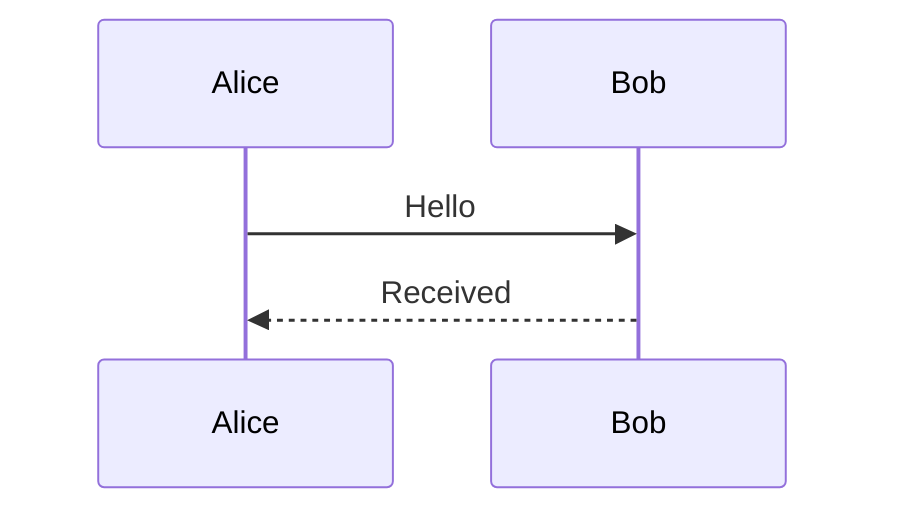
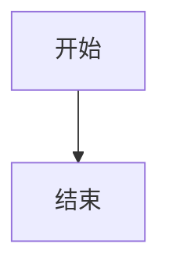

# 果铃工作台统一实施方案

日期：2026-10-10。
范围：目标与执行可靠性、主会话与临时卡、AI-native 能力、固定设计比例的原生创作、资源和本机 MCP。
核对基线：ghostairship-debug/ittoedu，HEAD df21debdde2a86e7108a1af41b7aa4df62746b67。实施时以真实工作树及有效未提交成果为准。
状态：用户已确认产品取舍；本轮只生成方案包，未开始产品开发、发行或 Portable 修复。

## 执行说明

本文件是本批唯一执行规格，包含产品规则、当前机制、具体工作包、旧路径清理、验收输入和完成条件。[包入口](README.md)负责导航，[启动指令](START_PROMPT.md)供实施者接续；[审查事实](evidence/REVIEW_FACTS.md)和[Portable 诊断](PORTABLE_SHARP_DIAGNOSIS.md)是证据。原 GPT Pro 稿只作为历史材料，不再决定当前行为。执行无需阅读此前聊天或访问临时附件目录。

用户最终决定：**放弃跨画布比例自动重排；可视作品按固定设计比例展示，视觉布局与编辑视图一致。MCP 默认权限与内置 AI 相同，用户可在连接中选择完全访问。** 临时卡完成仅高亮，点击后选中；自动引用跟随当前页面，保留 A 应固定引用；删除当前元素引用同步取消选择；本机 MCP 默认关闭，主动开启后免令牌。

“生成方案包”不等于“开始开发”。收到按本包实施的明确指令后，按 §10 接续；普通实现细化不用再次询问用户。Portable 修复仍遵守本轮仅诊断的限制，需另获明确执行授权。新的付费渠道、真实用户数据迁移、扩大远程访问以及最终发行不因本方案自动获准。

先核对真实 HEAD、未提交改动及直接受影响链；已满足规则且证据仍有效的内容复用，不重复实现或跑无关测试。保全用户文件、人工布局、恢复稿及旧发行证据，不启动旧 queued，不改 AGENTS，不把本包标为已实施。

## 1. 方案结论与优化目标

果铃应围绕**同一份真实作品**提供两种 AI 工作方式：主会话承载连续、可追溯的工作；临时卡承载局部、快速、可并行的操作。两者共享目标定位、能力描述、正式写入和运行输出，分别管理自己的上下文与界面生命周期。

模型使用熟悉的内容、样式、布局和程序表达，决定创作意图与设计。软件将这些表达可靠地作用到目标上，负责身份、属性映射、资源、布局执行、版本依据、事务、撤销、保存与运行管理。普通新作品保持原生、可持续编辑；局部程序不吞掉整页。

优化按照以下顺序取舍：

1. 用户能完成创作和修改，作品、人工调整与持续编辑能力不回退。
2. 模型保留有价值的判断与设计自由，机械步骤由软件执行。
3. 在相同任务质量下，减少模型依赖往返、无关输入与错误恢复，改善实际应用速度。
4. 降低开发和维护复杂度：复用现有业务 owner，删除被替代的公开路径和旧规则。

不以工具数量、最小代码差异、节点数量或一次截图作为优化目标。不预先承诺任意 HTML/JS 无损原生化、弱模型审美自动提升或固定百分比的性能收益。

### 1.1 实施重点

先修正真实错写和结果串轮，再打通目标到语义操作的共同链路。对象锁与同文档多预览需一起闭合，不能只放宽 Gateway 而留下单预览消费者。

原生创作沿现有自由 frame、正式对象及固定设计视口接续。AI 的 HTML/CSS 用于表达设计和续改；软件求值、装配、维护身份并回投当前作品。放弃跨比例响应式系统后，不再新建持久 Flex/Grid 容器引擎，也不把合法自由 frame 判成失败的像素快照。

能力与上下文共同组织。普通正文、格式和外观首轮可用；长尾可发现并真实调用。资料准备、资源绑定、等待、路径、版本和事务由软件承担，保留模型的内容、设计、研究与判断自由。

## 2. 已确认产品规则

| 项目 | 最终规则 |
|---|---|
| 主会话 | 工作空间归属，每个会话内部串行；保留可选文件夹分类与历史，分类不隐式决定操作目标或相对路径。 |
| 临时卡 | 独立临时上下文，不进入主会话历史；固定原空间与目标；不同、不冲突目标可并行，同文档也应支持。 |
| 默认引用 | 自动项跟随当前页面/文档与实际选择；开始输入不冻结；需要持续关注 A 就固定 A。 |
| 固定引用 | 可同时固定多个文件、页面和元素；固定身份，后续任务读取当前内容；发送后保留。 |
| 删除引用 | 删除当前元素引用同步取消当前选择；不在眼前的固定元素删除不影响眼前选择。旧焦点不立即补回已删除引用。 |
| 卡片存续 | 无未结束任务时，用户取消选择才关闭；准备/等待/运行中取消选择保留，完成不追溯执行旧取消。 |
| 卡片显示 | 随真实目标和裁切显示；离开视野隐藏，返回恢复；不夹在窗口边缘。完成只高亮结果，点击后定位和选中，不抢焦点。 |
| 过程与回答 | 两通道展示真实活动与自然语言；只显示本轮真实最终输出，不套摘要、不以进度或旧回答代替。 |
| 全表面 | 目标、引用、停止、卡片与结果规则贯通 MD、TXT、HTML、原生工程；格式能力以实际格式为准。 |
| 修改 | 单一正式作者数据和事务；生成锁作品、局部修改锁实际目标、结构重做锁相应页面/文档，参考项不全锁。 |
| 编辑布局 | 人工自由拖拽；自由文字使用文本框；拖动不默认改排序，也不被 CSS 自动弹回。 |
| 创作表达 | AI 可用 HTML/CSS、Flex/Grid；在固定设计视口装为正式对象和自由几何；当前作品可回投给 AI 持续修改。 |
| 展示布局 | 放弃跨比例自动重排；窗口/设备变化只整体等比适配、留白、镜头或滚动，不改作者排布。 |
| Flow | “流式布局（Flow）”；正文保阅读顺序，固定逻辑排版宽度、自然内容高度和滚动；自由浮层/文本框不支配正文邻居。 |
| 结束 | 普通模型任务自然结束，退役公开强制 task.finish；保留内部 run.end、停止屏障和未知副作用查询。 |
| 保存 | 普通编辑进当前作品/恢复稿；原格式保存、指定导出与独立成果写盘分别表达，不自动混为存盘。 |
| MCP | 默认关闭、主动开启后免令牌；默认与内置 AI 共用四档及 DEFAULT_PERMISSION_MODE，当前为 workspace；连接可直接调整为 full。 |
| Portable | 已完成只读诊断；底层原因待证，修复候选与取证单独管理，未授权自动修复或替换发行件。 |

固定比例约束可视作品的作者构图，不把 TXT 虚构成有字体颜色的画布。Flow 正文的内容增长、文本框内部换行、表格/图表及局部程序内部排版继续按自身属性工作；宿主窗口变化不得改变页面邻居的位置。比较视觉时使用相同页/状态、设计尺寸、字体素材和观察矩阵，编辑选框等 UI 装饰不属于作品画面。

## 3. 统一实现的核心：目标、操作和副作用各归其位

### 3.1 必须分开的概念

| 概念 | 含义 | 不能代替什么 |
|---|---|---|
| 工作空间 | 文件组织、会话归档和默认执行环境 | 不是当前页面，也不是一次操作的实际修改范围 |
| 引用集合 | 用户希望本次任务关注的内容身份 | 不自动决定读写角色，不自动锁全部引用 |
| 操作目标 | 当前指令／调用具体作用的内容 | 不等于当前浏览焦点；不能因可读成字符串就决定使用正文替换 |
| 操作语义 | 读取、改正文、改格式、改布局、创建、导出等 | 不等于内部模块或文件格式 |
| 授权范围 | 本任务允许接触或修改的边界 | 不等于模型必然会修改的集合 |
| 实际写入范围 | 本次已确定操作会改变的对象／结构 | 决定互斥与提交检查；不能拿诊断用 effectTargets 直接充当授权 |
| 观察依据 | 模型作出这次修改时依据的内容版本 | 不能用提交前临时重读的版本替代 |
| 视图状态 | 页面、滚动、选择、试运行现场 | 不控制运行存续，不改变在途任务目标 |

这是对既有字段和职责的归位，不要求建立八套管理系统。

### 3.2 推荐的共同处理链

```text
主会话／临时卡／人工操作
        ↓
逻辑目标 + 当前内容 + 实际能力
        ↓
模型表达语义操作，或人工控件表达相同操作
        ↓
软件解析真实目标、参数与必要写入范围
        ↓
既有专业编辑函数／内容装配服务
        ↓
正式 DocumentSession 事务、History、资源与回执
        ↓
最新目标映射 + 操作事实 + 活动／模型回答
        ↓
各表面显示、定位与继续编辑
```

人工操作不经过模型；“共同处理链”指相同的业务语义与正式修改 owner。不能只在末端共用 writer，而在前面分别维护两套“改颜色／转换图表／调整布局”的算法。

### 3.3 目标描述与能力来自现有真实实现

沿 `SelectionCapture`、`ToolTarget`、组件定义、表面适配器和 `ToolRegistration` 补齐紧凑的目标描述：内容身份、类型、相关正文／属性、所属页面和布局上下文、当前展示状态、可操作范围。

属性面板已经知道的专业属性，应尽量直接成为 AI 可用的语义参数。模型不必判断颜色存于 `data.appearance` 还是 `style`，也不必维护表格行列 ID、图片资源 ID 或新节点身份。自定义组件只声明真实支持的公开参数与源码能力。

后台可以保留很多专用函数。模型侧应有稳定、清楚的动作，不建设一个接受任意 JSON 的万能 `execute`，也不把每个内部函数都暴露为工具。

### 3.4 单一作者数据不等于所有格式统一转原生

MD/TXT 和单独 HTML 的正式源文可以继续是作者数据，结构和选区是其编辑投影；原生工程以正式对象与布局关系为作者数据，HTML 风格源文可以是输入或可生成的编辑投影。

各文档只有一个正式修改依据。不要同时保存一份权威 HTML 和一份权威节点树，再让 AI 或同步层猜哪份正确。也不要为了“全表面一致”把 TXT 自动转成富文本工程。


---

## 4. 双通道、引用与临时卡

### 4.1 主会话归属与组织

当前会话 home 已是工作空间内的可选组织位置，不是另一套会话归属。保留可选分类和“显示全部”，不删除历史或用户文件。取消 home 对默认引用、在途任务环境和文件默认根的隐式控制；普通切文件不更换会话，切空间不停止原任务。

临时卡复用现有隐藏会话和执行器，不另建轻量 harness。创建/首次接受任务时固定卡的工作空间与逻辑目标，后续发送、追问、草稿和查询都使用卡自身上下文；全局当前空间变化不能迁移旧卡。卡默认只带局部目标与必要环境，不继承主会话全部固定引用。

卡打开时可连续追问；按规则关闭后再打开属于新的临时交互，不增加跨重启长期历史恢复。内部回执、停止所需状态和作品 History 继续按已有机制保留。

### 4.2 引用集合的具体规则

引用集合放在现有会话草稿状态中。每项携带逻辑目标和固定状态，显示可读名称；固定不需要复制正文。

- **自动跟随项**：下一条草稿随着实际导航或主动选择更新，包括上一任务仍在运行时。开始输入文字本身不再冻结整组引用；需要保留就固定。
- **固定项**：跨页面、跨文件保留，发送后仍保留，可逐项删除。固定的是身份，不冻结内容版本或编辑权限。
- **提交快照**：发送时将本次引用、目标和执行环境固定下来。任务运行期间的浏览变化不改变该快照。

浏览变化不改变已提交消息及在途任务快照；输入框准备下一条任务时，草稿自动引用仍跟随当前页面，固定项保持。发送时另建本次快照。

删除元素引用须同步取消当前元素选择；删除不在眼前的固定元素，不影响眼前其他选择。独立固定的元素不依赖父页面标签是否保留。没有任何引用才回到工作空间上下文。

删除自动页面／文档引用时，同时取消依附它的未固定元素引用与点选；独立固定项仍保留。

同一目标只留一项：再次点选已固定目标不产生副本。区分页面整体引用与页面内元素引用，它们不是重复身份。取消固定保留当前项直到下次正常自动更新，不额外增加一种引用类型。目标身份须包含必要的页面／展示状态／字段或文本范围信息，同一实例的不同明确状态或范围不能误去重。

**后端接线**：同一文档的多个引用聚合为一份文档下的目标集合，再交给既有授权接口。不能把 A1、A2 做成重复 documentId；也不能让按 documentId 建立的 Map 丢掉后一项。默认目标必须来自本次明确焦点／调用，多个工程时不以“第一个文档”猜测。

### 4.3 引用的角色由操作表达

同一个集合可以支持“比较 A 与 B”“把 A 的样式应用到 B”“同时修改 A、B、C”。界面不强制区分参考与目标，运行器仍按实际操作识别读来源和写目标。

固定 A、B 不等于同时锁 A、B。复制 A 的颜色到 B 时，A 是读取来源，B 是写入目标；联合修改则分别处理各目标。读取时保存观察依据，提交时检查实际写入范围。

### 4.4 临时卡按事件关闭并随目标显示

| 情形 | 行为 |
|---|---|
| 用户取消选择，卡没有未结束任务 | 关闭该临时交互 |
| 准备、运行、等待回答或停止收拢时取消选择 | 保留卡和任务控制入口 |
| 滚动、切页、切标签或镜头使目标离开视野 | 隐藏，不销毁、不吸附屏幕边缘 |
| 任务完成 | 保留过程与本轮真实输出，高亮结果；不自动选中、跳页、滚动或聚焦 |
| 回到目标视野 | 恢复原卡和结果高亮，保持当前人工选区与键盘焦点 |
| 点击结果高亮/定位入口 | 由用户动作定位并选中修改后的逻辑目标 |
| 多张卡完成 | 各保留卡和高亮；用户点击哪一项才激活哪一目标 |
| 点击卡输入或滚动其内容 | 操作卡本身，不算取消选择 |

不得以持续条件 !running && !selected 自动销毁，也不得用挂载 focus() 在后台完成或恢复显示时抢输入。任务状态、存续、可见性、结果高亮和作者选择分别由现有状态管理维护，不新建任务平台。

卡以逻辑身份重解析当前锚点，判定活动文档/页、局部裁切和变换，不只判断应用窗口边界。文本替换跟随新范围；对象转换跟随正式身份关联；HTML 重建使用作者目标映射。目标被删除时保留结果和删除位置提示，不造新对象供选择。

已有运行列表/会话入口应可返回原任务；目标外的提示可显示“完成/定位”，但卡本体不常驻前台。显式关闭文档或应用仍沿现有停止和草稿保全；普通切页不等于关闭。

### 4.5 工作过程与最后回答

主会话和临时卡复用现有事件投影：真实自然语言流、当前活动、工具批次、等待／失败／需回答事项。普通工具详情折叠，避免一条工具占一张大卡。未提供公开进度文字时显示实际等待状态，不生成虚假思考或百分比。

最终区域直接渲染 AI 最后输出。软件不总结、不改写、不限定字数和内容格式；复用相应文本／Markdown 渲染能力，不能把回答塞进工具详情或被 `run.end` 覆盖。

`src/main/workbench/execution/ExecutionDesktopService.ts` 的 `collectReply` 当前取最后一条非空 assistant 文本，但该文本也可能是中途进度。需要将正常最终答复和过程文字正确关联到本轮运行，而非另建结果存储。

用户向上阅读时不抢滚动；最新文字或活动变化时能够跟随。卡片事件追赶复用主助手已有的合并思路，只刷新变化的运行，避免每个增量触发完整历史查询。

---

## 5. 写入、观察依据与自然结束

### 5.1 锁实际作者修改范围

生成期锁作品，局部编辑锁目标，结构重做锁页面/文档；不锁整个工作空间，也不把全部引用锁起来。暂停策划/框架确认时开放其内容编辑。

复用对象、内容块、整体文本范围等稳定单元，不建设逐字符/逐属性协作锁。同目标明确冲突，不冲突目标并行；主会话、临时卡、人工输入、属性、删除、撤销、源码和外部正式调用共用规则。不能用支持整文档单预览的现状削减已定同文档并行目标。

自由画布上改长正文不自动推开邻居；文本框内部排版和既有自动高度按正式属性处理。Flow 正文增长推移后文是文档流结果，不等同于对所有后文的作者写入。真正改变多个对象、归属或整体排布时，按实际修改范围扩锁。

### 5.2 先明确真实操作，再锁实际范围

局部“修改这里”任务目标已明确，可在准备阶段占用该目标。主会话可能只是讨论或比较，不预先锁所有引用；当操作范围确定后，沿现有写入 owner 获取相应互斥并进行提交检查。

权限、操作目标和实际影响范围必须在同一调用中衔接。正常授权内动作不增加一次额外批准；会影响局部任务之外的对象、共享定义或内容格式时，不无声扩大范围。模型改用文件／源码工具也不能绕过这一限制。

### 5.3 原观察依据持续到正式提交

模型读 r0，人工随后改到 r1，软件不能临提交重新签发 r1 句柄，把依据 r0 的 AI 内容作为 r1 的修改提交。最终 CAS 和显式 expectedVersion 必须核对原观察快照，不能在版本检查后重读而失去依据。

当前已用真实 DocumentSession/Gateway 的受控交错复现 AgentFileText.write 和 patch：r0 版本检查后，人提交 HUMAN! 到 r1，commit 经 attachRunDocument → issueTarget 捕获 r1，旧 AI draft 被接受到 r2。回执 beforeVersion 仍为 r0，beforeRevision 却是 1。这不是历史用户数据损失或 GUI 端到端证据，但已证明真实核心错写机制。

让观察的 documentId/epoch/baseRevision、绑定版本和范围持续传至事务；无关局部变更沿现有历史映射接续，真正重叠则冲突/重新读取。文件、源码兜底不能刷新依据或扩大目标。新建或明确完整替换无需无意义的前置 read，但已拿到的版本条件及并发提交检查不能被豁免。

### 5.4 停止并接手

停止后撤销后续写入权，等待已在提交的必要边界收拢，再释放锁。已应用内容保留，未提交草稿按现有规则处理，迟到结果不能覆盖人接手后的内容。继续时读取当前作品，不恢复过期内存状态。

现有 lease、停止屏障与文档关闭屏障应复用；它们并不等于产品对象锁已经实现，也不应因“精简”被无差别删除。

### 5.5 正常工具循环自然结束

```text
模型请求动作 → 软件执行并返回事实 → 模型继续或正常回答
    → 本轮无待执行调用且正常结束 → 软件收拢运行并发送 run.end
```

普通路径取消 `task.finish` 的公开要求，同时清理局部系统提示、工具目录、同轮提前 break、默认继续修复指令和相关旧测试期望。保存／导出能力回到已有作品操作中。

`run.end` 保留为内部通知，负责状态与清理，不需要模型调用，不产生一段代替 AI 回答的机械文案，也不关闭临时卡。

正常答复属于同一个模型循环，不新增摘要 Agent 或必填结束字段。确实只有工具调用而缺最终答复的路径会需要正常后续回复请求；已有最终答复的路径不再额外调用一次。

### 5.6 运行结束与作品结果独立表达

软件记录实际应用、保存、导出、失败和未知结果；模型负责解释与回应。明确修改任务没有目标提交时，不标“已修改”；普通讨论不要求制造一次写入。某个不相干文件已写入也不能证明用户选中对象已改好。

失败后已恢复的中间错误保留在详情中，不永久污染最终状态。已知失败或暂时未满足项允许模型如实说明后结束，不再要求取得“准许结束”的回执。软件也不建设一个通用目标达成判官。

必须区分自然 stop、输出截断、网络中断和用户停止。没有收到最终文字时显示真实缺失状态，不拿进度文字／软件模板冒充，也不重放已有修改来补回答。

### 5.7 自然结束不留下无主的后台写入

任务内尚有会继续写入的作业时，由现有运行器等待、收拢或明确取消其写入；不能先发结束、释放锁，再让旧作业继续应用结果。无独立工作时软件等待实际作业事件，有独立工作时模型可继续处理。

纯候选图/只读委派虽不写正式作品，仍属于本轮要求返回的成果时，也不能被 finally 无差别取消。软件等待并返回资源，或明确说明取消/失败；用户明确要求后台进行的独立任务复用已有入口和作业 owner，不建永久任务平台。

这是在途操作的生命周期管理，不是以“内容质量还不够”为由强迫模型继续。未知副作用保留原身份查询，不能为了拿到成功标记换新调用重试付费生成。


---

## 6. AI-native 能力体系

### 6.1 能力按用户动作组织

以下是模型接口的逻辑划分，不要求创建同名新工具或把全仓工具统一改名。

| 语义方向 | 模型决定 | 软件接管 |
|---|---|---|
| 寻找与读取 | 来源、问题、范围、需要什么信息 | 定位、当前稿、必要提取、分页、索引与相关表示 |
| 正文与数据 | 改写内容、专业数据与关系 | 范围、格式保留、字段映射与专业数据结构 |
| 格式与外观 | 风格、属性值、匹配来源 | 文本范围格式、对象外观、专业属性的实际存储与应用 |
| 布局与结构 | 排布关系、组合、移动、复制、转换 | 坐标／约束计算、父子关系、顺序、专业转换与身份 |
| 创作与装配 | 布局框架、内容、素材意图、局部程序 | 建立原生结构、资源绑定、持续更新与事务 |
| 行为与观察 | 互动逻辑、检查内容、视觉判断 | 运行／截图／日志；区分作者修改与运行时操作 |
| 外部执行与交付 | 搜索、生成、计算、委派、保存和导出的真实目的 | 连接、输入准备、作业等待、文件路径、资源、生产器与回执 |

### 6.2 彻底解除“选中文字＝text.replace”

入口捕获目标，不预选输出动作。`prepareExecutionContentOutput` 的默认目标便利性可以保留，其“读得出文字就标 replace-text”的定性需要取消。

正文改写、范围格式、对象外观、布局、行为与源码是不同动作。同样选中标题，既可能要求润色，也可能加粗两个词、匹配阴影或移到图片上方。模型依据意图选择实际可用动作，不需要先调用另一个分类模型。

`text.replace` 保留为明确的正文替换原语。它已有的合法富文本表达能力不全局禁用；但不能靠允许任意 HTML 注入来补对象样式工具。对象范围与正文范围需要真实支持，不能把范围文字为了改颜色自动扩大为整对象。

目标格式确实不支持某属性时给出原因和可行选择。TXT 不支持持久化颜色，不能悄悄写入 span；Markdown 的可表达范围按实际序列化与渲染能力说明。跨表面统一的是行为与接口职责，不是虚构格式能力。

### 6.3 语义操作共享真实业务函数

通过现有注册和专业处理函数提供目标可编辑属性。简单的颜色、字体、阴影、大小有明确类型和适用范围；表格单元格、图表系列、图片裁剪等保留专业语义，不强行抹平成 CSS。

“把 A 的颜色和阴影应用到 B”可以由模型指定来源、目标和属性；软件读取真实样式并映射应用。模型不必复制大段 CSS。需要创造新视觉方案时仍由模型设计，不由软件模板替代审美。

模型错误调用时，返回具体不支持项、未应用事实和当前可用的相关操作。自动规范化只做语义等价处理，不能自动升级成整页重写、跨目标修改或新付费调用。

### 6.4 工具与上下文共同渐进披露

**稳定核心**提供普通读／查、基本文件工作和真实能力发现。**当前目标动作**在首轮直接提供正文、实际支持的格式／外观等常见能力。**专业和长尾能力**在实际需要时展开，包括复杂表格／图表、音视频、代码、外部 MCP 和委派。

同一任务的工具簇尽量稳定，复用已有 `describeRun` 缓存。浏览焦点变化不重算在途工具目录。发现返回真实可调用 schema，并由软件接到后续模型请求；不能只给说明却让模型仍调用不到。

从现有注册项派生可用性、配置状态、授权和本轮可见性，不另建镜像白名单。低置信度路由用于增加候选，不能凭“文字”等关键词永久排除样式或结构能力。创建新内容的能力不能因为当前还没有对应原生对象而被永久过滤。

单项工具与 batch 不总是全量双重暴露。常见单项保留直接路径，同类型多对象可用目标列表；复杂混合变更使用适当批量装配。同文档批量可以是一笔事务，跨文档则分别报告结果，不虚构全局原子提交，也不合并独立临时卡的撤销。

### 6.5 上下文分工

| 时点／持有方 | 内容 |
|---|---|
| 首轮直接给模型 | 用户原话、紧凑目标描述、小型完整选区、常用相关样式与布局信息、页面／文档结构概要、固定引用的必要片段 |
| 需要时再读取 | 父容器／邻近内容、复杂专业数据、源码、真实画面、材料其他页段和历史取舍 |
| 软件本地维护 | 版本与范围映射、权限根、资源字节、派生表示、操作身份、完整事务、作业与停止状态 |
| 返回模型的回执 | 是否应用、实际目标、可继续使用的资源／定位、必要保存状态与具体错误 |

结构概要优先来自既有标题、对象标签、类型与索引，不为每次点选额外调用摘要模型。大材料允许分页回读；不得因为未注入全文就断言不存在信息。

固定引用在后续新任务中重新读取当前内容；不把很久以前的固定快照当当前作品。已有上下文压缩、归档、笔记与 `context.read` 继续使用，先减少重复输入，再依据真实成本调整压缩策略。不要因旧记录出现大上下文就再建一套记忆系统。

### 6.6 冗余与整合处置

| 能力／路径 | 处置 | 保留的能力边界 |
|---|---|---|
| `task.finish` | 普通模型入口退役，交付脱钩 | 内部 `run.end`、真实停止／恢复事实保留 |
| 当前 `load_tools` | 去除对现有八族无增量的加载仪式，转为真实按需发现 | 常用核心直出；完整授权能力仍可达 |
| `read / inspect / listChildren` | 统一目标、观察依据和返回形态；常用读取无需模型先猜内部表示 | 不强行把正文、结构、画面三类结果每次全量返回 |
| `object.update / object.author` 等 | 按目标投射语义属性和专业动作 | 复用既有表格／图表／图片算法，保留高级数据与源码 |
| 对齐、分布、转换 | 保留并增强 | 软件计算机械布局、数据和身份 |
| 默认 `teacher.ensure` | 适用作品在创建时由宿主准备 | 主动恢复／定制控制台保留，不给所有格式强加控制台 |
| 材料提取／表示切换 | 普通读／查内部自动准备必要表示 | 原件、页段、来源、诊断及高级提取控制保留 |
| `job.* / image.status / delegate.read` | 统一模型观察，等待与结果接续由软件管理 | 资源结果、取消、日志和未知原操作查询不能丢 |
| `file.save / project.save / finish.delivery` | 用现有通用保存能力作为常规入口，重复项目入口降为内部适配 | 原格式保存、导出、独立成果物化仍区分 |
| `artifact.save` | 保留独立成果写盘；不作为所有资源应用前的固定步骤 | 已有资源可直接应用，无需先导出到磁盘再导入 |
| `task.note` | 长任务按需保留取舍理由 | 不要求短任务维护计划、状态、摘要三份账 |
| `ask_user` | 保留真正的任务内决策／作品确认 | 普通聊天可以自然提问；权限批准仍由软件负责 |
| `compute / local / delegate / MCP` | 真实能力保留，按需展开 | 计算、外部进程、模型委派不混成同一信任范围 |
| 源码／文件兜底 | 保留，承接原目标、原观察依据和授权 | 不默认升级为整页替换，不能成为第二 writer |

基线中的 `visibleRunToolNames` 将现有八个工具族全部列为默认可见，加载不会增加这些族的可见工具；这与权限筛选是否有效是两回事。`image.fetch` 的资源获取分支则被原生工程写条件过滤。分别在W1、W4调整，不能用删除权限检查来解决暴露错误。

---

## 7. 固定比例原生创作与 AI 人工双向续改

### 7.1 正式布局事实与设计视口

复用 V10 的自由 frame、对象/编组/顺序和 Flow 正文模型。自由 frame 是合法作者布局事实，不再要求持久化响应式 Flex/Grid 容器、保存跨比例重排规则或新建布局权威。设计尺寸取作品/页/场景的正式值；Spatial 还保留世界与镜头。

软件在固定设计视口和真实字体/资源下求值 AI 输入；frame 进入正式结构后由人工/AI 显式几何修改更新。测量 DOM 不持久为第二作者树。HTML/CSS 可读写投影由当前正式结构生成，不与节点树分别保留两份权威内容。

编辑、试运行、播放及适用画面导出使用同一设计尺寸与对象布局；窗口、侧栏、设备宽高比和观察 zoom/pan 只改变适配矩阵、留白或滚动。不得用不同入口的物理面板宽度触发媒体查询或二次布局。

Flow 保固定逻辑阅读宽度、自然高度和滚动；正文收展沿阅读流，浮层保持自由几何。不能为了固定比例把长文压成固定高度页，也不能因“编辑自由拖拽”把普通正文改成一堆文本框。需要自由定位的文字使用文本框。MD/TXT 等原格式按其真实内容语义工作，视觉一致性只针对声称支持的可视作品/输出。

### 7.2 AI 用熟悉表达构造原生作品

AI 可用普通 HTML/CSS、Flex/Grid 表达初稿和明确重做的布局，使用专业内容表达与局部程序。软件经现有 ContentApply/project.apply 在固定尺寸求值、识别内容、分配身份、装配资源和正式对象；不要求模型逐节点填写 frame、抄 ID 或学习完整内部 schema。

标题、文本框/正文、图片、表格、图表等尽量装为独立可编辑对象。普通 p 的 line-height: normal、figure/figcaption、布局 wrapper 不应因识别窄门而自动吞为整页 Web。组内关系在正式编组和对象结构中保留，几何按设计尺寸落地；不要把不需要的响应式引擎作为原生化前置。

一个局部按钮/实验的 script 不应把整页标题、正文和图片都变成程序。程序保持明确局部边界；未知外部程序无法可靠拆分时保留原件和具体诊断，不承诺任意 JS 自动原生化，也不静默截图或丢内容。

### 7.3 人工自由拖拽与当前作品投影

人工拖动/缩放直接改变正式自由几何，默认精确保留落点；不解释为自动改顺序，不在后续 CSS 求值时回弹。主动编组、排序、移入/移出或重做布局用明确现有动作表达；不让用户为每次拖动选择映射策略。

AI 续改读取从最新正式结构生成的内容/HTML/CSS，其中含当前位置、尺寸、文字样式、素材与对象身份。不得把初始输入 HTML 当当前作品，再叠一层 AI 看不到的人工覆盖。固定布局的 CSS 可以包含定位和尺寸，AI 仍使用熟悉语法；软件负责投影身份与差异映射。

局部改正文、颜色、题注或程序源码仅改变真实差异，保护未涉及对象和人工几何；不把“提交了一段 HTML”当作整页重导入。明确移动、调整大小或重做时，才更新对应 frame。文本框内部自动高度/固定高度/缩小适配继续由已有策略处理，不能由宿主视口偷偷改变。保持一手势一历史、事务/ACK 不重复提交。

### 7.4 框架 内容 素材 状态与程序

复杂作品可先建立正式框架再填内容/素材/互动；简单区块可一批创建，不强制空壳与逐节点工具序列。框架和后续续改操作同一作品与身份。

软件分配素材占位身份；结果返回后沿原目标登记/应用。步骤、命名状态和连续模拟分别用现有能力，按作品需要使用，不规定每页数量。教师控制台仅在适用作品创建时准备，主动恢复/定制继续可用。

局部实验/游戏可作为有身份、frame、源码和公开参数的程序组件。第三方 HTML 保真路径及边界继续保留；不得借固定比例要求静默改写用户原始网页、迁移旧作品或关闭已有高级编辑能力。

### 7.5 视觉一致性与输出闭环

“与编辑视图一致”包含实际文本换行/字体、对象几何、样式、图片裁切/方向、层次、组变换和同一展示状态；对象坐标相同不足以证明一致。编辑选框、快捷条等 UI 不进入作品输出；合法运行交互可改变运行状态，比较时对齐场景/状态。

优先复用现有浏览器、组件渲染和文本布局实现，消除重复缩放、不同字体 fallback 与设计尺寸来源分叉。缺字体/素材或不支持的导出能力应明确诊断，不用整页截图或静态化掩盖新作品原生生产缺口。

用一个连续作品贯通 AI 创建 → 人工拖动/缩放 → AI 只改另一对象 → 保存重开 → 编辑/试运行/播放 → HTML 与声称支持的其他画面导出，再改变窗口比例确认只整体适配、不重排。不建设跨比例响应式验收。

## 8. 材料、资源、文件和作业：下沉没有新判断的步骤

### 8.1 材料读取

普通“读取这个章节／查找这个问题”由现有材料服务自动准备必要表示、复用缓存并返回所需页段。模型负责信息选择与解读，不负责搬运 attachmentId、派生 ID 和 representationId 的固定流程。

保留原件、页码、来源、未提取范围和诊断。按需求取文本或页面图像，不默认全件 OCR、全量截图或新的付费解析。高级提取控制仍可按需使用。

### 8.2 资源获取与应用分别判断

搜图、下载、生成资源不天然依赖已有可写原生工程；应用到某个对象才检查目标的实际写能力。修正 `image.fetch` 的资源获取分支与原生类型的错误耦合，并检查同类音频、视频和附件链。

明确要求“生成并插到这里”时，生成、资源登记与目标绑定可以由软件组合。需要挑选候选或用户尚未决定时先返回资源，不提前写入作品。不要改变 `image.generate` 现有参数含义却不修改接口和消费方。

已有资源能直接进入正式对象时不先落临时文件再导入。只有实际要交付独立文件时才物化，并返回真实路径。资源失败不抹掉已经完成的独立内容，也不自动换付费模型或另起生成请求。

### 8.3 作业运行

统一对模型提供必要状态、结果与资源接续，底层复用原作业 owner。普通等待由软件事件或既有有界等待处理，模型只在新结果需要判断或有独立工作时继续。

保留取消、查询原作业、读相关日志、获取图片资源和委派结果。长任务能力不能因“减少工具”被删掉。作业等待不新增一份永久台账，结束与停止沿第5节规则。

### 8.4 路径和授权上下文

普通文件读、写、建目录、成果保存与 `from` 统一使用明确的默认目录语义。工作空间作为默认起点，临时目录通过明确返回值表示，不让模型猜会话目录或文件夹绑定规则。

preflight 与 execute 从同一个任务上下文取得已有绑定文件范围，补齐 Engine 普通文件路径丢失 `readOnlyRoots` 的断点。读取工作空间外的已绑定文件不等于开放整个桌面，也不自动扩大写权限。

工程虚拟路径与磁盘路径对用户／模型清楚说明；软件能够识别已有工程路径时复用其正式 owner，不能误走普通磁盘 file.read。暂不强行统一两者的数据存储。

### 8.5 保存、导出和恢复稿

沿用既有“普通编辑应用到当前作品／恢复稿，不默认保存磁盘”的约定。创建文件的写盘行为以实际文件操作回执为准，不能混成所有修改都自动存盘。

常规模型接口统一原格式保存；导出有清楚格式意图；独立作业成果物化保留实际含义。不得让省略参数在不同别名中既表示保存又表示 HTML 导出。已应用、已保存、已导出分别展示，但这份状态由软件维护，不要求模型记账，也不作为是否允许结束的统一资格。

---

## 9. 内容输入、导航、命名与接续

### 9.1 确认采用眼前当前内容

策划、框架或其他关联作品的确认绑定具体文档。确认时提交编辑器内尚未应用的草稿，取得当前正式内容，重新建立继续编辑的观察依据与必要写权，然后把最新内容交给模型。

人工修改与临时卡修改都应被采用。无需用户先保存磁盘，也不重新生成一份策划覆盖原文。提交草稿失败就呈现真实原因，不拿旧内容继续。普通不关联文档的问题不升级为审批文档流程。

### 9.2 Markdown、代码块和异步粘贴

修共享粘贴与序列化链。明确的 Markdown 围栏进入正式代码块；代码块内部和纯文本粘贴保持字面语义。已损坏旧片段可显式重新解释并可撤销，不做全局反转义。

已标记 `mermaid` 的非空块交由实际库解析／渲染，取消自写图类型前置白名单；错误显示真实诊断，保留原安全渲染和过期响应保护。`isMermaidSource` 对类型名后换行、前置注释等输入存在误拦；删除该前置门后仍须验证真实渲染与保存重开，不能只测试正则。

异步素材粘贴遇到原目标改变时保留防错写，但应告知未应用原因，不静默返回，也不追随新光标突然插入。Mermaid 加载失败后的缓存重置／重试是关联恢复优化，需代表用例确认，不作为已普遍发生的故障。

### 9.3 编辑、试运行、播放

对具备演示／运行语义的表面，取消独立“运行现场”提示条，在同一位置常驻编辑／试运行／上一步／下一步／回到初始画面。纯文本不为外观一致而新增虚假的播放能力。上一步／下一步使用真实页内步骤与页面推进，不给旧翻页按钮改名了事。

切换编辑／试运行保留当前场景位置；模式改变输入和执行状态，不默认回到初始页。上一步不是编辑撤销，运行时变量也不因进入编辑就全部固化到作者数据。

“回到初始画面”默认作用于当前页／场景；整份作品回起点使用页面导航。在同一导航 owner 内落实，不额外建设一套编辑模式导航。

### 9.4 Flow、Skill 与模型选择

模式相关界面、帮助和工具／Skill 说明统一“流式布局（Flow）”；实际教学讲义的内容用语保留。内部 `flow` 标识不因改名迁移。

Skill 负责创作方法、教学／研究策略和可选配方；工具描述和目标能力负责怎样使用软件。内置能力默认可用，外部同名 Skill 通过明确来源选择；不再要求必读若干 Skill 才能调用已授权工具。

修复旧提示对正文替换、整页 HTML、强制 finish、必经材料物化的错误引导。不能一边修改能力接口，一边保留另一份旧操作指南让模型继续走旧链。

模型切换近期先显示当前任务实际模型与后续提交模型。在途下一次请求切换模型不属于已定必做；不以该增强为借口重写执行器。

### 9.5 本机 MCP 与内置 AI 同源权限

默认关闭；用户主动开启后在回环地址免令牌连接。四档共用 executionPermission.ts 的 read-only/ask/workspace/full、默认常量及解释；当前默认为 workspace。full 保持“可读写任意文件，修改不再询问”的现有语义，用户可在已有连接界面直接选择，不新增批准、配对或令牌手续，也不要求手工重连。

连接绑定用户选择的工作空间。普通前台导航/切空间不重定向已连会话；连接明确切空间或改权限时，通过原 run/grant 和停止屏障使后续调用生效，保护已接受调用的冻结依据与已提交成果。旧 writable 句柄和未执行调用按新授权边界失效，迟到回复及原操作回执不能丢失到触发副作用重放。

默认权限相同还须同实际授权行为：普通文件、前台文档、明确绑定外部文件和 Office 使用同一冻结读取集合。“明确提供”指用户/宿主登记的实际授权，不是客户端自报文件参数。workbench.state 不可成为超出当前档位与实际授权集合的读取旁路；用户/宿主明确提供的空间外文档，应与内置任务一样可读，不能扩大到整个父目录。full 的空间外前台内容/文件读取和写入继续真实可用，不受工作空间根限制。

旧 enabled:true 不能被当作用户已主动开启新的免令牌模式。端口/权限等偏好保留，首次升级该模式从关闭开始；新明确启用事实由单一设置 owner 记录，主动选择后按既有偏好持久化，不每次启动清零。保留 Host/Origin、停止、正式事务和对象锁，不扩大到公网、远程监听或另一套外部 writer。

## 10. 实施任务、依赖与源码落点

### 10.1 启动与工作顺序

收到实施授权后先运行 git status --short、git rev-parse HEAD、git log -1 --oneline、git diff --stat，核对实际 package.json scripts 和工具可用性。读当前用户入口、AGENTS、相关合同及直接 producer/consumer，不重新展开全仓审计。

| 工作包 | 结果 | 前置/可交错部分 | 完成条件 |
|---|---|---|---|
| W1 | 语义目标、观察依据、最小互斥、自然终态及能力投射 | 先修错写和串轮；从标题颜色/阴影修改贯通 | 原依据不丢、不扩大范围，同文档并行可用；回答/状态真实 |
| W2 | 工作空间会话、多引用、卡片、确认、输入和导航 | 依赖 W1 共同目标/输出；独立 UI 小修可先做 | 各代表表面完整闭合，保留人工焦点和在途任务 |
| W3 | 固定比例原生创作、人工自由拖拽、当前源码投影及导出 | 从 W1 开始验证小作品；生产接入依赖目标/事务 | 人改与 AI 续改、保存/重开、运行和适用导出视觉一致 |
| W4 | 资料/资源/作业/文件减负及免令牌 MCP 同源权限 | 使用 W1 注册与 grant；非重叠项可交错 | 机械步骤内部衔接，已有高级能力与完整权限仍可达 |
| P1 | Portable 故障补证及局部修复候选 | 诊断已完成；运行需 Windows/原制品；修复需另行授权 | 每项事实/假设区分，未复现不冒称根治 |

推荐先闭合 W1.2 错写、W1.3 串轮，再接 W1.1 样式修改与 W3 固定视口往返。W2 卡片/引用使用同一目标与输出链；W4 路径、MCP和材料可依窄接口交错。Mermaid、命名等独立项不用等最大结构任务；W3 是本批必做，不静默延期。

单一主执行者实施与自检，确有独立收益时并行；共享实体单 writer，重要结构改动沿现行必要独审，不为每个小修建立子 Agent、卡或审批门。版本/权限/持久化改变只更新真实相关合同，不新增第二执行台账。

### 10.2 W1：可靠的语义修改与自然执行

#### W1.1 目标捕获、操作语义与专业参数

**现有断点**：`prepareExecutionContentOutput` 在能读取文字时直接定性为 `replace-text`；整对象属性接口拒绝文字字段／范围；HTML局部入口与原生对象属性接口不接续；专业外观字段的存储差异仍需要模型猜测。

**直接定位**：

| 路径 | 重点符号／内容 |
|---|---|
| `src/core/tools/ToolTargets.ts` | `prepareExecutionContentOutput`、`readEditableTargetContent`、`planTextSelectionReplacement`、HTML作者字段映射 |
| `src/core/tools/ToolRegistration.ts`、`src/core/tools/ToolCatalog.ts` | 目标支持条件、工具语义、targets/effects/handler |
| `src/core/tools/toolSchemas.ts` | `objectUpdatePropertiesInputSchema`、`objectAuthorInputSchema`及范围参数 |
| `src/core/tools/courseInstanceEdits.ts` | `courseInstancePropertyEdits`、`courseInstanceConversionEdits` |
| `src/core/course/componentDataEdits.ts`、`src/components/text/data.ts` | 专业属性与现有 formatTextComponentRange，共享人工/AI范围格式函数 |
| `src/renderer/workbench/SelectionContextController.ts` | 捕获、当前稿准备、目标引用 |

**执行**：

1. 保留宿主默认目标的便利性，移除从“能读成文字”到“必须正文替换”的定性。先提交本地输入，再捕获准确逻辑目标；小选区和必要属性直接进入首次请求。
2. 将正文改写、范围格式、对象外观、布局、结构和运行时操作明确区分。优先扩展现有语义handler；需要新增动作时使用清楚、窄而可组合的参数，不加万能任意JSON执行器。
3. 将人工属性面板使用的专业函数接到同一动作。模型使用专业属性名／可读定位，软件处理 `appearance/style/sizing/frame` 等存储差异、行列身份和资源编号。
4. 支持“来源A、目标B、指定属性”的确定性匹配。读取A与写B分别解析，复制已知样式不让模型抄整段CSS；需要创作新样式时保留模型表达。
5. 更新HTML轻编辑、MD、TXT和原生工程入口。用源码搜索定位 `HtmlLightEditOverlay`、`TextAiButton`、`ElementAiButton` 及其调用者，不能只修共用类型而不接表面。
6. 不支持的格式或范围返回未应用事实、具体原因和实际可用动作；只做语义等价的参数规范化。TXT不写入标记，窄选区不静默扩为整文档。

**清理**：删去入口、提示和测试中“所有选中文字只许替换正文”的假设；不删除真实的 `text.replace`、高级源码或专业编辑能力。

**验收**：V01、V02、V03、V06。以“B匹配A的颜色和阴影”为第一条闭环，再检查同一入口的改正文和范围加粗。

#### W1.2 观察依据、实际写范围、最小互斥与停止

**现有断点**：已有单writer、CAS、停止租约和文档关闭屏障，但这些不等于产品对象锁；文件 write/patch 已复现校验后重新签发句柄导致原观察依据丢失；源码／文件路径与局部目标范围需要连续传递。

**直接定位**：`src/core/tools/DocumentToolGateway.ts` 的 `beginRun`、`issueTarget`、目标映射、`effectTargets`、`effectWriteScopes`、`withWriteTaskBarrier`；`src/main/workbench/execution/AgentFileText.ts` 的 `write/replaceExisting/patch/commit`；`src/main/workbench/execution/EditSessionService.ts`；`src/main/workbench/execution/ExecutionEngine.ts` 的 `stop/drive/finally`；当前 `DocumentSession`、人工输入提交调用者及 `src/renderer/workbench/EditPreviewProjection.ts` 的多预览消费。

**执行**：

1. 基于已确定的逻辑操作取得实际作者写入范围；读取引用不加写锁。局部任务在准备时锁目标，新作品生成锁该作品，结构重做锁稳定页面／文档范围。
2. 沿已有正式写入owner实现任务级最小互斥；对象／内容块／整体文本选区为单位。接入人工输入、属性面板、键盘删除、撤销、源码、另一个AI任务及外部正式调用。
3. 保留软件捕获的原观察版本及字段／范围依据，复用已有映射。无关变化接续，重叠变化明确冲突；不得将临提交重读的新版本冒充模型编辑依据。
4. 明确整篇重做仍可整体提交；新建或意图完整的直接替换不新增仪式性前置read。对同文档batch保留真实原子事务；跨文档分别记录结果。
5. 在任务结束或停止时先收拢在途写入并撤销迟到写权，再释放产品锁；不合并独立临时任务的撤销组。
6. 原参考内容在一次任务内按已读取的观察依据使用；续作读取当前作品。无需建设实时参考依赖图或自动合并系统。
7. 同时移除 EditSessionService 的 documentId → 单 editId 限制及 EditPreviewProjection 的单快照假设。按既有目标/运行身份消费多个不冲突预览，停止/ACK/结束只清理对应任务；预览不是正式作者树。

**清理**：不能新增第二writer／History；现有停止、最终CAS、授权和未知副作用保护继续保留。组件内部排版和 Flow 文档流结果不等于对所有显示位移对象的作者写入；自由页面不自动重排。

**验收**：V04、V05、V06、V08。必须加入显式 expectedVersion 校验后人工提交的受控交错场景，分别验证 write 和 patch；不把核心复现说成历史用户数据损失。

#### W1.3 自然结束与AI最后输出

**现有断点**：局部系统提示要求同轮 `text.replace` 后 `task.finish`；该工具成功后循环提前break；当前自然 stop 仅 pending/unknown 会继续，已知失败可 partial；不得误写成现状普遍强迫修复已知失败。`runEndSummary` 是软件诊断，`collectReply` 已实证忽略本轮边界，旧回答、带工具的进度和截断文字均可能成为回复。

**直接定位**：`src/main/workbench/execution/ExecutionEngine.ts` 的系统消息、`runTools`、`drive`、`publishEnd`、恢复逻辑；`src/main/workbench/execution/executionOutcome.ts` 的 `executionExitDecision/executionCompletionIssues/runEndSummary`；`src/main/workbench/execution/ExecutionDesktopService.ts` 的 `collectReply/startSubmission`；`src/core/tools/TaskNoteTools.ts`；`src/shared/workbench/userQuestion.ts`；现有模型事件、消息落库与两通道展示消费者。

**执行**：

1. 普通模型目录不再暴露或要求 `task.finish`。保存／导出复用现有动作，移除其与结束资格的绑定。
2. 工具结果返回同一个模型；模型继续调用或正常答复后自然结束。没有在途副作用时，不因为已知失败或未满足项要求重复申请结束；也不创建新目标达成判官。
3. 以 initialMessageCount、本轮请求/消息身份、工具轮及 finishReason 区分最终回答、进度和截断，复用现有消息记录。失败/停止且没有本轮最终答复时，不复制上一轮文本，不为补回答重放已有修改。最终回答原样传到主会话和卡片，不重新总结、截成固定模板或塞进工具详情。
4. 保留内部 `run.end`，仅处理运行状态和清理，不覆盖模型文字、不关闭卡片。同步校正明确目标的应用事实，不能用无关写入证明目标已改。
5. 核对原 `task.finish` 提前break之后的流式能力观察、缓冲flush和清理，接回正常循环，不能在移除分支时漏掉必要逻辑。
6. 区分stop、截断、断连、用户停止。未收到最终答复时诚实显示缺失，不把进度当结论，不重放已有修改。已有最终回答不再额外请求一轮。
7. 历史运行读取可保留内部兼容；恢复已完成事实不重新调用模型或重做工具。真正开放中的作业由原运行器等待或取消写入后收拢。

**清理**：普通工具暴露、局部提示、Skill操作说明、提前结束分支、无必要的结束批准及其旧测试一起调整。保留 `task.note` 的长程取舍记忆和 `ask_user` 的任务内决策；普通主会话允许自然提问并结束等待下一条消息。

**验收**：V07、V08、V16。测试使用假provider先完成，无需为终态逻辑反复付费跑整课。

#### W1.4 真实按需暴露的基础接线

**现有断点**：八个工具族全部默认可见，`load_tools` 对这些族无可见性增量；工具available、configured、authorized与exposed的含义需要分别处理；单项与batch重复投射全量参数。

**直接定位**：`src/core/tools/ToolRegistration.ts`、`src/core/tools/ToolCatalog.ts` 的 `visibleRunToolNames/batchInputSchemaFor`；`src/core/tools/DocumentToolGateway.ts` 的 `describeRun/resolveRunTool/loadToolFamilies`；`src/main/workbench/execution/ExecutionEngine.ts` 的 `runTools/refreshTools`；`src/core/tools/modelToolResult.ts`。

**执行**：沿原注册表投射“稳定核心＋当前目标真实动作＋可发现长尾”，复用原schema、handler和缓存。替换现有无效加载时，在同一增量中接好发现后的可调用schema；不能先移除加载却令长尾不可达。复杂batch只含本轮相关变体，简单修改保留直达路径。复用已有回执精简和上下文压缩，不新建摘要器、路由模型或能力白名单。

**清理**：不再发送一套总已可见工具并要求再加载；不因关键词路由永久排除其他合理动作。长尾精调和资源能力条件在W4继续，但常用正文／样式必须在W1首轮可用。

**验收**：V09、V10；重点验证“未加载→可发现→同一任务真实执行”的可达性与权限一致性。

### 10.3 W2：双通道、引用和所有表面的交互

#### W2.1 工作空间会话与逐项固定引用

**现有断点**：文件／文件夹会话home影响默认上下文；输入会冻结整集合，添加引用替换集合，发送后清空；selection移除按全组处理，后端拒绝重复documentId并依赖唯一工程推断默认目标。

**直接定位**：`src/renderer/workbench/ExecutionAssistant.tsx` 的 `freezeDocuments/changeSelection/unpinSelection/removeDocumentReferences/applySendResult`、root effect、会话home处理；`src/renderer/workbench/SelectionContextController.ts` 的 `setPinned/captureDocumentReference`；`src/shared/workbench/conversations.ts`；`src/main/workbench/execution/ExecutionDesktopService.ts` 的 `prepareSubmission`；`DocumentToolGateway.beginRun`；现有会话管理和 `WorkbenchSessionPortal` 消费者。

**执行**：

1. 普通主会话统一归工作空间，保留工作空间内可选 home 分类/筛选与“显示全部”，取消其对自动目标和执行根的隐式控制。既有历史与组织信息保留，不因此删除会话或移动用户文件。
2. 在现有会话草稿中存引用身份、固定状态和必要显示信息；自动项随空闲焦点更新，固定项增量保留，发送后固定项不清空。输入文字不冻结全组。
3. 页面／文档与元素引用独立可删；删除当前元素同步取消点选，删除后不被旧焦点立刻补回。多选可批量固定，相同逻辑身份去重。
4. 提交前完成输入drain并按最新版本解析全部引用。前端标签逐项保留，后端按文档合并目标；同一文档多个页面或对象不重复授权、不相互覆盖。
5. 在提交中保留明确聚焦目标与各项身份；工具显式目标优先，歧义时返回候选，不能默认写向第一份工程。引用没有强制“参考／目标”角色。
6. 任务运行不随浏览变目标或空间。保留现有后台入口以返回原会话；无需新建跨空间任务平台。

**清理**：文件home自动重新绑定、整组输入冻结、单文档覆盖集合、发送清空固定项及其旧测试期望。

**验收**：V11。固定A1、A2、B页后浏览C并联合操作；逐项删除和取消固定均要走一次。

#### W2.2 卡片存续 逻辑锚定 结果高亮与并行

**现有断点**：`dismissText` 只要有历史entries就拒绝关闭；不可见目标被 `cardPosition` 夹回窗口；卡片保留旧DOM锚点；发送时的全局工作空间可能重新解释存续卡片。

**直接定位**：`src/renderer/workbench/elementCards/elementCardController.ts` 的 `dismissText/openText/send/followText`；同目录 `ElementTextCards.tsx` 的 `cardPosition/textAnchors/TextCardPanel/ElementTextCardLayer`；`ElementAiCard.tsx`；`src/renderer/editing/quickbar/SelectionQuickBar.tsx`；各表面真实选择／几何适配。

**执行**：

1. 关闭条件改为事件：用户在任务非运行期间取消点选。运行中取消、任务结束、UI卸载、目标离开视野均不自动关闭。准备、排队、等待回答和停止收拢属于未结束。
2. 存续卡根据逻辑目标重新取得当前位置和裁切区域；离开活动文档、页面或局部视口时隐藏，禁止屏幕边缘常驻fallback。
3. 文本替换用已有 `followText` 与ACK范围映射跟随；HTML作者目标和原生实例各走真实适配。返回视野时卡片和结果高亮恢复，不自动选中；用户点击后选中当前逻辑目标。
4. 完成只高亮并保留卡片；用户点击结果后才定位/选中。多卡分别保留结果，不抢当前作者选区/键盘焦点。去掉恢复挂载时的无条件 focus，点击卡片输入/滚动不关闭自身。
5. 卡片工作空间和目标随创建／首次任务固定，不因主会话切空间重建卡会话。可复用隐藏会话执行，不建第二harness。只在真实关闭时结束该临时交互，不建立永久聊天历史。
6. 不冲突卡并行，同目标遵守W1写锁；卡片消失不删除作品与正常撤销。显式关闭文档／应用仍沿现有停止及草稿机制，不将普通切页误作关闭。

**清理**：旧常驻前台fallback、提交过即不能关闭的entries判断、依赖当前全局workspace重定向旧卡、只依赖quickbar存续的卡生命周期。

**验收**：V04、V12、V13；MD、TXT、HTML、原生工程各跑一次完整返回链，不把共享类型测试当作表面接通。

#### W2.3 过程展示、最后回答与事件开销

**直接定位**：`src/renderer/workbench/ExecutionTimeline.tsx`、`executionTimelineModel.ts`、`ExecutionAssistant.tsx` 的事件追赶；`elementCardController.ts` 的 `catchUp/refresh/applySubmission/withReply`；`ElementAiCard.tsx`、相关CSS和共享执行事件投影。

**执行**：向卡片开放已存在的活动投影；两通道共用自然语言流、当前活动和紧凑工具批次，详情默认折叠。以W1最终消息原样渲染，不另写摘要。滚动跟随依赖文字／活动变化并尊重向上阅读。复用主会话catchingUp/catchUpPending合并追赶，每次只刷新变化运行；用现有身份/单调状态/请求序号防止旧 conversation、旧 run 或迟到 running 查询覆盖 completed；过期异步查询不能覆盖新状态，查询失败保留已有画面并给必要反馈。

**清理**：卡片仅“请求＋粗状态”的展示、按每个增量全量查询历史、一工具一大卡、仅entries数量驱动滚动。

**验收**：V07、V12、V17。性能改善以真实请求／IPC计数与耗时衡量，不宣称它就是长任务全部耗时来源。

#### W2.4 确认当前稿、Markdown粘贴与Mermaid

**直接定位**：`ExecutionEngine.ts` 的 `ask/answer`；`src/shared/workbench/userQuestion.ts`；`SelectionContextController.prepare`、Gateway的 `prepareInput` 和文档drain；`src/renderer/document/editorSession.ts` 的 `createDocumentDraftSession/handlePaste/pastePrepared`；`src/shared/document/markdown.ts`；`src/renderer/document/mermaidCodeBlockView.ts` 的 `isMermaidSource/loadMermaid/render`。

**执行**：ask_user 的作品确认明确携带文档/范围/候选身份；普通问题不绑定作品。关联作品的确认先通过已有 renderer input preparer settle/ACK，再 drain 当前正式稿并更新续作观察依据，包含人工与临时AI修改；失败不得继续旧稿。普通无文档问答不增加确认文档。共享可视粘贴识别明确Markdown围栏，保留纯文本粘贴与代码块内字面输入；已有受损片段只能显式重解释并可撤销。非空mermaid块直接交给实际库，移除图类型白名单；语法错有诊断，保留安全模式与过期结果保护。异步带资源粘贴因目标变化取消时给出未应用反馈，不能追到新光标。覆盖加载失败后失败缓存重置和显式重试，不扩展成完整新加载系统。

**清理**：确认只返回选项、不刷新作品的分支；以围栏普通正文转义代替代码结构；Mermaid前置静默empty；素材粘贴取消无反馈。

**验收**：V14、V15。

#### W2.5 导航、Flow名称、模型显示和内置方法

**直接定位**：`src/renderer/ui/workspaces/SlideLocationWorkspace.tsx`；通过符号搜索定位 `SlideWorkspaceConnector`、`CourseV10RuntimeView/resetPlayback`、`src/renderer/components/ComponentNavigationOwner.ts`；`ExecutionAssistant.tsx/switchConversationModel`；`src/shared/courseAgentSkills.ts`、实际内置Skill来源和生成打包入口。

**执行**：对有演示语义的表面复用已有现场保留/当前页 reset owner，落实常驻五动作；修正 scene.previous/next 绕过 step 的接线，并使编辑态真实导航在共同 owner 中可用，保持 step/page 推进和当前现场，移除独立live-scene-bar。Flow模式统一称流式布局，保留内容意义上的讲义和内部flow标识。显示当前任务实际模型与后续提交模型，不增加本轮在途热切换。Skill只负责创作方法，公共能力和授权不以读Skill为前置；内置随产品可用、外部同名通过显式来源选择。

**清理**：旧导航条、翻页按钮伪装页内步骤、模式名称残留、旧操作说明。生成的内置Skill文件用现有生成入口同步，避免只改源码说明而打包仍旧。

**验收**：V18、V19；纯TXT不凭空增加播放能力。

### 10.4 W3 固定比例原生创作与持续编辑

#### W3.1 固定设计视口与可编辑装配

现状：现有 htmlObjectStyle 的布局规则剥离、纯布局 wrapper 展开，在固定几何装配中可以继续使用；仅修造成实际画面偏差、必要编组/身份或可编辑语义丢失的分支。professionalHtml 对普通 p/normal line-height 与 figcaption 的识别存在落入 Web 的窄门；measurement 的 sourceScopes/document 程序标记可能保留完整 body，即使没有局部程序需求。现有自由 frame 与固定 stage fit 可复用，问题是装配对象的可编辑性/边界及当前投影的可靠往返，不是缺少响应式引擎。

直接定位：
- src/core/contentApply/assembly/htmlAssembly.ts：htmlObjectStyle、assembleMeasuredHtml、wrapper、flowCoupled、sourceProgramAssembly。
- src/main/workbench/contentApply/application/html.ts 与 professionalHtml.ts：专业内容/Flow 识别、原生对象与局部程序装配。
- src/main/workbench/contentApply/measurement/prepareMeasurementDocument.ts、ElectronHtmlDesignMeasurement.ts：固定设计视口、sourceScopes、程序边界和真实字体。
- src/core/projectFiles/componentPlatform/coordinator.ts、projection.ts：project.apply、当前正式作品的 HTML 投影与差异。
- src/components/web/authoringDom.ts、authoringRecords.ts：已有变换/尺寸作者记录与 data.set 事务，复用而非另建覆盖树。
- src/shared/slideCanvas.ts、src/player/surfaces/publishedStageFit.ts、各真实 Slide/Flow/Spatial 编辑/运行适配：设计尺寸、fit 与镜头；专业组件共享实现。

执行：
1. 用 §11.4 的普通文本/图片/局部互动作品先走一次固定尺寸装配，检查当前容器/编组和专业识别，沿真实 consumer 修缺口。不新增持久 Flex/Grid、断点/跨比例约束系统，不先改工程总版本。
2. 在新建/明确重做范围求值 AI 的 HTML/CSS；软件装成独立对象、内容和自由 frame，保存组/顺序/资源和专业数据。既有 frame 作为正式几何，测量记录只作装配依据。
3. 修普通 p、figcaption 与非程序 body 的不必要整块 Web fallback；布局 wrapper 仅在引起画面偏差或必要身份/编组/可编辑语义丢失时修正，求值后展开本身不是缺陷。程序局部保留，第三方整体保真路径不误退役；不以禁止 HTML/代码规避装配。
4. 统一设计 viewport、字体/素材与 fit；物理窗口/容器不触发页面重排。检查重复缩放、文本换行/line-height、裁切/层次与 Spatial 镜头。
5. 各表面点选、几何、卡锚点、拖拽、属性使用正式对象/范围；拖动默认提交精确 frame，不改顺序，不因下一轮 CSS 求值回弹。
6. Flow 正文在固定阅读宽度自然增长；自由浮层/文本框保 frame。对象内部自排版继续按专业实现工作，但不改其他页面对象。

清理：原方案新增响应式容器和跨比例重流任务、拖拽默认改排序、将合法 frame 视为不合格快照的要求。退出新作品不必要整页黑盒/重复作者树；保留旧人工布局与原格式能力。

验收：V20、V21、V26。必须从实际编辑、保存、运行及导出消费者验证，不仅检查“对象结构存在”。

#### W3.2 当前投影 人工几何保护与内容续装配

直接定位：W3.1 的 coordinator/projection/ContentApply；当前 canonicalComponentFileEdits 与正式事务；ProjectFileTools、presentation/interaction/teacher 能力、资源和源码组件；相关创作/续改 Skill 的实际打包源。

执行：
1. HTML/CSS 当前投影只从最新正式内容生成，含人工位置、尺寸、字体/外观、资源和可读身份。AI 不负责 ID、版本/映射或 frame 簿记，软件把投影差异映回同一正式目标。
2. 正文、题注、样式、源码的局部变化保护未涉及 frame；不能重导整个原 HTML。明确要求移动/调整/重做才改相应几何；同步核正文自动高度/固定框溢出和可撤销。
3. 框架、材料和图片续装配使用同一作品/对象；明确目标的生成/应用内部衔接，候选不提前改。步骤、命名状态、连续模拟与控制台复用现有能力。
4. 复杂互动/游戏是明确局部程序，不吞普通内容；任意未知 JS 不承诺拆解。同步 Skill/工具说明，允许熟悉输入，保留计算、SVG、局部源码和可选 recipe/remix。
5. 保存/重开、编辑/试运行/播放、HTML 和适用其他导出消费相同作者几何和资源。专业格式不能承载互动时按已有真实能力报告，不以整页图片/黑盒冒充原生可编辑作品。

清理：初始 HTML 被当当前源码、AI 看不到的永久人工覆盖、普通续改重导整页、已有素材先落盘再导入、运行状态误写作者数据。

验收：V20—V22、V26。AI 初创→人工任意拖动/缩放→AI 改另一对象→保存/重开→运行/导出全部完成后才能标 W3 通过。

### 10.5 W4：材料、资源、作业与交付减负

#### W4.1 文件路径、绑定范围与通用保存

**现有断点**：普通file preflight/execute重新拼任务上下文时漏掉已有绑定文件读取范围；mkdir与artifact.save默认根不同；现有 project.save 已转发 file.save，不是第二 writer；核对公开入口和省略参数是否真的不同，再退役纯同义暴露。

**直接定位**：`src/core/tools/AgentFileTools.ts`；`src/main/workbench/execution/AgentFileService.ts` 的 `startDirectory/preflightMutation`；`AgentFileText.ts`；`ExecutionEngine.ts` 的普通file上下文；`src/main/workbench/workbenchToolServices.ts`；`src/core/tools/DocumentDeliveryTools.ts` 的 `executeResolvedDocumentDelivery`；`src/core/tools/ProjectFileTools.ts`；`src/main/workbench/execution/HostArtifactDeliveryService.ts/preflight`。

**执行**：普通 file、Office preflight、execute、续作打开均复用同一任务冻结上下文、精确 boundPaths/readOnlyRoots 和读写边界；恢复已绑定外部文件的readOnlyRoots但不开放桌面全目录，不能把 dirname(binding.path) 机械复制成普通文件读取授权。普通相对路径默认工作空间，临时位置明确返回；工程虚拟路径仍由正式工程owner处理。`file.save` 作为常规原格式保存入口，复用现有交付实现；`project.save` 的同义公开入口退为内部适配，`document.export` 明确导出格式，`artifact.save`仅负责独立成果物化。

普通编辑不自动存盘；新建文件、保存和导出分别以真实回执判断。旧结束工具中的交付功能接回正式保存／导出，不能随结束工具一并删除。局部文件／源码兜底继续承接W1的目标与观察依据。

**清理**：经核实纯同义的公开保存暴露、实际存在的省略参数歧义、会话home暗中改变目录、必要资源应用前必须先落盘的流程。原格式保存、指定格式导出和成果物化继续区分；document.export 默认离线 HTML 是导出语义，不据此判为错误保存别名。

**验收**：V03、V06、V23。已知外部HTML读取和路径错误可在W1提前闭合，不等W4全包。

#### W4.2 按需材料读取与资源获取／应用

**直接定位**：`src/core/tools/MaterialTools.ts`；`src/main/workbench/attachments/`既有提取／快照服务；`src/core/tools/AssetSourceTools.ts` 的 `image.search/image.fetch/asset.save`；`src/core/tools/HostToolServices.ts` 的图片生成与状态；现有 `media.apply/media.insert`、资源注册和材料来源处理。

**执行**：普通material读／查内部自动准备必要页段和表示，复用缓存并保留来源、页码、未读范围和诊断。模型只提供材料、问题／范围和必要表示偏好，不搬派生ID。高级提取控制保留，禁止自动全量OCR或静默新增付费解析。

修 `image.fetch` 的resource-only分支，同时修 AssetSourceTools 的可见性/授权条件、Gateway image.fetch 的执行前置和 provideImage 的登记 owner，使 resource-only 只依赖来源服务与实际授权，不要求已有可写原生工程；取得独立资源接现有工作空间资源 owner；带目标应用再核其能力、写范围/版本/事务。覆盖无工程、MD 与只读工程，不新增临时资源仓库。按同一原则检查音视频与附件。明确“生成并插入这里”可由软件串起生成、登记和绑定；仅候选生成不提前应用，不悄悄改变现有target字段含义。没有新的判断就内部组合，有候选取舍则将结果交回模型／用户。

**清理**：列原件→提取→搬派生ID→列表示→读取的普通必经链；搜图可用却因无原生工程不能获取的条件；直接应用已有资源仍强制另存再读的往返。

**验收**：V10、V22、V24。

#### W4.3 统一作业观察、等待与上下文增量

**直接定位**：`src/core/tools/WorkbenchServiceTools.ts` 的 `job.* / delegate.* / compute.*`；`src/core/tools/HostToolServices.ts/image.status`；`src/main/workbench/jobs/`、图片与委派结果服务；`ExecutionEngine.ts/prepareContext/summarizeContext`；`modelToolResult.ts`；实际材料／资源回执消费者。

**执行**：复用原作业owner对模型提供必要状态、结果和资源，支持查询原未知操作、取消及读所需日志。有独立工作时模型继续，无独立工作时软件事件驱动等待；不要让模型重复生成例行wait调用。短任务无需全部后台化，长任务也不新建永久账本。最终写入和结束沿W1屏障收拢。

首轮提供足以完成常见任务的目标和内容；重复源码、完整事务、资源字节和派生簿记留在软件。复用原上下文压缩、task.note、context.read和回执精简，按真实成本调整；不另建记忆系统，不把每个工具结果交给总结模型。

**清理**：纯等待引发的模型轮询、状态查询却丢失可用资源的分裂接口、重复schema／上下文；高级代码、外部进程、委派和MCP保留其不同信任边界，不能合成一个任意执行口。

**验收**：V09、V16、V17、V24。

#### W4.4 默认关闭 免令牌与连接权限调整

现状：DEFAULT_EXTERNAL_MCP_SETTINGS.enabled 为 true；permission 已同源 DEFAULT_PERMISSION_MODE=workspace。settings/configure 只改变新会话，Panel 也明确旧会话不变；尚未兑现用户要求的连接中调权限。workbench.state 可签发空间外前台读取句柄，普通 file 却核根；token 贯穿启动/帮助脚本/配置，不能只删服务端校验。

直接定位：src/shared/workbench/executionPermission.ts、external.ts；src/main/workbench/external/ResidentMcpServer.ts、ResidentMcpSettings.ts、ExternalMcpService.ts、externalDesktopService.ts、installedMcpBootstrap.ts；src/renderer/workbench/ExternalMcpPanel.tsx；resources/mcp-bootstrap、相关客户端配置/启动帮助与现有 Gateway。

执行：
1. 默认不监听；主动开启后无需 Bearer。同批退出 token 创建/解密、握手依赖、token IPC/UI、ready 输出和客户端配置中的必填 token；保留精确 loopback、Host、Origin 和已有协议关闭行为。
2. 处理旧 enabled:true：免令牌模式首次从关闭开始，保留端口/权限/关闭行为偏好。用设置 owner 的最小明确启用事实持久化用户新选择，不搭迁移平台，不重复每次关回默认。
3. 共用内置四档、默认常量和实际授权语义，默认 workspace。已有连接在 UI 可直接选择 full，也可降回其他档；变更来自用户/宿主，客户端自报名称或参数不能提升权限，不新增 full 开通批准。
4. 调整连接权限时沿用其选择的工作空间，通过原 bind/run/grant 停止屏障切换授权。bind 的“未变化”判断包含 permission；目录、文件上下文、Gateway grant 与界面同一档，不只改可变 session.permission。
5. 接受调用时冻结 run、permission、root、绑定读取集合和操作身份。升级不追溯赋予在途动作更多权；降级/停止撤销旧未提交写权并收拢已提交边界，后续调用用新档。并发连接不能迟到挂上旧权限。
6. workbench.state 与 file/Office/内置 AI 使用共同读取规则：默认根、用户/宿主实际登记授权的精确文档、full 的真实空间外能力。客户端自报外部路径不构成授权。workspace 下明确引用外部文件可读，其外部修改沿现有审批；full 任意文件读写不再逐项询问，前台文件也不受工作空间根限制。不能复制父目录扩权，亦不能私加 full 文件限制。
7. 前台切 B 不改变连接 A；连接显式切空间/权限后旧句柄失效。原操作回执按原 run、原工作空间/根和原 operation/ticket 身份匹配；只有明确绑定原范围的重试或未交付调用接续才复用原事实，不再次执行。不能简单删除现有 run 条件做跨空间全局去重。切 A→B 后，同相对路径、同参数的新操作应在 B 执行；明确重试 A 的原动作才返回 A 的原事实。
8. 内置/外部共用语义 owner、事务、范围锁与停止；未授权供应商费用、运行外来程序的宿主边界及公网监听不因 full 自动扩大。不能将当前用户对 full 的允许转换为另一批准流程。

清理：必填令牌整条链、仅新连接可调权限的旧限制、可变 session 授权与冻结 grant 分叉、前台额外读取旁路。保留现有连接 UI、授权根 owner、操作回执和协议能力，不建另一套 writer/目录/配对系统。

验收：V25、V27。实际客户端无 Bearer 初始化并执行；当前连接 full 读写空间外测试文件；档位/根切换、撤权和已提交动作重试均覆盖。只开端口不算完成。

### 10.6 每个增量的统一收口

改动按业务链提交到当前工作树，先查并更新相关既有测试，再补最少缺失用例。源码路径以实际函数定位为准；文件改名只需跟随当前导入链，不重新审计整个仓库。

每个增量同时完成：行为接通、两端producer/consumer一致、相关旧分支退出、内置说明／生成资源同步、最小有效验证。旧记录必要读取兼容留在内部，不永久向模型暴露两套协议。

若实现发现具体结构问题影响范围，只在本文对应任务和现有状态入口记录事实与调整；不生成平行方案或新审计附件。不能以已有实现更方便为由取消多引用、卡片存续、原生布局或全表面规则。

---

## 11. 验证场景、测试输入与性能判断

### 11.1 验证方式

以下编号是可复用用例，不代表相同次数的付费模型任务，也不是每次修改都重跑的全矩阵。共享目标／状态／注册／事务逻辑优先使用离线单测与假provider；已有测试能表达新预期就修改原测试。UI需要验证的生命周期链在MD、TXT、HTML和原生工程各执行一次；其他场景选择最相关的表面，不做格式与场景的笛卡尔积。

真实模型只用于确定性测试不能证明的意图选择、设计表达或整体创作质量，使用少量固定题和既有授权连接。真实网络、MCP和保存重开分别给出实际结果；假服务或复制谓词通过不等于这些链路已通过。未变的有效验证直接复用，通过即停止增加无信息增益的检查。

### 11.2 可直接执行的验收场景

仅运行受变更影响的场景；新增代表用例用真实 user path 或最近层服务验证。下表是覆盖承诺，不要求每个增量全跑或新建测试框架。

| 编号 | 输入与操作 | 必须观察到的结果 |
|---|---|---|
| V01 正文与格式 | 同一标题分别润色、局部加粗/改色、匹配阴影 | 操作语义正确，范围外正文/样式保留，不将选中文字定死为正文替换 |
| V02 样式匹配 | A 黄字双阴影，B 原字号/位置；只复制颜色和阴影 | 软件读取/映射专业属性，B 正文、字号、位置保留；核实际画面 |
| V03 全表面语义 | MD/TXT/HTML/原生分别局部编辑；读取已绑定空间外 HTML | 各格式真实能力生效；TXT 不写 span；不超过当前档位及用户/宿主实际读写授权，不整页兜底 |
| V04 同文档并行 | 两卡改 A/B，人工操作 C；再使两任务指向 A | A/B 独立预览/提交/撤销，C 可编辑；A 冲突明确；后端和前端多预览均消费 |
| V05 写锁与接手 | 局部任务→人工改无关/重叠对象→等待确认→停止接手 | 只锁实际范围；等待可改稿；停止后迟到结果不写，无已应用内容丢失 |
| V06 原观察错写 | write/patch 带 r0 expectedVersion；校验后人工提交 r1；另测不相交 patch | 重叠旧稿不覆盖 r1；局部不相交按既有映射；回执观察依据一致；包含正式核心测试 |
| V07 本轮最终回答 | 新失败运行无 assistant；带工具进度；正常最终答复；截断 | 不串上一轮，不把进度/截断标普通最终回复；正常答复原样显示，无二次摘要 |
| V08 结束与停止 | 假 provider 走自然 stop、已知失败、pending/unknown、截断、用户停止 | 各终态真实；无强制 finish；未知副作用查原操作；不补回答重放修改 |
| V09 能力可达 | 首轮正文/格式；发现专业长尾后同任务调用；检查权限/配置 | 常用直接可用，发现能真实调用；不存在全量暴露后无效 load 仪式 |
| V10 独立资源 | 无工程、MD、只读工程分别 search/fetch，再明确应用 | 可获取独立资源；应用才核目标写权；可见性/执行/登记三层贯通 |
| V11 引用 | 输入中/上一任务运行中从 A 浏览 B；固定 A1/A2/B 后去 C；逐项删除/发送 | 下一草稿自动项跟随，在途快照不变；固定项保留且读最新内容；当前删除取消选区，旧焦点不补回；后端多引用不丢 |
| V12 卡生命周期 | 运行中取消选区、离开视野、完成、返回、点击结果、再取消 | 保留卡，离开仅隐藏，返回高亮；完成不抢选区/焦点，点击才选择；新取消才关闭 |
| V13 卡跨空间 | A 开卡后去 B，再追问 A 卡；对象转换/文本替换/删除 | 卡任务仍在 A，目标身份跟随；删除提示诚实，不能造假目标 |
| V14 当前稿确认 | 策划/框架待确认；人工未 settle 的输入+另卡已改；确认 | 绑定正确稿，先 settle/ACK 再读最新内容，模型採用新稿；失败不继续旧稿，不要求保存 |
| V15 真实粘贴 | §11.3 围栏粘入可视 MD；Mermaid 换行/注释/错误/空块；异步资源目标变更 | 正式结构与真实渲染、保存重开；语法诊断；资源取消有反馈；代码块内保字面语义 |
| V16 作业 | 长图/委派等待，有独立任务；停止后结果到达；查询 unknown | 软件事件等待与可用资源接续，不例行模型轮询，不重复付费原操作，迟到无写权 |
| V17 增量 UI | 密集分片、多卡；迟到 running 刷新晚于 completed；用户上滚 | 过程可见、工具紧凑；只追变化运行；旧身份/状态不能覆盖新结果，不抢滚动 |
| V18 导航 | 当前页中间步骤，切编辑/试运行，前后步/页/回初始 | 同 owner 真实 step/page；保现场；默认 reset 当前页；编辑态接线可用 |
| V19 名称模型方法 | Flow 创建/工具/打包 Skill；运行中选择后续模型 | 模式名称一致，真实讲义用语保留；当前/后续模型准确；内置能力不依赖外装 Skill |
| V20 固定布局双向链 | §11.4 创作；人工拖动/缩放、扩写、AI 改另一对象、换图、保存重开/运行 | 正式独立对象、身份和人改保留；HTML 当前投影含新几何；不回弹、不重导整页 |
| V21 边界与保全 | 一个局部互动、普通 p/figcaption；既有自由页/Flow/第三方 HTML | 程序不吞普通内容；旧人工布局与阅读语义保留，外来 HTML 不静默改写 |
| V22 素材绑定 | 候选图与“生成并替换这里”；直接应用已有资源；停止后返回 | 候选不预写；明确目标自动登记/绑定；不强制先落盘再导入；停止不回写 |
| V23 路径保存 | home 在子目录；相对 mkdir→file.write→artifact.save；编辑未保存→原格式存/导出 | 默认根一致；文件/Office 预检与续作共享 boundPaths；应用/保存/导出分别真实 |
| V24 材料 | 首次指定页/节读查；重复读已准备范围；检查实际输入 | 按需准备和缓存，保来源/未读范围；不搬派生 ID，无默认全件 OCR/总结调用 |
| V25 MCP 同源权限 | 默认、主动开启、无 Bearer；同连接四档和 full；空间外绑定/前台文档 | 默认关闭，主动后可用；同档同实际 grant，full 空间外读写真实可用；保 Host/Origin |
| V26 视觉与导出 | V20 同作品，固定页/状态/素材；窗口宽窄/同与异屏比；HTML 与适用导出 | 只整体适配/镜头/滚动，无页面重排；相同设计空间的几何、换行、字体、裁切一致 |
| V27 MCP 升级与在途 | 旧 enabled:true；主动启用；连接改 full/降级/切根；A→B 同相对路径同参数的新操作；明确重试 A 已提交而回复丢失的原操作 | 旧状态不自动开免令牌；用户新选择持久；冻结/撤权/目录和句柄一致；新操作在 B 执行，绑定原身份的 A 重试仅返回 A 原事实，不重放副作用 |
| V28 Portable 专项 | 原同批 Portable+dir 实物，故障机各 5 次冷启动+同 PNG 解码 | 负载闭包/原生路径/结果可追；全部失败记录；缺环境标 blocked，不用开发机成功签根治 |

视觉验收在同一逻辑设计坐标和暂停展示状态下比较，排除选框/工具 UI；几何/文本行数/裁切为确定断言，截图是补充。环境造成的栅格边缘差异不替代布局判断；缺字体/资源及明显差异必须解决或明确报告，不降低为“坐标差不多”。各声称支持的画面输出须覆盖真实消费，不能只导出一个 HTML 字符串。

### 11.3 内置测试输入：文本、样式与Mermaid

**样式目标**：在测试文档中建立A、B两个有独立身份的标题。A设为黄色文字与双层阴影；B有不同颜色、不同位置和原有字号。要求“只把A的文字颜色和阴影应用到B，保留B的正文、字号和位置”。执行前后核对对象属性及实际画面；提交身份或字节一致不能代替视觉验证。

**Markdown围栏输入**：在可视Markdown编辑区粘贴以下完整片段，而不是只把里面的源码送给Mermaid。

````markdown



````

再测试 `classDiagram` 后换行的简单类关系、语法确有错误的源码、已标记mermaid但为空的代码块，以及代码块内粘贴字面反引号。期待由实际解析器判断，不维护另一份图类型白名单。测试暂时加载失败时，只重试加载／渲染，不改变正文，也不无限循环。

### 11.4 固定视口原生作品样例

用临时作品，在作品正式设计尺寸（如 1280×720）内提交普通 HTML/CSS 设计；素材使用预先提供的本地图片，不调用付费生成。下面是代表输入，不声称当前基线已完整装配：

~~~html
<section style="display:grid;grid-template-columns:1fr 1fr;gap:24px;padding:24px">
  <div style="display:flex;flex-direction:column;gap:12px">
    <h1>实验原理</h1>
    <p style="line-height:normal">这段说明应能独立选择、修改和自由摆放。</p>
  </div>
  <figure>
    
    <figcaption>更换图片后保留题注和人工位置。</figcaption>
  </figure>
</section>
~~~

软件在固定尺寸求值，生成可编辑对象、组和自由 frame；再加一个有开关/复位的局部互动。必须走一条连续流程：AI 创建 → 人工拖动文本框到原布局之外/与其他对象交叠 → 缩放图片 → 扩写文字 → AI 只改题注颜色 → 换图 → 保存重开 → 编辑/试运行/播放 → HTML 和适用其他导出。

检查实际正式对象、当前投影、图像方向/裁切、字号/换行、身份、人工几何和局部互动。改变宿主窗口宽高比只整体适配，1280×720 与 640×360 使用同一逻辑设计尺寸；竖屏窗口不触发两栏换行或改字号。不能为了通过而转成整页图片/程序。

再用固定逻辑宽度的 Flow 正文走扩写/滚动：自然高度/阅读顺序允许随内容变化，窗口宽窄不改变排版宽度；自由浮层保自身 frame。第三方 HTML 原件保真接入另沿既有契约，不把本批新创作规则强塞到所有外来网页。

### 11.5 成功、速度与成本

先确认任务正确、人工变化保留和持续编辑能力，再比较：

| 指标 | 记录方法与解释 |
|---|---|
| 首次实际应用时间 | 从提交到正式写入回执；与仅显示进度、预览首帧区分 |
| 最终完成时间 | 从提交到AI最后回答及运行收拢；记录长作业等待的独立耗时 |
| 模型依赖往返 | 记录必须等待前一结果才能发起的模型请求；不要只数工具总数 |
| 上下文负担 | 首次和累计工具定义／内容tokens、重复源码和材料范围；缺实际用量时标估算 |
| 错误恢复 | 同因工具误用、重复读取、例行轮询及无效加载的次数 |
| UI事件成本 | 合并前后查询／IPC数、已结束运行重复读取和可见更新时间 |
| 结果质量 | 同一任务是否成功、对象能否持续编辑、保存重开及互动是否保持 |

使用相同样例、模型、推理设置与可比环境，优先复用既有时序和回执。发现步骤若增加一次往返却几乎没有节省输入，应改为直接暴露。不能以换更强模型、减少高级能力、提前显示转圈或规定工具数量上限证明优化完成。

---

## 12. 完成核对与交付

### 12.1 唯一完成核对表

实施时在本表或仓库现有唯一状态入口记录真实状态。下表初始均为“待实施核对”，不是断言当前代码全部未做。实际已经完成的项目可用受影响范围内有效证据确认，避免重复劳动；不要再生成第三份任务台账。

| 工作项 | 所属包 | 关闭条件 | 状态 |
|---|---|---|---|
| 目标捕获不预设text.replace，正文／格式／外观语义接通 | W1.1 | V01—V03通过，相关工具／提示／入口一致 | 待实施核对 |
| 观察版本、实际范围与最小写锁 | W1.2 | V04—V06通过，人工／AI／外部正式写入共用规则 | 待实施核对 |
| 自然结束、AI最后输出与运行状态分开 | W1.3 | V07／V08通过，无强制结束或二次摘要路径 | 待实施核对 |
| 按需能力可达与schema投射 | W1.4、W4.3 | V09通过，权限不变，常用动作无发现前置 | 待实施核对 |
| 工作空间会话与多项固定引用 | W2.1 | V11通过，旧位置绑定不再干预任务 | 待实施核对 |
| 全表面卡片生命周期、结果高亮与并行 | W2.2 | V12／V13在各代表表面通过，不常驻前台 | 待实施核对 |
| 共享过程、最终回答与增量展示 | W2.3 | V07／V17通过，卡片有过程且保留原话 | 待实施核对 |
| 确认读取当前策划与人工／AI修改 | W2.4 | V14通过，不依赖磁盘保存、不继续旧稿 | 待实施核对 |
| Markdown粘贴、Mermaid与素材取消反馈 | W2.4 | V15通过，包括保存重开及真实渲染 | 待实施核对 |
| 导航、流式布局命名、模型与Skill显示 | W2.5 | V18／V19通过，打包内容已同步 | 待实施核对 |
| 固定视口装配、专业对象与自由布局 | W3.1 | V20／V21／V26通过，正式自由几何、人改和视觉/导出一致；无不必要整页黑盒 | 待实施核对 |
| 内容素材续装配、状态和局部程序 | W3.2 | V20—V22通过，局部程序不吞整页 | 待实施核对 |
| 路径与已绑定外部文件上下文 | W4.1 | V03／V23通过，不超出当前档位与用户/宿主实际读写授权；full 保持真实空间外能力 | 待实施核对 |
| 统一保存、导出与成果物化 | W1.3、W4.1 | V23通过，普通编辑不自动存盘 | 待实施核对 |
| 材料准备、资源获取和明确目标装配 | W4.2 | V10／V22／V24通过，不搬派生身份 | 待实施核对 |
| 作业软件等待、结果资源与上下文减负 | W4.3 | V16／V17／V24通过，没有迟到写入 | 待实施核对 |
| MCP 默认关闭、免令牌和连接权限 | W4.4 | V25／V27实际客户端通过 | 待实施核对 |
| 固定视图及适用导出 | W3.1、W3.2 | V26 连续往返与真实输出通过 | 待实施核对 |
| 旧配置升级、连接调权及回执接续 | W4.4 | V27 实际连接/在途/重试通过 | 待实施核对 |
| Portable 专项 | P1 | V28 原制品/故障机补证；修复另需授权，不阻塞 W1—W4 | 诊断完成，实物与故障机待证 |
| 被替代路径、说明与旧测试清理 | 各包同步 | 实际公开目录与提示仅保留新语义，无平行执行／作者状态 | 待实施核对 |

### 12.2 交付口径

每个已完成工作项记录实际改动范围、执行过的测试和观察结果；未通过项写具体表现、阻断和保留能力。离线单测、GUI、真实服务、真实模型分别标注，不能互相替代。无需单独写审计长报告，信息进入现有唯一结果入口即可。

W1／W2完成后可以交付对应改善，但不得宣称原生创作总目标已完成。四个包的核心结果均满足，且全表面代表链、原生持续编辑链和必要连接链通过，才将本批整体标为完成。发行／发布仍依用户授权，不将测试通过等同公开发行。

不要求每次差异都跑完整产品矩阵。只复验改动影响的行为和关键整合链；旧有效证据未受影响直接复用。

### 12.3 防止能力再次分叉

新增或修改能力沿现有注册项同时接上：真实目标支持、语义参数、必要上下文、实际副作用、正式handler和一个代表测试。人工与AI共享业务动作，不另写一份漂移的AI能力表。

确定性连续步骤进入既有软件服务；新的模型工具应承载新的操作、判断或必要信任边界。专业算法、布局表达、局部程序、研究、计算、委派等能力不因“精简”被取消。

卡片、引用、布局和终态不创建第二份作者内容、目标身份或成功账本。这些约束通过实际类型、handler和相关测试落实，不给用户每次创作增加新的门槛。

### 12.4 不纳入本批的扩展

不新增跨比例自动重排、持久响应式容器引擎、从任意拖拽反推 CSS 意图、同目标实时自动合并、字符级分布式协同、跨重启永久临时卡恢复、任意JS自动解耦、在途模型热切换或Office深度编辑。已有相关可用能力继续保留；本文未要求的扩展不得挤占核心工作。

不建设第二套harness、writer、History、目标树、布局树、能力白名单、记忆库或永久任务平台。不以新模板替代模型设计，不以整页runtime更名冒充原生，不用禁止HTML／代码／计算来躲避装配缺陷。

出现新的问题时，先判断是否属于本文现有目标的实现缺口；属于就并入相应工作项。需要改变用户已定产品边界时明确说明，不静默降级，也不自动重启已经关闭的历史任务。

---

## 13. P1 Portable 单文件启动专项

[完整专项诊断](PORTABLE_SHARP_DIAGNOSIS.md)在本包内，已确认的启动路径、NSIS 顺序、上游 Win64 文件和当前验收缺口无需重复全面排查。实际 EXE 未取得，开发机离线且正常，故障机未接入；底层原因待证，不把共用 Temp 目录、安全软件或 ABI 猜测写成结论。

本批已获准生成方案，未获准修复这一专项。需要修复时用户只须授权具体范围，不重做产品取舍。先保留旧 EXE/同批目录版、原验证记录及失败信息；不要重构打包系统、直接升级 Electron、重装依赖、关闭防护或清空 Temp。

最小候选：
1. 四条确认启动入口（admittedImageResource、ModelCapabilityProbe、imageFileEditing、OpenImageService）按功能首次调用加载 sharp，复用薄 CommonJS 加载和现有错误通道；这是启动隔离，不代表解决间歇失败。
2. 识别模块不可用与坏图片，修附件错误转换/跳过等直接消费者；首次/并发调用成功、失败不错误提交，不缓存永久失败或无限重试。非可达旧入口不自动扩面。
3. 复用现有验证补 Portable 自身 Main 的真实 PNG 解码、明确制品路径及同批负载/原生比对，各至少 5 次独立冷启动。追加证据，不覆盖旧 report，不跑整个发行工作流。
4. 只有重叠启动/清理干扰证据成立时，优先使用 builder 支持的 portable.unpackDirName:false；实物漏包/解析错只修对应依赖或规则。没有证据就不加 sleep/盲重试/系统 DLL 复制。

复现原制品阶段无需重新构建；授权实际修复后，候选包产出沿原流程但单独命名/目录，保留旧交付件，不自动替换/推送/发行。Windows/故障机不可用只阻断本专项运行验收，不阻断 W1—W4 独立工作。用户配合最多两项：保留完整错误与对应安全事件；对比原同批 Portable/dir 各 5 次启动与同 PNG 解码。

## 执行终点

用户在工作空间主会话中持续创作，在元素／文本临时卡中快速并行修改；多项引用可固定，操作目标与授权不漂移；卡片随目标显示和恢复；运行自然结束并展示AI最后输出。模型保留内容与布局设计自由，人工自由拖拽，展示保持编辑构图，软件承担对象、资源、固定视口布局装配、版本依据和正式写入。产物始终是可以由人继续编辑、再交给AI续改的同一份真实作品。
