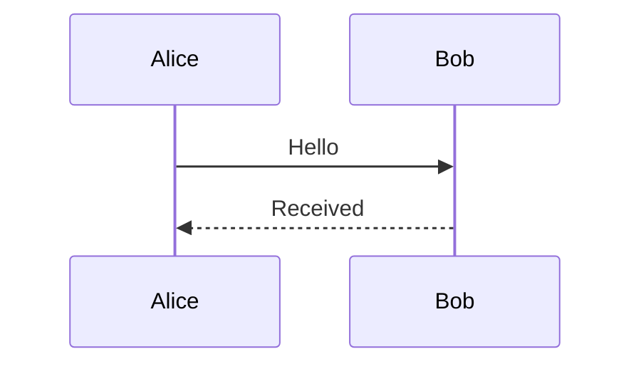
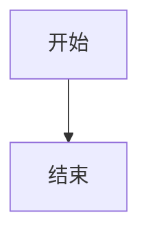

# 果铃工作台：最终可执行方案

日期：2026-10-10  
范围：产品交互、AI-native能力、原生创作、运行与内容接续的统一实施。  
源码定位基线：`ghostairship-debug/ittoedu@df21debdde2a86e7108a1af41b7aa4df62746b67`。这是已读取的固定提交，不是对实施时最新HEAD的承诺。  
文档状态：可直接交付开发执行的规格；不表示下列修改已完成。本次仅生成本文件，未修改仓库、提交或执行产品验证。

## 执行说明

**本文件是本批工作的唯一方案，包含完整产品规则、问题机制、源码定位、实现步骤、依赖、旧路径清理和验收用例。执行不依赖其他方案、审计附件、压缩包或历史对话。**只需本文件、实际源码与仓库现行开发规范；不再编写另一份总方案、分包方案或补充审计报告。

用户授权开始开发后，按§10执行。先核对实际HEAD及未提交改动，然后从当前实现接续。与固定基线已经不同的部分，只检查受影响链；已经满足本文且有有效验证的内容直接复用，不重复实现或重跑无关测试。

§2—§9规定产品及实现边界；§10是四个工作包的具体任务；§11提供直接可用的验证场景；§12是唯一完成核对表。表内编号仅为本文件导航，不要求分别创建任务文件或多智能体工作流。

保持用户文件、未提交成果、恢复稿与人工布局。变更应接入已有正式事务、History、资源和执行器。既有发行、费用及权限边界保持；真实用户数据迁移、新付费渠道等不因本方案自动获准。普通实现细化不反复申请批准，未解决的一个子项不阻塞无关工作。

---

## 1. 方案结论与优化目标

果铃应围绕**同一份真实作品**提供两种 AI 工作方式：主会话承载连续、可追溯的工作；临时卡承载局部、快速、可并行的操作。两者共享目标定位、能力描述、正式写入和运行输出，分别管理自己的上下文与界面生命周期。

模型使用熟悉的内容、样式、布局和程序表达，决定创作意图与设计。软件将这些表达可靠地作用到目标上，负责身份、属性映射、资源、布局执行、版本依据、事务、撤销、保存与运行管理。普通新作品保持原生、可持续编辑；局部程序不吞掉整页。

优化按照以下顺序取舍：

1. 用户能完成创作和修改，作品、人工调整与持续编辑能力不回退。
2. 模型保留有价值的判断与设计自由，机械步骤由软件执行。
3. 在相同任务质量下，减少模型依赖往返、无关输入与错误恢复，改善实际应用速度。
4. 降低开发和维护复杂度：复用现有业务 owner，删除被替代的公开路径和旧规则。

不以工具数量、最小代码差异、节点数量或一次截图作为优化目标。不预先承诺任意 HTML/JS 无损原生化、弱模型审美自动提升或固定百分比的性能收益。

### 1.1 本次重排的三个关键决定

**先打通目标到操作的共同链路。**会话、多引用、临时卡、工具误用和写锁都涉及“操作谁”。先将这条链收敛，再扩展各界面，避免每个入口单独路由。

**原生布局同时开展有界设计验证。**它与现有自由 frame 装配存在真实契约差异，不能一直排在零散体验优化之后，也不能因此阻塞正文、样式和会话修复。

**能力与上下文共同组织。**既不能默认暴露几乎所有工具却只给正文，也不能把常见操作藏进多轮发现流程。每次输入应尽量足以支持当前合理判断，同时保留完整授权能力的可达性。

---

## 2. 已收敛的产品规则

以下为本次实施的产品规则。旧代码、旧测试和历史说明与之冲突时，调整实现与对应测试，不静默降低目标。

| 项目 | 统一规则 |
|---|---|
| 主会话 | 连续、重度、可追溯；每个会话内部串行。统一归属工作空间，不按文件夹、文件、页面或元素划分另一类主会话。 |
| 临时卡 | 临时、快速、不进入主会话历史；不同、不冲突目标可以并行。局部卡与主会话都能修改元素，能力不因入口被压成正文替换。 |
| 默认引用 | 主会话空闲时跟随当前页面／文档；点选元素后增加可删除的元素引用。 |
| 多项引用 | 可以同时持有多个文件、页面、元素；逐项固定后不随导航丢失，仍可直接删除。用途由指令决定，不强制分成一个目标和其他参考。 |
| 删除引用 | 删除当前元素引用立即取消点选，保留页面／文档；继续删除且没有其他引用后回到工作空间上下文。删除不能立即被旧焦点补回。 |
| 临时卡关闭 | 仅在没有运行任务时，用户取消点选才关闭；运行中取消点选不关闭，任务完成不追溯触发旧取消动作。 |
| 临时卡显示 | 始终依附目标；目标不在视野就一起退出视野。完成后返回原视野仍有卡片，并自动点选修改目标。 |
| 过程与回答 | 两通道都显示真实过程。结束后直接展示 AI 最后输出，不加摘要模板、字数／内容规则或二次总结。 |
| 全表面 | 上述交互与执行规则适用于 MD、TXT、HTML、原生工程等；不要求不同文件格式拥有相同编辑能力。 |
| 人／AI 写入 | 新作品生成期只预览；成品编辑锁实际对象／页面等范围。采用最小充分互斥，不追求同目标自动合并。 |
| 创作 | AI 能表达灵活的响应式布局；软件在正式作品中建立原生对象、布局框架并装配内容和素材，不默认整页 HTML runtime。 |
| 结束 | 普通任务自然结束；退役强制 `task.finish`，保留软件内部 `run.end`。 |
| Flow | 模式名称为“流式布局（Flow）”；“讲义”可以继续表示具体教学内容。 |

“每个主会话串行”不等于工作空间只允许一个会话。“临时不可追溯”不等于作品不能撤销，也不要求删除维持当前运行安全所必需的内部回执。

---

## 3. 统一实现的核心：目标、操作和副作用各归其位

### 3.1 必须分开的概念

| 概念 | 含义 | 不能代替什么 |
|---|---|---|
| 工作空间 | 文件组织、会话归档和默认执行环境 | 不是当前页面，也不是一次操作的实际修改范围 |
| 引用集合 | 用户希望本次任务关注的内容身份 | 不自动决定读写角色，不自动锁全部引用 |
| 操作目标 | 当前指令／调用具体作用的内容 | 不等于当前浏览焦点；不能因可读成字符串就决定使用正文替换 |
| 操作语义 | 读取、改正文、改格式、改布局、创建、导出等 | 不等于内部模块或文件格式 |
| 授权范围 | 本任务允许接触或修改的边界 | 不等于模型必然会修改的集合 |
| 实际写入范围 | 本次已确定操作会改变的对象／结构 | 决定互斥与提交检查；不能拿诊断用 effectTargets 直接充当授权 |
| 观察依据 | 模型作出这次修改时依据的内容版本 | 不能用提交前临时重读的版本替代 |
| 视图状态 | 页面、滚动、选择、试运行现场 | 不控制运行存续，不改变在途任务目标 |

这是对既有字段和职责的归位，不要求建立八套管理系统。

### 3.2 推荐的共同处理链

```text
主会话／临时卡／人工操作
        ↓
逻辑目标 + 当前内容 + 实际能力
        ↓
模型表达语义操作，或人工控件表达相同操作
        ↓
软件解析真实目标、参数与必要写入范围
        ↓
既有专业编辑函数／内容装配服务
        ↓
正式 DocumentSession 事务、History、资源与回执
        ↓
最新目标映射 + 操作事实 + 活动／模型回答
        ↓
各表面显示、定位与继续编辑
```

人工操作不经过模型；“共同处理链”指相同的业务语义与正式修改 owner。不能只在末端共用 writer，而在前面分别维护两套“改颜色／转换图表／调整布局”的算法。

### 3.3 目标描述与能力来自现有真实实现

沿 `SelectionCapture`、`ToolTarget`、组件定义、表面适配器和 `ToolRegistration` 补齐紧凑的目标描述：内容身份、类型、相关正文／属性、所属页面和布局上下文、当前展示状态、可操作范围。

属性面板已经知道的专业属性，应尽量直接成为 AI 可用的语义参数。模型不必判断颜色存于 `data.appearance` 还是 `style`，也不必维护表格行列 ID、图片资源 ID 或新节点身份。自定义组件只声明真实支持的公开参数与源码能力。

后台可以保留很多专用函数。模型侧应有稳定、清楚的动作，不建设一个接受任意 JSON 的万能 `execute`，也不把每个内部函数都暴露为工具。

### 3.4 单一作者数据不等于所有格式统一转原生

MD/TXT 和单独 HTML 的正式源文可以继续是作者数据，结构和选区是其编辑投影；原生工程以正式对象与布局关系为作者数据，HTML 风格源文可以是输入或可生成的编辑投影。

各文档只有一个正式修改依据。不要同时保存一份权威 HTML 和一份权威节点树，再让 AI 或同步层猜哪份正确。也不要为了“全表面一致”把 TXT 自动转成富文本工程。


---

## 4. 双通道、引用与临时卡

### 4.1 主会话只归工作空间

文件夹／文件入口可以继续帮助用户把内容带入会话，但不隐式创建不同归属、不同可见性的主会话。浏览其他文件不会更换当前会话。

会话列表统一按工作空间管理。切换工作空间不终止原空间任务；既有运行入口应能返回其所属会话。原会话历史和用户文件保留，不因取消位置绑定而删除。

每个临时卡继续拥有独立运行上下文；可以复用现有隐藏会话实现，不另建轻量 harness。卡片所在工作空间在创建／首次接受任务时确定，不能被全局“当前工作空间”改写。卡片默认带局部目标与必要环境，不悄悄继承主会话全部固定引用；明确提供给该临时任务的材料才进入它的上下文。

卡片打开期间可以连续追问；按规则关闭后再次打开是新的临时交互，不提供长期历史恢复入口。必要的内部执行回执和作品History按既有机制保留，不因界面关闭误删正式成果。

### 4.2 引用集合的具体规则

引用集合放在现有会话草稿状态中。每项携带逻辑目标和固定状态，显示可读名称；固定不需要复制正文。

- **自动跟随项**：空闲时随着实际导航或主动选择更新。开始输入文字本身不再冻结整组引用；需要保留就固定。
- **固定项**：跨页面、跨文件保留，发送后仍保留，可逐项删除。固定的是身份，不冻结内容版本或编辑权限。
- **提交快照**：发送时将本次引用、目标和执行环境固定下来。任务运行期间的浏览变化不改变该快照。

已发送消息保留当时的引用；输入框可以准备下一次任务，但在当前主任务运行时不因普通导航自动重定向。空闲后按当前聚焦内容刷新自动项。

删除元素引用须同步取消当前元素选择；删除不在眼前的固定元素，不影响眼前其他选择。独立固定的元素不依赖父页面标签是否保留。没有任何引用才回到工作空间上下文。

删除自动页面／文档引用时，同时取消依附它的未固定元素引用与点选；独立固定项仍保留。

同一目标只留一项：再次点选已固定目标不产生副本。区分页面整体引用与页面内元素引用，它们不是重复身份。取消固定保留当前项直到下次正常自动更新，不额外增加一种引用类型。目标身份须包含必要的页面／展示状态／字段或文本范围信息，同一实例的不同明确状态或范围不能误去重。

**后端接线**：同一文档的多个引用聚合为一份文档下的目标集合，再交给既有授权接口。不能把 A1、A2 做成重复 documentId；也不能让按 documentId 建立的 Map 丢掉后一项。默认目标必须来自本次明确焦点／调用，多个工程时不以“第一个文档”猜测。

### 4.3 引用的角色由操作表达

同一个集合可以支持“比较 A 与 B”“把 A 的样式应用到 B”“同时修改 A、B、C”。界面不强制区分参考与目标，运行器仍按实际操作识别读来源和写目标。

固定 A、B 不等于同时锁 A、B。复制 A 的颜色到 B 时，A 是读取来源，B 是写入目标；联合修改则分别处理各目标。读取时保存观察依据，提交时检查实际写入范围。

### 4.4 临时卡按事件关闭，按几何显示

| 情形 | 行为 |
|---|---|
| 用户取消点选，且卡片没有运行任务 | 关闭卡片 |
| 用户在运行中取消点选 | 卡片保留，任务继续 |
| 滚动、切页、切标签、画布平移导致目标离开视野 | 只隐藏；不销毁、不吸附屏幕边缘 |
| 目标未选中时任务完成 | 保存该卡过程与 AI 最后输出，不自动关闭 |
| 完成后目标已可见／用户回到目标视野 | 目标旁显示原卡，自动选中修改后的逻辑目标 |
| 随后用户再次取消点选，且任务已结束 | 关闭卡片 |
| 点击卡片输入、滚动卡片内容 | 视为操作该卡，不等于取消点选 |

实现不得使用持续条件 `!running && !selected` 自动销毁。任务状态、卡片存续、目标可见性和目标选择分别处理，仍使用现有状态管理，不另造任务平台。

已接受但尚未结束的等待／准备任务应按“仍有任务”处理，避免等待用户回答时丢失控制入口。卡片不因 UI 卸载停止运行。

显示锚点由当前逻辑目标重新解析，不能只持有旧 DOM。判定可见性包括活动文档、画布／编辑区域的真实裁切，以及滚动和变换；不能只看是否落在整个应用窗口内。

替换文本后跟随新的范围；原生对象转换后跟随正式身份关联；HTML 重建后重新定位作者目标。目标确被删除时保留结果与适当的删除位置提示，不伪造一个新目标来选中。

**多卡同时完成的默认处理**：优先复用表面已有多选／高亮来呈现结果；仅支持一个活动文本选区时，最近完成目标作为活动选区，其他可见结果保留高亮与卡片。自动选择不触发其他卡的“用户取消点选”，也不反复抢焦点。按此默认实现，不取消单卡自动点选的既定规则。

单纯离开视野与显式关闭文档／应用分开。跨重启永久恢复临时卡不纳入本轮新增目标；显式关闭沿现有停止与草稿保全机制处理，不据此把普通切页当关闭。

### 4.5 工作过程与最后回答

主会话和临时卡复用现有事件投影：真实自然语言流、当前活动、工具批次、等待／失败／需回答事项。普通工具详情折叠，避免一条工具占一张大卡。未提供公开进度文字时显示实际等待状态，不生成虚假思考或百分比。

最终区域直接渲染 AI 最后输出。软件不总结、不改写、不限定字数和内容格式；复用相应文本／Markdown 渲染能力，不能把回答塞进工具详情或被 `run.end` 覆盖。

`src/main/workbench/execution/ExecutionDesktopService.ts` 的 `collectReply` 当前取最后一条非空 assistant 文本，但该文本也可能是中途进度。需要将正常最终答复和过程文字正确关联到本轮运行，而非另建结果存储。

用户向上阅读时不抢滚动；最新文字或活动变化时能够跟随。卡片事件追赶复用主助手已有的合并思路，只刷新变化的运行，避免每个增量触发完整历史查询。

---

## 5. 写入、观察依据与自然结束

### 5.1 写锁只保留用户能理解的规则

**生成期锁作品，局部编辑锁目标，结构性重做锁页面／文档。**不锁整个工作空间，不把所有引用锁起来。暂停等待策划／框架确认时开放对应内容编辑。

锁的单位使用现有对象、内容块或整体文本选区。文本范围作为一个目标处理，不建设逐字符或逐属性锁。范围无法可靠映射时可保守扩大到已有稳定单元并明确提示，不能静默假装支持精确并行。

同一目标冲突时明确说明；不同、不冲突目标继续并行。主会话、临时卡、属性面板、删除／撤销、源码修改和外部正式调用都经过同一规则。第一版不做复杂等待队列、同目标自动合并或新协同协议。

**布局重流与作者写入须分开**：在响应式容器中改长一段文字，其他内容按已有规则移动，是布局计算结果，不必把所有移动对象都算成 AI 写入并整页上锁。改变容器规则、对象归属或多个对象结构，才需要相应扩大写入范围。

### 5.2 先明确真实操作，再锁实际范围

局部“修改这里”任务目标已明确，可在准备阶段占用该目标。主会话可能只是讨论或比较，不预先锁所有引用；当操作范围确定后，沿现有写入 owner 获取相应互斥并进行提交检查。

权限、操作目标和实际影响范围必须在同一调用中衔接。正常授权内动作不增加一次额外批准；会影响局部任务之外的对象、共享定义或内容格式时，不无声扩大范围。模型改用文件／源码工具也不能绕过这一限制。

### 5.3 观察版本由软件保管

最终 CAS 只能保证某次提交所核对的版本，不自动证明模型使用了正确内容。模型读 r1、人改成 r2 后，软件不能临提交重读 r2，再把模型依据 r1 写出的完整字符串当成 r2 的产物。

软件保存原观察依据，使用既有范围／字段映射和局部提交。无关变化可接续；真正重叠时重新读取或明确接手，不把版本号维护交给模型。明确整篇重做在实际锁定范围内执行；直接创建或意图完整的替换也不强加无意义的前置 read。

定位到的静态路径位于 `src/main/workbench/execution/AgentFileText.ts` 的 `write / replaceExisting / commit`：未提供观察版本的整体替换会以执行时读取的源文为依据。本次未复现实际数据损坏。用§11的旧观察替换场景验证并修正，不把这条风险扩大为所有文件修改都不安全。

### 5.4 停止并接手

停止后撤销后续写入权，等待已在提交的必要边界收拢，再释放锁。已应用内容保留，未提交草稿按现有规则处理，迟到结果不能覆盖人接手后的内容。继续时读取当前作品，不恢复过期内存状态。

现有 lease、停止屏障与文档关闭屏障应复用；它们并不等于产品对象锁已经实现，也不应因“精简”被无差别删除。

### 5.5 正常工具循环自然结束

```text
模型请求动作 → 软件执行并返回事实 → 模型继续或正常回答
    → 本轮无待执行调用且正常结束 → 软件收拢运行并发送 run.end
```

普通路径取消 `task.finish` 的公开要求，同时清理局部系统提示、工具目录、同轮提前 break、默认继续修复指令和相关旧测试期望。保存／导出能力回到已有作品操作中。

`run.end` 保留为内部通知，负责状态与清理，不需要模型调用，不产生一段代替 AI 回答的机械文案，也不关闭临时卡。

正常答复属于同一个模型循环，不新增摘要 Agent 或必填结束字段。确实只有工具调用而缺最终答复的路径会需要正常后续回复请求；已有最终答复的路径不再额外调用一次。

### 5.6 运行结束与作品结果独立表达

软件记录实际应用、保存、导出、失败和未知结果；模型负责解释与回应。明确修改任务没有目标提交时，不标“已修改”；普通讨论不要求制造一次写入。某个不相干文件已写入也不能证明用户选中对象已改好。

失败后已恢复的中间错误保留在详情中，不永久污染最终状态。已知失败或暂时未满足项允许模型如实说明后结束，不再要求取得“准许结束”的回执。软件也不建设一个通用目标达成判官。

必须区分自然 stop、输出截断、网络中断和用户停止。没有收到最终文字时显示真实缺失状态，不拿进度文字／软件模板冒充，也不重放已有修改来补回答。

### 5.7 自然结束不留下无主的后台写入

任务内尚有会继续写入的作业时，由现有运行器等待、收拢或明确取消其写入；不能先发结束、释放锁，再让旧作业继续应用结果。无独立工作时软件等待实际作业事件，有独立工作时模型可继续处理。

这是在途操作的生命周期管理，不是以“内容质量还不够”为由强迫模型继续。未知副作用保留原身份查询，不能为了拿到成功标记换新调用重试付费生成。


---

## 6. AI-native 能力体系

### 6.1 能力按用户动作组织

以下是模型接口的逻辑划分，不要求创建同名新工具或把全仓工具统一改名。

| 语义方向 | 模型决定 | 软件接管 |
|---|---|---|
| 寻找与读取 | 来源、问题、范围、需要什么信息 | 定位、当前稿、必要提取、分页、索引与相关表示 |
| 正文与数据 | 改写内容、专业数据与关系 | 范围、格式保留、字段映射与专业数据结构 |
| 格式与外观 | 风格、属性值、匹配来源 | 文本范围格式、对象外观、专业属性的实际存储与应用 |
| 布局与结构 | 排布关系、组合、移动、复制、转换 | 坐标／约束计算、父子关系、顺序、专业转换与身份 |
| 创作与装配 | 布局框架、内容、素材意图、局部程序 | 建立原生结构、资源绑定、持续更新与事务 |
| 行为与观察 | 互动逻辑、检查内容、视觉判断 | 运行／截图／日志；区分作者修改与运行时操作 |
| 外部执行与交付 | 搜索、生成、计算、委派、保存和导出的真实目的 | 连接、输入准备、作业等待、文件路径、资源、生产器与回执 |

### 6.2 彻底解除“选中文字＝text.replace”

入口捕获目标，不预选输出动作。`prepareExecutionContentOutput` 的默认目标便利性可以保留，其“读得出文字就标 replace-text”的定性需要取消。

正文改写、范围格式、对象外观、布局、行为与源码是不同动作。同样选中标题，既可能要求润色，也可能加粗两个词、匹配阴影或移到图片上方。模型依据意图选择实际可用动作，不需要先调用另一个分类模型。

`text.replace` 保留为明确的正文替换原语。它已有的合法富文本表达能力不全局禁用；但不能靠允许任意 HTML 注入来补对象样式工具。对象范围与正文范围需要真实支持，不能把范围文字为了改颜色自动扩大为整对象。

目标格式确实不支持某属性时给出原因和可行选择。TXT 不支持持久化颜色，不能悄悄写入 span；Markdown 的可表达范围按实际序列化与渲染能力说明。跨表面统一的是行为与接口职责，不是虚构格式能力。

### 6.3 语义操作共享真实业务函数

通过现有注册和专业处理函数提供目标可编辑属性。简单的颜色、字体、阴影、大小有明确类型和适用范围；表格单元格、图表系列、图片裁剪等保留专业语义，不强行抹平成 CSS。

“把 A 的颜色和阴影应用到 B”可以由模型指定来源、目标和属性；软件读取真实样式并映射应用。模型不必复制大段 CSS。需要创造新视觉方案时仍由模型设计，不由软件模板替代审美。

模型错误调用时，返回具体不支持项、未应用事实和当前可用的相关操作。自动规范化只做语义等价处理，不能自动升级成整页重写、跨目标修改或新付费调用。

### 6.4 工具与上下文共同渐进披露

**稳定核心**提供普通读／查、基本文件工作和真实能力发现。**当前目标动作**在首轮直接提供正文、实际支持的格式／外观等常见能力。**专业和长尾能力**在实际需要时展开，包括复杂表格／图表、音视频、代码、外部 MCP 和委派。

同一任务的工具簇尽量稳定，复用已有 `describeRun` 缓存。浏览焦点变化不重算在途工具目录。发现返回真实可调用 schema，并由软件接到后续模型请求；不能只给说明却让模型仍调用不到。

从现有注册项派生可用性、配置状态、授权和本轮可见性，不另建镜像白名单。低置信度路由用于增加候选，不能凭“文字”等关键词永久排除样式或结构能力。创建新内容的能力不能因为当前还没有对应原生对象而被永久过滤。

单项工具与 batch 不总是全量双重暴露。常见单项保留直接路径，同类型多对象可用目标列表；复杂混合变更使用适当批量装配。同文档批量可以是一笔事务，跨文档则分别报告结果，不虚构全局原子提交，也不合并独立临时卡的撤销。

### 6.5 上下文分工

| 时点／持有方 | 内容 |
|---|---|
| 首轮直接给模型 | 用户原话、紧凑目标描述、小型完整选区、常用相关样式与布局信息、页面／文档结构概要、固定引用的必要片段 |
| 需要时再读取 | 父容器／邻近内容、复杂专业数据、源码、真实画面、材料其他页段和历史取舍 |
| 软件本地维护 | 版本与范围映射、权限根、资源字节、派生表示、操作身份、完整事务、作业与停止状态 |
| 返回模型的回执 | 是否应用、实际目标、可继续使用的资源／定位、必要保存状态与具体错误 |

结构概要优先来自既有标题、对象标签、类型与索引，不为每次点选额外调用摘要模型。大材料允许分页回读；不得因为未注入全文就断言不存在信息。

固定引用在后续新任务中重新读取当前内容；不把很久以前的固定快照当当前作品。已有上下文压缩、归档、笔记与 `context.read` 继续使用，先减少重复输入，再依据真实成本调整压缩策略。不要因旧记录出现大上下文就再建一套记忆系统。

### 6.6 冗余与整合处置

| 能力／路径 | 处置 | 保留的能力边界 |
|---|---|---|
| `task.finish` | 普通模型入口退役，交付脱钩 | 内部 `run.end`、真实停止／恢复事实保留 |
| 当前 `load_tools` | 去除对现有八族无增量的加载仪式，转为真实按需发现 | 常用核心直出；完整授权能力仍可达 |
| `read / inspect / listChildren` | 统一目标、观察依据和返回形态；常用读取无需模型先猜内部表示 | 不强行把正文、结构、画面三类结果每次全量返回 |
| `object.update / object.author` 等 | 按目标投射语义属性和专业动作 | 复用既有表格／图表／图片算法，保留高级数据与源码 |
| 对齐、分布、转换 | 保留并增强 | 软件计算机械布局、数据和身份 |
| 默认 `teacher.ensure` | 适用作品在创建时由宿主准备 | 主动恢复／定制控制台保留，不给所有格式强加控制台 |
| 材料提取／表示切换 | 普通读／查内部自动准备必要表示 | 原件、页段、来源、诊断及高级提取控制保留 |
| `job.* / image.status / delegate.read` | 统一模型观察，等待与结果接续由软件管理 | 资源结果、取消、日志和未知原操作查询不能丢 |
| `file.save / project.save / finish.delivery` | 用现有通用保存能力作为常规入口，重复项目入口降为内部适配 | 原格式保存、导出、独立成果物化仍区分 |
| `artifact.save` | 保留独立成果写盘；不作为所有资源应用前的固定步骤 | 已有资源可直接应用，无需先导出到磁盘再导入 |
| `task.note` | 长任务按需保留取舍理由 | 不要求短任务维护计划、状态、摘要三份账 |
| `ask_user` | 保留真正的任务内决策／作品确认 | 普通聊天可以自然提问；权限批准仍由软件负责 |
| `compute / local / delegate / MCP` | 真实能力保留，按需展开 | 计算、外部进程、模型委派不混成同一信任范围 |
| 源码／文件兜底 | 保留，承接原目标、原观察依据和授权 | 不默认升级为整页替换，不能成为第二 writer |

基线中的 `visibleRunToolNames` 将现有八个工具族全部列为默认可见，加载不会增加这些族的可见工具；这与权限筛选是否有效是两回事。`image.fetch` 的资源获取分支则被原生工程写条件过滤。分别在W1、W4调整，不能用删除权限检查来解决暴露错误。

---

## 7. 原生声明式创作：保留布局表达权，改变装配结果

### 7.1 这部分存在真实结构调整

基线实现的具体限制：`htmlAssembly.ts/htmlObjectStyle` 会剥离部分 Flex/Grid 和容器布局规则并转为自由 frame；`assemblyContentDraft` 在 Flow 耦合布局分支保留单个 Web 对象；`prepareMeasurementDocument` 的文档级程序标记会令测量链保留完整输入。这三处必须沿同一装配链调整，详见W3。

这些行为与旧自由布局／保真接入目标有关，不能统统删除。新目标要求在新作品创作链中保存可编辑对象及持续布局关系，改工具描述或去掉 `.html` 文件中转不能独立完成。

### 7.2 推荐的作者模型：同一对象树内支持自由布局与声明式容器

**自由布局**继续使用正式 frame 表达位置与尺寸，保留已有 Slide／Spatial 的手工拖拽能力。**声明式容器**保存作者指定的 Flex/Grid、间距、相对尺寸、对齐及必要响应式规则，子对象的位置由该容器计算。

每个布局上下文只保留一个位置权威。声明式布局计算出的几何可以用于选中框、卡片锚点和碰撞观察，但不能又成为一份独立作者 frame，下一次渲染再覆盖作者规则。自由布局也不能被另一份 CSS 隐式重排。

在现有对象树、容器与样式数据中演进；不另起布局树、平行工程或第二份作者 HTML。是否需要正式 schema 的有界扩展，按实际缺口决定，不预先宣布 V11 或完整前端重写。

优先复用浏览器或现有布局执行能力，补充容器投影与几何桥接，不自研完整 CSS 排版引擎。编辑、试运行、播放使用相同作者结构与布局规则；不同表面的投影适配不能变成不同的持久化事实。

### 7.3 模型采用熟悉的表达，软件维护原生细节

推荐新建／明确重做的布局输入采用 HTML/CSS 风格片段及可识别的专业内容表达，直接进入现有 `project.apply`／ContentApply 装配链。这里的 HTML 是构造作品的输入，不是默认交付的一整个 iframe 页面。

语法示意（不代表当前工具已支持此接口）：

```html
<section style="display:grid;grid-template-columns:repeat(auto-fit,minmax(260px,1fr));gap:24px">
  <div>
    <h1>实验原理</h1>
    <p>需要解释的核心内容。</p>
  </div>
  
</section>
```

预期结果是正式布局容器、分组、标题、正文和图片对象，而非仅有一块整页 Web 内容。软件负责分配身份、关联资源、生成可编辑字段和稳定定位。

模型可以知道少量真实表达约定，例如素材占位与局部程序入口；不要求理解完整原生 schema、抄 ID 或逐节点调用工具。也不承诺模型完全不知道能力边界时，任意程序都能自动变成理想原生结构。

### 7.4 框架、内容和素材是创作组织方式，不是硬性工具顺序

复杂作品可先建立正式布局框架，再填内容、素材和互动；简单区块允许一批创建布局与内容。不得强制先建空壳、逐字逐节点补齐，或每步都要求用户确认。

已建立的正式作品持续作为后续修改对象。图片生成后写入已有占位；正文扩写进入原文本对象；修改一个区块不重生成整页。原生对象识别、Flow 正文解析和专业组件装配已有实现，应继续复用。

展示步骤、命名状态和连续模拟各用现有适合的能力。策划需要分步呈现时，框架阶段就建立对应状态；不规定每页必须有几个状态，也不把互动模拟拆成多张静态页面。

### 7.5 局部程序边界明确

实验、游戏或复杂自定义互动可以作为一个局部程序组件，具有正式身份、位置、源码和实际公开参数。普通标题、说明、插图和页面布局不因其中一个按钮有脚本就一起被吞入程序块。

新建作品应明确程序组件边界；遇到混合输入，尽量保留可识别内容并返回局部诊断。无法安全拆分的未知程序保留原件和可修输入，不能静默宣布已交付原生作品。也不为任意 JS 自动解耦建设通用程序分析系统。

第三方 HTML 的保真接入保留原路线，允许明确的整体运行环境与编辑边界。它与新作品的默认生产契约不同，但可以共享解析、资源和正式写入服务。

### 7.6 人工编辑应维护布局语义

在声明式容器内拖动，默认调整顺序、归属或相应布局属性；不能表面上拖动成功，随后被布局重新弹回。明确自由定位／脱离布局才转成相应自由位置关系，且可撤销。

改长正文、换不同尺寸图片后按作者规则重流。AI 再次修改另一对象时应保留这些人工变化。布局规则、对象身份与素材关系要经保存重开继续有效。

首批不要求所有 CSS 属性无条件可视化编辑；标准属性和专业控件优先，必要高级源码仍可用。未支持的表达说明具体范围，不以“原生化”名义压缩成几种僵硬模板。

### 7.7 技术选择的验证点

原生布局方向已定，以下属于实施设计需验证的窄问题：现有容器数据能否保存作者规则，现有 DOM／Canvas／Spatial 投影如何消费结果，哪些专业对象能直接嵌入布局容器，局部程序边界如何与已有源码组件衔接。

使用一份包含文字、图片、两栏／换行布局和局部互动的作品贯通验证，再推广。不能先增加几十种抽象布局类型，再发现真实编辑链尚未接通。

---

## 8. 材料、资源、文件和作业：下沉没有新判断的步骤

### 8.1 材料读取

普通“读取这个章节／查找这个问题”由现有材料服务自动准备必要表示、复用缓存并返回所需页段。模型负责信息选择与解读，不负责搬运 attachmentId、派生 ID 和 representationId 的固定流程。

保留原件、页码、来源、未提取范围和诊断。按需求取文本或页面图像，不默认全件 OCR、全量截图或新的付费解析。高级提取控制仍可按需使用。

### 8.2 资源获取与应用分别判断

搜图、下载、生成资源不天然依赖已有可写原生工程；应用到某个对象才检查目标的实际写能力。修正 `image.fetch` 的资源获取分支与原生类型的错误耦合，并检查同类音频、视频和附件链。

明确要求“生成并插到这里”时，生成、资源登记与目标绑定可以由软件组合。需要挑选候选或用户尚未决定时先返回资源，不提前写入作品。不要改变 `image.generate` 现有参数含义却不修改接口和消费方。

已有资源能直接进入正式对象时不先落临时文件再导入。只有实际要交付独立文件时才物化，并返回真实路径。资源失败不抹掉已经完成的独立内容，也不自动换付费模型或另起生成请求。

### 8.3 作业运行

统一对模型提供必要状态、结果与资源接续，底层复用原作业 owner。普通等待由软件事件或既有有界等待处理，模型只在新结果需要判断或有独立工作时继续。

保留取消、查询原作业、读相关日志、获取图片资源和委派结果。长任务能力不能因“减少工具”被删掉。作业等待不新增一份永久台账，结束与停止沿第5节规则。

### 8.4 路径和授权上下文

普通文件读、写、建目录、成果保存与 `from` 统一使用明确的默认目录语义。工作空间作为默认起点，临时目录通过明确返回值表示，不让模型猜会话目录或文件夹绑定规则。

preflight 与 execute 从同一个任务上下文取得已有绑定文件范围，补齐 Engine 普通文件路径丢失 `readOnlyRoots` 的断点。读取工作空间外的已绑定文件不等于开放整个桌面，也不自动扩大写权限。

工程虚拟路径与磁盘路径对用户／模型清楚说明；软件能够识别已有工程路径时复用其正式 owner，不能误走普通磁盘 file.read。暂不强行统一两者的数据存储。

### 8.5 保存、导出和恢复稿

沿用既有“普通编辑应用到当前作品／恢复稿，不默认保存磁盘”的约定。创建文件的写盘行为以实际文件操作回执为准，不能混成所有修改都自动存盘。

常规模型接口统一原格式保存；导出有清楚格式意图；独立作业成果物化保留实际含义。不得让省略参数在不同别名中既表示保存又表示 HTML 导出。已应用、已保存、已导出分别展示，但这份状态由软件维护，不要求模型记账，也不作为是否允许结束的统一资格。

---

## 9. 内容输入、导航、命名与接续

### 9.1 确认采用眼前当前内容

策划、框架或其他关联作品的确认绑定具体文档。确认时提交编辑器内尚未应用的草稿，取得当前正式内容，重新建立继续编辑的观察依据与必要写权，然后把最新内容交给模型。

人工修改与临时卡修改都应被采用。无需用户先保存磁盘，也不重新生成一份策划覆盖原文。提交草稿失败就呈现真实原因，不拿旧内容继续。普通不关联文档的问题不升级为审批文档流程。

### 9.2 Markdown、代码块和异步粘贴

修共享粘贴与序列化链。明确的 Markdown 围栏进入正式代码块；代码块内部和纯文本粘贴保持字面语义。已损坏旧片段可显式重新解释并可撤销，不做全局反转义。

已标记 `mermaid` 的非空块交由实际库解析／渲染，取消自写图类型前置白名单；错误显示真实诊断，保留原安全渲染和过期响应保护。`isMermaidSource` 对类型名后换行、前置注释等输入存在误拦；删除该前置门后仍须验证真实渲染与保存重开，不能只测试正则。

异步素材粘贴遇到原目标改变时保留防错写，但应告知未应用原因，不静默返回，也不追随新光标突然插入。Mermaid 加载失败后的缓存重置／重试是关联恢复优化，需代表用例确认，不作为已普遍发生的故障。

### 9.3 编辑、试运行、播放

对具备演示／运行语义的表面，取消独立“运行现场”提示条，在同一位置常驻编辑／试运行／上一步／下一步／回到初始画面。纯文本不为外观一致而新增虚假的播放能力。上一步／下一步使用真实页内步骤与页面推进，不给旧翻页按钮改名了事。

切换编辑／试运行保留当前场景位置；模式改变输入和执行状态，不默认回到初始页。上一步不是编辑撤销，运行时变量也不因进入编辑就全部固化到作者数据。

“回到初始画面”默认作用于当前页／场景；整份作品回起点使用页面导航。在同一导航 owner 内落实，不额外建设一套编辑模式导航。

### 9.4 Flow、Skill 与模型选择

模式相关界面、帮助和工具／Skill 说明统一“流式布局（Flow）”；实际教学讲义的内容用语保留。内部 `flow` 标识不因改名迁移。

Skill 负责创作方法、教学／研究策略和可选配方；工具描述和目标能力负责怎样使用软件。内置能力默认可用，外部同名 Skill 通过明确来源选择；不再要求必读若干 Skill 才能调用已授权工具。

修复旧提示对正文替换、整页 HTML、强制 finish、必经材料物化的错误引导。不能一边修改能力接口，一边保留另一份旧操作指南让模型继续走旧链。

模型切换近期先显示当前任务实际模型与后续提交模型。在途下一次请求切换模型不属于已定必做；不以该增强为借口重写执行器。

### 9.5 本机 MCP

沿用户已定方向实现本机无令牌直连，继续限定回环地址、Host／Origin 与正式工具权限。免令牌不自动授予任意 shell 或公网访问，不扩大到远程服务。

复用内置与外部同源的语义操作及正式事务，不建设外部专用写入器。该项可独立完成，不等待原生布局全面落地，也不增加新的配对／令牌配置负担。

---

## 10. 实施任务、依赖与源码落点

### 10.1 启动与执行组织

主执行者直接实施、验证和交付；共享文件保持单一修改者。涉及实际架构合同的改动沿仓库已有必要审查处理，不为每个小改动增加子Agent、审查轮或验收门。

启动只完成以下核对，不重新展开全面审计：

```sh
git status --short
git rev-parse HEAD
git log -1 --oneline
git diff --stat
node -e "console.log(JSON.stringify(require('./package.json').scripts, null, 2))"
```

随后读取仓库现行执行入口和与本批相关的合同条款。测试命令使用实际 `package.json` 和已安装测试器提供的入口；不要凭本方案假定某个npm脚本、CI任务或测试文件已经存在。不能把无测试匹配、跳过或仅构建成功记录成体验通过。

| 工作包 | 交付内容 | 开始与依赖 | 包完成条件 |
|---|---|---|---|
| W1 | 可靠的语义修改、目标版本与写权、自然结束及能力暴露基础 | 首先实施；贯通已有标题样式问题 | 正确操作能真实应用，错误范围不能扩大，AI自然回复且停止安全 |
| W2 | 工作空间会话、多引用、卡片并行和全表面交互 | 使用W1共同目标／输出链；边界清晰的小修可提前 | 四类表面分别跑通，引用不漂移、卡片按事件关闭 |
| W3 | 同一对象树的声明式布局与原生持续创作 | 有界结构验证从W1开始；正式接入依赖W1目标／事务接口 | 生成、人改、AI续改、保存重开、运行均成立 |
| W4 | 材料、资源、作业、保存和本机调用减负 | 依赖W1注册／执行边界；非重叠部分与W2/W3交错 | 常见机械步骤由软件衔接，全能力仍可达 |

推荐推进顺序：W1先贯通一个样式修改样例，同时验证W3的容器布局；接上W2两通道；按相关文件交错完成W4；完成W3生产链和各包回归。Mermaid、命名、路径和本机MCP等可独立闭合的小项不用等待最大的布局任务。不得把W3静默改为“后续可选”。

### 10.2 W1：可靠的语义修改与自然执行

#### W1.1 目标捕获、操作语义与专业参数

**现有断点**：`prepareExecutionContentOutput` 在能读取文字时直接定性为 `replace-text`；整对象属性接口拒绝文字字段／范围；HTML局部入口与原生对象属性接口不接续；专业外观字段的存储差异仍需要模型猜测。

**直接定位**：

| 路径 | 重点符号／内容 |
|---|---|
| `src/core/tools/ToolTargets.ts` | `prepareExecutionContentOutput`、`readEditableTargetContent`、`planTextSelectionReplacement`、HTML作者字段映射 |
| `src/core/tools/ToolRegistration.ts`、`src/core/tools/ToolCatalog.ts` | 目标支持条件、工具语义、targets/effects/handler |
| `src/core/tools/toolSchemas.ts` | `objectUpdatePropertiesInputSchema`、`objectAuthorInputSchema`及范围参数 |
| `src/core/tools/courseInstanceEdits.ts` | `courseInstancePropertyEdits`、`courseInstanceConversionEdits` |
| `src/core/course/componentDataEdits.ts` | 专业属性记录与共享编辑函数 |
| `src/renderer/workbench/SelectionContextController.ts` | 捕获、当前稿准备、目标引用 |

**执行**：

1. 保留宿主默认目标的便利性，移除从“能读成文字”到“必须正文替换”的定性。先提交本地输入，再捕获准确逻辑目标；小选区和必要属性直接进入首次请求。
2. 将正文改写、范围格式、对象外观、布局、结构和运行时操作明确区分。优先扩展现有语义handler；需要新增动作时使用清楚、窄而可组合的参数，不加万能任意JSON执行器。
3. 将人工属性面板使用的专业函数接到同一动作。模型使用专业属性名／可读定位，软件处理 `appearance/style/sizing/frame` 等存储差异、行列身份和资源编号。
4. 支持“来源A、目标B、指定属性”的确定性匹配。读取A与写B分别解析，复制已知样式不让模型抄整段CSS；需要创作新样式时保留模型表达。
5. 更新HTML轻编辑、MD、TXT和原生工程入口。用源码搜索定位 `HtmlLightEditOverlay`、`TextAiButton`、`ElementAiButton` 及其调用者，不能只修共用类型而不接表面。
6. 不支持的格式或范围返回未应用事实、具体原因和实际可用动作；只做语义等价的参数规范化。TXT不写入标记，窄选区不静默扩为整文档。

**清理**：删去入口、提示和测试中“所有选中文字只许替换正文”的假设；不删除真实的 `text.replace`、高级源码或专业编辑能力。

**验收**：V01、V02、V03、V06。以“B匹配A的颜色和阴影”为第一条闭环，再检查同一入口的改正文和范围加粗。

#### W1.2 观察依据、实际写范围、最小互斥与停止

**现有断点**：已有单writer、CAS、停止租约和文档关闭屏障，但这些不等于产品对象锁；文件整体替换可能把执行时最新版本当成模型的原观察依据；源码／文件路径与局部目标范围需要连续传递。

**直接定位**：`src/core/tools/DocumentToolGateway.ts` 的 `beginRun`、`issueTarget`、目标映射、`effectTargets`、`effectWriteScopes`、`withWriteTaskBarrier`；`src/main/workbench/execution/AgentFileText.ts` 的 `write/replaceExisting/patch/commit`；`src/main/workbench/execution/EditSessionService.ts`；`src/main/workbench/execution/ExecutionEngine.ts` 的 `stop/drive/finally`；当前 `DocumentSession` 与人工输入提交调用者。

**执行**：

1. 基于已确定的逻辑操作取得实际作者写入范围；读取引用不加写锁。局部任务在准备时锁目标，新作品生成锁该作品，结构重做锁稳定页面／文档范围。
2. 沿已有正式写入owner实现任务级最小互斥；对象／内容块／整体文本选区为单位。接入人工输入、属性面板、键盘删除、撤销、源码、另一个AI任务及外部正式调用。
3. 保留软件捕获的原观察版本及字段／范围依据，复用已有映射。无关变化接续，重叠变化明确冲突；不得将临提交重读的新版本冒充模型编辑依据。
4. 明确整篇重做仍可整体提交；新建或意图完整的直接替换不新增仪式性前置read。对同文档batch保留真实原子事务；跨文档分别记录结果。
5. 在任务结束或停止时先收拢在途写入并撤销迟到写权，再释放产品锁；不合并独立临时任务的撤销组。
6. 原参考内容在一次任务内按已读取的观察依据使用；续作读取当前作品。无需建设实时参考依赖图或自动合并系统。

**清理**：不能新增第二writer／History；现有停止、最终CAS、授权和未知副作用保护继续保留。自动布局重流不计作对所有移动对象的作者修改；不能因此普遍升级为整页锁。

**验收**：V04、V05、V06、V08。旧观察覆盖场景属于必须验证的静态风险，不写成已经发生的数据损坏。

#### W1.3 自然结束与AI最后输出

**现有断点**：局部系统提示要求同轮 `text.replace` 后 `task.finish`；该工具成功后循环提前break；自然stop路径又可能因“尚可修复”强迫继续。`runEndSummary` 是软件诊断，`collectReply` 的最后非空文本可能只是中途进度。

**直接定位**：`src/main/workbench/execution/ExecutionEngine.ts` 的系统消息、`runTools`、`drive`、`publishEnd`、恢复逻辑；`src/main/workbench/execution/executionOutcome.ts` 的 `executionExitDecision/executionCompletionIssues/runEndSummary`；`src/main/workbench/execution/ExecutionDesktopService.ts` 的 `collectReply/startSubmission`；`src/core/tools/TaskNoteTools.ts`；`src/shared/workbench/userQuestion.ts`；现有模型事件、消息落库与两通道展示消费者。

**执行**：

1. 普通模型目录不再暴露或要求 `task.finish`。保存／导出复用现有动作，移除其与结束资格的绑定。
2. 工具结果返回同一个模型；模型继续调用或正常答复后自然结束。没有在途副作用时，不因为已知失败或未满足项要求重复申请结束；也不创建新目标达成判官。
3. 以正常终轮、消息／请求身份和工具轮边界区分最终回答与进度，复用现有消息记录。最终回答原样传到主会话和卡片，不重新总结、截成固定模板或塞进工具详情。
4. 保留内部 `run.end`，仅处理运行状态和清理，不覆盖模型文字、不关闭卡片。同步校正明确目标的应用事实，不能用无关写入证明目标已改。
5. 核对原 `task.finish` 提前break之后的流式能力观察、缓冲flush和清理，接回正常循环，不能在移除分支时漏掉必要逻辑。
6. 区分stop、截断、断连、用户停止。未收到最终答复时诚实显示缺失，不把进度当结论，不重放已有修改。已有最终回答不再额外请求一轮。
7. 历史运行读取可保留内部兼容；恢复已完成事实不重新调用模型或重做工具。真正开放中的作业由原运行器等待或取消写入后收拢。

**清理**：普通工具暴露、局部提示、Skill操作说明、提前结束分支、无必要的结束批准及其旧测试一起调整。保留 `task.note` 的长程取舍记忆和 `ask_user` 的任务内决策；普通主会话允许自然提问并结束等待下一条消息。

**验收**：V07、V08、V16。测试使用假provider先完成，无需为终态逻辑反复付费跑整课。

#### W1.4 真实按需暴露的基础接线

**现有断点**：八个工具族全部默认可见，`load_tools` 对这些族无可见性增量；工具available、configured、authorized与exposed的含义需要分别处理；单项与batch重复投射全量参数。

**直接定位**：`src/core/tools/ToolRegistration.ts`、`src/core/tools/ToolCatalog.ts` 的 `visibleRunToolNames/batchInputSchemaFor`；`src/core/tools/DocumentToolGateway.ts` 的 `describeRun/resolveRunTool/loadToolFamilies`；`src/main/workbench/execution/ExecutionEngine.ts` 的 `runTools/refreshTools`；`src/core/tools/modelToolResult.ts`。

**执行**：沿原注册表投射“稳定核心＋当前目标真实动作＋可发现长尾”，复用原schema、handler和缓存。替换现有无效加载时，在同一增量中接好发现后的可调用schema；不能先移除加载却令长尾不可达。复杂batch只含本轮相关变体，简单修改保留直达路径。复用已有回执精简和上下文压缩，不新建摘要器、路由模型或能力白名单。

**清理**：不再发送一套总已可见工具并要求再加载；不因关键词路由永久排除其他合理动作。长尾精调和资源能力条件在W4继续，但常用正文／样式必须在W1首轮可用。

**验收**：V09、V10；重点验证“未加载→可发现→同一任务真实执行”的可达性与权限一致性。

### 10.3 W2：双通道、引用和所有表面的交互

#### W2.1 工作空间会话与逐项固定引用

**现有断点**：文件／文件夹会话home影响默认上下文；输入会冻结整集合，添加引用替换集合，发送后清空；selection移除按全组处理，后端拒绝重复documentId并依赖唯一工程推断默认目标。

**直接定位**：`src/renderer/workbench/ExecutionAssistant.tsx` 的 `freezeDocuments/changeSelection/unpinSelection/removeDocumentReferences/applySendResult`、root effect、会话home处理；`src/renderer/workbench/SelectionContextController.ts` 的 `setPinned/captureDocumentReference`；`src/shared/workbench/conversations.ts`；`src/main/workbench/execution/ExecutionDesktopService.ts` 的 `prepareSubmission`；`DocumentToolGateway.beginRun`；现有会话管理和 `WorkbenchSessionPortal` 消费者。

**执行**：

1. 普通主会话统一归工作空间，取消文件位置对新会话归属、列表和自动目标的隐式控制。既有历史保留；旧home元数据不再干预新行为，不因此删除会话或移动用户文件。
2. 在现有会话草稿中存引用身份、固定状态和必要显示信息；自动项随空闲焦点更新，固定项增量保留，发送后固定项不清空。输入文字不冻结全组。
3. 页面／文档与元素引用独立可删；删除当前元素同步取消点选，删除后不被旧焦点立刻补回。多选可批量固定，相同逻辑身份去重。
4. 提交前完成输入drain并按最新版本解析全部引用。前端标签逐项保留，后端按文档合并目标；同一文档多个页面或对象不重复授权、不相互覆盖。
5. 在提交中保留明确聚焦目标与各项身份；工具显式目标优先，歧义时返回候选，不能默认写向第一份工程。引用没有强制“参考／目标”角色。
6. 任务运行不随浏览变目标或空间。保留现有后台入口以返回原会话；无需新建跨空间任务平台。

**清理**：文件home自动重新绑定、整组输入冻结、单文档覆盖集合、发送清空固定项及其旧测试期望。

**验收**：V11。固定A1、A2、B页后浏览C并联合操作；逐项删除和取消固定均要走一次。

#### W2.2 卡片存续、逻辑锚定、自动呈现与并行

**现有断点**：`dismissText` 只要有历史entries就拒绝关闭；不可见目标被 `cardPosition` 夹回窗口；卡片保留旧DOM锚点；发送时的全局工作空间可能重新解释存续卡片。

**直接定位**：`src/renderer/workbench/elementCards/elementCardController.ts` 的 `dismissText/openText/send/followText`；同目录 `ElementTextCards.tsx` 的 `cardPosition/textAnchors/TextCardPanel/ElementTextCardLayer`；`ElementAiCard.tsx`；`src/renderer/editing/quickbar/SelectionQuickBar.tsx`；各表面真实选择／几何适配。

**执行**：

1. 关闭条件改为事件：用户在任务非运行期间取消点选。运行中取消、任务结束、UI卸载、目标离开视野均不自动关闭。准备、排队、等待回答和停止收拢属于未结束。
2. 存续卡根据逻辑目标重新取得当前位置和裁切区域；离开活动文档、页面或局部视口时隐藏，禁止屏幕边缘常驻fallback。
3. 文本替换用已有 `followText` 与ACK范围映射跟随；HTML作者目标和原生实例各走真实适配。返回视野时卡片与修改后目标恢复，不要求再点“打开卡片”。
4. 完成后目标可见时自动点选；多卡按§4.4默认处理，自动选择不能触发其他卡的用户关闭。点击卡片输入或滚动卡片不关闭自身，不在后台完成时跳转页面。
5. 卡片工作空间和目标随创建／首次任务固定，不因主会话切空间重建卡会话。可复用隐藏会话执行，不建第二harness。只在真实关闭时结束该临时交互，不建立永久聊天历史。
6. 不冲突卡并行，同目标遵守W1写锁；卡片消失不删除作品与正常撤销。显式关闭文档／应用仍沿现有停止及草稿机制，不将普通切页误作关闭。

**清理**：旧常驻前台fallback、提交过即不能关闭的entries判断、依赖当前全局workspace重定向旧卡、只依赖quickbar存续的卡生命周期。

**验收**：V04、V12、V13；MD、TXT、HTML、原生工程各跑一次完整返回链，不把共享类型测试当作表面接通。

#### W2.3 过程展示、最后回答与事件开销

**直接定位**：`src/renderer/workbench/ExecutionTimeline.tsx`、`executionTimelineModel.ts`、`ExecutionAssistant.tsx` 的事件追赶；`elementCardController.ts` 的 `catchUp/refresh/applySubmission/withReply`；`ElementAiCard.tsx`、相关CSS和共享执行事件投影。

**执行**：向卡片开放已存在的活动投影；两通道共用自然语言流、当前活动和紧凑工具批次，详情默认折叠。以W1最终消息原样渲染，不另写摘要。滚动跟随依赖文字／活动变化并尊重向上阅读。复用主会话catchingUp/catchUpPending合并追赶，每次只刷新变化运行；过期异步查询不能覆盖新状态，查询失败保留已有画面并给必要反馈。

**清理**：卡片仅“请求＋粗状态”的展示、按每个增量全量查询历史、一工具一大卡、仅entries数量驱动滚动。

**验收**：V07、V12、V17。性能改善以真实请求／IPC计数与耗时衡量，不宣称它就是长任务全部耗时来源。

#### W2.4 确认当前稿、Markdown粘贴与Mermaid

**直接定位**：`ExecutionEngine.ts` 的 `ask/answer`；`src/shared/workbench/userQuestion.ts`；`SelectionContextController.prepare`、Gateway的 `prepareInput` 和文档drain；`src/renderer/document/editorSession.ts` 的 `createDocumentDraftSession/handlePaste/pastePrepared`；`src/shared/document/markdown.ts`；`src/renderer/document/mermaidCodeBlockView.ts` 的 `isMermaidSource/loadMermaid/render`。

**执行**：关联作品的确认先提交当前输入、读取最新正式稿并更新续作观察依据，包含人工与临时AI修改；失败不得继续旧稿。普通无文档问答不增加确认文档。共享可视粘贴识别明确Markdown围栏，保留纯文本粘贴与代码块内字面输入；已有受损片段只能显式重解释并可撤销。非空mermaid块直接交给实际库，移除图类型白名单；语法错有诊断，保留安全模式与过期结果保护。异步带资源粘贴因目标变化取消时给出未应用反馈，不能追到新光标。覆盖加载失败后失败缓存重置和显式重试，不扩展成完整新加载系统。

**清理**：确认只返回选项、不刷新作品的分支；以围栏普通正文转义代替代码结构；Mermaid前置静默empty；素材粘贴取消无反馈。

**验收**：V14、V15。

#### W2.5 导航、Flow名称、模型显示和内置方法

**直接定位**：`src/renderer/ui/workspaces/SlideLocationWorkspace.tsx`；通过符号搜索定位 `SlideWorkspaceConnector`、`CourseV10RuntimeView/resetPlayback`、`src/renderer/components/ComponentNavigationOwner.ts`；`ExecutionAssistant.tsx/switchConversationModel`；`src/shared/courseAgentSkills.ts`、实际内置Skill来源和生成打包入口。

**执行**：对有演示语义的表面落实常驻五动作、真实step/page推进与保留当前现场，移除独立live-scene-bar。Flow模式统一称流式布局，保留内容意义上的讲义和内部flow标识。显示当前任务实际模型与后续提交模型，不增加本轮在途热切换。Skill只负责创作方法，公共能力和授权不以读Skill为前置；内置随产品可用、外部同名通过显式来源选择。

**清理**：旧导航条、翻页按钮伪装页内步骤、模式名称残留、旧操作说明。生成的内置Skill文件用现有生成入口同步，避免只改源码说明而打包仍旧。

**验收**：V18、V19；纯TXT不凭空增加播放能力。

### 10.4 W3：原生声明式创作与持续编辑

#### W3.1 同一对象树的布局扩展与装配修正

**现有断点**：`htmlObjectStyle` 删除外层布局属性；纯布局wrapper被展开；`flowCoupled` 导向单个Web对象；文档级script／事件标记导向整体程序保留。直接更换模型或把HTML文件改为内联字符串不会改变这些分支。

**直接定位**：

| 路径 | 重点 |
|---|---|
| `src/core/contentApply/assembly/htmlAssembly.ts` | `HtmlAssemblyObject`、`htmlObjectStyle`、`assembleMeasuredHtml`、wrapper展开、`flowCoupled`、`sourceProgramAssembly` |
| `src/main/workbench/contentApply/application/html.ts` | `assemblyContentDraft`、原生识别与Flow整块分支 |
| `src/main/workbench/contentApply/application/professionalHtml.ts` | 专业内容识别与可复用装配 |
| `src/main/workbench/contentApply/measurement/prepareMeasurementDocument.ts` | `documentProgramReason`、作者规则保留 |
| `src/main/workbench/contentApply/measurement/ElectronHtmlDesignMeasurement.ts` | `measureHtmlAtDesignViewport`与程序返回 |
| `src/core/projectFiles/componentPlatform/coordinator.ts`、`projection.ts` | `project.apply`输入、正式对象／源文投影、身份对齐 |
| `src/shared/contracts/component-platform/`、现有组件渲染消费者 | 对象、容器、frame、布局／运行投影 |

**执行**：

1. 用§11.4的一个样例先检验现有容器数据和渲染路径，不建新工程树。确有字段缺口时在现有正式结构中做有界扩展；改变持久化结构时更新现行相关合同及兼容策略，不预先宣布整体新版本。
2. 同树内允许自由frame与声明式容器。自由对象维持既有位置，声明式子项保存作者布局规则并由容器布局；计算几何只用于显示与定位，不生成第二作者位置权威。
3. 新建／明确重做的声明式输入保留父子布局关系，采用浏览器或已有布局执行能力。普通标题、正文、图片、表格等装成正式对象；不要求模型抄原生ID／内部schema或逐节点调用。
4. 对新建生产路径改正布局剥离、wrapper摊平和Flow整块fallback；外部HTML保真路径保留其明确用途。不能全局删掉原始内容保全，也不能为避免错误而退回只有固定模板。
5. 将几何桥接接入点选框、卡片锚点、拖拽与属性面板。容器内拖动默认修改顺序／关系；明确脱离布局才改自由frame。正文变长后按规则重流，不改写其他对象的作者字段。
6. 编辑、试运行、播放、保存重开读取同一布局事实；导出使用同一已支持表达，不以截图或静态化掩盖缺失能力。

**清理**：新作品中以整页Web或单次测量像素快照冒充原生布局的默认路径；不得保留平行HTML和节点树作为两份权威。已有手工布局、Flow阅读顺序及第三方保真行为不得无声回退。

**验收**：V20、V21。结构验证启动即开展，完整持续编辑链未通过不得宣布原生创作完成。

#### W3.2 内容、素材、展示状态与局部程序

**直接定位**：W3.1的ContentApply链；`src/core/tools/ProjectFileTools.ts`；`src/core/tools/ToolCatalog.ts` 的 `presentation.update/interaction.update/teacher.ensure`；当前原生组件插入、资源和程序实现；`.agents/skills/orchestrate-courseware/SKILL.md`及共享操作指南的实际打包来源。

**执行**：复杂作品先正式框架再填内容素材，简单区块允许一次创建。框架与后续修改使用同一作品和对象身份。明确素材占位由软件生成身份并绑定结果；方法中的教学步骤、命名状态和连续模拟分别用已有能力，按需要使用，不规定每页数量。默认宿主控制台仅在适用作品中由创建路径准备，主动恢复／定制仍可用。

复杂实验／小游戏使用明确局部程序组件，普通排版与程序边界分开；局部脚本不能自动吞掉整页。无法拆分的外部程序保留原件和诊断，不宣称其已成原生作品，不建设任意JS自动解耦系统。

同步修工具与Skill对“创作表达”和“最终装配结果”的说明：HTML/CSS风格是允许的输入，完整网页中转不再是默认制作方法；不禁Python、计算、SVG或局部代码以回避装配问题。`recipe/remix` 保留为可选创作能力，不成为固定模板门。

**清理**：重复外部整页作品、每次局部改动重导入、素材已存在仍先物化再导入、组件运行状态被静默固化为作者数据。

**验收**：V20、V21、V22。

### 10.5 W4：材料、资源、作业与交付减负

#### W4.1 文件路径、绑定范围与通用保存

**现有断点**：普通file preflight/execute重新拼任务上下文时漏掉已有绑定文件读取范围；mkdir与artifact.save默认根不同；多个保存入口省略参数的含义不同。

**直接定位**：`src/core/tools/AgentFileTools.ts`；`src/main/workbench/execution/AgentFileService.ts` 的 `startDirectory/preflightMutation`；`AgentFileText.ts`；`ExecutionEngine.ts` 的普通file上下文；`src/main/workbench/workbenchToolServices.ts`；`src/core/tools/DocumentDeliveryTools.ts` 的 `executeResolvedDocumentDelivery`；`src/core/tools/ProjectFileTools.ts`；`src/main/workbench/execution/HostArtifactDeliveryService.ts/preflight`。

**执行**：preflight和execute复用同一任务冻结上下文、绑定路径与读写边界；恢复已绑定外部文件的readOnlyRoots但不开放桌面全目录。普通相对路径默认工作空间，临时位置明确返回；工程虚拟路径仍由正式工程owner处理。`file.save` 作为常规原格式保存入口，复用现有交付实现；`project.save` 的同义公开入口退为内部适配，`document.export` 明确导出格式，`artifact.save`仅负责独立成果物化。

普通编辑不自动存盘；新建文件、保存和导出分别以真实回执判断。旧结束工具中的交付功能接回正式保存／导出，不能随结束工具一并删除。局部文件／源码兜底继续承接W1的目标与观察依据。

**清理**：同义但默认语义不同的公开保存分支、会话home暗中改变目录、必要资源应用前必须先落盘的流程。

**验收**：V03、V06、V23。已知外部HTML读取和路径错误可在W1提前闭合，不等W4全包。

#### W4.2 按需材料读取与资源获取／应用

**直接定位**：`src/core/tools/MaterialTools.ts`；`src/main/workbench/attachments/`既有提取／快照服务；`src/core/tools/AssetSourceTools.ts` 的 `image.search/image.fetch/asset.save`；`src/core/tools/HostToolServices.ts` 的图片生成与状态；现有 `media.apply/media.insert`、资源注册和材料来源处理。

**执行**：普通material读／查内部自动准备必要页段和表示，复用缓存并保留来源、页码、未读范围和诊断。模型只提供材料、问题／范围和必要表示偏好，不搬派生ID。高级提取控制保留，禁止自动全量OCR或静默新增付费解析。

修 `image.fetch` 的resource-only分支，使资源获取只依赖来源服务和实际授权，不要求已有可写原生工程；带目标的应用再检查该目标能力。按同一原则检查音视频与附件。明确“生成并插入这里”可由软件串起生成、登记和绑定；仅候选生成不提前应用，不悄悄改变现有target字段含义。没有新的判断就内部组合，有候选取舍则将结果交回模型／用户。

**清理**：列原件→提取→搬派生ID→列表示→读取的普通必经链；搜图可用却因无原生工程不能获取的条件；直接应用已有资源仍强制另存再读的往返。

**验收**：V10、V22、V24。

#### W4.3 统一作业观察、等待与上下文增量

**直接定位**：`src/core/tools/WorkbenchServiceTools.ts` 的 `job.* / delegate.* / compute.*`；`src/core/tools/HostToolServices.ts/image.status`；`src/main/workbench/jobs/`、图片与委派结果服务；`ExecutionEngine.ts/prepareContext/summarizeContext`；`modelToolResult.ts`；实际材料／资源回执消费者。

**执行**：复用原作业owner对模型提供必要状态、结果和资源，支持查询原未知操作、取消及读所需日志。有独立工作时模型继续，无独立工作时软件事件驱动等待；不要让模型重复生成例行wait调用。短任务无需全部后台化，长任务也不新建永久账本。最终写入和结束沿W1屏障收拢。

首轮提供足以完成常见任务的目标和内容；重复源码、完整事务、资源字节和派生簿记留在软件。复用原上下文压缩、task.note、context.read和回执精简，按真实成本调整；不另建记忆系统，不把每个工具结果交给总结模型。

**清理**：纯等待引发的模型轮询、状态查询却丢失可用资源的分裂接口、重复schema／上下文；高级代码、外部进程、委派和MCP保留其不同信任边界，不能合成一个任意执行口。

**验收**：V09、V16、V17、V24。

#### W4.4 本机MCP无令牌接入

**直接定位**：`src/main/workbench/external/ResidentMcpServer.ts`、`ResidentMcpSettings.ts`及连接信息界面；现有Gateway／MCP同源工具暴露。

**执行**：按可信本机使用边界取消要求用户配置Bearer令牌的直连障碍，继续监听回环地址，保留Host／Origin校验、实际工具权限、正式事务与对象写锁。连接信息直接可用，不换成新的配对／令牌手续。此选择不再依靠Bearer区分本机进程，因此不扩展公网监听、远程访问或任意shell权限。

**清理**：本机使用必填token与旧说明；不新增外部专用writer或另一套能力目录。

**验收**：V25。可独立完成，但完成事实必须包含实际客户端连接与正式修改测试，不能只有端口开启。

### 10.6 每个增量的统一收口

改动按业务链提交到当前工作树，先查并更新相关既有测试，再补最少缺失用例。源码路径以实际函数定位为准；文件改名只需跟随当前导入链，不重新审计整个仓库。

每个增量同时完成：行为接通、两端producer/consumer一致、相关旧分支退出、内置说明／生成资源同步、最小有效验证。旧记录必要读取兼容留在内部，不永久向模型暴露两套协议。

若实现发现具体结构问题影响范围，只在本文对应任务和现有状态入口记录事实与调整；不生成平行方案或新审计附件。不能以已有实现更方便为由取消多引用、卡片存续、原生布局或全表面规则。

---

## 11. 验证场景、测试输入与性能判断

### 11.1 验证方式

以下编号是可复用用例，不代表25次付费模型任务，也不是每次修改都重跑的全矩阵。共享目标／状态／注册／事务逻辑优先使用离线单测与假provider；已有测试能表达新预期就修改原测试。UI需要验证的生命周期链在MD、TXT、HTML和原生工程各执行一次；其他场景选择最相关的表面，不做格式与场景的笛卡尔积。

真实模型只用于确定性测试不能证明的意图选择、设计表达或整体创作质量，使用少量固定题和既有授权连接。真实网络、MCP和保存重开分别给出实际结果；假服务或复制谓词通过不等于这些链路已通过。未变的有效验证直接复用，通过即停止增加无信息增益的检查。

### 11.2 直接执行的验收用例

| 编号 | 操作步骤 | 必须观察的结果 |
|---|---|---|
| V01 语义编辑 | 在同一作品中建立A、B两个标题；依次要求润色B、给B指定词加粗、把A的颜色和阴影用于B、将B与图片对齐 | 各请求使用匹配的实际操作；B身份不丢，A和其他内容不变；不预先锁为正文替换，不重生成整页；每次有正式应用结果与可撤销修改 |
| V02 格式能力边界 | 对TXT选区要求改色；对支持富格式的HTML／原生选区要求加粗和改色；对MD使用当前格式实际支持的标记 | TXT不注入HTML、不静默转格式；可支持的格式原位生效；无法持久化的属性清楚说明；范围外文字与格式保留 |
| V03 外部绑定HTML | 在临时工作空间外建立测试HTML，正常打开并绑定；局部卡要求B匹配A样式，并触发一次必要的源码读取 | 已绑定文件可按既有读取范围读取；未开放整个上级目录；修改经正式事务，仅目标改变；布局、交互和其他人工调整保留 |
| V04 串行与并行 | 主会话启动目标A任务并追加第二条；另起B、C两个临时卡；尝试在A未结束时人工或另一卡写A | 同一主会话串行，B/C在不冲突时并行；A冲突明确，其他对象仍可编辑；各任务拥有独立撤销与回答，不被合成一个任务 |
| V05 停止与迟到结果 | 假provider／作业保留一个延迟结果；开始修改后停止并接手，人工修改目标，再释放旧延迟结果 | 先完成停止屏障再交还写权；旧结果不能覆盖新人工内容；已提交内容保留，未提交片段不伪装应用；没有新付费重试 |
| V06 旧观察与CAS | 捕获r1后人工生成r2，再提交依据r1的局部改动和整文档替换；分别测试无关字段与重叠字段 | 无关改动通过正式映射保留；冲突被明确处理；不能以执行时重读r2为由接受旧整文档产物；不要求模型手写版本token |
| V07 正常最后回答 | 假provider先输出进度并调用修改工具，读取回执后返回不同的最后文字且自然stop；让状态／usage事件晚于文字到达 | 最终区域显示最后文字原文，进度仍属于过程；没有结束工具、摘要调用或模板；run.end不覆盖文字，主会话和临时卡一致 |
| V08 失败与空答复 | 分别模拟只读而未修改目标、失败后恢复、失败后解释结束、长度截断、最后回答网络失败、正常空文本返回 | 运行结束和作品结果区分；不把无关写入或只读叫已修改；恢复的中间失败不永久污染结果；缺最终答复不冒用进度，不重放修改 |
| V09 工具按需可达 | 比较文字、表格、图片与无文档工作空间任务的首次工具投射；在同一任务发现并调用一种未初始暴露的已授权能力 | 常用动作首轮直接可用；长尾发现提供实际schema并能调用；发现不扩大权限；浏览切页不改变在途工具集；没有全已暴露却还要求加载的流程 |
| V10 资源获取条件 | 在图库服务可用的纯工作空间、MD任务与原生工程任务分别检查搜图和resource-only获取；再指定真实插入目标 | 前三种环境按实际服务和授权可取得资源；插入另外检查目标写能力；不可写目标不会因资源获取成功而获写权；先用假服务验证条件，再按需要实测已授权下载 |
| V11 多项固定引用 | 固定A文档元素1与元素2，固定B文档一页，浏览C；联合修改指定内容；依次删一元素、删页面、取消固定；发送后继续浏览 | 固定项不被替换或发送清空；同文档多个标签分别可删且授权聚合；删当前元素同步取消点选，不由旧焦点回弹；在途目标不漂移；清空才回工作空间 |
| V12 卡片完整生命周期 | 唤起卡并运行；运行中取消点选、离开视野；在外部完成；返回原视野；随后再次取消点选 | 同一卡仍在原目标旁，自动点选修改后的内容，显示AI最后输出；运行时取消未追溯关闭；最后一次非运行取消才关闭；四类表面分别成立 |
| V13 锚点与空间恢复 | 在内部滚动容器滚出目标、平移／缩放画布、重挂载页面；A空间卡运行时切B再返回A；多卡同时完成 | 按真实内容视口隐藏，不吸附前台；逻辑目标重建锚点；卡不改属B；不需要重新打开；自动选择不误关其他卡、不持续抢输入焦点 |
| V14 确认当前稿 | AI写策划并等待确认；人改未保存正文，临时卡再改一处，然后确认；另模拟输入提交失败 | 后续模型取得当前稿和正确观察依据，不要求磁盘保存、不重生成策划；输入失败时不沿旧稿继续；普通无文档问题不被强制转成文档审批 |
| V15 Markdown往返 | 粘贴§11.3完整围栏；编辑内容，切源文，保存重开；再测试代码块内字面粘贴、纯文本粘贴、异步带素材粘贴时移动光标 | 正式代码块和Mermaid真实渲染；换行／注释不被前置拦截；错误可见；纯文本语义保留；素材取消有反馈，不静默丢弃、不写向新光标 |
| V16 作业等待与终态 | 启动一个延迟作业，分别安排有独立创作与无独立工作；再测试取消和未知结果 | 有独立工作可继续，无工作由软件等待新事实；模型不例行轮询；作业结果携带可用资源／输出；结束不留下可迟到写入，未知原操作只按原身份查询 |
| V17 展示与增量成本 | 推送密集文本／工具事件，用户先在底部再向上阅读；启动多张卡并记录事件查询数和旧运行读取数 | 活动与文字持续显示，工具紧凑分组；底部跟随、向上阅读不被拉回；追赶合并，只刷新变化运行，不每个增量重读整段历史 |
| V18 现场与导航 | 在具有步骤／命名状态的页面推进到中间，切编辑再切试运行，执行前后步和回初始 | 五动作常驻于统一位置；真实页内步骤优先，页面边界语义一致；切模式保留现场；回初始默认当前页／场景；不将运行时变量全部存为作者数据 |
| V19 名称、模型与Skill | 检查创建入口、模式栏、属性、工具和打包Skill；运行中切模型后提交下一任务 | Flow模式名统一为流式布局，真实讲义内容不被误替换，内部标识不变；本任务与后续模型显示准确；无需外装Skill才能使用产品已有能力 |
| V20 原生布局纵向链 | 用§11.4样例直接创建，改长正文、换不同尺寸图片、手工调间距／顺序；AI只改另一对象；保存重开并运行 | 内容可独立选择与引用，布局规则真实持久；人工变化保留；计算位置不变成第二作者权威；窗口／容器变化仍按规则排布，不重建整页 |
| V21 局部程序与旧布局 | 在新作品加入一个局部互动，再对已有自由布局作品与第三方HTML各做一次原有编辑／打开 | 局部程序不吞掉标题正文图片，原生对象仍能续改；自由frame与既有手工摆放保持；第三方保真路径仍明确可用，不以原生化名义静态化 |
| V22 资源候选与绑定 | 分别要求“生成候选图”“生成并替换指定图片”；同时测已取得资源的直接应用和停止后资源返回 | 候选不提前修改作品；明确绑定自动登记和应用，保留目标身份；不先落盘再导入；停止后结果不写回，不重复生成已有资源 |
| V23 路径与交付 | 相对路径建目录后保存成果；修改文档不保存，再执行保存原格式和指定格式导出；保存失败后正常回复 | mkdir／写入／成果保存使用同一根；虚拟工程路径不当磁盘路径读；应用、保存、导出状态准确；不依赖task.finish，不以导出替代原格式保存 |
| V24 材料读取与上下文 | 从尚未提取的测试材料读取一页／一节，再查指定问题；重复读取已有范围，并检查发送给模型的内容 | 软件按需准备和复用表示，模型不搬派生ID；保留出处、未读范围与诊断；无全件OCR、全量重复输入和额外总结调用；大内容仍可分页回读 |
| V25 本机MCP | 使用测试客户端无Bearer连接回环端点，读取并修改测试对象；同时测试错误Host／Origin和锁定目标 | 无令牌可用且不扩大监听范围；原Host／Origin与正式权限有效；与内置AI共用语义操作／事务／写锁；错误请求不获得更高权限 |

### 11.3 内置测试输入：文本、样式与Mermaid

**样式目标**：在测试文档中建立A、B两个有独立身份的标题。A设为黄色文字与双层阴影；B有不同颜色、不同位置和原有字号。要求“只把A的文字颜色和阴影应用到B，保留B的正文、字号和位置”。执行前后核对对象属性及实际画面；提交身份或字节一致不能代替视觉验证。

**Markdown围栏输入**：在可视Markdown编辑区粘贴以下完整片段，而不是只把里面的源码送给Mermaid。

````markdown



````

再测试 `classDiagram` 后换行的简单类关系、语法确有错误的源码、已标记mermaid但为空的代码块，以及代码块内粘贴字面反引号。期待由实际解析器判断，不维护另一份图类型白名单。测试暂时加载失败时，只重试加载／渲染，不改变正文，也不无限循环。

### 11.4 内置测试作品：原生声明式布局

用临时作品完成，不读取或修改真实用户作品。通过正式创作／装配入口提交以下普通布局表达；这段是需要支持的代表输入，不宣称基线已经实现。

```html
<section style="display:grid;grid-template-columns:repeat(auto-fit,minmax(260px,1fr));gap:24px;padding:24px">
  <div style="display:flex;flex-direction:column;gap:12px">
    <h1>实验原理</h1>
    <p>这段说明应当可以独立选择和持续修改。</p>
  </div>
  <figure>
    
    <figcaption>更换图片后保留题注和布局关系。</figcaption>
  </figure>
</section>
```

图片使用测试中预先提供的本地素材，由软件完成绑定；无需调用生图模型。再通过已有局部程序能力插入一个具有开关／复位的最小互动组件，并按需增加一个页内步骤或命名展示状态。素材占位和程序边界采用实际工具约定，不要求另造测试专用格式。

必须完成下列一条连续流程：创建正式对象和布局 → 人工扩写正文 → 调整容器间距／对象顺序 → AI只修改题注 → 替换图片 → 保存并重开 → 切换编辑／试运行／播放 → 验证局部互动与布局。宽窄变化测试可以使用容器尺寸或适合该表面的视口变化，不要求把所有Slide强制变为长文。

同时用一个既有自由frame页面做对照：手工摆放不被声明式路径重排，局部修改不重生成整页。若当前某个投影不能消费布局容器，必须在W3交付中补上，而不是静默转整页runtime。

### 11.5 成功、速度与成本

先确认任务正确、人工变化保留和持续编辑能力，再比较：

| 指标 | 记录方法与解释 |
|---|---|
| 首次实际应用时间 | 从提交到正式写入回执；与仅显示进度、预览首帧区分 |
| 最终完成时间 | 从提交到AI最后回答及运行收拢；记录长作业等待的独立耗时 |
| 模型依赖往返 | 记录必须等待前一结果才能发起的模型请求；不要只数工具总数 |
| 上下文负担 | 首次和累计工具定义／内容tokens、重复源码和材料范围；缺实际用量时标估算 |
| 错误恢复 | 同因工具误用、重复读取、例行轮询及无效加载的次数 |
| UI事件成本 | 合并前后查询／IPC数、已结束运行重复读取和可见更新时间 |
| 结果质量 | 同一任务是否成功、对象能否持续编辑、保存重开及互动是否保持 |

使用相同样例、模型、推理设置与可比环境，优先复用既有时序和回执。发现步骤若增加一次往返却几乎没有节省输入，应改为直接暴露。不能以换更强模型、减少高级能力、提前显示转圈或规定工具数量上限证明优化完成。

---

## 12. 完成核对与交付

### 12.1 唯一完成核对表

实施时在本表或仓库现有唯一状态入口记录真实状态。下表初始均为“待实施核对”，不是断言当前代码全部未做。实际已经完成的项目可用受影响范围内有效证据确认，避免重复劳动；不要再生成第三份任务台账。

| 工作项 | 所属包 | 关闭条件 | 状态 |
|---|---|---|---|
| 目标捕获不预设text.replace，正文／格式／外观语义接通 | W1.1 | V01—V03通过，相关工具／提示／入口一致 | 待实施核对 |
| 观察版本、实际范围与最小写锁 | W1.2 | V04—V06通过，人工／AI／外部正式写入共用规则 | 待实施核对 |
| 自然结束、AI最后输出与运行状态分开 | W1.3 | V07／V08通过，无强制结束或二次摘要路径 | 待实施核对 |
| 按需能力可达与schema投射 | W1.4、W4.3 | V09通过，权限不变，常用动作无发现前置 | 待实施核对 |
| 工作空间会话与多项固定引用 | W2.1 | V11通过，旧位置绑定不再干预任务 | 待实施核对 |
| 全表面卡片生命周期、位置恢复与并行 | W2.2 | V12／V13在各代表表面通过，不常驻前台 | 待实施核对 |
| 共享过程、最终回答与增量展示 | W2.3 | V07／V17通过，卡片有过程且保留原话 | 待实施核对 |
| 确认读取当前策划与人工／AI修改 | W2.4 | V14通过，不依赖磁盘保存、不继续旧稿 | 待实施核对 |
| Markdown粘贴、Mermaid与素材取消反馈 | W2.4 | V15通过，包括保存重开及真实渲染 | 待实施核对 |
| 导航、流式布局命名、模型与Skill显示 | W2.5 | V18／V19通过，打包内容已同步 | 待实施核对 |
| 原生声明式容器、专业对象与自由布局共存 | W3.1 | V20／V21通过，布局非像素快照／整页黑盒 | 待实施核对 |
| 内容素材续装配、状态和局部程序 | W3.2 | V20—V22通过，局部程序不吞整页 | 待实施核对 |
| 路径与已绑定外部文件上下文 | W4.1 | V03／V23通过，不扩大读写根 | 待实施核对 |
| 统一保存、导出与成果物化 | W1.3、W4.1 | V23通过，普通编辑不自动存盘 | 待实施核对 |
| 材料准备、资源获取和明确目标装配 | W4.2 | V10／V22／V24通过，不搬派生身份 | 待实施核对 |
| 作业软件等待、结果资源与上下文减负 | W4.3 | V16／V17／V24通过，没有迟到写入 | 待实施核对 |
| 本机MCP无令牌且正式权限有效 | W4.4 | V25实际客户端通过 | 待实施核对 |
| 被替代路径、说明与旧测试清理 | 各包同步 | 实际公开目录与提示仅保留新语义，无平行执行／作者状态 | 待实施核对 |

### 12.2 交付口径

每个已完成工作项记录实际改动范围、执行过的测试和观察结果；未通过项写具体表现、阻断和保留能力。离线单测、GUI、真实服务、真实模型分别标注，不能互相替代。无需单独写审计长报告，信息进入现有唯一结果入口即可。

W1／W2完成后可以交付对应改善，但不得宣称原生创作总目标已完成。四个包的核心结果均满足，且全表面代表链、原生持续编辑链和必要连接链通过，才将本批整体标为完成。发行／发布仍依用户授权，不将测试通过等同公开发行。

不要求每次差异都跑完整产品矩阵。只复验改动影响的行为和关键整合链；旧有效证据未受影响直接复用。

### 12.3 防止能力再次分叉

新增或修改能力沿现有注册项同时接上：真实目标支持、语义参数、必要上下文、实际副作用、正式handler和一个代表测试。人工与AI共享业务动作，不另写一份漂移的AI能力表。

确定性连续步骤进入既有软件服务；新的模型工具应承载新的操作、判断或必要信任边界。专业算法、布局表达、局部程序、研究、计算、委派等能力不因“精简”被取消。

卡片、引用、布局和终态不创建第二份作者内容、目标身份或成功账本。这些约束通过实际类型、handler和相关测试落实，不给用户每次创作增加新的门槛。

### 12.4 不纳入本批的扩展

不新增同目标实时自动合并、字符级分布式协同、跨重启永久临时卡恢复、任意JS自动解耦、在途模型热切换或Office深度编辑。已有相关可用能力继续保留；本文未要求的扩展不得挤占核心工作。

不建设第二套harness、writer、History、目标树、布局树、能力白名单、记忆库或永久任务平台。不以新模板替代模型设计，不以整页runtime更名冒充原生，不用禁止HTML／代码／计算来躲避装配缺陷。

出现新的问题时，先判断是否属于本文现有目标的实现缺口；属于就并入相应工作项。需要改变用户已定产品边界时明确说明，不静默降级，也不自动重启已经关闭的历史任务。

---

## 执行终点

用户在工作空间主会话中持续创作，在元素／文本临时卡中快速并行修改；多项引用可固定，操作目标与授权不漂移；卡片随目标显示和恢复；运行自然结束并展示AI最后输出。模型保留内容与布局设计自由，软件承担对象、资源、布局执行、版本依据和正式写入。产物始终是可以由人继续编辑、再交给AI续改的同一份真实作品。
