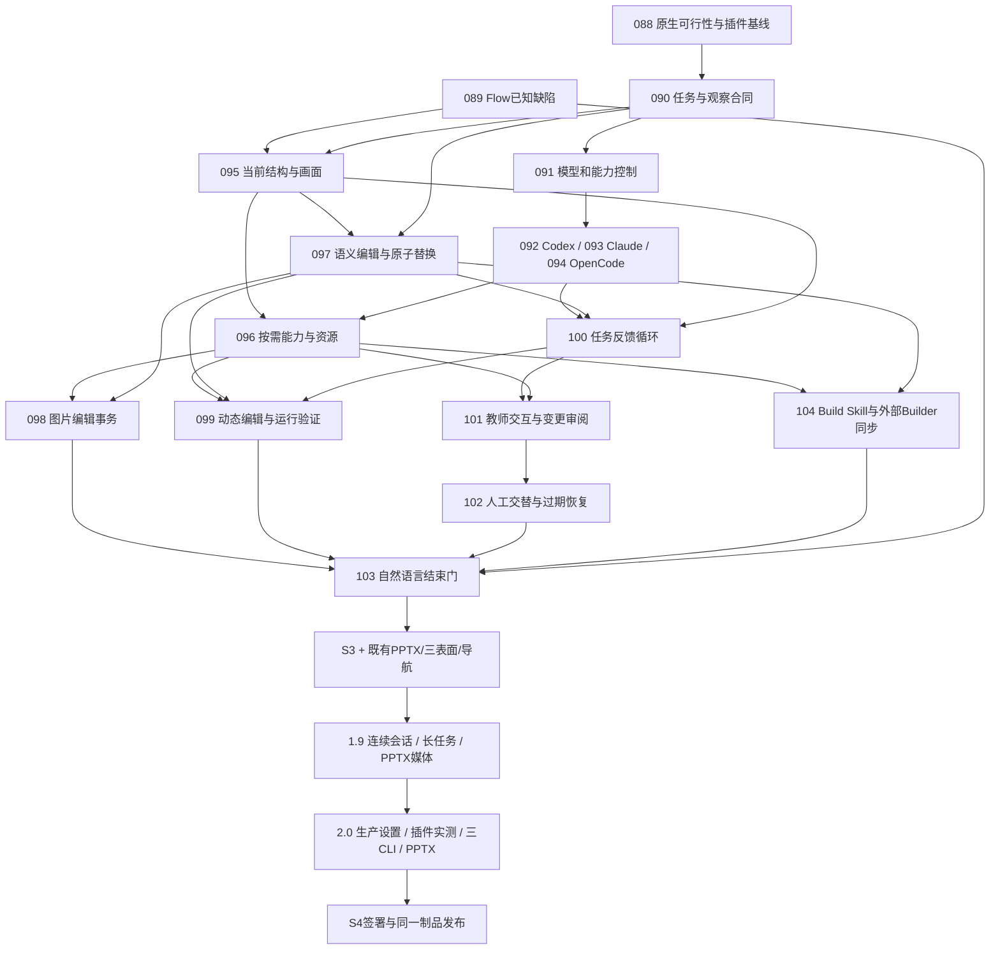

# 从当前缺口到 2.0：创作助手开发方案

2026-09-07，依据 Owner“体验至少达到 VS Code 中 Codex / Claude Code 插件，并实时理解课件现状”的要求重新编排。本文是当前剩余开发的实施路线，替代对标评估中尚未排入路线的 W 包建议；当前协调状态只看任务板，本文不表示已启动产品实现。

## 1. 成功标准与当前起点

教师能够用自然语言让 AI 理解当前课件、完成修改、观察实际效果、继续修正，并在讨论、计划和编辑之间明确切换。模型、推理强度、引用内容、进度、提问、变更和失败都可理解、可控制。人工编辑与 AI 交替时不丢内容、不改错目标；结果可撤销、保存重开、运行和导出。

当前仅保留以下已证明基础：CLI 进程/会话、局部候选与宿主事务、指定文字/组件源码修订、既有三表面和导出能力。它们不等于普通 AI 编辑可用。图片内容缺失、选区替换失败、模型/模式控制缺失、原始 JSON 反馈、上下文膨胀及 Flow 控制器不可达均属于必须关闭的实际缺口，见 [G01–G12](reviews/1.8-ai-assistant-gap-register.md)。Owner在编排中追加：按需发现/读取必须同步覆盖外部Build Skill；不能只整改应用聊天。

高可靠性依靠有约束的实现和直接证据：先证实接入路径可行；先定义观察/候选身份和生命周期；复用唯一工程事务；每个工作包有正向行为、可信反例和失败恢复；最终以普通教师提示完成真实课例。不能用增加测试数量、放宽 strict 或虚构“兼容降级”代替结果。

本计划不重写 V9，不换模型循环，不恢复 MCP 或工具 RPC。每份观察快照仍不可变，但一个任务能够收到多次最新观察和宿主结果。CLI 的思考与工具循环继续由 CLI 自身拥有，宿主只按正式事件协调观察、候选校验、运行验证和提交。

## 2. 版本重新分工

| 阶段 | 用户结果 | 必须完成 | 出口 |
| --- | --- | --- | --- |
| 1.8 A：可行路径与合同 | 已选图片能被实际传入，三 CLI 的交互能力有实证 | r18-088 原生能力/插件基线探针、r18-090 会话合同；独立 r18-089 修 Flow 已知可达性缺陷 | 三 CLI 的共同必需能力取得原生往返证据；未证实则088及其合同链不能过门，Flow等无关工作继续 |
| 1.8 B：理解与行动 | AI 看见当前结构/画面，按需读取说明，能改文字/图片并替换 Runtime；外部Builder共用同一发现能力 | r18-091–100及104：模型配置、三 adapter、观察、按需能力、语义编辑、图像事务、动态修改/反馈和Build Skill同步 | 先取得 Native/图片纵切，再取得真实动态及外部课例纵切；Native 的运行不得等待动态准入 |
| 1.8 C：教师可用 | 讨论/计划/编辑明确，中途纠正可达，提交结果可审阅 | r18-101–103：教师 UI、人工交替恢复、双入口自然语言工程结束门 | 关闭 G01–G12 当前阻断；汇合既有 PPTX、三表面与导航门后由 r18-060 签署 S3 |
| 1.9：持续使用 | 重启/恢复、未命名工程、会话搜索/分支、多任务、长上下文均可靠 | r19-040–043、050；保留 r19-051 PPTX 媒体/效果 | 连续真实课例 Dogfood 通过，r19-060 只形成候选源码标签 |
| 2.0：生产与对标 | 全部创作工作流与两款 VS Code 插件实测比较，达到对应体验下限 | 生产设置/Skills/数据控制、r20-025 插件工作流对照、无障碍、三 CLI 和 PPTX 验收 | r20-050 S4 教师签署；r20-060 发布同一候选源码及冻结 HTML |

1.8 不能以“留到 2.0”跳过核心编辑；1.9 不能重做已有聊天；2.0 不能只开放入口就算生产能力。完整插件级结论在 2.0 的实测门给出，1.8 的接口设计必须容纳它，禁止引入明知会在1.9推翻的单轮状态模型。

## 3. 当前依赖图与执行顺序

新节点及所有剩余 1.9/2.0 节点均有独立工作规格，从各版本 README 的“完整规格”进入。manifest 仍沿仓库现有格式指向版本 README 索引，不为本轮改写路线校验器。

最初可开始的剩余工作集合是 r18-088 与 r18-089：前者只持有 cli-adapters，后者持有 authoring-flow/published-flow/workspace-shell，不重叠；其已有依赖需确认有效证据。r18-090 等088完成。其后 r18-091 与 r18-095 的锁不重叠，但095另等089完成。

三 adapter 虽然有独立规格，但均涉及 cli-adapters/main-preload/ai-session，共用写锁，默认串行集成；不为了名义并行私自修改锁粒度。r18-095完成后，r18-097与一个adapter包的Owner锁不重叠，但还必须核对实际源码/测试文件：同一目标测试文件有写入重叠时串行集成。锁不重叠只是并行的必要条件；本计划描述可用执行集合，不授权自行启动多代理。单执行者按同一依赖顺序推进即可。

版本标签顺序仍为1.8→1.9→2.0。全仓库路线检查器的最早 frontier 包含历史版本，因为 manifest 不存完成状态；不能把它输出的历史1.2任务当成本轮待办。本轮 frontier 只依据上述当前剩余集合和有效依赖证据。

## 4. 必须先关闭的技术不确定性

| 风险 | 前置证明与决定 | 失败时如何继续 |
| --- | --- | --- |
| 原生协议实际能力与文档不同 | r18-088记录安装版本和真实能力；model/image/steer/question/interrupt/usage/文件读取分别验证 | 按官方受支持版本修adapter或明确最低版本；088共同能力未证实时合同链等待，Flow等独立包继续，不能降级共同任务并宣布三CLI完成 |
| 图片分析与修图混为一谈 | 图片输入在088证明；098采用宿主正式确定性图像变换，真实资产事务 | 不要求模型手写base64、不用色块覆盖原图；生成式语义修图若无当前CLI工具，只明确列为额外工具能力，不能阻断已确定的改色/裁切/替换 |
| “实时”产生新旧状态混用 | 090/095区分文档、活动草稿、视图与运行观察版本；102证明晚到候选不覆盖 | 保留严格过期检查，从最新观察恢复，禁止猜目标、合并未知字段或强行重放 |
| 一次候选流程无法自检 | 100把任务与CLI turn分开；宿主回传真实receipt和验证产物，CLI决定下一步 | adapter不能继续或确认输入时明确失败；不启动宿主第二模型循环掩盖缺口 |
| 模型质量和网络掩盖产品缺陷 | 同一版本/模型/强度保留全部尝试及分阶段耗时 | 区分服务不可用、模型结果不达标与产品错误；修相关层，不挑成功样本 |
| 原有产品门被新增AI掩盖 | Flow089、PPTX051/052/19-051/20-041以及既有导航均在发布依赖闭包 | 各门独立记录；AI全绿不能带过人工/导出失败 |

无需先批准一个新的外部服务或付费图像API。本计划中的图片变换以已有资产和宿主确定性运算实现；CLI已有的受管图像工具可按能力接入，但不能作为三CLI共同基础任务的隐含依赖。

## 5. 实现与迁移原则

共用决定写在 [AI实施合同](roadmap/1.8/IMPLEMENTATION_CONTRACT.md)，执行者不得自行改变目标身份、原子边界、草稿语义、应用策略或失败分类。

- 不建立第二工程模型：只读观察是派生产物，临时候选是既有事务预览，只有正式文档/资源事务是工程真相。
- 不在CourseChatPanel里继续堆模型调度、历史、观察和候选逻辑。UI投影状态；LocalAgent持有会话与原生进程；Generation持有候选/任务事务协调；Surface/Player持有实际观察；Assets持有图像运算。
- 新会话使用版本化正式合同；旧V1记录保持可读、无修改自动回放。旧候选跨重启、迁移和Save As不自动应用。迁移失败隔离单条会话，不能影响工程打开。
- 各包切换相应consumer时删除对应旧writer/旧模式；不长期保留“旧聊天能用、新聊天试验”的双轨。受影响能力回退到上一有效提交，不通过隐藏主入口掩盖失败。
- 写入、模型配置改变和用户补充都要有明确事件身份。重复事件不重复提交；断流发生在提交之后时按receipt对账，不把同一候选再应用一次。
- CLI读取应用管理的只读观察/能力文件，写当前候选根；保留原生搜索/读文件/受管暂存执行能力，宿主不建设MCP或替代工具RPC。Generated Component/Runtime能力边界保持原合同。

### 外部Builder与Build Skill同步

能力发现唯一源仍是正式工具/Schema/运行支持，生成精简入口和分片卡片；应用staging和外部Builder读取同一语义版本，查询结果提供carrier/surface/scope、必要依赖、输入示例、验证与限制。查询是对只读能力数据的本地操作，不是live工程工具RPC。

r18-096交付共用发现入口与数据；r18-104迁移仓库Build Skill、相关references、resolve脚本、Builder Facade发现入口及受管安装副本。保留index.json现有consumer兼容，不手写另一份能力表。Skill入口建议≤6KB，精简发现入口≤8KB；按需展开的完整合同不丢字段。教学策划与呈现脚本仍是已确认的体验真相，不能为了省token遗漏内容；引用材料改按片段读取并保留出处。编排Skill的策划/脚本确认门不改变。

Builder继续在教师课例目录交付，经正式build:courseware-case/API V2和真实V9工厂/命令；不让课例模块静态导入编辑器内部源码。当前API V2只创建新构建会话，未暴露打开已有工程的API：已有教师工程的增量修改由Skill转到真实编辑器和canonical target，验证保留人工内容；不得重建覆盖，104不凭空承诺旧工程加载能力。两种入口共用发现和验证语义，不强行统一写权限：外部Builder使用既有受管Facade，应用CLI只写候选并由宿主提交。受管安装通过现有installer更新；用户修改副本检测/备份/恢复遵守现有安装合同，不能直接覆盖所有个人Skill目录。

同一S3门同时证明：应用内自然语言编辑当前课件，以及任意普通目录从已确认Markdown构建/增量修订课例。只改Skill措辞、不提供实际可查询能力，或者只改索引不更新Skill，都不能完成104。

## 6. 高可靠性验收

### 6.1 三层证据

1. **确定性实现证据**：Schema/目标/范围、重复事件、乱序/迟到、取消、资源失败、过期、事务原子性、恢复。模拟只用于这些故障和协议边界。
2. **真实宿主证据**：实际编辑/试运行/Player/导出、图片和动画、视图变化、控制器、活动文字草稿。结构看解析，视觉看呈现，行为看真实动作。
3. **真实CLI与插件比较**：自然语言T01–T12、真实原生调用与实际插件工作流，不注入内部协议。当前CLI/model/effort与各次结果必须留存。

所有节点只跑规格列出的1–3条聚焦检查；只有失败指向更大范围或发布门要求才扩大。相关实现/依赖/定义/环境未变的证据继续有效；不因为换人、压缩上下文或文档变化重跑付费调用。

### 6.2 自然语言任务和发布门

T01–T12原话沿用[对标评估第7节](AI_ASSISTANT_VSCODE_BENCHMARK_ASSESSMENT.md)，包括识图不改、图片改绿、保真局部改色、文字样式、翻滚立方体、连续变慢、人工交替、计划后执行、Flow/Spatial、按钮排错、控制与恢复。

1.8工程结束门必须覆盖T01–T11中的本版功能和T12的保存/撤销部分。1.9补T12重启/未命名工程/删除及长任务。2.0在同一候选上覆盖完整矩阵并与插件对照。

**替换评估稿中“2/3成功即可复核”的建议**：确定性失败边界必须全部通过；关键自然语言链T01→T02→T05→T06以及T04/T07，每CLI在当前有效实现上预先固定3次独立完整运行，其中至少一次新会话和一次延续会话，三次均达到成功条件。其余用例每CLI至少一次。任一次失败都需定位归因并关闭相关问题，再复核受影响证据；保留全部失败，不重试凑成功；可复现宿主错误、假完成、数据错误或稳定能力缺失未关闭则不得过门。必要修复后只重做相关受影响证据。此门是有限验收，不声称统计证明未来100%成功。

任何 paid/耗时调用都有信息目的；088先用无生成metadata及低成本最小探针，完整矩阵仅在103和最终变更影响需要时运行。外部服务不可用可以阻断其证据，但不得伪造通过，也不阻断独立实现。

### 6.3 “实时”和性能门

- 已保存工程的未保存编辑在发送时必须来自内存当前状态；活动草稿通过原Owner冻结/提交，不能发送旧保存文件。
- 本地选择/文档变化至上下文提示p95≤500ms；原生可读事件到UI的p95≤300ms。用至少30个确定性本地事件测量，不能用三次模型请求计算可靠p95。
- 画面附带渲染身份和时间；尚未捕获完成时显示待同步，不能假装AI已看到。任务下一原生输入边界接收最新观察，提交之前重校验。
- 简单选区任务初始文本能力说明预算≤12KB；原图、正文和按需读取单列。不能把必要内容删除来压预算。
- 记录宿主准备、进程启动、模型首响、工具处理、准入、提交、渲染。插件对照固定模型/effort/平台/相近素材；宿主延迟另列，不能把网络总耗时归咎某一层或承诺固定生成秒数。

### 6.4 插件体验的对等范围

以对标资料中的用户工作流为最低要求，而不是只比按钮。2.0逐项验证引用、发现、模型/模式、提问/纠正、编辑、可视审阅、运行验证、恢复、上下文、长任务和多会话；课件额外验证结构/画面/运行三层一致。

IDE里的Git worktree/云环境/MCP服务配置不是课件工程必需的同名功能；本地任务、正式事务和受管资源提供相应课件工作流，但文档如实标明不具备那些平台专属能力，不宣称“所有插件功能一比一复制”。如无法完成实际插件对照，本产品功能仍可验证，但不能宣布达到插件级体验。

## 7. 工作包与已知缺口对应

| 缺口 | 主修复节点 | 结束证据 |
| --- | --- | --- |
| G01 图片内容不可见 | r18-092/093/094/095 | T01、095观察一致性、103真实三CLI |
| G02 图片修改闭环缺失 | r18-098 | T02/T03、保存重开与资产事务 |
| G03 替换无create scope | r18-097/099 | T05/T06、删除/创建/引用更新原子性 |
| G04 模型/effort | r18-091/101；r20-010 | T11、真实请求参数与可用模型变化 |
| G05 原始JSON与假完成 | r18-092/093/094/100/101 | 可读正文/事件、host receipt、拒绝/断流/迟到 |
| G06 讨论/修改不区分 | r18-090/100/101 | T01/T08、讨论零写、编辑明确结果 |
| G07 全量能力与慢 | r18-096；r19-043 | 上下文预算与分阶段延迟 |
| G08 候选非法与多轮无效 | r18-090/097/100/102 | strict、范围、幂等、一次格式修复与目标进展 |
| G09 缺少结果观察 | r18-095/099/100 | T05/T10、真实画面/运行/诊断反馈 |
| G10 测试提示泄露内部协议 | r18-088/103；r20-025/040 | 原话任务、完整尝试记录与插件对照 |
| G11 Flow几何/控制器 | r18-089 | 1280×720及第二窗口，编辑/试运行/预览/HTML |
| G12 Build Skill全量读取倾向 | r18-096/104 | 普通目录冷启动、按片段取能力/材料、实际构建与增量修订、受管安装一致 |

## 8. 排期与交接方法

不编造日历工期。先按A/B/C和1.9/2.0排序；088得到原生能力和实测基线、090冻结合同后，执行者用091–095首批实际耗时更新剩余估算。最重路径是当前状态观察、三原生交互、替换资源事务和运行反馈，不能把工作量按界面控件数估算。

每个节点交付：实现范围、真实结果、针对性检查、失败/未验证项和下游可复用证据；不得只有“代码已写”“测试全绿”。失败移交要给精确触发、目标/观察/候选身份、预期与实际、已排除路径；不要求产品Owner选择CLI参数或安排测试。

当前保留既有1.7–1.8协调卡并记录新路线；不预建二十个active卡。进入实施时按协议领用必要范围，不提交用户无关修改、不自动创建accepted标签。

## 9. 正式落点

- [1.8节点索引](roadmap/1.8/README.md)：新增088–104与S3依赖，含Build Skill同步。
- [1.9节点索引](roadmap/1.9/README.md)：恢复/删除、会话导航、未命名工程、长任务与真实课例。
- [2.0节点索引](roadmap/2.0/README.md)：生产工作流与插件对照必选门。
- [共同实施合同](roadmap/1.8/IMPLEMENTATION_CONTRACT.md)：任务、观察、应用、资源、迁移与失败语义。
- [manifest](roadmap/manifest.json)：唯一正式依赖图；README与独立规格必须一致。

本轮完成定义是上述计划与规格一致、依赖无环、关键任务不遗漏、验证入口实际存在。产品实现、S3/S4签署、推送和发布均不属于本轮完成事实。

## 10. 本轮计划验证

2026-09-07已执行，仅证明文档/依赖与现有规则一致，不证明新产品能力已实现：

| 检查 | 结果 |
| --- | --- |
| `npm run check:development-roadmap` | 170个正式节点通过；工具不存完成状态，因此它打印的历史1.2 frontier不作为本轮起点 |
| `npm run check:task-board` | 与既有任务卡一致，未预建新active卡 |
| `npm run check:contracts` | 4个正式合同产物仍一致；本轮只写待实施合同，没有改产品Schema |
| `npm test -- tests/unit/developmentRoadmap.test.ts tests/unit/taskBoardGenerator.test.ts` | 2文件、39项通过 |
| 独立规格补充核对 | 37份规格的标题/依赖/写锁/索引链接一致；全部新增节点纳入发布闭包，PPTX与插件对照必选门保留；当前剩余frontier为088/089且锁不重叠 |
| `git diff --check` | 通过 |

尚未执行本方案的产品修改、Skill源迁移、真实三CLI自然语言矩阵或插件实测，也未提交、推送、签署S3/S4或发布。产品实现阶段只复用仍有效的证据，补齐各节点实际行为。
