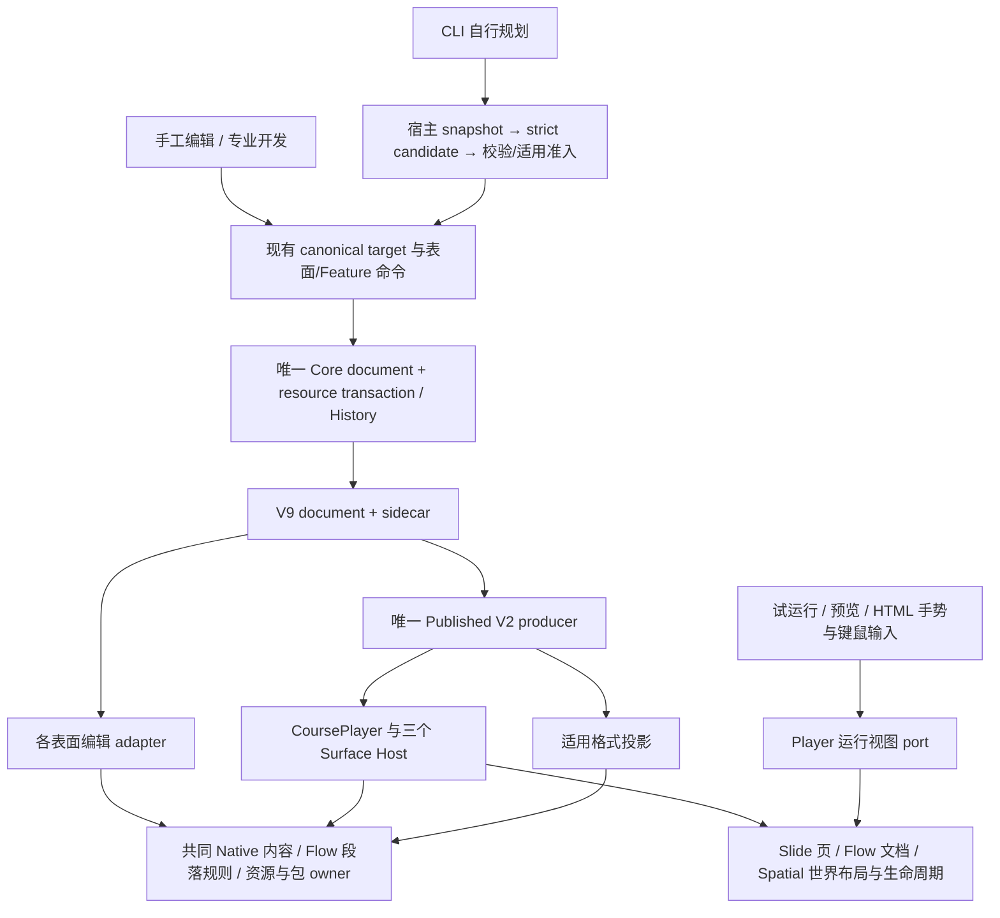

# 三表面架构整合与开发路线调整

2026-09-07。范围：三表面整合设计与实施。Owner已授权按计划推进1.8，并明确批准D1方案A；当前实施证据见任务卡与复核记录，不提交或发布。依据为当前含未提交修改的工作树、正式合同及既有可复现记录，不能将本文视为实现或验收完成。当前协调状态仍仅在[任务板](TASK_BOARD.md)，执行遵循[工作协议](WORKING_PROTOCOL.md)。

## A. 产品结论

**推荐在现有 1.8 上插入有结束门的整合阶段，暂缓 1.9–2.0 新能力扩张；独立用户阻断先修，坐标和绘制根因随对应 Owner 迁移闭合。** 保留三种表面入口和教师操作：Slide 逐页创作、状态及翻页；Flow 连续讲义、正文编辑和图文编排；Spatial 无限世界、自由相机、镜头及路径。不要求幻灯片教师改用镜头，也不把 Flow 正文变成自由定位图层。

整合共同内容规则、Native 内容绘制、已有段落语义、包编辑、历史算法和播放观察控制；保留各表面的布局、selection、placement command 和动态生命周期。共同基础主要已经存在，工作重点是消除错误分支、补足真实 consumer、停止重复 writer，而非创建一个 SurfaceEditorService 或重做产品。

预期收益是同一内容在编辑、试运行、预览及适用导出中遵守同一规则；人工、专业开发、AI 修改得到同一包身份与一次可撤销资源事务。成本集中在 Flow 几何及旧视觉政策、Native consumer 迁移、动态实例保全、包修订规则四处。历史算法重复属于维护负担，不能与当前可见阻断混报为 P1；Codex 服务超时是外部验证阻断，不能据此归罪于原生 adapter。

**V9 结构可以承载当前目标，不建议 V10。** 但 Flow 浮层的旧 16:9 投影与响应式正文存在呈现合同冲突：字段不变不等于语义无变化。D 节给出推荐与备选；只有这一项需要 Owner 决定。Owner现已批准方案A，Flow几何可按依赖进入实施；控制器、包编辑、候选修复、共享painter等独立工作继续推进。

## B. 当前事实与问题边界

### B.1 证据等级与复用范围

- **已证实**：本轮直接源码/合同可证明的规则、过滤或遗漏；先前隔离 Electron 与聚焦用例已记录的行为。两者分别注明，源码不替代实际视觉或真实 CLI。
- **合理推断**：由上述根因推导的修复边界、共享层收益及可能受影响的消费者，需由包内目标验收闭合。
- **尚待验证**：长文非 1 倍缩放的实际滚动/命中、Spatial Runtime 实际作者呈现、Word本机段落呈现，以及当前 Codex 连接恢复。实施后的Flow旧共享项定位、DOCX LibreOffice呈现、人工/Claude共享源码证据已追加到[S3复核记录](reviews/1.8-S3-review.md)；本节其余源码调查仍按原边界解释。

[U01–U11 原始记录和窗口测量](roadmap/1.8/USABILITY_REPAIR_PLAN.md)保持编号与证据。847×721 编辑内容视口的浮层绘制上界为 y=217.28，而标题在 y=147；拖入顶部后目标命中正文，是实际裁剪证据。整课预览稳定布局后正文标题尺寸不变、横幅变大约 68.5%，证明两套比例并存。U03 长文手势尚未实机复现，不能扩大描述。前轮[正文和 Claude 通过记录](reviews/chat-flow-usability-2026-09-07.md)仅在未变的消费者与样例范围内有效；旧 CLI 传输通过不替代当前原生传输。[S3](reviews/1.8-S3-review.md)仍未签署。

### B.2 实际链路与直接依据

下列路径相对于仓库根，行号为本轮读取位置；执行者应按符号重新定位，不能以旧行号替代当前源码。

| 证据 | 已证实的实现与直接依据 | 架构结论 |
| --- | --- | --- |
| E01 模型与有效域 | [V9 types](../../src/shared/contracts/course-project-v9/types.ts):65–82、256–265、269–413、460：共同 LayerItem；Slide canvas/scenes；Flow blocks/layout；Spatial world/cameras。Table/Chart 有正文与 world 正式分支。 | 不同布局不等于重复工程模型。保持 strict 有效域；input 仍只在 Slide scene，Flow overlay/Spatial shared/global 不借整合扩域。合同早段 Table 待扩域文字与末尾已实现条目有漂移，以当前 Schema及匹配 Published 为准。 |
| E02 目标与选择 | [courseAuthoringSession](../../src/renderer/authoring/courseAuthoringSession.ts):107–179 捕获 project/revision/generation/surface/owner/address；[flowDocumentModel](../../src/renderer/course/flowDocumentModel.ts):170 稳定块地址；[spatialEditorView](../../src/renderer/course/spatialEditorView.ts):49–69 保留 world/viewport。 | canonical target 已共享，Flow block 与普通 layer selection 不应强合；UI adapter 缺接线不等于重建 target 系统。 |
| E03 命令与资源历史 | [editorTransaction](../../src/renderer/authoring/editorTransaction.ts):12–38、89–120 是 document + resource step；[resourceAwareAuthoringHistory](../../src/renderer/authoring/resourceAwareAuthoringHistory.ts):66–201 被 Flow/Spatial 消费。[slideEditorCommands](../../src/renderer/course/slideEditorCommands.ts):157–189、260–296 重复基础历史算法，:216 已使用共同 document transaction。 | 共享 Core 是正式基础；Slide 留有可删除的算法重复。未证实第二活动 History 或由该重复导致数据损坏。 |
| E04 合成与 Slide | [courseLayerComposition](../../src/shared/courseLayerComposition.ts)统一有效合成；[SlideLocationWorkspace](../../src/renderer/ui/workspaces/SlideLocationWorkspace.tsx):1371–1460 已挂 Published authoring，同文件 :424–448/ACK 路径同步。 | 保留 Slide 同宿主内容、Phaser 几何/命中及 named state；不重做已完成的同步与状态所有权。 |
| E05 Native 内容 | [publishedNativeRendering](../../src/player/surfaces/native/publishedNativeRendering.ts):57–71、112–265 已有 frozen input、asset/controller ports 和 dispatch，真实消费者包括 Slide、Spatial Player、Spatial Table 作者及 PPTX。 | 共同 painter 已存在却归 slide 路径，应迁至 Surface 中立 Owner；它只绘内容，不接管表面布局、selection、Component/Runtime 生命周期。 |
| E06 Flow 分叉 | [FlowOverlayAuthoringLayer](../../src/renderer/ui/flow/FlowOverlayAuthoringLayer.tsx):48–56、197–310、591–601 自绘 Native、先减 scroll 再缩放、固定居中裁剪；[FlowSurfaceHost](../../src/player/surfaces/flow/FlowSurfaceHost.ts):844–858、1301–1457 独立定位/dispatch；[publishedStageFit](../../src/player/surfaces/publishedStageFit.ts):42–54 独立 fit 浮层。 | U01–U03 是布局映射和浮层绘制边界错误；正文并非第二 Published producer。 |
| E07 Spatial 分叉 | [SpatialLocationWorkspace](../../src/renderer/ui/workspaces/SpatialLocationWorkspace.tsx):205–253、591–682 把 Native 文本化并加固定卡片；:608、984 过滤 RuntimeLayerItem。SpatialSurfaceHost:284–315、546–553 的本地world/surface Runtime在运行侧也只是标签/静态后备；真实动态基础是 [publishedGlobalCanvasRuntimeOwner](../../src/player/surfaces/runtime/publishedGlobalCanvasRuntimeOwner.ts):68–74、356–405 的global Canvas API2。 | 横幅根因已证实。当前可闭合的动态consumer是global API2作者接线；local world/API3不能写成已有完整能力，也不借本轮自动扩域。截图Runtime的精确carrier仍须核对。 |
| E08 Flow 已共享文字 | [flowBodyPresentation](../../src/shared/flowBodyPresentation.ts)、[flowRichText](../../src/shared/flowRichText.ts)同时被编辑/Player消费；[flowTextEdit](../../src/renderer/authoring/flowTextEdit.ts)与 [useFlowTextAuthoringController](../../src/renderer/ui/flow/useFlowTextAuthoringController.ts):99–164 管草稿/IME/原 target。 | 保留这些当前工作区成果。React contenteditable 与运行 DOM 不必合成同一组件，文字规则和已支持排版语义必须共用。 |
| E09 段落交付遗漏 | V9 已有 textAlign/lineSpacing；FlowWorkspace:455–459 与 FlowSurfaceHost:1944–1949 各算 `1.6 + lineSpacing / 16`；[flowPrintPlan](../../src/renderer/export/course/flowPrintPlan.ts):22–33、174–198 不携带两字段，[flowDocx](../../src/renderer/export/course/flowDocx.ts):131–154 未输出对应段落属性。 | 段落算法重复与静态投影漏语义已证实，具体 Word 视觉尚待验证。是当前已支持文字能力的交付缺口，应纳入本轮，非高级排版扩张。 |
| E10 Published/生命周期 | [buildPublishedCourse](../../src/renderer/export/course/buildPublishedCourse.ts):622–705、730–734 单向发布；[CoursePlayer](../../src/player/surfaces/CoursePlayer.ts):158–187 和 [SurfaceHost](../../src/player/surfaces/SurfaceHost.ts):80–94 分责 activate/suspend/resume/reset/capture/destroy；FlowSurfaceHost:351–428 保留同表面实例；SpatialSurfaceHost:970–974 只更新运行相机。 | 同一 Published producer 和 session 已是基础。缩放/resize 只改观察变换，不能变成导航、重播或重建实例。 |
| E11 适用导出 | [buildCoursePptx](../../src/renderer/export/course/buildCoursePptx.ts):677–739、787–808 保留 Spatial 相机静态页与格式分支；[flowDocxProjection](../../src/renderer/export/course/flowDocxProjection.ts)以及 flowDocx:917–949 输出连续 Flow。 | Native 数据/段落语义可共用；格式投影保留。禁止将运行缩放写进 PPTX/DOCX，禁止从屏幕反建工程。 |
| E12 包写入分裂 | [courseComponentPackageTransactions](../../src/renderer/components/courseComponentPackageTransactions.ts):322–425 已递归遍历/更新 Flow 等全部实例，:449–656 校验替换并拒绝同版本异内容；[commitComponentPackageAuthoring](../../src/renderer/components/commitComponentPackageAuthoring.ts):430–485 人工源码却禁止换版本并原位写同版本字节。 | 不能只开放 textarea。人工、fork、替换 UI、AI 必须汇入一次版本修订/验证/替换事务，保持 registry 内容身份一致。 |
| E13 包 target 与源码 | [DeveloperTab](../../src/renderer/ui/DeveloperTab.tsx):650–697、982、1009 限 LayerItem/editableCopy；[editableComponentPackage](../../src/renderer/components/editableComponentPackage.ts):79–115 二次限制且另遍历 scopes 漏 Flow。generationSnapshot:16–22、46–63 不带源码 sidecar/包 destination；candidateStaging:33–49 仅落 request/Skills。 | U06/U11 是包源上下文和 target/写入规则缺口。外部目录只读不等于工程内嵌包只读；正文 target 不应借普通图层 ID 猜测。 |
| E14 候选修复 | [generationResult](../../src/shared/generationResult.ts):8–21 抛格式错误；[CourseChatPanel](../../src/renderer/ui/chat/CourseChatPanel.tsx):164 在 repair try 外读取，:179–186 只修合法 candidate 的准入失败；[generationRepair](../../src/renderer/authoring/generation/generationRepair.ts):29–33 只接合法 candidate。 | U07 严格拒绝正确，一次修复机会接线不完整。不能通过宽松 JSON、任意文本猜补或新模型循环修复。 |
| E15 转换/删除 | [flowSharedAuthoringAdapters](../../src/renderer/course/flowSharedAuthoringAdapters.ts):755–856 转换要求 fallback、反向新分配实例；[courseReferenceCleanup](../../src/renderer/course/courseReferenceCleanup.ts):76–93 对 include 空集 splice。 | U10 需真实实例 capture + placement/resource 一次事务；U09 保全控制器，普通共享装饰的清理仍保留各自语义。 |

### B.3 三条端到端链路

| 环节 | Slide | Flow | Spatial |
| --- | --- | --- | --- |
| 内容 | scene LayerItem、presentation state/override、surface/global | 语义 blocks/嵌套 section/list/table/component + paper/viewport 浮层 + global | world LayerItem、world Runtime、camera/path/relation、HUD/global |
| target / selection | canonical layer/state target；Slide selection | canonical block/content path 或 scoped layer；Flow text/block/overlay selection | canonical world/camera/path/relation/scoped layer；Spatial selection |
| 命令 | slideEditorCommands，命名状态保持原 override 规则 | flowEditorCommands、flowAuthoringTool、Flow placement planner | spatialEditorCommands、world/camera/path/relation commands |
| 提交与历史 | 表面 session adapter → Core；删除重复基础 history 算法 | 表面 session adapter → 同一 Core | 表面 session adapter → 同一 Core |
| 布局 | 固定页边界、页序/状态；stage fit | 响应式文档、正文重排与 wrap、纸张滚动；几何政策见 D | 无限 world + authored/runtime camera；HUD 独立于 world camera |
| 编辑绘制 | 已有 Published 内容 + Phaser/作者辅助层 | 语义可编辑 DOM + 共用正文规则；浮层迁共同 Native 内容 | 世界/共享 wrapper + 共用 Native 内容；动态实例另接正式 authoring host |
| 运行 | 同一 Published producer/CoursePlayer；页面切换和状态生命周期 | 同一 producer；同文档滚动/目录不重建实例 | 同一 producer；camera/culling 不重置既有Component/global API2实例；本地world/surface Runtime当前仍是标签/静态后备，不宣称完整运行 |
| 导出 | HTML/Web/Player 动态；PPTX 依现有 Native 可编辑投影；PDF/打印按既有静态规则 | HTML/Web 动态；DOCX 一份连续语义文档，普通浮层一次；PDF/打印保留原格式范围 | HTML/Web 保持当前世界/Component/global API2能力及本地Runtime限制；PPTX/PDF 等依已支持 authored camera 静态页并诚实标明 |

### B.4 Flow 文字分层结论

| 层次 | 本轮应做 | 不应从现象推导出的工作 |
| --- | --- | --- |
| 输入编辑 | 保全 IME、选区、待输入格式、草稿 dirty/save/recovery、列表/单元格内容路径；仅修迁移反例 | 无当前反例，不整体更换文本编辑器、不把光标/草稿放第二 Store |
| 文字呈现 | 保留已共享空段/换行/runs/CSS；浮层接正式 Native painter | 不把正文转换成文字盒、不把正文局部测试写成全部窗口通过 |
| 段落排版 | 把现有对齐/行距解析归正文 Owner，并贯通 DOM/print/DOCX | 不借修复新增段前后、孤行控制、分栏或段落样式系统 |
| 文档编排 | 可靠滚动/目录/重排/wrap、正文组件转换和命中；保留语义顺序/可访问性 | 页眉脚注、复杂分页、跨段选择新能力、逐段浮层锚定后续按真实需求规划 |
| 面板接线 | FlowComponentBlock 可解析到专业/AI共同包 target；转换明确正文落点 | 不把 readonly gate、target遗漏或缺 capture 说成 Flow 模型不支持组件 |

## C. 目标架构



### C.1 共享层的精确边界

| Owner | 输入 → 输出 | 状态归属、调用方向与真实消费者 | 旧路径退出 |
| --- | --- | --- | --- |
| Editor Core（复用） | 既有 target/revision、nextDocument、resource delta → transaction step/receipt、历史 resource direction | canonical/bytes/history 仍唯一；表面 adapter 提供 selection hint/error，不向 Core 注入完整 Store；人工/工具/包替换均消费 | Slide 重复 history/frame 算法删除；不另造公共 History Store或新作者 session |
| Player Native Content（迁移） | detached/frozen NativeRenderInput、asset resolver、controller hook、staticCapture/mode → 内容 DOM/canvas及必要 update/dispose | 不持 selection、布局或导航；Surface/Export → painter → shared contracts/text/formula/image。真实消费者 E05，加入 Flow 浮层和 Spatial 作者普通 Native | 删除 slide 路径 painter 实体及旧 import；删除 Flow/Spatial私有 Native dispatch，保留作者交互 wrapper/正式编辑控件；不能以 re-export 结束 |
| Flow Content Presentation（扩展既有） | 既有 rich text/paragraph typography → 规范 textAlign/有效行高语义及 DOM/Word 单位适配 | 无状态；Flow 编辑、Player、print plan/DOCX 消费；内容值仍在 blocks，草稿仍在 Flow | 删除两处私有段落公式，打印不再丢对齐/行距。HTML与Word不共用DOM节点，只共用语义 |
| Flow Layout（收口） | 实际 viewport、paper origin/scroll、layout policy、临时 zoom/pan → 正反映射、clip、visible bounds | 纯计算归 shared；DOM测量/observer归各host adapter；编辑 wrapper/选框/手势与Player共同消费 | 删除 Flow 固定 letterbox plane、私有 paperInset/scroll 算式；不得删除 Slide 固定页 helper 的合法 consumer |
| Playback View（新窄 port） | active host identity、CSS viewport、规范化gesture/key/control intent、zoom/pan/fit/anchor → 只读观察状态、有限平移范围及表面变换 | 运行session临时状态；手势/键鼠/控制器按钮/边条adapter → Published session窄port → active Surface adapter；Try-run/预览/HTML同入口，Player不import renderer | 运行态分散fit接线退出；控制器缩放按钮和边条复用同一port，动态内部优先；边条位置仅为派生值，编辑stage zoom不迁成新功能，不创建第二CourseSession |
| Components Packages/Authoring（汇合） | document/sidecars snapshot、精确包基线、文件草稿/严格变更、共享或单实例范围、取消token → prepared package/影响实例/diagnostics/唯一transaction | UI草稿、Main staging、Core数据各归原owner。面板/替换UI/AI工具 → 共同prepare/准入port → canonical commit | 删除同版本异内容writer、editableCopy写门及漏Flow的重复collector；fork也走相同资源事务，不复制工具私有smoke |

共享 Native painter只负责内容内部样式；frame、rotation、opacity、排序、clip 由一个明确 wrapper 应用，禁止内外各乘一次。视频/audio gate、teacher controller mount 复用既有正式 port，组件和 Runtime不被塞入 Native dispatch。Shared不依赖renderer，Feature不反向依赖composition root。

### C.2 布局与生命周期必须保留的差异

1. Slide 有页边界、scene order、named state 与适用 PPTX；试运行从当前位置/状态开始，整课预览仍从课程起点开始。对比呈现必须先固定同 location/state，而非改掉这两个入口语义。
2. Flow 正文是连续布局，正文上下浮层与全局平面合成仍为 `global Underlay → surface Underlay → body → surface Overlay → global Overlay`。滚动、目录开合、section折叠是文档行为；paragraph不能进入通用z-order。
3. Spatial 保留world/camera/path/relation和semantic zoom；world使用运行相机，普通HUD不跟随world相机漫游。world投影与普通HUD再共用一次播放观察zoom/pan，边条因此也能移动铺满画面的global Runtime。观察变换不回写camera，不让世界既吃外层zoom又吃camera补偿。视口剔除只调可见性，不以销毁/重建实例实现缩放；全局教师控制器和宿主边条例外见C.3。
4. 每个host保留mount/activate/suspend/resume/reset/capture/destroy。只有明确重播/内容版本变化等既有条件才重建；zoom、pan、fit、resize不得调用reset/replay/goToLocation，答案DOM、Component和Runtime实例身份/进度必须保留。

### C.3 播放观察控制

**Owner已明确：操作优先手势/键鼠，组件与Runtime内部逻辑优先；教师控制器的“缩放”按钮和播放区域底部/右侧边条分别作为缩放、平移的备用入口。** 区分手势发起区域与实际观察范围：从普通区域、控制器或边条主动发起整课观察操作时，正文、普通global/surface项、图片及Component/Runtime显示区域一起缩放/平移。全局教师控制器和宿主观察控件不随观察变换移动；边条不是课件内容。动态实例自身的缩放/拖拽只改变其内部状态，不自动带动整课。

| 输入区域 / 入口 | 处理规则 |
| --- | --- |
| 正文、普通图片、空白等非动态区域 | 触屏双指捏合、触控板捏合、Ctrl+滚轮发起整课缩放；双指移动或中键拖动用于观察平移。Flow普通滚轮/单指滚动继续滚动正文，不把所有wheel都当zoom。 |
| Component / Runtime区域（含整个iframe） | 优先内部缩放、拖动、滚动和输入。只有现有明确能力/行为证据证明该手势可无冲突交给外层时才转交；未知、未声明或无法判断时不接管。不能凭defaultPrevented=false、事件冒泡、短暂无响应推断无冲突。 |
| 混合触点 / 跨区域 | 双指都始于非动态区域才可由整课接管；任一触点始于动态区域，默认保留动态实例归属。开始时锁定区域、host/generation与锚点，途中跨边界不转交，结束/取消/切表面释放，避免内外同时缩放。 |
| 键盘备用 | 仅播放视口自身或非交互内容获得焦点时，Ctrl + +/-缩放、Ctrl+0恢复观察视图；动态iframe、组件输入框、其他输入控件或IME持有焦点时不抢快捷键。 |
| 教师控制器“缩放”按钮 | 固定可见的独立入口，不藏入通用工具菜单；点击展开小面板，提供缩小、当前倍率、放大、恢复视图。由教师明确触发宿主整课观察操作，不向动态实例模拟滚轮/捏合。Runtime铺满整页或内部完全占用手势时，仍能使用该入口。 |
| 播放区域底部横向、右侧纵向边条 | 使用浏览器滚动条式的滑轨/滑块，分别左右、上下移动整课观察视图；有可平移范围时持续可见，不依赖悬停到Runtime内部才出现。支持拖滑块、点击轨道以及边条自身获焦后的方向键操作。拖拽始于边条便由宿主持有至结束/取消，越过iframe也不转交，不向Runtime合成拖拽事件。 |

控制器按钮、边条与手势消费同一个Playback View port和同一份临时观察状态，不新建按钮专用公式或滚动条专用offset。按钮打开面板时保存当前内容观察锚点，按钮缩放围绕该锚点（无则内容视口中心），不能围绕控制器位置把内容推走。恢复只复位观察倍率/偏移，不重播、不导航、不改实例状态；Flow保持阅读锚点，Spatial保留当前world camera位置/进度，不把“恢复观察视图”当成重新跳到location镜头。

边条属于试运行/预览/HTML的固定宿主框，位于动态内容裁剪区之外；不是浏览器全窗滚动，也不嵌入组件/Runtime。宿主预留稳定边缘槽，厚度计入可用viewport，按需启用滑块不反复挤压内容引发重排/resize。控制器沿现有clamp避开边条和角落，两者均不可被global Runtime遮挡。保持鼠标、触控可命中；边条可分别以“左右移动视图”“上下移动视图”识别，获得焦点是教师明确操作宿主，不能持续抢回动态输入焦点。

**边条范围只表示当前观察视窗的有限偏移。** adapter提供当前基准观察区域与普通课件项bounds，排除教师控制器；用共同映射计算放大后的包围范围及两轴合法pan区间。Slide取页面及适用内容bounds；Flow取当前正文视窗与普通paper/viewport浮层bounds，不把整篇文档高度再次做成观察滚动范围；Spatial取当前基准镜头视窗与普通HUD边界，不把无限世界当成有总长度的滚动页面。必须包含全屏Runtime的宿主显示bounds，无需窥探iframe内部。滑块是合法区间中当前pan的投影，无溢出且位于原位的轴停用。拖动期间冻结区间与host/generation，不能随当前可见对象追着滑块改范围；zoom/resize、基准镜头或布局边界变化时结束旧拖动，再按锚点重算和clamp。缩小后不遗留可把内容推入空白的旧偏移，边缘内容和恢复入口始终可达。

Flow原有正文滚动只更新`paperScroll`，边条只更新共同`observationPan`并一起移动正文与普通浮层；正文滚动在D节公式中仍只减一次。两者不串联消费同一输入，不能用修改`scrollTop`同时补偿观察pan。若边条使用DOM scroll机制，其`scrollLeft/Top`只是Playback View状态的读写适配，不形成第三份权威位置；正文内滚动条与宿主“移动视图”边条按位置和名称明确区分。当前位置试运行、整课预览和HTML使用相同边条与规则。

该按钮是现有教师控制器的内置宿主观察操作；控制器即使处于紧凑/折叠状态也应有直接可达的缩放入口。复用teacherControllerDom.ts和teacherControllerRuntimeSession.ts的呈现/session边界并注入窄view port，不写入教师自定义课程按钮数组、不新增InteractionAction或V9字段、不复制第二控制器。展开小面板按屏幕边界约束，关闭后回到缩放按钮焦点；导出静态格式不增加无效操作面板，Player/HTML中保持可用。作者态控制器仍inert。

比例在手势期间可短暂提示，在控制器缩放面板中显示真实值。初始观察倍率100%，建议基础范围25%–400%，Spatial同时受既有合法camera范围约束。一条触控板捏合若产生wheel/pinch多种事件，只归一化一次；只有已获归属且实际消费的观察事件才阻止默认行为，不能触发Electron/浏览器全窗zoom。输入监听、归属与提示均由当前播放session清理。

**字体必须随整课观察缩放一起变大。** 同一窗口100%→200%，正文、普通浮层以及实际Component/Runtime内文字的视觉尺寸约×2，图像等同倍率。保存的字号不变只表示未修改课程内容，绝不表示屏幕字大小不变。Flow逻辑排版宽度、实例内部逻辑viewport不能因观察zoom反向缩小或重新fit来抵消放大；实际窗口resize的响应式排版是另一输入。动态实例内部手势则遵循它自己的缩放语义，不能把这两种倍率混为同一状态。

Slide用fit×observationZoom+pan；Flow用D节共同映射。Spatial先以既有runtime camera将world投影到基准逻辑视口，再对world投影及普通HUD共同应用一次Observation矩阵（zoom与pan）。world自由漫游只改camera，HUD不跟随；宿主观察手势/按钮/边条只改观察状态，不额外改camera的x/y/zoom。因此global Runtime也可被边条平移，不能只接world相机，不保留把整课观察zoom再次写入camera的路径。命中、有效semantic zoom与可见bounds按组合映射计算：实际宿主视口依次经Observation逆矩阵、camera逆矩阵求可见world范围，不沿用旧camera.viewport直接剔除；semantic zoom读取有效倍率，不回写camera。裁剪放在最终宿主视口，不能先裁掉基准视口的边缘再尝试移回，剔除仅调整既有wrapper可见性。相机巡游/自由移动、内容版本变化及host生命周期仍按既有规则处理，观察操作不导航/reset/remount。

动态iframe不默认注册强制整课手势转发。仅现有明确可转交的分支通过受管宿主传规范化观察意图，校验实例/generation并映射锚点；没有这项能力就保留内部处理，教师用控制器和边条操作。不新增通用手势权限协议、永久透明遮罩、任意工程接口或重挂iframe逻辑来强行接管。

全局教师控制器使用不含observationZoom/pan的wrapper，普通global Overlay仍随内容观察变换；保留原Overlay排序、单实例、session offset/clamp及可操作性。按钮、面板、比例提示、边条和既有退出入口不随内容缩放，控制器点击/拖动不启动课件平移。全屏global Runtime不得盖住边条和控制器的既定恢复入口。

### C.4 人工与 AI 包编辑汇合

共同prepare输入固定为`workspace/session token + documentRevision + packageId/baseVersion/baseContentIdentity + source files + scope + operationId`；先解析canonical instance target，再取得精确package address及全部受影响实例。正文、浮层、Slide state、Spatial/global各由现有target adapter表达，不用selectedNodeId临时猜包。

工程源码修改保持packageId与实例props/id/carrier；源文件未改变先判no-op。修改时宿主生成唯一工程内修订版本，建议合法semver的`主.次.补丁-edit.<host-operation-uuid>`，一次prepared/重试复用该版本；不让教师手工管理版本。**自动修订只适用于工程源码编辑，导入替换包保留其声明版本**，继续由原planner拒绝同版本异内容。所有引用version、manifest、文件和metadata/content identity一次更新。过期包基线或取消零写入。显式“仅当前实例”生成新packageId并只切该canonical target，不能暗中fork共享包。

完整候选files是源码真相。Runtime代码页绑定实际manifest.entry；修改entry时，新入口必须在候选files内且通过入口校验，不存在则拒绝，已存在则加载该文件，不能将旧Runtime页草稿默默覆盖另一个入口文件。旧`componentFilesWithAuthoredCode`的覆盖规则随共同owner迁移退出；文件草稿按原file key保留，entry切换也不能丢稿。

解析/编译/入口/依赖/素材闭包/精确origin/实例作用域/现有动态准入复用同一owner，准入完成及apply前再次查基线；后备资源按变更后实际实例刷新，不能留下旧包截图。旧外部归档provenance不能冒充新源码身份，按现有可选字段处理；不回写外部目录源。DeveloperTab仅在committed/unchanged回执后清对应草稿/报成功；stale保留草稿和错误，不能把Promise当同步成功。

AI只发送被引用包的完整source/manifest/样式/必要资源闭包及精确包destination，既有sidecar不是自动对CLI可见。当前profile是structured-stdout且未启用candidate文件摄取；首个实现可向stdout profile提供等价完整只读上下文和严格包候选，超预算明确阻止发送/缩小引用包范围，不能截断单包。若采用文件型profile，必须同时落当前session的只读source与独立candidate工作副本、显式capability及realpath摄取检查，不能仅因存在staging.read就宣称接通。CLI仍自行规划，没有live工程API、MCP或新模型循环。

## D. V9 适配结论与D1决定

现有V9可表达三表面内容/布局载体、Native字体/图片/形状、Flow段落/嵌套/wrap/正文组件、包版本和资源身份、camera/path。整合后的坐标派生值、播放zoom/pan、代码草稿和AI staging均不应进入工程。当前没有必须新增字段或V10的结构缺口。Flow高级排版若以后确需持久字段，再逐项列出字段、旧默认、strict reader拒绝和导出合同，本轮不预置。

**D1只讨论窗口变窄时的基准排版，不是“缩放时字体变不变”的选择。** Owner已明确以手势/键鼠主动缩放，控制器以外全部内容和字体同比变大。只有实际改变窗口宽度时，A才按当前文档逻辑重新换行，B则整体适配固定版面；两案在主动放大时都必须放大屏幕上的字。推荐A不意味着保持视觉字号不变，不能用响应式重排、反向减小字号或重算fit抵消手势放大。

**已批准选择的具体兼容影响是旧Flow浮层的基准投影。** [旧1.0边界§1.3](../contracts/EDITOR_1_0_ARCHITECTURE_BOUNDARY.md)要求全表面1280×720 letterbox；当前正文按CSS排版，浮层却按旧舞台比例。统一后旧浮层基准大小/位置需要复核；Owner于本次实施会话明确选择“采用A：响应式正文与统一尺度”，并确认响应式布局与主动缩放彼此独立；D1已批准。

| 选择 | 精确规则 | 教师收益与兼容成本 |
| --- | --- | --- |
| **A，推荐：响应式文档尺度** | Flow在基准z=1时，正文与frame均1逻辑单位=1CSS px；正文由实际可用宽度/readingWidth/wideContentWidth排版。viewport项相对实际文档视口，paper项相对纸张布局原点并随滚动。再整体应用临时运行zoom。 | 保留窄窗易读和连续流；浮层可覆盖顶部、尺寸与正文一致。旧浮层在Flow的视觉大小/位置会改变，包括同一global frame跨表面的投影；不自动改存储数值，必须复核旧课件。 |
| B：固定逻辑排版宽度整体适配 | 正文仍连续滚动，在1280逻辑宽度布局；body/paper/viewport共同乘`min(W/1280,H/720)`，从实际视口顶部展示，clip仍为真实视口；运行zoom再乘该比例。 | 共享frame保留旧逻辑尺度且全画幅易适配；窄窗正文会缩小，断行不再随实际宽度响应。不是Slide分页，但牺牲现有正文响应式阅读优势。 |

两案均可使用现有字段，均涉及呈现合同变化，不能声称视觉完全兼容。**Owner已批准A：基准响应式布局与运行观察缩放分离；不改持久frame数值，复核旧浮层投影变化。** 若要求所有旧课件在所有窗口保留旧视觉且同时实现新的响应式相对尺度，这两个要求不能同时满足；须另行决定显式迁移或版本化布局语义，再评估V9 additive及旧reader，不能偷偷加兼容模式。

A的共同几何计算建议放`shared/flowViewportGeometry.ts`（当前共同几何Owner），输入为`viewportClientRect, layoutViewportSize, paperOriginLayout, paperScrollLayout, baseScale, playbackZoom, playbackPanClient`，输出正反映射、clipClientRect、visible logical bounds。令`k=baseScale×playbackZoom`，`T=viewportOrigin+playbackPanClient`：

```text
viewportToClient(q) = T + k × q
paperToClient(q) = T + k × (paperOriginLayout + q - paperScrollLayout)
clientToViewport(c) = (c - T) / k
clientToPaper(c) = (c - T) / k - paperOriginLayout + paperScrollLayout
```

A的baseScale=1；B的baseScale为共同fit。文中`playbackPanClient`/`viewPan`是同一`observationPan`的表面映射，不是第二份位置状态。以上映射用于控制器以外的全部内容及其命中；全局教师控制器和宿主边条按C.3独立wrapper应用不含观察zoom/pan的视口映射。DOM adapter从未变换布局容器测量paper offset与scrollTop（布局单位）；若使用getBoundingClientRect，则先用父逆矩阵还原布局值。paperOrigin明确为scroll=0的原点，滚动只减一次；不能再加固定paperInset。clip只有实际Flow viewport；放开浮层16:9子裁剪不等于允许覆盖整个应用。

A还必须解决旧右下角/global普通共享项可达性。r18-074明确增加仅改变视图的“定位选中内容”接线：把选中项的逻辑bounds映射到client，计算使其至少可见并留16px操作边距的最小平移；文档viewport/paper内容共用viewPan，范围取当前可见内容bounds与viewport的并集，正文scroll仍单独用于paper。viewport项不会因为正文scroll而假装变得可达。作者态z固定1，选择/定位与可见的回到文档原位入口只改session viewPan，不改frame/历史、不新增编辑zoom；运行可用平移或缩小。超大对象可分区查看，不暗中缩小。该反例在几何包首个可运行纵切即验证，不能延至S3再找技术解法。教师控制器排除viewPan并沿既有session clamping保持可恢复，不占正文安全区。

## E. 分阶段迁移与回退

| 阶段 | 独立结果 / 可并行边界 | 退出与回退 |
| --- | --- | --- |
| 0 阻断先行 | r18-071控制器、r18-082候选修复可先交付；r18-070冻结窄接口并处理D1；源码包基础也不依赖Flow几何 | 每个包用独立实质diff/验证闭合；D1或Codex未决不冻结其他工作 |
| 1 共同Owner | r18-072历史、r18-073 Native、r18-078包修订可按隔离写域并行；r18-084段落语义独立闭合 | 首个真实consumer切换时同一变更删除对应旧算法/writer；资源历史、import方向或行为不等价即回退该包 |
| 2 表面consumer | r18-074 Flow、r18-075 Spatial Native、r18-076 Spatial Runtime；r18-079专业面板、r18-080正文转换 | 一包交付完整编辑/保存/历史/运行/适用导出纵切；不能先关能力再等后续包补回 |
| 3 观察与AI接线 | r18-077播放控制、r18-081源码上下文；已通过的修复不等待整条线结束才给用户 | 缩放不重建实例；包修改失败零工程/资源写入；完整包不足预算显式失败 |
| 4 工程结束与S3 | r18-083完成整合结束门；现有r18-050补当前原生三CLI证据；原PPTX两节点继续作为必选 | 整合工程结束可独立于Codex服务状态成立；S3仍要求三CLI及PPTX既有门。Owner签署前无accepted |

每包回退以本包完整的owner+consumer变更为单位；后续已依赖者须一起回退到最近完整边界，不只撤回新owner留下断链。实施时保护当前dirty，禁止`reset --hard`或整体覆盖。无V9迁移时以工程副本做保存/重开验证；D1呈现政策变更不得用自动改frame“补偿”。允许实现过程短暂未提交编辑状态，不允许交付提交/候选中存在双写、功能开关双轨或永久re-export兼容壳。

## F. 可执行工作包

以下ID已同步到[1.8正式规格](roadmap/1.8/README.md)与[manifest](roadmap/manifest.json)，是路线节点，不是queued/active卡。每包由一个正式Owner持有写入；共享worktree只有一个writer，本轮其他调查者只读。实际并行实现须隔离worktree，composition root/shared History保持单writer。表中依赖是技术/发布依赖，写锁碰撞即使无依赖也须串行。

验证命令默认`npm run test:product -- <所列现有文件>`，每包最多选择下列1–3项直接检查；真实交互项由指定carrier验证。这里描述未来验收，**本轮未执行**。新用例加入已有文件；新增实现文件名是允许落点，不假称已存在测试。

### r18-070-surface-integration-contract

**结果：共同内容、表面几何和运行观察port有可实现合同。** E05/E06/E12已证明错误Owner与规则分叉。

- 依赖：无。Owner：Shared Contracts/Domain；写入仅架构合同、D1决定、旧1.0边界受影响条款及相关规格，不改产品或V9 Schema。
- 明确交付：按C节冻结input/output/state/call direction、wrapper仅应用一次frame/rotation/opacity；列出真实consumer迁移和D1旧课件反例。D1是r18-074额外启动条件，不是本节点及所有下游的共同依赖；本节点可在D1尚未裁决时完成中立接口合同，不能顺带批准任何坐标政策。
- 退出旧路径：旧“Flow一律16:9舞台”描述在D1批准后由明确的新Flow政策取代；不改Slide/Spatial页/HUD合同。
- 不含：万能Surface服务、V10、新AI协议平台、所有高级排版。
- 验收/最小验证：对照V9字段、现有port和直接consumer作合同审阅；路线/link检查；共同接口不预置D1任一政策，标明Flow实施必须先有Owner决定，不把本次文档生成当作批准。
- 停止：需要新持久字段、逐表面global frame副本或教师能力取舍时只停该争议边界，记录精确反例；不得声称整个整合已blocked。

### r18-071-controller-preservation

**结果：删除最后include引用页不删除全局教师控制器及配置（R01/U09）。** 当前聚焦用例失败和E15可直接复用。

- 依赖：无。Owner：Course document/history；写入`courseReferenceCleanup.ts`、`courseLocationCommands.ts`、控制器canonical commands和对应测试。
- 设计/退出：对controller保留layerItemId/content/buttons/assets；include删除后仍有有效ID则仅保留这些ID，清空时保持include并填入删除事务完成后的全部有效location IDs（现有单剩余页反例期望include该页），exclude空集归all。停止空include一概splice控制器的路径；普通global装饰及PPTX surface装饰仍按其原范围清理，不能一概变all。
- 不含：视口、AI、普通共享项产品语义重写。
- 验收/最小验证：`globalEditorStore.test.ts`的`canonicalizes include/exclude`和`courseLocationCommands.test.ts`删除/撤销反例；副本实际删页→Undo/Redo→保存重开，核查canonical条目/资源与一次历史。
- 停止：无剩余有效位置且既有规范无法表达controller可见范围时返回明确失败/既有空工程规则，不自动删配置；合同冲突须先指出具体分支。

### r18-072-shared-authoring-history

**结果：Slide基础资源历史算法只由现有Core实现。** E03为确定维护重复，不宣称用户P1。

- 依赖：r18-070共同接口部分。Owner：Editor Core；写入`authoring/resourceAwareAuthoringHistory.ts`、`course/slideEditorCommands.ts`及其history类型/直接consumer；表面selection保持原Owner。
- 退出：删除Slide私有create/commit/undo/redo/frame算法，保留只做目标拒绝/错误适配的窄函数；不保留同义实现或第二history状态。
- 不含：合并三session、改资源模型、重写Store composition或重排教师历史。
- 验收/最小验证：`crossSurfaceResourceHistory.test.ts`与`slideOwnedCommands.test.ts`覆盖混合document/transaction frame、字节复制、Undo分支、原100步上限及stale；检查直接imports与旧算法消失，确认Core不反向依赖Slide。保留现有可读的旧document history entry，不借迁移清除历史。
- 停止：文档、资源或历史顺序不等价，回退整包，不以双写兼容撑过下一阶段。

### r18-073-shared-native-painter

**结果：三表面和导出可消费同一个正式Native内容Owner（R02/R03的共同前置）。** E05跨Surface真实consumer已存在。

- 依赖：r18-070共同内容接口。Owner：Player Native Content；允许迁`player/surfaces/slide/publishedNativeRendering.ts`到`player/surfaces/native/`正式Owner，现有叶子helper及直接imports（Slide/Spatial/Export），相关测试。
- 设计/退出：保留frozen input与asset/controller/staticCapture ports；先迁真实Slide/Spatial Player/PPTX consumers并删旧实体和imports，不以re-export落地。视频保留mount/capture gate，内外几何只应用一次。
- 不含：世界相机、正文排版、Component/Runtime执行宿主；不删除已有Table/Chart编辑控件或Phaser命中。
- 验收/最小验证：`nativeAuthoringAppearance.test.tsx`和`nativePathRendering.test.ts`中直接样式/路径反例；同Native文本/图片/路径在真实Slide、Spatial Player与适用PPTX投影抽查，确认旧painter consumer清零和依赖方向。
- 停止：需要以静态图取代动态对象、让Player依赖Renderer或扩大Native合法域，停止并修正Owner边界。

### r18-074-flow-layout-authoring

**结果：Flow正文/浮层/纸张滚动/选框命中消费一个布局映射及共同Native内容（R02/U01–U03）。** 失败证据E06和既有窗口/拖拽记录。

- 依赖：r18-070的D1明确批准、r18-073。Owner：Flow Layout，编辑与运行单writer；允许`FlowWorkspace.tsx`、`flow/FlowOverlayAuthoringLayer.tsx`、`workspaces/FlowLocationWorkspace.tsx`、拟新增`shared/flowViewportGeometry.ts`、`FlowSurfaceHost.ts`、`flowRuntimeToc.ts`、`publishedStageFit.ts`的Flow分支及直接测试。
- 设计/退出：实现D节正逆变换、actual viewport clip、paper实际origin/scroll及view-only定位；内容、选框、drag inverse共用。Flow Native浮层接r18-073内容Owner；删除独立16:9 plane fit、未统一单位的私有scroll换算和固定paperInset、两套Native dispatch。规范公式仍是在布局空间减scroll后乘比例，不能误删这一步。保留正文React编辑DOM、目录/section/wrap/Component实例。
- 不含：新增编辑zoom、Flow分页、正文layer化、逐段锚定、完整文字编辑器替换。
- 验收/最小验证：`stageViewportTransform.test.ts`保留Slide反例，`flowWorkspace.test.tsx`/`flowSurfaceHost.test.ts`加入非1比例、长文scroll、目录开合、clip顶部及逆变换；真实同Flow两种窗口在编辑/试运行/预览/HTML检查顶部拖动、滚动后paper定位、选择和旧右下global项可达，再保存/Undo/重开。
- 停止：D1未决；旧共享项不可达；需要改frame数值或新持久模式；输入草稿/正文互动/导出回退。不能增加顶部空白或越出应用裁剪掩盖根因。

### r18-084-flow-paragraph-semantics

**结果：已支持的Flow对齐/行距只有一份语义，并进入连续DOCX。** E09为源码确认的投影遗漏，实际Word视觉待验。

- 依赖：r18-070共同内容接口；不等D1几何。Owner：Flow Content Presentation；允许`shared/flowBodyPresentation.ts`、FlowWorkspace/FlowSurfaceHost段落adapter、`export/course/flowPrintPlan.ts`、`export/course/flowDocx.ts`及目标测试。
- 设计/退出：统一解析既有paragraph/heading/quote的textAlign与lineSpacing；现有行高倍数固定为`1.6 + (lineSpacing ?? 0) / 16`，DOM消费该倍数，Word输出`w:lineRule="auto"`及`w:line=round(倍数×240)`、对齐输出`w:jc`。缺省也保留该行高，不能掉回Word默认或按字体重新解释为固定额外px；print plan携带语义值，删除两处私有公式，不从CSS字符串反解Word。
- 不含：新增段前后、分栏、分页、页眉脚注、Flow新discriminator或改变PDF浮层范围。
- 验收/最小验证：`flowDocxProjection.test.ts`/`coursePrintArtifacts.test.ts`检查对齐/行距XML及段落顺序；`flowInlineTextEditor.test.tsx`只覆盖受影响文字/IME用例；代表真实段落编辑→Undo/Redo→保存重开→Player/DOCX，确认可编辑文字而非图片。
- 停止：需要新Schema或Word映射不能表达已有语义时给出具体差异，不能静默遗漏、用截图过关或要求先完成高级排版。

### r18-075-spatial-native-authoring

**结果：Spatial world/shared/global Native作者内容忠实使用正式样式（R03/U04 Native部分）。** E07固定卡片是直接根因。

- 依赖：r18-070共同接口、r18-073；不依赖Flow几何实现。Owner：Spatial Authoring；写入`SpatialLocationWorkspace.tsx`、Spatial wrapper/target adapter、必要`SpatialSurfaceHost.ts`窄呈现接线和直接测试。
- 设计/退出：移除spatialNativePaint及HUD固定深色/白字/13px/圆角样式；共同painter画内容，Spatial wrapper应用frame/rotation/opacity/plane/selection；world使用camera，HUD用viewport。保留Table/Chart文字数据编辑和组件实际挂载。
- 不含：Runtime新宿主、Flow、camera/path产品功能扩张。
- 验收/最小验证：`spatialWorkspaceAuthoring.test.ts`选择/旋转/拖拽和`nativeAuthoringAppearance.test.tsx`受影响样式；同camera两窗口对照编辑/试运行/预览/HTML的横幅、图形路径、图片/公式，保存重开与一次Undo/Redo。
- 停止：需要静态化、丢有效Native或改变world/HUD所有权；Runtime过滤不在此包假称修复，交r18-076。

### r18-076-spatial-runtime-authoring

**结果：Spatial全局Canvas Runtime API2补齐真实作者挂载与精确target（R03当前动态范围）。** E07已证实作者过滤，global API2正式运行/authoring owner已存在；不能宣称本地world/API3已具备同样基础。

- 依赖：r18-070运行/作者生命周期接口、r18-075。Owner：Spatial Authoring composition；mount/target规则归Player Runtime。允许SpatialLocationWorkspace及拟新增`ui/workspaces/spatial/`窄adapter、`publishedGlobalCanvasRuntimeOwner.ts`、`publishedDynamicHosts.ts`中只读authoring state抽取并迁原consumer、必要Runtime canonical文本命令接线和直接测试。
- 设计/退出：Spatial为global Underlay/Overlay API2条目提供真实wrapper和`getPublishedGlobalRuntimeMountTarget(itemId)`；以同canonical snapshot派生payload，向现有PublishedGlobalCanvasRuntimeOwner注入hosts/asset resolver/只读courseState及无副作用authoring services/target sink。wrapper就绪后`mount(document) → moveTo(surfaceId)`，模式/工程/generation退出时destroy。删除该受支持分支的JSX过滤，不另造执行循环。观察camera/zoom只改矩阵，不调用mount/destroy/resize。
- target经owner现有layerId/bounds映射，接`captureCourseRuntimeContentTextTarget`、`planRuntimeContentTextUpdate`及`createRuntimeAuthoringActions`；仅在global编辑范围写入。正式作者内容提交后用已有`applyAuthoringContentValue`更新被改carrier，其他实例不重建；源码/真实frame提交按现有generation更新。无细粒度targets时保留真实内容及外层frame选择，不伪造内部编辑。
- 不含：local world/surface Runtime全面动态执行、API3 global扩域、RuntimeScope新增world/surface、第二registry、把Spatial挂到仅支持Slide的createPublishedAuthoringCourseSession或图片假通过。
- 验收/最小验证：`publishedRuntimeAuthoringMounts.test.ts`真实wrapper/targets，`publishedGlobalCanvasRuntimeOwnerLifecycleIsolation.test.ts`一个实例内容修改而另一个不重建/迟到零误写；真实Spatial global API2编辑显现→选target→改文字→Undo/Redo/保存重开→试运行/HTML，切镜头/观察zoom不重复挂载。
- 停止：截图若为local world/API3，记录精确carrier及当前运行限制，不能把本包通过扩写为“所有Spatial Runtime已完整”。补查已知缺口为本地live consumer、RuntimeScope（当前scene/global）映射及mount handle公开resize；须独立作者—运行—导出合同后才能扩域，不能偷带入此包。若旧已签署样例证实本次迁移造成回退，必须原范围恢复后才能退出。

### r18-077-playback-view-controls

**结果：手势尊重动态实例，控制器可兜底缩放、底部/右侧边条可兜底平移，整课字体同比放大且状态保留（R04/U05）。** E10和现有自动fit-only行为为边界。

- 依赖：r18-074、r18-075、r18-076。Owner：Preview/Player Viewport；教师控制器只接窄view port。允许coursePlayerTryRun、useCourseDelivery、Published session/viewport、三host的view/gesture adapter、teacherControllerDom.ts、teacherControllerRuntimeSession.ts及必要teacherControllerLayout/AuthoringChrome同步、宿主边条/范围适配、比例提示和直接测试；动态host仅接已有明确可转交分支，不强制改扩展协议。
- 设计/退出：实现C.3按起始区域/焦点锁定、内部优先、未知不接管及手势去重；加入控制器独立缩放按钮和小面板、固定横纵边条，普通区域手势/按钮/边条共用唯一view状态/公式。Flow正文scroll与观察pan分别归原owner；Spatial保留world camera，并在其投影与普通HUD外共同应用一次观察矩阵，不把整课zoom/pan再次写入camera。删除分散fit和Flow独立plane fit；保留编辑stage合法consumer。无自定义课程按钮写入、无第二控制器或边条私有状态。
- 不含：编辑态新增zoom、覆盖组件/Runtime内部手势、新通用仲裁协议、实例内viewport反向适配、持久化观察状态或重新创建CourseSession。
- 验收/最小验证：coursePlayerTryRunFit.test.ts与spatialPlaybackGestures.test.ts覆盖非动态起始/混合触点/焦点/未知不接管/锚点去重，以及边条范围投影、缩小/resize后clamp；teacherControllerRuntimeSession.test.ts覆盖按钮/边条/手势同一状态、恢复不重播。真实三表面两窗口从普通区域用捏合/Ctrl+滚轮，确认100%→200%全部课件文字及动态区域视觉尺寸约×2，controller/边条不变；带内部缩放/拖拽的组件/Runtime只响应自身，未知动态区域不带动整课。用铺满画面的global Runtime实际点击缩放按钮到200%，仅用横纵边条看到四边/四角，再恢复；拖滑块跨iframe不中断，内部逻辑不误触发，控制器/边条始终可达。Flow长文先滚至中段再放大/平移，确认正文与浮层共同移动、paperScroll未被重复修改，恢复后保留阅读锚点；Spatial边条确实移动global Runtime，world自由漫游仍不移动HUD，观察变换不双写camera。缩小/resize后无旧偏移困住内容，答案/焦点/Component状态/Runtime进度保留；HTML定向复核。无相应硬件如实列未验，合成事件不能冒充真实手势。
- 停止：内外同时缩放/拖拽、焦点/触点被抢、未知实例被接管、全屏Runtime遮住按钮/边条、边条只移动world不移动global Runtime、Flow scroll/pan重复应用、拖动区间漂移、缩小后内容不可恢复、观察操作形成第二状态或双写camera、字体放大被fit抵消，或zoom/pan导致reset/navigate/remount；不得以强制转发、遮罩或重播绕过。

### r18-078-component-package-revision

**结果：工程包源码、替换及fork均经同一修订/校验/资源事务Owner（R09/R05共同基础）。** E12版本与writer分裂、E13重复collector是直接失败边界。

- 依赖：r18-070共同包接口、既有r14-030-dynamic-code-tools。Owner：Components Packages/Authoring；允许`components/{editableComponentPackage,commitComponentPackageAuthoring,courseComponentPackageTransactions}.ts`、必要canonical target/admission窄port、`componentPackageTool.ts`及直接测试。
- 设计/退出：实现C.4版本/no-op/共享范围/单实例fork；复用已有递归collector和replacement planner。删除原位同版本writer、editableCopy作为工程包写门、漏Flow的scopes遍历及fork独立persist路径；保留外部源只读与明确fork入口。
- 不含：Catalog重做、Provider接线、新Component API、packageId自动合并。
- 验收/最小验证：`courseComponentPackageTransactions.test.ts`与`componentPackageManagement.test.tsx`覆盖新版本/所有引用/嵌套Flow/no-op/stale/坏字节/失败零资源；Mixed真实包替换后当前和其他实例配置不丢，一次Undo/Redo/重开/HTML一致。
- 停止：同版本不同源码仍可写、出现第二准入/资源writer或错误清理仍被引用的旧包资源；回退整包，不让UI自行bump版本规避。

### r18-079-developer-package-targets

**结果：专业面板可直接修改工程包两个源文档并正确处理Flow正文（R09/U11）。** E13为readonly/target与同步假成功边界。

- 依赖：r18-078。Owner：Components Authoring UI；允许`DeveloperTab.tsx`、组件canonical selection adapter及局部草稿controller、必要Flow/Slide/Spatial目标接线和直接测试。
- 设计/退出：block/layer target解析精确包、展示共享影响与显式fork；Runtime.js/Manifest.json可输入。应用await唯一prepare/commit receipt；以workspace+包基线+file key保存草稿切换，Cancel/失败/stale保留合法草稿，不跨工程串稿。删除row-only推断、editableCopy UI gate和同步报成功。
- 不含：第二代码工作台、Flow视口重写、重做运行Runtime源编辑、新包writer。
- 验收/最小验证：`developerMode.test.tsx`与`componentPackageManagement.test.tsx`目标/草稿/拒绝反例；真实普通工程包和嵌套Flow正文组件编辑两文件、切文件/切组件/Cancel/stale、应用、共享实例、一次Undo/Redo、重开/HTML。命名状态按既有target规则，不把package全局变更伪装为state局部变更。
- 停止：UI只能靠改editableCopy元数据解锁、应用未await、丢稿或错误目标写入；不能只修改旧拒绝测试宣称完成。

### r18-080-flow-component-conversion

**结果：普通插入浮层的组件可以直接进入指定正文位置并反向转换（R08/U10）。** E15已确认缺实例后备而非缺carrier。

- 依赖：r18-074的布局/目标定位。Owner：Flow Placement，用例组合Components instance capture和Core；允许`FlowPropertiesPanel.tsx`、`FlowPropertiesContextBuilder.ts`、`flowAuthoringSlice.ts`转换意图、`flowSharedAuthoringAdapters.ts`、capture窄port及目标测试。
- 设计/退出：输入捕获时target/revision和`{parentBlockId,index}`；复用仍有效的当前实例fallback，否则真实挂载capture、校验PNG后一次写resource+新block+移除原overlay+selection。删除UI同步直调作为完整用例的路径，纯planner仍复用。反向新ID须显式重映射/清理引用；能表达的props/包/素材/wrap保留。
- 不含：包缩略图冒充当前实例、放宽V9 fallback必填、global静默移入某页、不可表达的layer属性静默丢弃。
- 验收/最小验证：`flowSharedAuthoringAdapters.test.tsx`有/无fallback、capture失败/迟到/stale、转换往返与引用；真实组件库插入→指定正文→重排/滚动→转回→Undo/Redo/重开，HTML真实互动，DOCX只投影一次。
- 停止：capture失败/过期则原浮层及资源不变；遇无法表达的layer-only属性/引用明确说明不可转换项，不偷偷丢失数据或创建半个正文块。

### r18-081-component-source-context

**结果：AI完整读取被引用工程包并精确修改同一个包（R05/U06）。** E13 metadata-only快照与缺包destination。

- 依赖：r18-078、r18-079、既有r18-040-staging-file-boundary；人工包修改先证明共同Owner。Owner：Generation Snapshot/Main staging；允许`generationSnapshot.ts`、对应request/profile、`candidateStaging.ts`/harness、`componentPackageTool.ts`、聊天引用/预览及直接测试。
- 设计/退出：按C.4提供完整引用包source/资源身份/精确package target及base revision；只读snapshot与candidate分离。停止以实例target替代package target、metadata-only上下文及AI私有包校验；未改文件完整保留。超过预算显式失败，准备/适用准入/提交沿既有owner。
- 不含：MCP、live project API、模型规划循环、任意工程目录读取、新宿主权限。
- 验收/最小验证：`editorTransaction.test.ts`快照/allowed destination/prepare+apply与后序失败零写，`diagnosticLog.test.ts`候选/staging/harness反例；当前可用真实CLI读取并修改现有组件内部布局，检查共享实例、props、Undo/Redo、重开/HTML。三CLI最终矩阵在r18-050；fixture不能冒充真实通过。
- 停止：源码闭包不完整、基线过期、资源/准入失败或需要扩大staging摄取范围；不得自动重建另一个组件包替代修改目标。

### r18-082-candidate-format-repair

**结果：确定的非法候选获得既有唯一一次修复机会（R06/U07）。** E14及OpenCode实际失败继续有效。

- 依赖：既有r18-046-stop-undo-stale。Owner：CLI Result/Generation lifecycle；写入`generationResult.ts`、`generationContract.ts`、`localAgentContract.ts`及profile/harness正式request/result接线、`generationRepair.ts`、`CourseChatPanel.tsx`及直接协议测试。
- 设计/退出：结果区分普通回答、合法candidate、带原request identity的候选格式错误；后者携带有界原通道片段/JSON或Schema finding，进入同一个repairBudget，不强造合法candidate。一次逻辑request只有一次预算；repair新transport requestId关联原逻辑请求，保留原target/revision/session基线，不能靠换ID重置预算。停止candidate解析异常在repair外直接终止的路径；第二次失败终止并显示具体错误。
- 缺标记规则：显式生成/应用用例的request声明`expectedResult=candidate`；普通聊天为`auto`，CLI可用严格终结结果声明本轮`edit`从而要求candidate。`candidate-required`缺标记作为格式错误；没有结构化修改意图的纯文字保持普通讨论，绝不因scope=local-edit、选了对象或文本包含花括号而猜测写入。新增的仅是临时request/result判别，不是工程Schema或模型循环。
- 不含：宽松JSON、自动提交、第二修复预算、通用文本修补器。
- 验收/最小验证：`diagnosticLog.test.ts`与`editorTransaction.test.ts`覆盖非法引号→修复、required缺标记、普通问答无candidate、第二次失败、Stop/stale、原target不换revision；原生adapter接线变动时只补`electronLaunchEnvironment.test.ts`对应fixture。OpenCode当前ACP首轮/继续修改真实纵切汇入r18-050。
- 停止：无法证实本轮要求candidate时不自动写入或强迫普通问答修复；取消/迟到/并发编辑终止机会，零工程写入。

### r18-083-surface-integration-exit

**结果：整合以有限的工程结束门收口，交回1.8 S3。** 不能把“所有高级排版”或Codex无限重试变成重构条件。

- 依赖：r18-071/072/074/075/076/077/079/080/081/082/084；其余共同基础由这些节点传递依赖。Owner：Integration/Delivery；写入受影响集成证据、S3清单、能力/Owner ledger/必要生成物，产品修复必须回到具体包，不借验收包扩写。
- 必须证明：D1已裁决并兑现；U01–U07/U09–U11逐项闭合；E09段落交付、共享history/painter/package旧writer退出；三表面每步均可编辑/保存/撤销/重开/运行/适用导出；缩放保答案/实例/进度；CLI失败不影响人工。Codex U08可以仍为外部阻断，此时只能宣布整合engineering完成，不能宣布S3通过。
- 退出旧路径：核对F各包删除项与直接consumer，无第二Store/History/Session/writer、无Player→Renderer反向依赖、无静态假通过。按实际修改更新既有ledger/ratchet，不另建协调台账。
- 不含：全量历史重新验收、重开未失效修复、完成分栏/脚注、发布标签或安装器。
- 最小验证：复用每包有效证据，只补`tests/integration/mixedCrossSurfaceHistory.test.tsx`及`tests/e2e/stabilizationCoreUsability.spec.ts`受影响整合纵切；形成候选时按工作协议执行尚未覆盖且必要的`npm run verify`一次；真实教师复核另属S3，不能拿自动化替代。
- 停止：明确失败回对应包；无新证据不增加矩阵或重复全量。三CLI/PPTX门缺失时保留1.8待验收，独立人工修复仍可交付。

## G. 与现有整改方案逐项映射

U01–U11与R01–R09保持原编号和原证据；新增E03/E09/E07动态分支是本轮边界调查事实，不另建缺陷/协调台账。

| 原整改 | 问题 | 安排与正式包 | 先后及理由 |
| --- | --- | --- | --- |
| R01 | U09 controller最后include页删除 | 保留独立，r18-071 | 可先交付；不等几何、AI或完整整合 |
| R02 | U01顶部裁剪、U02比例、U03paper滚动 | 吸收至r18-070(D1)、r18-073、r18-074 | 先定几何/内容Owner再替换两端，不能临时另补z-index/顶部空白 |
| R03 | U04 Spatial共享Native样式；Runtime呈现范围需核对 | r18-073 → r18-075；动态分支r18-076 | 不要求等Flow实现；Native与动态分开验收，不隐藏Runtime |
| R04 | U05试运行/预览主动zoom/pan，控制器按钮与横纵边条兜底；汇合U01–U04 | r18-077 | Flow/Spatial映射与host闭合后接同一运行port，动态内部优先、global Runtime四边可达，避免两套fit/偏移或重建状态 |
| R05 | U06 AI源码/包精确目标 | r18-078 → r18-079 → r18-081 | 与人工汇合唯一包Owner，先证明人工修改，再交付CLI上下文；不新建AI包writer |
| R06 | U07 OpenCode非法/缺标记候选一次repair | 保留独立，r18-082 | 可先修；与R05只有实际共享chat/harness写锁冲突时串行 |
| R07 | U08 Codex超时；当前三CLI实际纵切/S3 | 保留现有r18-050及r18-060，不另造验证平台 | 受影响R05/R06闭合后补缺失纵切；Codex恢复先最小文字连接，无环境变化不反复重试；外部阻断不冻结独立修复 |
| R08 | U10普通组件无fallback无法转正文 | r18-080 | 等Flow几何/落点接口；复用真实capture和资源事务，不放宽V9正文carrier |
| R09 | U11工程包editableCopy限制与Flow正文target遗漏 | r18-078、r18-079 | 先消除版本/collector/writer冲突，再接面板；与R05同一Owner，无人工/AI双轨 |

R05/R06原文的泛化测试入口不再作为对应能力证据：`scopedValidationWorkflow.test.ts`只验证CI条件，不能证明源码、准入或事务；`coursewareSkillsContract.test.ts`只证明profile/Skills，不能代替包修改。以F列出的最近层测试和实际carrier为准，原证据不删除、不改写成通过。

## H. 路线调整、结束门与重新验收

2026-09-07新增U12/R10导航目标见[085–087工作包](roadmap/1.8/r18-085-navigation-levels.md)：步进连续跨场景，场景按钮直接跳过剩余步骤；同画布镜头归步骤，观察恢复不改变步骤。原r18-070–084共15节点与r18-083有限结束证据保留；新增085合同→086实施→087真实结束门，r18-060额外等待087。以下原结束范围不覆盖新增U12，不能据原工程结束结论跳过导航实施。085–087已完成，见[导航结束记录](reviews/1.8-navigation-level-exit.md)；未重启已完成的几何/包/历史工作。

1. **保留1.6–1.8成果。** CLI自行规划、原生传输、WorkspaceIdentity本地会话隔离、staging、strict candidate、动态准入、canonical transaction、基础聊天/Skills/Stop/Undo/stale继续作为正式基础。当前工作区的Flow正文/CSS/富文本及Claude证据按有效范围保留；入口继续默认显示，不回到dogfood开关或MCP。
2. **本次正式调整DAG。** 1.8加入F的15个节点，manifest与1.8任务表一一对应；r18-050增加r18-081/r18-082前置；r18-060保留原三CLI/PPTX依赖并增加r18-083。r19-051原本只等r18-051，现增加r18-060，避免媒体/效果扩张绕过S3。1.9其余节点及2.0已有链自然等待S3，不另造新版本或active状态。
3. **暂缓范围明确。** 新的会话恢复/迁移/删除完整产品化、持续Dogfood扩张、PPTX新增媒体/效果、2.0设置/隐私/无障碍扩张和生产验收按原节点后移；已存在能力不撤回。能独立闭合的当前阻断可在1.8修复，并由后续节点复用，不要求等“完整重写”。1.8既有PPTX图示/旧公式仍须达原验收范围，不因AI重构被取消，也不要求覆盖所有PowerPoint特性。
4. **整合结束是r18-083，不是无限扩面。** 当前明确的共享Owner和已证实consumer闭合、旧实现退出、目标往返/动态保全通过即结束。高级文档排版、新carrier、持久主题绑定、统一所有selection或万能renderer均不进入该门。
5. **1.8重新验收条件。** 整合结束门、r18-050当前原生三CLI纵切、r18-051图示和r18-052旧公式验收全部成立；再由Owner按固定课例检查真实视觉/互动及手工/专业/AI修改、保存/历史/重开/适用导出。Codex若仍外部不可用，保留待验收；改变三CLI支持矩阵或豁免需要Owner单独决定，本方案不默认豁免。已有Claude证据仅在共享路径未变时复用，改到源码/repair的部分定向补验。
6. **继续1.9–2.0。** S3签署/r18-060完成后恢复1.9现有DAG；1.9 candidate后按原2.0依赖进入S4。1.8仍只交accepted源码标签、无发布HTML/安装器；2.0的源码+固定课例离线HTML及S4制品冻结规则不变。本轮不创建任何标签或发布物。

D1已由Owner选择A；包修订、target设计、测试挑选、写域与依赖已在方案内明确，后续执行者不应再把这些技术细节转交产品Owner。
