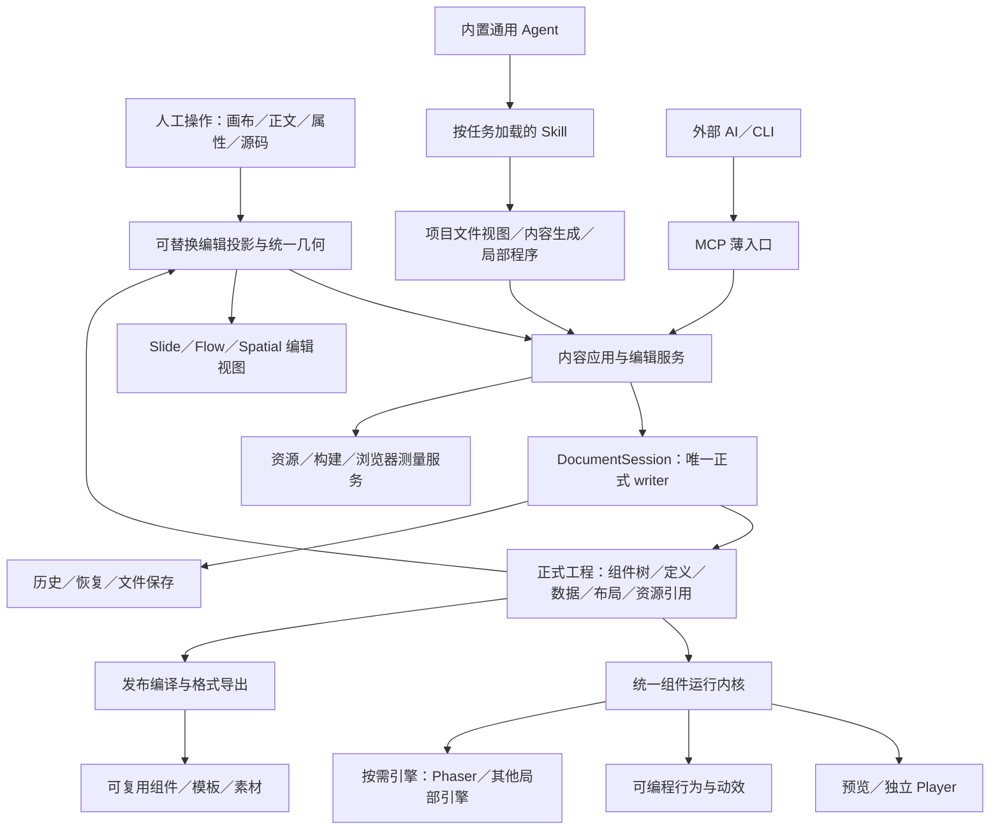
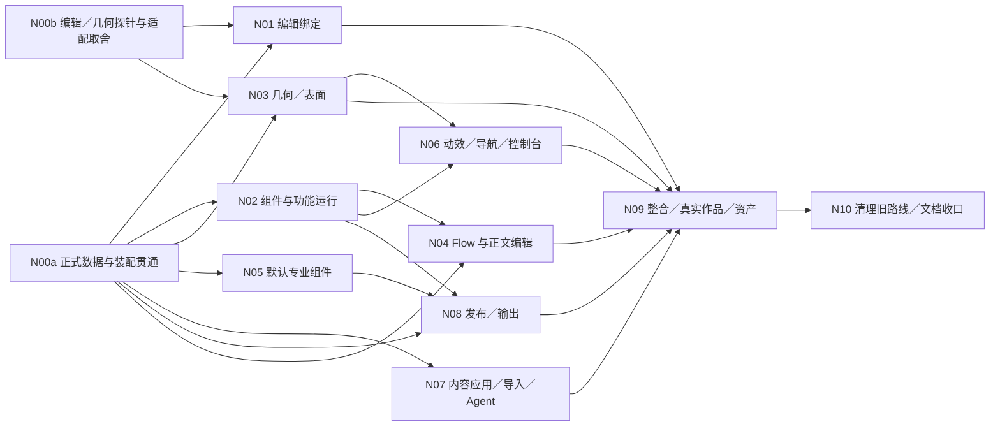

# 果铃统一组件架构与整体重构方案

> 日期：2026-10-04  
> 状态：当前目标总方案；开发入口已同步，执行级安排见[执行计划](EXECUTION_PLAN.md)。产品实施尚未因文档更新而启动，不代表新架构已通过验收。  
> 范围：通用 Agent 工作台中的内容创作、深度编辑、互动运行、资产沉淀及课件三表面；Office 等文档保留自己的原格式文档模型。  
> 决策依据：本会话 Owner 的最新决定。此前冻结、版本约束、实现路线和兼容要求可以被本方案替代；不为旧工程建设兼容分支。  
> 本次交付：按 Owner 后续确认同步 AGENTS.md、开发入口、架构合同和必要协议文字，并细化执行计划；不修改产品代码、实际任务状态或用户作品，不构建发行包。  
> 修订来源：Antigravity、Grok、dsh、muse、Kimi、Claude、space bunny 的评审输入及之后的 Owner 讨论；意见处理见 §24.4。评审中的执行命令不构成独立授权。
> 开发模型与调度：以[执行计划的模型表](EXECUTION_PLAN.md#model-routing)为唯一配置落点；启动使用[Luna 执行提示词](LUNA_EXECUTION_PROMPT.md)。主 Luna 只调度与转交，常规实现与集成用分级 Sol，固定 Astra xhigh 专家参与架构／高难问题，机械执行另交 Luna 子智能体。

## 目录

1. [目标、决定与证据边界](#s01)
2. [当前问题如何归并](#s02)
3. [统一设计语言](#s03)
4. [完整架构层级与职责](#s04)
5. [GrapesJS、Phaser 与其他基础库的取舍](#s05)
6. [组件模型：内容、专业节点与功能组件](#s06)
7. [原生能力如何成为可深改的默认组件](#s07)
8. [布局、坐标、三表面与画布比例](#s08)
9. [Flow 的深度互动](#s09)
10. [可编程行为、动效与导航](#s10)
11. [人工编辑与 AI 共编](#s11)
12. [Schema、Contract 与工程格式重写](#s12)
13. [正式写入、历史、保存与恢复](#s13)
14. [资源、构建、导入与诊断](#s14)
15. [Harness、Skill、能力与脚本](#s15)
16. [创作、导入、编辑工作流](#s16)
17. [组件库、模板与资产沉淀](#s17)
18. [预览、Player、发布与导出](#s18)
19. [通用工作台能力如何归位](#s19)
20. [模块组织与现有代码处置](#s20)
21. [按最高开发速度组织实施](#s21)
22. [验证、质量比较与完成标准](#s22)
23. [技术风险与原型收口项](#s23)
24. [依据、实施交接与文档维护](#s24)

<a id="s01"></a>
## 1. 目标、决定与证据边界

### 1.1 产品目标

果铃定位为通用 Agent 内容工作台。教育是首发场景，教学创作方法通过 Skill 加载，不进入通用 Agent 的固定人格或系统方法。课件编辑器的价值是让优质内容能够继续由人和 AI 深度编辑，并沉淀为可复用的组件、模板、素材及互动方法。

本轮重构的核心是：**模型表达内容、设计和交互，软件完成确定性的装配；内容与功能都进入同一组件体系，人和 AI 在同一正式作品上继续编辑。**

创作输入可以是普通 HTML/CSS、专业内容数据或局部程序源码。它们是表达作品的材料，不是要求模型理解本软件内部协议的理由。软件负责对象身份、引用、布局测量、资源包装、提交、保存和发布。

目标不是把一个成品 HTML 变成编辑器里不可拆的播放器，也不是要求模型重新学习一种比 HTML 表达力更弱的 DSL。目标是保留 Web 创作的视觉与互动上限，同时获得重型编辑器的可视化精修、专业数据编辑、正式工程管理和资产积累能力。

### 1.2 成功标准

| 维度 | 应达到的结果 |
|---|---|
| 创作质量 | 同模型、同提示词、相近生成条件下，果铃路径不弱于裸写 HTML；软件不引入排版、视觉或互动衰减 |
| 模型负担 | 不要求模型填写句柄、编号、登记表、fallback 清单、组件内部版本和机械几何参数 |
| 编辑价值 | 常规内容可点选、拖拽、缩放、改文案和专业参数；复杂程序可改源码、参数及可识别的局部内容 |
| 持续创作 | 策划、框架、资产、装配和精修在同一工程中推进，后续 AI 编辑保留人工调整 |
| 互动上限 | 可生成和改写功能组件的程序、状态机、时间线与轨迹，不受预置效果枚举限制 |
| 三表面 | 同一组件可用于演示、讲义或空间；布局和导航语义按表面保留 |
| 工程闭环 | 结果正确提交、保存、重开、运行并完成相应导出，不以“已经写了文件”代替完成 |
| 资产沉淀 | 优质作品能提炼为带数据、源码、资源和编辑能力的可复用资产 |
| 开发速度 | 收口最小共享接口后并行开发，避免串行重造已有可靠服务 |

“不弱于裸写 HTML”是相对质量目标。快速模型出现物理概念、空间推理或程序遗漏，要区分模型原始错误与软件加工造成的损失。软件工程闭环成功不能替代创作质量证明，模型知识错误也不能直接证明软件架构失败。

### 1.3 已确认决定、工程建议与当前事实

| 类别 | 内容 |
|---|---|
| Owner 已确认 | 整体重构；历史冻结可推翻；不考虑兼容；组件统一；功能与动效可改源码；模型专注创作；软件负责机械任务；以最高开发速度组织 |
| Owner 已确认 | 通用 Harness、按任务 Skill；规划和框架默认确认；明确自动推进时保留成果但不等待；导航可以深改控制台或独立实现 |
| Owner 已确认 | 接受 GrapesJS 可替换适配器定位；技术选择由主执行者决定，必须统一架构、避免混乱臃肿 |
| 本轮布局前提 | 教师／办公用户以自由布局编辑演示和空间对象；HTML/CSS 关系布局用于方便 AI 创作；Flow 延续既有阅读流方向，不改造成自由画布 |
| 技术决定 | 果铃独立 Schema 与正式 frame；编辑器为可丢弃投影；GrapesJS 按适配收益采用或降级；Phaser 仅作为可选局部引擎；复用可靠的 DocumentSession 与专业算法 |
| 技术决定 | 新工程、发布格式和组件 API 按成套 consumer 切换；目标采用 Project V10、Published V3、Component API 5，当前尚未实现 |
| 当前事实 | 应用仍有 V9／Published V2／Component API 4 及多个内容载体；GrapesJS 尚未集成进产品依赖和正式文档链路 |
| 当前事实 | 已完成 GrapesJS 0.23.6 隔离原型；只证明部分 Web 编辑与序列化能力，不能视为产品架构已交付 |

以上是本轮目标版本，实际支持仍以相应 Schema、producer、consumer 和行为证据为准。产品发行版本 `0.0.1` 与工程格式版本独立。

本轮把适配器、布局 owner、局部修改语义和 N00 路线写为工程决定，不把七份评审逐条改称“Owner 已确认”。旧稿中四种正式布局并列、GJS 结构影响正式 Schema 和先依赖 GJS 贯通的措辞由本稿替代。当前事实仍按已验证范围陈述。

### 1.4 不兼容的具体含义

新版本只承载新合同，不建设 V9→V10 转换器、双内核、旧新状态同步或长期兼容模式。旧作品原件、旧验证记录及已有发行物仍保留；不兼容不意味着删除用户文件。若后续有真实旧内容使用需求，可以作为普通外来内容重新导入，那属于新增需求，不暗中恢复兼容工程。

旧方案中的单 writer、资源归属和保存保护不因名称保留，也不因“大重构”自动删除：凡能防止实际错写、数据损坏或副作用重放的机制继续使用；无法对应当前正确性属性的门删除或降为诊断。

<a id="s02"></a>
## 2. 当前问题如何归并

### 2.1 根因不是“缺几个工具”，而是表达、执行和正式工程脱节

当前历史实现把原生、组合、Runtime、Component、Flow 正文及各表面的编辑能力分别组织。模型往往需要先判断载体，再学习其参数、限制和准入步骤，最后手工拼装。某条路径能显示，但没有完整编辑能力；某个局部程序能运行，却被另一路径的包装或占位资源卡住。

这种结构有三个直接后果：模型注意力离开创作；载体转换产生质量衰减；后续编辑不得不回到外部 HTML，编辑器与资产库因此被绕过。

统一方案把问题归到六个 owner：组件内容、布局编辑、功能运行、正式写入、内容应用、资产发布。不是把所有旧工具外面再包一层统一命名，而是让相同职责只保留一个实现落点。

### 2.2 已知问题与新版落点

| 已知问题或证据 | 新版处理 | 不采用的局部补丁 |
|---|---|---|
| 程序包装使用无效小 PNG，真实解码失败 | 一个共享的有效预览／占位资源 producer；真实渲染成功后更新捕获图 | 放宽图片解码；让模型手填 fallback；三个 producer 分别修同类常量 |
| Spatial 新旧节点分批排号造成重复顺序 | 正式父子关系与最终子项顺序由软件一次合成 | 要求 AI 猜 order 或补编号 |
| CSS／主题未参与尺寸测量，默认画布尺寸覆盖实际尺寸 | 同主题、资源和设计视口的真实浏览器测量，保存正确的布局事实 | 用更多 CSS 字符串规则猜矩形 |
| body 背景、内容背景与世界背景混淆 | 页面、组件、世界与视口背景明确归属 | 每个 surface 分别猜背景归属 |
| 已提交草稿被回报成可运行成功 | 提交状态、可用状态与交付状态分别返回，局部诊断可见 | 统一回复 applied；截断后只剩长路径 |
| HTML/CSS/JS 文件内容还需重新粘到 JSON 参数 | 按文件路径应用内容，共享文件读入、识别、构建和正式提交 | 每个 Skill 再写一套转义与封装脚本 |
| 导出需要过期目标句柄、目录创建失败 | 从正式文档捕获当前状态；合法目标目录由软件创建 | AI 维护最新 revision／targetId 或提前逐级 mkdir |
| Flow 扁平化容器、样式、SVG、表单，拒绝普通脚本 | 保留 Web 树与样式；动态区域作为程序组件承载 | 强迫全部 HTML 塞进旧正文白名单 |
| 变换后的对象不能稳定选取、拖动 | 统一 DOM／父级／世界／镜头的变换与逆变换 | 对所有变换对象禁用编辑 |
| Flow 区块在不同 consumer 中收展语义不同 | 同一组件实现与行为运行体系用于编辑、预览和 Player | 两端分别补一个收展按钮 |
| 翻页和空间切镜头直接跳变 | 导航事实与可编程视觉过渡分工，默认动效是可改源码的组件 | 扩展大量 scene.transition 枚举 |
| 内容创作成为一次整课手写和重导入 | 项目文件视图增量应用、阶段成果可见、局部组件编辑 | 只加更多提示词而不改变真实执行入口 |

### 2.3 证据使用的限制

此前创作上限测试中，保存、重开与可运行部分有有效证据，但程序组件准入存在失败。不能把外部独立 HTML 正常运行当成工程内组件已成功，也不能把可保存草稿称为最终可运行课件。

“观察导致空提交、revision 从 48 涨到 64”的猜测已撤回：记录对应真实编辑操作，不能据此另起历史系统重构。PowerShell 参数引用、测试工具的不可见目标点击及启动等待，也不能自动升级为产品缺陷。

本轮优先切换正确 owner。将被删除的旧路径不先逐条补到完美；会复用的资源、事务、文件与编译服务中的真实错误，需要在新版 consumer 接入时消除。

<a id="s03"></a>
## 3. 统一设计语言

### 3.1 统一术语

| 术语 | 本方案含义 |
|---|---|
| 工作空间 | 文件、会话、资源与任务所在的用户工作范围 |
| 文档／工程 | 正式作品及其作者数据；课件、Markdown、Office 各有文档驱动 |
| 表面 Surface | 作品的组织与浏览语义：Slide、Flow、Spatial |
| 组件定义 Definition | 某种内容或功能的专业数据规则、源码、编辑与输出适配 |
| 组件实例 Instance | 工程中一次具体使用，拥有软件维护的身份、数据、布局与绑定 |
| 专业数据 Data | 文字、路径、图表系列、表格单元格、裁切参数、公式等可编辑内容 |
| 实现 Implementation | 如何显示、互动、响应数据及生命周期的代码和样式 |
| 功能组件 | 可无可见外观，挂在内容／范围／页面／工程上提供行为或动效的组件 |
| 布局 Layout | 内容之间的持久位置、关系、尺寸与约束，区别于观察缩放及动画帧 |
| 正式状态 | 软件提交并纳入历史、保存和恢复的作者状态 |
| 运行状态 | 学生答题、收展、模拟进度、动画位置等临时状态 |
| 项目文件视图 | 正式工程提供给 AI／源码编辑者的当前可编辑内容投影 |
| 应用 Apply | 软件将内容变化识别、装配并提交到正式工程的操作 |
| 发布物 Published | 从工程生成的运行数据、组件实现和资源，不含编辑器及供应商凭据 |
| 能力 Capability | 软件实际提供的确定性服务，如应用文件、测量、导入、导出、观察 |
| Skill | 任务方法、阶段、质量准则、示例和少量执行入口的按需包 |
| 脚本／命令 | 对软件能力的薄调用入口，不拥有另一套内容真相或导入规则 |

### 3.2 “一切皆组件”的适用范围

作者可独立编辑、复用或赋予行为的内容，都进入组件体系。文字框、图片、形状、图表、容器、实验、控制台、弹窗、镜头过渡、文字动画均可用同一套定义与实例管理。

这不要求每个字符、每个 SVG 控制点、每个表格单元格都创建独立脚本进程。它们是专业组件内可寻址的数据。行内选区、单元格或路径点可以成为功能组件的挂载目标，但不需要变成一万个 DOM 组件。

文件服务、事务内核、Provider Secret、权限与操作系统服务属于基础设施，不因为口号被改造成作品组件。Office 文档也不为了统一名称被转换成 Web 树。

### 3.3 用户界面的统一语言

用户看到文字、图片、形状、组件、页面、讲义和空间等熟悉对象。内部统一组件后，不要求界面将所有文字改称“组件实例”，也不增加专业术语负担。

常用操作是“编辑内容”“调整样式”“添加互动”“修改实现”“提炼为资产”。高级源码入口与普通属性入口操作同一对象；复杂程度按需展开。

组件来源分为默认内置、资源库、外来／自定义，用于说明出处及更新关系，不构成三套执行器、三种编辑质量等级或默认权限等级。

<a id="s04"></a>
## 4. 完整架构层级与职责

### 4.1 架构总图



所有输入经内容应用／编辑服务进入 DocumentSession，再从正式数据派生编辑投影和运行投影。编辑器不是正式模型的上游数据库，DocumentSession 也不是挂在某一编辑器末端的附加保存器。GrapesJS、ProseMirror 或薄手势库都只能实现相应投影与输入端口。

### 4.2 各层的唯一职责

| 层 | 负责 | 不负责 |
|---|---|---|
| 通用 Agent／Harness | 对话、任务上下文、文件操作、工具执行、观察、长程推进与停止 | 固定教学方法、组件登记、坐标装配、供应商凭据下发 |
| Skill | 教学／办公等专业方法，阶段成果，必要质量检查与示例 | 复制导入实现，代写身份和版本，新增独立 writer |
| 内容应用层 | 接收普通内容／局部修改，识别对象，装配资源，形成正式编辑操作 | 自己保存第二份工程；让 AI 调用底层接口序列 |
| 文档内核 | 正式状态、事务、历史、保存、恢复、身份与最终一致性 | 浏览器排版、模型推理、实时动画帧 |
| 组件内核 | 定义与实例、专业数据、实现、挂载、编辑与输出适配 | 三套按来源区分的 Runtime；全局任意 DOM 猜测 |
| 布局与表面 | 自由布局、流式排版、世界／镜头，坐标映射与命中 | 教学策略；覆盖局部组件内部布局 |
| 编辑投影适配 | 可编辑视图、文本输入、样式编辑与局部事件转换；几何手势统一委托果铃几何层 | 正式存储、独立历史、全局镜头事实、资源闭包 |
| 行为运行 | 状态、事件、目标、临时表现、可取消动效与组件生命周期 | 逐帧改正式工程；独占导航和镜头事实 |
| 资源与编译 | 文件摄取、实际资源处理、构建、程序运行准备和诊断 | 把可用输入因格式偏好整份拒绝 |
| 发布与资产 | 精简运行投影、格式导出、复用依赖和资产提炼 | 以截图替代本应保留的专业数据；携带长期凭据 |

### 4.3 模型与软件的具体分工

| 任务 | 模型表达 | 软件执行 |
|---|---|---|
| 生成页面 | 文案、普通 HTML/CSS、内容结构与视觉层级 | 识别组件、生成身份、浏览器排版、装配进工程 |
| 插入图表 | 数据、图表语义、配色与讲解 | 校验真实数据形状、渲染、专业属性编辑与导出 |
| 生成实验 | 实验逻辑、UI、必要算法和源码 | 模块构建、资源绑定、生命周期、状态接口和实例持有 |
| 自定义动效 | 时间线、轨迹、算法及取消逻辑 | 目标解析、帧调度、表现层、清理及镜头／导航服务 |
| 局部精修 | 选区内文字、样式、参数或实现修改 | 绑定当前目标、保留其他变化、事务与撤销 |
| 资源积累 | 哪些设计值得复用、可变内容与合理默认值 | 收集实际依赖、去除实例绑定、生成包和预览 |
| 保存导出 | 用户要求的文件名／格式与结果目标 | 当前状态捕获、目录创建、落盘、回执与打开入口 |

软件不替模型决定未知的教学意图。遇到“整体改成更高级”的开放创作请求，模型仍需作出设计选择；遇到“自动编号、补框、登记资源”的确定性工作，软件承担。

<a id="s05"></a>
## 5. GrapesJS、Phaser 与其他基础库的取舍

### 5.1 推荐路线

采用 **果铃正式组件模型 + 共享 DOM／专业运行实现 + 表面策略 + 可替换编辑适配**。React 工作台、已有 ProseMirror、专业图表／公式／图片处理算法继续复用。GrapesJS 是可选 Web 编辑适配，不是工程格式、三表面、Player 或组件运行内核的基础依赖。

主编辑几何由果铃持有，可使用 Moveable 等薄手势库提供输入能力。Phaser 在新几何接管相应 consumer 时退出主编辑路线，保留为游戏／模拟组件的按需引擎。主编辑器不再以游戏引擎或 GJS 拖拽状态作为正式坐标。

### 5.2 表面与适配边界

| 区域 | 内容／编辑基础 | 正式布局 owner | GrapesJS 的可用范围 |
|---|---|---|---|
| Slide | DOM/SVG 默认组件、专业文本编辑、薄几何手势 | 果铃 frame、组内局部坐标与子项顺序 | 按需用于 Web 内容内部的样式、文字、结构编辑；不控制页级 frame |
| Flow | 一个正文编辑会话，结构化阅读顺序和组件块 | Flow 文档顺序、行内范围与块尺寸策略 | 仅适用的局部 Web 内容；不接管全文和撤销 |
| Spatial | 自有世界容器与视口变换、共享组件 renderer | 果铃世界坐标、编组、镜头与路径 | 按需编辑选定卡片内部；不承载无限世界 |
| 独立程序组件 | 组件内部 DOM／Canvas／Phaser 等 | 外框由所在表面持有，内部由组件实现持有 | 仅有实际收益时使用，不要求嵌套 GJS |
| Player | 共享有效组件实现与表面运行策略 | 同一正式布局数据 | 不加载 GrapesJS |

Web 渲染贴近模型的表达和现有 DOM/SVG 内容，但不等于必须采用某一整套网页编辑器。GJS 的结构、样式和富文本视图是否节省工作量，由同一输入样本的实际绑定成本决定。不能为保留库而复制几何、历史或专业数据 owner。

### 5.3 开源核心与商业 SDK 的边界

本方案不依赖商业 Studio SDK。GrapesJS 开源核心许可为 BSD-3-Clause，实施时保留相应许可声明。[核心许可](https://raw.githubusercontent.com/GrapesJS/grapesjs/dev/packages/core/LICENSE)。

商业 SDK 的 Absolute Mode、React 自定义 renderer 等成品插件不能记作开源核心已具备的完整能力。核心的绝对拖拽能力也不等于完整的自由画布、旋转编组和无界空间编辑器。本轮自行补足实际需要的部分，不引入采购前置。[商业 Absolute Mode](https://app.grapesjs.com/docs-sdk/plugins/canvas/absolute-mode)、[核心 Component API](https://grapesjs.com/docs/api/component.html)。

### 5.4 独立正式模型与可丢弃编辑投影

**正式 Project Schema 由果铃定义；GrapesJS JSON 不作为正式存储，也不决定正式节点的字段形状。**工程根独立保存表面组织、实例、定义、专业数据、frame、行为及资源。作者 Web 子树只使用内容所需的标签／属性／子内容结构，不继承 GJS 运行对象或编辑器元数据。

编辑器存在一棵可丢弃的内存投影是允许的；必须禁止的是两份可独立保存、竞争写入的正式语义。GJS adapter 显式完成“正式节点 → 编辑投影”“编辑事件 → 语义局部操作”“ACK／外部修改 → 局部投影更新”，不在每次保存时用 `getProjectData()` 覆盖正式工程，也不靠全量重新导入 HTML 同步。

GrapesJS 文档建议用其项目 JSON 恢复完整的 GJS 项目，这是该编辑器自身的存储合同；果铃只将选定内容投影给它，并不把整个工程交给该存储模型。[GJS 项目存储](https://grapesjs.com/docs/modules/Storage.html)。不能据此推断 GJS 无法局部适配，也不能把它的独立项目往返实验当作果铃保存证明。

专业组件的绘制子树是派生视图，普通 Web 容器的作者子树才是内容。adapter 不从绘制结果反向制造一份专业数据。Definition、Instance、Implementation 是正式模型内不同职责的数据，不是三套独立 writer。

### 5.5 正式历史绑定

关闭 GrapesJS 的独立 localStorage 保存与永久 Undo owner。编辑事件形成 §13.2 的局部操作，经 DocumentSession 提交；ACK 只确认／校正原投影，不能生成第二次提交或撤销项。运行帧与选区变化不进入历史。

人工修改和 AI 修改只要已提交正式工程，都按照同一文档历史支持撤销。不可撤销的是重复 ACK 回显，不是 AI 修改本身；不能把“外部回显不入栈”实现成用户无法撤销 AI 编辑。

GrapesJS 的 Undo Manager 支持停止／跳过自身追踪，可用作绑定工具，但不证明与正式历史的集成已经完成。[Undo Manager API](https://grapesjs.com/docs/api/undo_manager.html)。

### 5.6 Phaser 的保留理由

游戏循环、物理、粒子、精灵及高频模拟可继续使用 Phaser。实例的外框、数据、资源、启动／暂停／销毁仍由统一组件内核持有，Phaser 只管理组件内部世界。局部引擎按组件依赖加载，普通文字图片页面无需加载它。[Phaser 官方文档](https://docs.phaser.io/)。

无需为了统一把所有游戏重写成 DOM，也无需为了保留 Phaser 再让它负责所有内容的选取和拖动。导出的运行物只带使用到的引擎。

### 5.7 已完成原型的证据

隔离原型使用 GrapesJS 0.23.6，验证了 grid、CSS 变量、富文本、SVG、自定义形状源码修改和项目 JSON 保存重载。根内容测量转自由框后矩形保持；原生鼠标拖动标题约 70×55 px，邻近卡片不动；双击标题输入文字并保存重载后，原有 `<em>` 格式、实例身份和形状数据仍在。

原型首次默认拖拽把行内 `<em>` 从标题中拉出。调整对象编辑粒度并启用 absolute drag 后修正。这说明必须明确“可编辑对象”与“组件内部内容”的粒度，不能将默认行为直接用于产品。

行为源码在该原型中只是保存的元数据，未执行。DocumentSession、Player、无限画布、旋转编组、中文输入法、资源闭包、导出及任意 HTML 保真均未通过此原型验证。[原型证据](../../../output/architecture-spike/grapesjs-20261004/evidence.json)、[原型页面](../../../output/architecture-spike/grapesjs-20261004/index.html)。这些位于本机 output，可能不随仓库分发；实施收口时应把必要结论留在正式记录中。

### 5.8 iframe 分支与退出条件

GJS 默认画布使用 iframe，官方提供 `getFrameEl`／`getDocument`；其 `infiniteCanvas` 配置标为实验性。这些是库事实，不证明果铃的工具条、焦点、截图和世界几何已经可用。[Canvas API](https://grapesjs.com/docs/api/canvas.html)、[Canvas 配置源码](https://raw.githubusercontent.com/GrapesJS/grapesjs/dev/packages/core/src/canvas/config/config.ts)。

本轮不把“改造成同文档 GJS 画布”设为任务。需要其视图时先按真实 iframe 接入，并在 N00b 验证：目标绑定、选框／AI 卡坐标、焦点与快捷键让路、IME、截图区域、局部 ACK。无法以窄 adapter 保持这些行为时，移除该区域的 GJS view，使用同文档专业／Web 视图。不能将 iframe 的实际边界藏到 N04/N06 才处理。

| 观察结果 | 处理决定 |
|---|---|
| 单个坐标偏移、事件归属等可在一个明确 adapter 内修好 | 修适配并验证该属性，继续使用 |
| 基础拖拽不足以支撑旋转编组 | 由果铃几何／薄手势层承担，不改正式模型；这本来就是职责分工 |
| 文字／样式编辑收益明确，但整页视图导致反复重挂载或 IME 破坏 | 降级为局部编辑；页面由共享 DOM renderer 显示 |
| 必须依赖 GJS 项目存储、第二套历史、全页重载，或修改 GJS 核心才能保持正式编辑语义 | 放弃该编辑适配，采用自有数据投影和薄手势层 |
| 解析／局部面板也没有减少实际实现成本 | 不引入 GrapesJS 产品依赖，保留既有可用基础与必要解析库 |

N00b 用同一卡片／旋转组做一个有界对比：GJS 适配与既有 WebComposition 基础加 Moveable／Selecto 薄手势。后两者提供拖动、变换或框选能力，不替果铃保存坐标、历史与身份；这是候选组合，不是已经验证的完整编辑器。[Moveable](https://github.com/daybrush/moveable)、[Selecto](https://github.com/daybrush/selecto)。判断依据是目标行为、需要新增的同步逻辑和真实适配改动，不预设半天完成或凭库宣传定输赢。

《独立讨论方案》曾建议不整体引入 GJS，本稿据此把 Web 编辑与特定库分开：可以选用局部能力，也可以完全不选用。任一选择都不改变工程、装配、Player 和资产格式；不以退回主 Phaser 几何链作为默认后路。

<a id="s06"></a>
## 6. 组件模型：内容、专业节点与功能组件

### 6.1 一个组件体系，允许不同专业表达

统一的是身份、实例、依赖、生命周期、编辑、行为和输出合同，不是把所有数据压成 `props: any`。文本、图像、路径、表格、图表、程序有不同的数据类型，定义提供相应的 Schema 与适配。

普通 Web 内容保留标签、属性、子节点和样式规则。专业图表保存系列、坐标轴及配色等数据；专业形状保存路径与控制点；程序保存必要源码与参数。组件内核不强迫这些内容先扁平化为截图或通用字符串。

### 6.2 定义、实例、实现和派生视图

| 对象 | 持有内容 | 保存规则 |
|---|---|---|
| 定义 | 数据类型、默认实现、编辑适配、输出适配、必要宿主端口 | 工程内私有定义或可复用库定义 |
| 实例 | 数据、布局、定义引用、子内容、功能挂载与用户配置 | 工程正式状态 |
| 实现 | 源码、样式、模块依赖与引擎要求 | 源码正式保存；构建结果可重建 |
| 视图 | DOM/SVG/Canvas、计算样式、bounds、命中结果 | 运行派生；不作为第二份作者内容 |
| 运行状态 | 答案、展开状态、模拟进度、动画帧 | 默认临时；确需学习记录时另有明确服务 |
| 预览资源 | 真实捕获图或软件有效占位 | 资源保存，明确真实图／占位身份 |

专业数据生成的内部绘制元素默认不进入普通树拖拽。可寻址部位通过编辑适配暴露，例如路径点、表格格子和图表系列。容器中的作者子节点则正常进入树操作。

### 6.3 建议的数据轮廓

以下是结构说明，不是已实现的最终 TypeScript 或需要 AI 手填的 JSON。正式类型应在 N00 中结合可运行样本收口。

```ts
type ComponentRole = 'content' | 'behavior' | 'mixed';

interface ComponentDefinition<Data> {
  key: string;                       // 软件维护
  role: ComponentRole;
  dataSchema: DataSchema<Data>;
  implementation: SourceModuleRef;
  editor?: EditorAdapterRef;
  outputs?: OutputAdapterRefs;
  requirements?: HostPortRequirements;
}

interface ComponentInstance<Data> {
  id: string;                        // 软件维护
  definition: DefinitionRef;
  data: Data;
  layout?: Placement;
  children?: AuthorChildTree;         // 仅作者子内容，不包含实现生成的 DOM
  attachments?: BehaviorBinding[];
  implementationOverride?:
    | { kind: 'patch'; base: DefinitionRevisionRef; patch: ImplementationPatchRef }
    | { kind: 'custom'; source: SourceModuleRef };
}

type ProfessionalData =
  | TextDocumentData
  | ImageData
  | ShapeData
  | TableData
  | ChartData
  | FormulaData
  | InputData
  | WebAuthorTreeData
  | ProgramParameters;
```

这些是果铃自有节点字段，不是 GJS component 的扩展属性。实例只拥有一份数据和一份父子关系；专业数据生成的绘制子树不存入 `children`。普通 Web 内容的作者子树若保存在其内容字段，类型就不得再同时保存另一份等价 `children`。具体有序树／索引布局由 N00a 的真实操作验证，但此单一归属不留作自由选择。

定义和资源可以独立共享索引。扩展组件的数据按自己的 Schema 解析，不让不透明对象侵入布局、保存和导航。源码引用与产物缓存分开：正文／实现的作者源可恢复，缓存不是正式内容。

未定制实例共享预置默认实现，无每实例转译、构建或 iframe。改变数据、样式或加行为不自动复制默认源码。局部实现 patch 必须绑定工程保存的确定基础版本；基础源码可从工程依赖恢复，不能依赖联网取得库的最新版本。明确重写可保存完整源码，不强制生成脆弱的文本 diff。

### 6.4 功能组件的挂载位置

挂载目标可以是文本范围、段落、区块、对象、编组、页面、表面或整个工程。目标引用、范围映射及节点身份由软件维护。模型使用“当前选中段落”“这个按钮”“答案区”等当前上下文或内容结构表达目标，不抄内部编号。

库组件可以定义有意义的输入角色，例如 trigger、answer、diagram。软件根据插入上下文和结构绑定；出现真实歧义时才询问具体目标，不能在每次使用前要求模型填写目标登记表。

功能组件自身可无几何外框。混合组件可以同时生成提示控件并控制目标。二者使用同一模块加载和生命周期，不新增“行为 Runtime”与“内容 Runtime”两套系统。

### 6.5 通信原则

组件通过局部数据、事件、命名状态和宿主端口通信。独立运行区域通过统一桥接端口参与，普通同文档组件可以直接走内存调用。组件不依赖全局 Zustand Store、renderer DOM 选择器或原始 Electron main。

组件自己管理内部 UI 状态；共享状态由宿主提供作用域和订阅。只有确需联动的值提升到页面／课程作用域，避免将所有局部变量登记进全局状态平台。

### 6.6 渲染与执行边界

默认专业组件和普通 Web 容器共享 DOM／运行实现，不为每个文字框或行为创建 iframe。软件序列化专业数据与作者子树，编辑 adapter 只投影相关部分，不将绘制结果重新保存成作者节点。AI 自定义模块按 §14.4 的运行权限边界加载，不能因默认组件有同文档快路径就自动获得工作台上下文。

需要完整网页环境、相互冲突样式或独立程序生命周期的区域，可以使用独立运行容器，端口通过桥接保持相同语义。Phaser／Canvas 等局部引擎在这样的组件内部运行。隔离粒度按真实内容边界决定，不因来源名称统一强制，也不为可信普通组件额外建设进程平台。

主题样式由工程拥有；作者 Web 样式保留真实作用范围；专业组件实现的内部样式由其视图拥有。独立外来程序保留必要的原页面样式环境。不能简单给全部选择器加前缀并假定脚本查询仍然正确，也不能让一个深改组件的样式静默污染整份讲义。

同文档 renderer、GJS iframe、独立运行容器使用一份端口合同和一份组件实现，仅传输、目标定位、资源 URL 与生命周期接线有宿主 adapter。共享事件／状态／动效逻辑不复制三遍。N00／N02 首先证明同一行为在编辑预览与 Player 生效；确实出现跨容器 consumer 时再扩桥接，不预做全部组合。

### 6.7 全局组件、表面图层与顺序

教师控制台等可见组件支持工程级挂载，页面／表面内容支持相应局部挂载。挂载范围决定实例的生命周期和状态归属；布局决定位置，层级决定绘制顺序，三者不是同一个字段。

全局与局部组件使用相同定义、编辑和运行能力。软件维护容器内最终顺序以及明确的全局／表面叠放关系，模型不填写 zIndex 登记表。弹窗、提示及选取工具属于各自的临时表现／编辑层，不通过修改正式作者顺序获得置顶。

全局控制台切表面时不重复创建。表面局部组件离开时按自己的状态保持策略处理，不能因全局／局部投影各有一份而双重执行事件。

<a id="s07"></a>
## 7. 原生能力如何成为可深改的默认组件

### 7.1 原生节点的定位

“原生”表示软件默认提供高质量的专业实现和编辑适配，不再表示一条无法改源码的独立载体。文字、图片、形状等是默认组件，保留专业数据编辑与语义导出优势。

| 默认组件 | 保留的专业能力 | AI 深度修改的入口 |
|---|---|---|
| 文字 | 富文本、字体、段落、行内范围、公式与中文输入 | 排版实现、局部文字效果、范围行为与源码样式 |
| 图片 | 原资源、裁切、fit、透明度、滤镜、遮罩、局部素材替换 | 显示实现、SVG／CSS 效果，实际支持的像素处理或图像连接 |
| 形状 | 路径、点、填充、描边、几何属性 | SVG 绘制实现、形变算法、动态路径和交互 |
| 表格 | 单元格、合并、行列、内容与格式 | 呈现与交互实现，保留可输出的数据 |
| 图表 | 真实数据、系列、坐标轴、图例与标注 | 自定义绘制、讲解层、数据互动与动画 |
| 公式 | 原公式、渲染参数与专业输入 | 展示样式、步骤分解、局部交互 |
| 输入与选择 | 题干、选项、答案规则、反馈文案 | 自定义反馈、联动状态机、视觉实现 |
| 容器／编组 | 作者子内容、布局与整体编辑 | Web 布局、背景、边框、局部功能与实现 |

图片像素级改图和生成新图需要真实处理能力，不能用“改源码”宣称凭空获得图像模型。软件已有处理可直接使用，模型生成／编辑仍走已配置且可用的连接。

### 7.2 就地改造，而不是重建替换

选中一个形状要求“变成可拖动的液滴”，优先调整数据、样式与附加行为；确需新绘制算法时改该实例的实现。软件保留身份、外框、层级、资源关系及人工调整。只有实际定制源码才产生私有实现，不因一次改色复制一份默认模块。

共享库定义不能因一次局部请求被静默改写。默认使用实例私有覆盖或软件自动派生定义；只有明确选择“更新同类实例”或“更新库组件”时才扩大范围。无需让 AI 手动创建新版本、复制所有参数或删除旧对象。

改实现与改数据是两个明确入口，但都写到同一个实例。改实现后，数据仍由实现读取；普通属性修改不会把它悄悄恢复成默认实现。

“替换实现”属于明确的操作语义，不是每次都新增用户确认弹窗：用户已要求深改并授权自动推进时直接执行；普通局部文案修改不得偷偷替换整份实现。界面展示“已定制”及被源码接管的专业属性，并提供“恢复默认实现”：保留数据、frame 与人工布局，只移除实现覆盖。运行状态重置或专业数据不再可解释时如实反馈。

### 7.3 深改后专业能力的真实边界

自定义实现若继续遵循该组件的专业数据和编辑适配，专业工具保持可用。若用户主动将图表改成任意 Canvas 程序、绕开原系列数据，软件应保留源码并说明哪些原专业工具或输出语义已不适用。

不以保持所有属性面板为由禁止深改，也不承诺任意重写后所有原控件仍正确。能力变化以实际 adapter 为准，局部工具可以隐藏或提供重新绑定入口；未改对象不受影响。

### 7.4 默认实现同时具备三类能力

默认组件的交付包含显示实现、编辑适配和输出适配。显示正常但无法专业编辑的实现不称为完整默认原生能力；输出端只能截图而源数据完整存在时，应优先完善相应语义 adapter。

外来程序的诚实底线是源码和参数编辑。自动识别文字、图片可提供快捷修改，但不能据此承诺任何 Canvas／WebGL 画面都能反向拆解为专业节点。

<a id="s08"></a>
## 8. 布局、坐标、三表面与画布比例

### 8.1 保留坐标，重构其职责

正式布局只有两类：**坐标自由布局**与**阅读顺序流**。Slide 和 Spatial 共用自由几何，Spatial 另外持有世界与镜头语义；Flow 延续现有阅读流，正文及图片、卡片、模拟默认是随文内容。行内内容是正文组成部分，world 是坐标域，二者不再各建一套并列布局引擎。

HTML/CSS、grid、flex 和响应式写法方便 AI 表达初稿。在 Slide／Spatial 装配边界，浏览器按指定设计尺寸测量并生成自由对象；不建立持续支配页面对象的自动布局或断点体系。组件内部保留实际需要的 CSS／程序排版，编辑器管理它的外框。

“冻结”只发生在选定的可编辑对象／容器外边界。文字在框内换行，卡片内可以自动排版，实验内部可自由拖动。需要独立摆放的卡片子对象转为组内局部 frame；纯内部排版不再和页面几何争抢同一字段。模型不承担页面坐标簿记；组件内部的 SVG 路径、模拟坐标等真实创作代码仍可自由表达。

### 8.2 布局的单一归属

| 区域 | 正式保存 | 计算所得 |
|---|---|---|
| Slide／Spatial 自由对象 | 父级局部 frame、编组关系、子项顺序；空间另存镜头点与路径 | 屏幕矩形、选框、DOM 外框样式 |
| Flow 正文与随文块 | 阅读顺序、正文／范围、块宽高策略及对齐 | 行盒、块位置、文档高度、滚动锚点 |
| 组件内部 | 自己的专业数据／Web 子树／样式／程序 | 内部布局与绘制结果，不能回写所在页面的位置 |

正式 frame 独立于 CSS 存储，至少一等表达 x/y、宽高、旋转、变换原点与组内局部坐标。顺序和归属由父容器的有序关系拥有，不同时保存可独立竞争的 order/zIndex。需要保真的附加二维仿射信息在 geometry 合同内表达，不能只用旋转后轴对齐包围盒代替真实几何。

renderer 从 frame 派生外框 CSS，编辑 adapter 不回存这份派生 CSS。作者内容样式只拥有内部表现；收到与正式外框冲突的 left/top/transform 时按 §13.6 的修改意图处理，不能以 CSS 优先覆盖人工位置。工程格式不引入 page-level free↔auto 切换，因此无需维护两套持续布局的迁移状态机。

| 内容尺寸策略 | 行为 |
|---|---|
| 普通文字框 `grow-height` | 宽度与左上位置不变，文字换行后向下增长；保留用户明确的最小高度 |
| 显式固定框 `fixed` | 保留用户设置的尺寸，溢出报告；是否裁切由可见 overflow 设置决定 |
| 明确选择 `shrink-text` | 在用户选择的范围内缩字以适配，不能作为软件静默默认 |
| 程序／图表／卡片 | 默认保留外框；仅组件声明并被选用的自适应高度影响自己的框 |

自由对象增长可以形成重叠，软件不自动推开邻居。Flow 随文块增长或收展则自然推移后续阅读内容，这是阅读流语义，不是覆盖人工自由坐标。局部必要测量只更新该对象允许变化的尺寸，与整页重装配严格区分。

背景分为世界、页面、组件和视口外壳；内容背景不能因 body 默认色被覆盖。局部动效使用临时表现层，不改布局拥有的正式变换。

### 8.3 HTML 初次装配为自由布局

新建自由页面／空间编组，以及明确要求整页重做时执行：

1. 使用页面设计宽高或插入编组的设计尺寸，不能以编辑器窗口宽度代替；同步真实主题、字体与素材。
2. 等影响几何的字体加载、图片解码得到明确结果；缺失资源诊断并保留草稿，不无限等待。代表性保真验收使用完整资源。
3. 按人类可指认对象选择装配粒度，一次采集边界、实际样式和变换后再统一改写，避免边测边改造成后续坐标漂移。
4. 生成软件维护的身份、父子关系、局部 frame、顺序与专业内容。外层原 CSS 排版退出位置控制；装饰、内部样式和程序保留。
5. 应用为一次正式装配结果，保留必要原稿以便明确重做。原稿不是持续参与排版的第二个正式页面。
6. 后续局部文字、样式、资源和源码修改走对应对象操作，不再次运行整页装配。

不要求模型加标记或模板。图像、遮罩、渐变、SVG 和继承字体等真实视觉要素随相应对象保留；不能只留下矩形与纯文本就声称保真。强脚本耦合或无法可靠拆分的内容保留为源程序组件，明确其编辑粒度。

`getBoundingClientRect` 只能给出屏幕轴对齐矩形，不能独自恢复旋转、斜切和嵌套变换。非平凡变换必须使用完整矩阵及父级坐标关系；首轮只承诺实际支持的二维变换，不为普通内容增加全局拒绝门。[CSSOM View](https://www.w3.org/TR/cssom-view/)、[CSS Transforms](https://www.w3.org/TR/css-transforms-1/)。

### 8.4 三表面共享与差异

| 表面 | 组织语义 | 默认布局 | 导航与编辑 |
|---|---|---|---|
| Slide 演示 | 页面／场景，页面内步骤 | 固定设计尺寸的自由对象与编组 | 页切换、步骤、对象拖拽与缩放 |
| Flow 讲义 | 连续文档、章节／锚点、阅读顺序 | 正文、图片、卡片、模拟默认随文；保留所需文档列宽规则 | 拖块重排、滚动、展开、跳转、行内互动与正文编辑 |
| Spatial 空间 | 世界对象、镜头／路径／停靠点 | 世界中的自由对象与编组 | 平移缩放、切镜头、世界对象编辑 |

同一专业组件与功能组件可以出现在任一表面。表面是布局和浏览策略，不是三套内容类型、三套互动协议或三套保存格式。

混合课程持有表面条目及统一导航位置。组件不会因为表面切换被无条件重新初始化；是否暂停、保持还是重置由生命周期与作者策略决定。

### 8.5 设计尺寸、窗口适配与比例修改

设计尺寸、应用窗口适配和编辑观察缩放必须分开：

- Slide：保存设计宽高；改变窗口只改变显示 fit。改变设计比例是明确画布编辑，选择保持原尺寸／整体等比缩放或重做布局，不自动重排。
- Flow：文档列宽和阅读规则决定排版，纵向高度来自内容；这一原有阅读属性不扩展为 Slide 的响应式页面模式。
- Spatial：世界范围可增长；窗口是观察视口，镜头与对象坐标不因窗口大小改变。
- 组件内部：可以适配自己外框尺寸，但不能通过内部媒体查询控制所在页面的邻居位置。

默认比例只是新建建议，不是导入硬限制。宽高、比例、主题和表面选择进入策划及当前工程配置；软件不可无依据地将任意内容归成 1280×720。

### 8.6 自由编辑几何

命中、选框、拖动和缩放共享一套转换：组件局部 → 父级 → 页面／世界 → 镜头 → 编辑视口 → 屏幕。指针变化经逆变换回写拥有该 frame 的坐标空间。

旋转编组的缩放不能只改屏幕包围盒；锚点、容器边界、裁切和 world zoom 也不能各自另算一套。自由变换由一个 geometry owner 实现，普通对象、专业节点和程序外框都使用它。

自由编辑须包含多选、编组／解除编组、对齐、分布、吸附、参考线、层级、复制、图片等比缩放以及一次手势一次撤销。薄手势库只产生输入，果铃几何层计算并提交 frame，不能与 GJS absolute drag 各写一份位置。

Flow 拖动随文块表达阅读顺序调整，不转换成绝对定位；显式锚定浮动仅作为实际需要时的高级能力，不是首轮前置。组件内部排版与页面编组互转必须是明确“展开为可编辑组”等操作，软件做一次转换并切换 owner，不在普通拖动中暗中转换。

### 8.7 空间性能

静态内容可按视口裁剪／按需挂载。正在运行的模拟、共享状态提供者或被镜头过渡引用的组件不能因离屏就丢失状态。暂停与卸载由生命周期明确区分。

空间采用果铃自己的视口和世界变换容器，组件挂到世界中；不依赖 GJS 实验性 infinite canvas，也不为每张卡片常驻一套 GJS。N00b 的旋转组探针前置，N03 再以代表性大世界验证命中、缩放和生命周期；只有实际瓶颈出现才扩大虚拟化。

### 8.8 装配粒度、落位与诊断

| 输入内容 | 默认装配结果 |
|---|---|
| 可分别编辑的卡片内容 | 一个编组，标题／正文为文字框，图片保持图片 |
| 强调、链接、行内公式 | 留在文字框／正文内部，不拆成独立拖动对象 |
| 纯装饰 | 父对象的样式或组件内部绘制，不制造大量无意义节点 |
| 图表、模拟、游戏 | 带可编辑外框的专业／程序组件，内部不强行拆为页面对象 |
| 耦合紧密的整页程序 | 一个保真可移动组件，保留源程序与参数 |

新增自由内容按新编组落位，软件根据实际目标容器与空位放置，不移动原对象；无足够空位时保留新内容并明确溢出／重叠，不能偷偷缩小旧内容。Flow 新块插入指定阅读位置，后文自然顺延。资产以整体插入，必要时按目标范围等比缩放，不按新容器重新排版内部设计。

observe 提供内容溢出、画布越界和相关对象相交的定位信息；装饰、遮罩、父子包含和有意叠放不能统称错误。诊断不阻断保存，不自动推开对象。局部编辑后检查变更对象及受影响区域即可，不每次扫描全课。

<a id="s09"></a>
## 9. Flow 的深度互动

### 9.1 有必要补齐，而且应作为组件能力

Flow 适合长文本阅读、推理展开、练习、注释和条件内容。只支持静态段落与目录会丢失其教学价值。补齐方式是行内／区块内容组件加可编程功能挂载，而不是新增一套 Flow 专用互动语言。

这是增强现有阅读流。当前 `FlowSurfaceHost` 已把 section 渲染为 `<details>`，并提供锚点滚动；新方案不声称这些基本能力从零缺失。当前问题是不同 consumer 的语义不一致，以及可编辑行内交互和可编程组合能力不足。[现有 Flow 实现](../../../src/player/surfaces/flow/FlowSurfaceHost.ts)。

| 场景 | 内容表达 | 默认功能组件 | 可深改部分 |
|---|---|---|---|
| 正文收展 | 标题、摘要、正文区域 | disclosure | 展开条件、渐进动画、嵌套收展与状态联动 |
| 注释／解释 | 行内锚点、注释内容 | popover／tooltip | 多阶段解释、媒体、位置算法和呈现 |
| 新内容弹出 | 触发区与独立内容区 | dialog／panel | 对话流程、分支、验证、复杂交互 |
| 行内填空 | 空白位置、输入规则与反馈 | inline-input | 反馈算法、答案解析、联动展开 |
| 选择／分支阅读 | 选项与条件内容 | choice／conditional | 任意状态机、复杂组合条件 |
| 逐步证明 | 步骤与当前展示区域 | progressive-reveal | 跳步、回退、同步图示与时间线 |
| 文中跳转 | 语义目标／章节锚点 | anchor-navigation | 先展开再定位、过渡和上下文提示 |
| 阅读辅助 | 段落／范围标识 | highlight／annotation | 关键点强调、阅读进度与可定制反馈 |

这些名称是默认库示例，不是 Schema 固定枚举。模型可以从源码改出组合功能，或者编写新的功能组件。

N04 用覆盖收展、填空／选择、跳转和浮层的一份组合讲义验证扩展方式，不要求为表中每行新建独立基础设施。默认库的视觉和算法都可深改。

### 9.2 正文与功能锚点

正文保留结构化内容和样式；功能可以附着于文本范围或区块。插入、删除和改写文字时，范围通过正文编辑操作映射更新，不要求模型重填字符索引或节点 ID。

一份讲义只有一个正式正文编辑会话，正文范围、块组件、IME、提交和撤销共享该会话。块组件内部运行状态可以独立，但不能为了嵌入它另存一份讲义或另建作者历史。

普通网页内容保留其原生 Web 树。专业正文编辑器在能保真表达的范围内接入；超出其 Schema 的结构使用对应 Web 编辑方式，不静默丢弃内容。ProseMirror 是可复用的正文编辑基础，不是任意 HTML 的万能存储格式。[ProseMirror Schema 指南](https://github.com/ProseMirror/website/blob/master/markdown/guide/schema.md)。

### 9.3 可访问与输入行为

默认收展、对话框和输入组件提供实际键盘操作、焦点与语义；高级源码可改视觉和逻辑，宿主提供必要输入与焦点服务。中文输入期间不因外部重渲染丢失正在组合的文字。[Disclosure 模式](https://www.w3.org/WAI/ARIA/apg/patterns/disclosure/)、[Dialog 模式](https://www.w3.org/WAI/ARIA/apg/patterns/dialog-modal/)、[Input Events](https://www.w3.org/TR/input-events-2/)。

默认课程快捷键在输入框、富文本编辑、IME 组合及需要原生键盘的交互区域让路，不抢占学生答题操作。

### 9.4 作者状态与阅读状态

作者保存“默认收起”“允许重试”“答案规则”和内容；学生运行保存“本次展开”“本次答案”“当前进度”。预览操作不改变作者默认状态。教师明确选择“把当前效果设为默认”时才产生正式修改。

跳转到折叠区域时，功能运行层先打开必要祖先，再根据真实排版定位。AI 局部编辑不让整个讲义滚回顶部；保留当前阅读锚点和未修改控件状态。

Flow 的正文收展、条件内容和文字增长通常参与文档流，会自然推移后文；弹窗、tooltip 和独立提示浮层不参与流式排版。Slide／Spatial 的相同功能只影响组件内部或表现层，不自动推开邻居。不能把“运行状态不写作者历史”误读成“运行期间禁止正常文档重排”。

<a id="s10"></a>
## 10. 可编程行为、动效与导航

### 10.1 不把行为压缩成预置效果

行为组件可以包含自定义 JS／TS、事件处理、状态机、异步过程、逐帧算法和组合时间线。动效组件可以实现对象路径、弹性、遮罩、文字逐字、图表联动、镜头曲线及跨表面过渡。

宿主内置少量默认模块：淡入、位移、简单收展、页面过渡、镜头平滑移动。它们以可查看、可派生、可改源码的组件交付，主要用于快速使用和示范端口，不成为算法上限。

### 10.2 宿主提供事实和执行条件

下表是职责分类，不是要求 N00 一次实现八套子系统。N00 只交付真实样本使用的目标解析、事件订阅／清理、运行状态和必要临时表现；N06 接入实际导航与镜头后再扩相应窄端口。资源解析复用现有服务，生命周期清理由统一实例作用域承担。

| 宿主端口 | 提供 | 组件可自由决定 |
|---|---|---|
| targets | 当前绑定目标、尺寸、范围、局部可访问视图 | 哪些内容在何时响应 |
| events | 输入、组件事件、状态变化与导航生命周期 | 事件组合和处理算法 |
| state | 组件／页面／课程命名状态、订阅 | 状态机与联动规则 |
| motion | 临时表现层、帧调度、动画实例与取消 | 插值、路径、时间线和视觉策略 |
| camera | 当前镜头、坐标转换、临时镜头表现 | 镜头轨迹、速度曲线与组合表现 |
| navigation | 真实当前位置、可执行动作与过渡任务 | 控件视觉、快捷交互和过渡实现 |
| assets | 实际解析的素材 URL／句柄及加载结果 | 如何显示和使用素材 |
| lifecycle | mount/update/resize/suspend/resume/reset/destroy | 内部状态更新和清理策略 |

端口是最低限度的运行合同，不建设一个替代 JavaScript 的完整可视化语言。源码可使用浏览器能力与已打包依赖，但通过宿主端口作用于正式目标，不能借动画偷偷成为正式文档 writer。

不硬性追求“6～7 个方法”：过多端口会增加负担，把所有操作塞进一个无类型 `execute` 也会增加负担。只新增有直接 consumer 的方法，并提供两三份可运行范式。端口名称的扩展不要求重写整份工程格式；改变已保存数据语义时才处理相应格式合同。

### 10.3 概念性源码示例

以下 API 是建议轮廓，实施时以实际合同为准。示例展示任意逐帧算法能力，不要求普通内容作者阅读它。

```ts
export function mount(ctx) {
  const answer = ctx.targets.role('answer');
  const off = ctx.events.on('submit', ({ correct }) => {
    ctx.state.set('exercise.feedback', correct ? 'correct' : 'retry');
    ctx.motion.replace('answer-reveal', ({ elapsed, cancelled }) => {
      if (cancelled) return 'done';
      const t = Math.min(elapsed / 420, 1);
      const eased = 1 - Math.pow(1 - t, 3);
      answer.presentation.set({ opacity: eased, translateY: 14 * (1 - eased) });
      return t === 1 ? 'done' : 'continue';
    });
  });
  return () => {
    off();
    ctx.motion.cancel('answer-reveal');
    answer.presentation.clear();
  };
}
```

实际 API 要让取消、清理和目标失效易用；不要求所有模块都手工管理定时器和监听器。模块内复杂算法仍由模型编写，软件只承担通用生命周期与机械服务。

最先稳定的动效语义是：`replace` 只替换当前实例／明确通道的旧任务；`cancel` 可重复调用；取消后旧回调不能继续写表现；自然完成可以保持最终表现直到清理或下次状态变更；卸载统一清除订阅与临时表现。跨容器端口遵守同一语义，不能另创一套“iframe 动效 API”。

### 10.4 动效不覆盖正式布局

作者 frame、内容自身 transform 与临时表现变换要有明确合成顺序。默认使用组件根／内部视图／表现包裹层分工或等价矩阵合成。功能模块不能直接覆盖根元素的 `transform`，把人类旋转和缩放清掉。

动画结束清除临时层，正式布局不变。希望动画结束后改变作者位置，是明确编辑操作，不是运行帧自动落盘。学生拖动实验物体属于实验运行数据，也不默认修改教师工程。

### 10.5 导航与过渡闭环

宿主持有页面／步骤／讲义锚点／镜头位置。导航操作创建一次过渡任务：起点、终点、目标准备、可取消信号和最终位置。行为组件可接管其视觉过程，宿主负责最终位置与输入期间的有效状态。

处理次序建议：准备目标 → 保留必要源／目标视图 → 执行组件过渡 → 完成或中断 → 释放无用视图。连续翻页取消或接续旧视觉任务，最终必须落到最后一次有效请求的位置；不能因为旧动画稍后结束而回跳。

普通 DOM 动画可使用 Web Animations API；复杂轨迹可使用逐帧程序。View Transitions 可作为适用页面的局部适配，不作为所有 iframe、Canvas、混合表面必需的唯一引擎。[Web Animations API](https://developer.mozilla.org/en-US/docs/Web/API/Web_Animations_API)、[Animation.cancel](https://developer.mozilla.org/en-US/docs/Web/API/Animation/cancel)、[同文档 View Transitions](https://developer.chrome.com/docs/web-platform/view-transitions/same-document)。

### 10.6 默认导航与自定义导航

默认教师控制台是普通的系统提供组件，支持同样的内容、样式、源码与 AI 编辑入口。用户有明确导航设计时，可以深改该组件，也可以关闭默认控制台并实现独立导航。选择依据是实现和后续编辑的方便程度。

独立导航调用宿主导航端口，不能复制另一套课程顺序、步骤或镜头状态。关闭默认控制台也不等于删除宿主基础导航能力。

默认预览快捷键：左右键上一步／下一步，Page Up／Page Down 上一个／下一个场景或相应位置；翻页笔默认上一步／下一步。按键绑定可被用户修改，输入区域优先保留自己的键盘语义。

### 10.7 生命周期函数与状态保持

| 时机 | 应发生的行为 |
|---|---|
| 首次进入运行 | 加载实际使用的实现和资源，建立实例 |
| 数据局部更新 | 更新实例数据，尽量保持未修改的运行状态 |
| 修改实现 | 清理旧模块并挂载新模块；保留可兼容的数据，不伪造无损热更承诺 |
| 改尺寸／布局 | 发出 resize；不因改外框重建整个模拟 |
| 切页／离屏 | 按策略暂停、保持或卸载，区分 suspend 与 destroy |
| 返回页面 | 恢复既有状态；明确的教学 reset 才重置 |
| 删除／关闭文档 | 取消动画、订阅、作业及资源引用 |

编辑视图默认不执行会干扰选取的交互；预览运行真实行为。需要编辑态演示时按组件支持开启。截图／捕获是独立模式，不偷偷播放到任意帧当静态后备。

<a id="s11"></a>
## 11. 人工编辑与 AI 共编

### 11.1 一个对象，一套操作入口

常规选中后显示快捷工具条；双击进入专业内容编辑；属性可调整数据和布局；AI 卡以当前对象／范围为目标；源码入口展示其当前实现。功能组件可从对象的“互动／动效”附着列表选择，也能通过页面／课程面板选中无外观模块。

系统教师控制台、普通文本和外来组件使用同一目标绑定与工具条机制。是否具备某个专业按钮由实际编辑 adapter 决定，不能因对象叫“系统组件”而绕过 AI 修改入口。

### 11.2 文字编辑粒度

文字框作为外层可拖对象；内部格式和范围通过正文编辑器操作。默认不把行内强调、链接和公式拉出父段落。文本输入期间维持编辑 DOM 与选区，尤其中文 IME 组合不能被主进程回显打断。

GrapesJS 自带富文本工具可替换，适合接入现有专业编辑器；接入后必须共享内容与历史，而非另存一个正文副本。[替换 Rich Text Editor](https://grapesjs.com/docs/guides/Replace-Rich-Text-Editor.html)。

### 11.3 图片与形状编辑

图片保存原件和变换意图，派生像素资源另有引用；裁切不是覆盖原图。HTML 的 ``、srcset、CSS 背景层、SVG image 和动态图片区域，应按实际可识别能力提供适配。未支持部位保留源码并诊断，不伪装成已完成深度修改。

形状默认可改路径点与样式；AI 修改绘制实现可以保留参数化路径，也可以选择新的实现。专业数据与当前实现的关系明确，不能出现属性面板显示旧圆角但画面由另一份源码控制。

### 11.4 AI 目标与人工调整

任务开始冻结文档与用户明确的修改范围，焦点变化不偷换目标。模型读取的项目文件视图包含已 ACK 的人工修改；有未完成输入时，在需要读取相关内容的边界协调，不全局锁住编辑器。

“只改两个文案”形成局部修改，未涉及对象的位置、样式、行为和素材保持。模型不能通过重导整页默认覆盖人类布局。若请求本身是整体重设计，明确范围后才允许结构性修改。

### 11.5 行为组件的可视化编辑

默认面板提供输入／目标、关键参数、状态与事件、动效预览和源码入口。自由算法不要求完整图形化反编译成节点图。可视化参数与源码都映射到同一正式组件定义／实例，不能产生一个“面板状态机”和另一个真实程序。

<a id="s12"></a>
## 12. Schema、Contract 与工程格式重写

### 12.1 必须同批重写的合同

| 合同 | 新版需明确的内容 |
|---|---|
| 工程根 Schema | 页面／表面组织、组件树、定义、作者数据、主题、资源与附件；取消旧载体分流 |
| 组件合同 | content／behavior／mixed、专业数据、实现、依赖、编辑与输出适配 |
| 布局合同 | 自由 frame 与 Flow 阅读顺序；组内坐标、尺寸策略、设计视口；组件内部布局边界 |
| 功能运行合同 | 目标、事件、状态、临时表现、镜头、导航、生命周期与清理 |
| 编辑合同 | 局部数据／结构／样式／实现修改，范围映射与一次用户操作的提交语义 |
| 资源合同 | 原件、派生资源、真实捕获与占位、程序依赖闭包 |
| 发布合同 | 无编辑器的运行数据、实现、资源及运行初态 |
| 导出合同 | 各组件对目标格式的语义输出、外观输出与明确能力限制 |
| 内容应用合同 | 文件／内容输入，软件装配，正式提交及可用性诊断 |

这些合同不再将 Native／Composition／Runtime／Component 当作四条正式载体。专业数据、作者 Web 子树和局部程序是统一组件的不同表达能力。

九个条目是一个工程／组件合同中的关注面，不是九个平台或九个全量预研任务。N00 先落实保存和运行样本所需字段；专业 adapter、复杂导出与特定桥接按实际 consumer 增加。不得为了未来通用性预建无人使用的抽象层。

### 12.2 目标版本切换

本轮采用 Course Project V10、Published Course V3、Component API 5 作为目标。Runtime 能力并入统一组件运行端口，不保留另一套对外创作协议。产品代码是否仍需要内部程序桥接模块，由实际运行边界决定，不因旧模块名把两套公共 API 留下。

一次可运行整合同时切换根 Schema、工厂、serializer、DocumentSession driver、编辑投影、发布 producer、Player consumer、必要导出与代表性 fixtures。不能只发布一个新 Schema，再用旧 Player 勉强忽略字段。

正式根和节点 Schema 独立于 GJS，属于 §5.4 的独立模型方案，不是 GJS 项目 JSON 的包装层。GJS adapter 未接通时，新的保存与 Player 仍可独立运行。工程根可直接容纳无外观行为、空间镜头和专业输出数据，不塞进 HTML attributes。

### 12.3 正式状态的内容归属

| 内容 | 正式 source of truth |
|---|---|
| 普通 Web 容器／内容 | 果铃定义的作者 Web 子树与内部样式；自由外框位置只由 frame 拥有 |
| 专业文本／图表／形状等 | 对应专业数据及作者样式；实现生成的 DOM 为派生 |
| 独立程序／复杂实验 | 源码、参数和资源引用；运行 DOM/Canvas 为派生 |
| 布局 | Slide／Spatial 的 frame、编组与顺序；Flow 的阅读顺序、范围和尺寸策略 |
| 行为／动效 | 定义实现、实例参数、目标绑定及作者默认状态 |
| 主题／资源 | 工程主题与资源索引 |

禁止同一区域同时保存可独立编辑的 HTML、专业数据和快照，再靠“最新修改者获胜”猜测真相。缓存可以存在，但必须可从正式内容重建。

根工程的必要结构包括：文档身份与格式版本、表面／页面组织和各内容根、全局挂载、组件定义／源码引用、主题／样式、资源索引和作者配置。共享状态的作者初值可以保存，实际导航位置、选区、窗口 fit 和学生答题另属 ViewState／运行状态。

页面顺序与组件子项顺序是软件维护的正式关系；镜头点与路径是空间表面的作者内容。混合导航引用这些真实关系，不另存一份可独立修改的页面清单。定义／资源索引可共用，但同一组件实例不得在两个表面根中重复拥有。

复制对象由软件生成新实例身份并复用可共享定义／资源。输入或内部操作出现重复拥有时，在构造该关系的事务边界报告具体冲突并保留原状态，不静默去重、删除对象或接受无法重开的工程；外来内容的正常重复使用不因此被拒绝，软件负责登记为独立实例。

### 12.4 格式严格与导入宽容并不冲突

正式工程 Schema 必须保证保存和重开能够理解它。普通 HTML／程序／数据的导入边界可以宽容：软件先包装成正式合同能承载的组件，局部问题形成诊断和保留输入。

因此，不要求外来 HTML 自带工程元数据，也不把未知旧工程 JSON 静默当新格式打开。真正缺少必要解释的工程明确报错；可承载的外来内容经正常导入形成新工程。

### 12.5 合同保持短而集中

正式技术合同为实现者而写，包含字段、owner、事件与真实失败语义；Skill 面向模型，只给当前任务需要的简短内容入口。共享类型和运行验证从同一模块提供，不在提示词、脚本、renderer 和 main 分别维护四套约束。

<a id="s13"></a>
## 13. 正式写入、历史、保存与恢复

### 13.1 复用唯一 writer，替换其内容 driver

DocumentSession 继续拥有文档正式状态、事务、历史与保存。需要修改的是课件 driver 和新组件操作，不为 GrapesJS 新建独立数据库、保存器或撤销链。

GrapesJS、专业正文编辑器、AI 项目文件和 MCP 都是编辑来源。它们经同一服务提交，主进程回执后成为正式状态。视图可以即时显示尚未 ACK 的局部输入，以保持操作流畅。

### 13.2 编辑操作粒度

| 操作 | 正式提交粒度 |
|---|---|
| 连续拖拽／缩放 | 实时本地预览，手势完成提交一次 |
| 文字输入 | 适当合并同一输入过程；保留 IME 与撤销语义 |
| 属性修改 | 一次明确属性编辑，可按实际 UI 连续操作合并 |
| 局部 AI 编辑 | 按实际作用范围提交；复杂生成先保留可恢复源码再应用 |
| 源码修改 | 源码及必要参数／资源引用同一编辑结果；构建诊断与可运行状态另报 |
| 动画／学生答题 | 运行状态，不进入作者历史 |
| 选取／缩放／滚动 | ViewState，不增加作者 revision |

动画连续帧、DOM 观察和 GJS 模型回显都不能被误当正式编辑。ACK 回显有来源标记和局部抑制机制，不再触发相同提交。

正式提交采用**对象身份定位的语义局部操作批次**。不是每次替换整页，也不是把第三方编辑器生成的任意 JSON Patch 直接写入工程。建议最小集合如下，字段名可在 N00a 的样本中细化，操作边界不变：

| 操作类别 | 内容与限制 |
|---|---|
| 对象字段修改 | 仅写指定 data／style／配置字段；frame 必须走几何操作，不接受不透明整实例覆盖 |
| 正文编辑 | 专业编辑器的范围／结构操作经 adapter 规范化，保留未修改格式和选区映射 |
| 布局修改 | 同一手势影响的 frame 批次；仅在父级坐标域内提交最终变换 |
| 结构修改 | 插入、删除、移动、编组与解组，软件维护身份和最终子项顺序 |
| 实现／行为修改 | 指定实例或明确共享定义的源码／参数／挂载变化，资源与依赖关联一并处理 |
| 明确子树／页面重做 | 在该操作的授权范围内替换；不能由“输入很长”或“收到整页 HTML”自动升级 |

事务批次带软件维护的文档身份、基线、操作标识和历史合并信息。main 计算实际结果／逆操作并返回已应用局部变化；renderer 对同一操作 ACK 只推进已确认基线，来源标记只抑制此次回显，不能吞掉期间真实输入。

拖拽期间以本地临时 frame 显示，结束后提交。无关对象的外部更新正常应用；同一对象的并发修改按字段冲突处理，不用全页重载解决。IME 组合期间保留活跃编辑 DOM，相关回显协调到组合结束；不能全局暂停所有对象更新。

“一次撤销”的证据包括手势只产生一次作者修改、ACK 不追加历史，以及 AI 的正式修改仍可撤销。局部操作的实际表示和回显抑制必须在 N00 中运行证明，类型检查不替代该证据。

### 13.3 AI 并发编辑的边界

最终 CAS 保证不会覆盖已经变化的正式状态。软件尽可能将独立局部操作应用到当前目标；真实冲突返回被改内容和可继续的目标信息，不只给一个“版本过期”让模型重读全工程。

只有已知可安全重放的局部操作自动重试。真实外部副作用结果未知时先查证，不复发导出、发送或其他有副作用的请求。停止屏障防止用户停止后旧异步结果继续写入，不演变成额外审批平台。

### 13.4 保存、恢复与另存为

正式状态与文件路径 binding 分离。AI 应用默认进入工程及恢复稿；用户要求保存时写入目标文件。另存为由文件服务捕获当前正式状态并处理文档身份，不让模型手工复制内部 ID。

保存必须包含作者数据、必要源码和资源引用；重开不依赖内置 AI 历史或 staging 目录。构建缓存可重新生成，源码和用户资源不能因清理缓存丢失。

### 13.5 项目文件视图不是第二个正式工程

AI 读取和修改的是正式工程投影的当前文件内容。每次 apply 以相应基线形成局部变化并交回 writer；人工编辑回到同一投影。磁盘上的外部 HTML 原件与导入后的工程副本不进行隐式双向同步。

首轮使用显式 apply 命令／工具即可，不同时建设自动 watcher、外部全量同步与另一套 source editor writer。后续若新增自动应用，只能改变触发方式，不能成为第二种提交语义。

### 13.6 四类内容应用意图与位置保护

创建新页面／新工程是目标创建，之后应用的编辑意图分为四类；模型只需表达自然任务或简短意图，身份、句柄与字段映射仍由软件维护。

| 意图 | 软件操作 | 布局规则 |
|---|---|---|
| 修改内容 | 改文案、图片、专业参数、局部实现／行为 | 保留对象位置；仅按既定尺寸策略更新受影响对象 |
| 插入对象 | 应用新内容／编组到指定容器 | 自由表面找位置不移旧对象；Flow 插入阅读序列 |
| 改主题／样式 | 更新相应色彩、字体、边框及内部表现 | 不改 frame 的位置／宽度／旋转；字号变化可按既有文字尺寸策略改变高度并报告 |
| 整页重做 | 按设计尺寸重新测量与装配该范围 | 只有明确重做意图才替换既有外层布局 |

尺寸变化与重排不是同一件事。“主题／样式不动布局”指不移动邻居、不重装配；固定尺寸框维持尺寸，采用自动增高的文字框仍遵守其原有策略。

只改一处却交来整页 HTML 时，应用层依据当前目标、已导出的投影映射及结构差异提取该处变化，保留人工 frame。映射不确定时保留输入并指出歧义，不能猜测替换全页。不得要求模型补内部标记来挽救软件缺少的映射。

含外框定位 CSS 的局部文件修改同样按意图处理：普通内容／样式任务不能改 frame；明确布局调整交几何服务；明确整页重做才重测页面。新增和资产插入只测新范围，主题更新不能触发隐式整页重排。

<a id="s14"></a>
## 14. 资源、构建、导入与诊断

### 14.1 一个内容应用服务

所有入口复用相同流水线：读取输入 → 识别实际内容 → 解析／构建 → 解析资源 → 软件包装与布局 → 正式操作 → 可用性诊断。人工粘贴、文件导入、Skill 脚本、AI 文件应用和 MCP 不各建一套规则。

“应用文件”接收真实路径，可以是 HTML/CSS、组件源码、图片、Markdown 或专业数据。授权范围内的合法目标目录由软件创建；模型不再把长文件内容复制进嵌套 JSON，或为导出捕捉内部 revision。

### 14.2 HTML 接入策略

| 内容情况 | 处理 |
|---|---|
| 普通静态 HTML/CSS/SVG | 保留作者树、样式和资源，建立可编辑内容 |
| 可识别的专业内容 | 在无内容损失的范围提供专业 adapter；身份及登记自动完成 |
| 独立动态区域／程序 | 保留源码、参数和依赖，成为程序组件 |
| 紧耦合的整页脚本 | 先作为可运行源程序区域保真承载，再按真实需要局部拆解 |
| 缺资源／局部脚本错误 | 保留原件与可用部分，清楚占位或诊断并给修复入口 |
| 当前确实无法运行的依赖 | 保存可恢复输入和状态，明确哪些区域不能运行，不称交付完成 |

不要为了实现“所有 HTML 都能拆成原生组件”进行通用反编译。保持原网页的可用性和可修改源码比错误拆解更有价值。新课常规创作则优先按页／组件逐步生成，避免主动做成无法拆分的整页程序。

GrapesJS 的 HTML/CSS 解析有能力边界，复杂 CSS 可通过 parser 适配处理；不把浏览器 CSSOM 输出当成任意源码逐字往返承诺。[自定义 CSS parser](https://grapesjs.com/docs/guides/Custom-CSS-parser.html)。

### 14.3 资源由软件维护

软件识别 HTML 引用、CSS 背景、SVG image、程序声明的依赖及用户素材，生成工程引用。源文件路径和运行 URL 分离，发布时带入实际需要的资源。

动态拼接的远程路径未必能自动离线闭包。软件提供实际检测与诊断；模型可以改程序使用已入库资源，但不能要求所有普通输入事先填写资源登记表。

裁切与滤镜保持原件；像素变换生成派生资源。占位图由真实图像工具生成或使用有效软件资源，不复制未经解码的硬编码二进制常量。

### 14.4 程序构建与可信运行

默认组件直接使用共享预置实现，不做每实例编译。自定义行为和普通局部程序优先使用内存解析／转译与模块加载：处理实际导入依赖、必要入口及数据协议，复用源码与编译选项、依赖版本对应的缓存；源码未变且依赖环境未变时不重复编译。必要的 Blob URL／内存 ESM 只是实现方式，需遵守实际 CSP、模块解析和回收规则。

不为简单行为强制建立磁盘构建目录、先打完整组件包或先做静态截图。复杂依赖、媒体处理、正式保存和发布仍使用必要的文件／构建服务；“不走重型机械前置”不等于禁止所有磁盘 I/O 或删除已有构建算法。当前证据证实过无效占位图片阻塞；尚无证据证明所有失败或耗时都由磁盘构建造成。

保留实际语法、入口、导入解析及宿主调用权限检查。依赖可以是宿主模块、已允许的本地资源和实际打包库，不能简单限制为只准 import ctx 而砍掉正常图表／实验能力。解析成功不能证明任意 JS 会退出；生命周期通过运行时作用域清理、实际错误捕获和代表性行为验证。不给“5 ms 内挂载”“第一次必定成功”这样的无条件保证，性能分冷启动、缓存命中和目标呈现实测。

只有实际不能解析／运行的区域报告失败或保留草稿，不因普通数据、条件语句、动态样式出现某个字符串拒绝整份作品。局部源码修改失败时保留作者源及诊断，不宣称新版本已经运行；如显示上一个可运行版本，必须明确它是预览后备而非当前源码已通过。

内部团队可继续采用受信代码模型，但源码执行不等于获得应用权限。外来内容和分享作品在无 Node、无 privileged preload、无 Provider Secret 的浏览器／隔离内容环境运行，只经明确端口取得作品能力；GJS 默认 iframe 也不能自动视为安全边界。可信默认组件的同文档快路径不自动扩展给任意导入脚本。

独立 Web 分享物只有普通 Web 页面能力，正常网络依赖按实际来源策略处理，不声称它完全无网络权限。在 Electron 打开外来工程时，应用桥接、文件、登录会话与连接凭据不得被作品脚本继承。复用既有权限／origin 边界，N00/N08 按真实载体验证；不能兑现该隔离的 carrier 不声明支持外来代码执行。这是实际分享场景的必要边界，不扩建通用 OS 沙箱平台。

GrapesJS 原生组件脚本通常在画布 iframe 环境运行，依赖与外部闭包有边界；果铃不能把这一能力直接当成完整的功能组件运行合同。[Components & JS](https://grapesjs.com/docs/modules/Components-js.html)。

### 14.5 预览与静态后备

软件维护实际捕获、尺寸与有效后备资源。普通 Web 内容可以直接呈现，不要求每个组件先生成一张 fallback 图才能进入工程。程序已正常运行但尚无最终捕获图，不应仅因这个机械步骤拒绝导入。

当前载体确实不能运行时，用明确标记的草稿／占位保留内容，不静默将复杂互动变成静态图。最终交付必须修好核心互动，或者明确留下未完成项，不能靠“已经保存”掩盖。

### 14.6 回执同时说明三个事实

内容应用结果至少说明：正式修改是否提交；实际可用区域与不能运行区域；用户要求的保存／导出是否完成。建议机器结构如下，字段名在合同收口时确定：

```json
{
  "commit": "committed",
  "usability": "partial",
  "delivery": "not_requested",
  "summary": "页面已进入工程，实验区域缺少一个实际依赖。",
  "diagnostics": [
    { "scope": "实验区域", "code": "dependency-missing", "repairable": true }
  ]
}
```

三种状态不可互相推断：`committed` 不等于全部可运行，可运行不代表已保存／导出，MCP 传输成功也不等于没有内容诊断。错误摘要优先显示真实原因，再给位置和日志路径；不要被统一字符截断吞掉。

<a id="s15"></a>
## 15. Harness、Skill、能力与脚本

### 15.1 核心能力与任务能力分层

通用 Agent 默认具备对话、文件、搜索／读取、基本任务与工具执行、观察和停止。特定任务加载对应 Skill，专业文档、例子及内容能力按需进入上下文。

Skill 加载后，给它完成任务所需的一小组直接入口即可，不再要求每做一步都先发现一层能力、读一份协议、拼一次底层参数。能力发现用于陌生专业能力和可用连接，不成为创建项目、应用内容、观察和交付的固定仪式。

### 15.2 Skill 的建议组成

```text
skill/
  SKILL.md                 任务触发、成果、阶段与直接操作入口
  references/              仅需时读取的专业说明与特殊能力
  examples/                少量高质量内容／组件／工作流样本
  templates/               可选起点，不是导入强制格式
  scripts/                 共享命令的薄调用与专业辅助计算
```

`SKILL.md` 不变成长篇 SDK。脚本也不重复 main 的导入、编号、资源和事务逻辑。通用机械逻辑留在软件服务；Skill 脚本只提供易用调用或任务确需的专业计算。

用户侧 Skill 的可执行指令必须对应已合入且能调用的服务，未交付能力留在开发方案，不提前发布为“现在能做”。维护者保留入口与相关证据映射即可，不要求每一句自然语言都带源码链接，也不因一个可选能力未实现而禁用整个 Skill。创作阶段是专业方法，不进入通用执行器的硬阶段门。

### 15.3 主要 Skill 路由

| Skill 类别 | 触发 | 核心成果 | 能力入口 |
|---|---|---|---|
| 创作 | 从主题、教材、教案生成新作品 | 策划、工程框架、逐页／逐组件完善、检查与资产提炼 | 当前工程文件视图、应用内容、素材、观察、交付 |
| build／导入 | 已有外来 HTML／其他可接入产物 | 保真接入、可编辑范围和诊断 | 导入／构建服务，不串行要求写教学策划 |
| edit | 已有作品局部改写、布局或互动修改 | 保留未选内容及人工调整的正式局部编辑 | 当前对象／范围、文件局部应用、专业参数／源码 |
| office | Word／Excel／PPT 原格式构建与编辑 | 正确原格式文件与专业内容 | 相应文档 driver 和原格式 patch |
| research／data | 研究、材料阅读、数据与报告 | 可追溯依据、实际数值与图表 | 搜索、文件、计算、报告驱动 |

物理能力按 owner 组织，Skill 按任务方法组织。某个图表能力可以被课件、报告或 Office Skill 共用，不为每个 Skill 再创建一份能力实现。

### 15.4 项目文件视图的建议样式

```text
作品/
  01-教学策划.md
  pages/
    导入问题.html
    实验探究.html
    阅读讲义.html
  theme.css
  components/
    电路实验/
      view.ts
      style.css
    镜头过渡/
      behavior.ts
  assets/
    diagram.svg
```

这是软件提供的易用视图示例，不是模型必须遵守的目录合同。名字可自然表达，身份、模块入口、依赖映射和正式登记由软件维护。专业数据可按实际编辑需要提供简洁文件视图，不强迫所有内容先转成 HTML。

页面文件反映当前工程里的人工调整。模型只需修改相关内容并调用一次应用；软件形成局部操作，而非清空页面重新导入。

文件视图不是强制整页 HTML 无损往返协议：创建／重做可用 HTML/CSS；现有对象可以提供文案、样式、数据或源码局部视图。外框位置以 frame 为准，页面 HTML 的定位样式是投影，按 §13.6 处理，不使模型每次改字都重走装配。

### 15.5 建议最小执行入口

```text
project.read     读取当前项目文件或相关目标内容
project.apply    应用文件／内容的局部变化；也可创建所需目标
project.observe  预览、截图、结构或运行状态的相关观察
project.deliver  保存／导出当前正式状态
```

以上是对外语义示意，不承诺直接把现有工具改成这些字符串。已有 CLI／MCP 可以提供等价薄入口。底层几百种内部操作不必全部成为模型工具，也不能因没有当前目标就隐藏创建／导入能力。

入口收敛与内容服务切换同批进行：新旧工具名在必要短过渡中只能委托同一应用服务与正式 writer，不能各自保留一套 apply。新 Skill 只暴露已合入的简洁入口；直接 consumer 切换后删除旧工具与说明，不建设长期名称兼容平台。

### 15.6 降低模型说明读取量

优先提供当前选区的可编辑内容、已有资产的少量候选、自然可读例子和最短操作方式。生成普通页面无需先读组件 API；编写复杂行为时才加载相应 runtime 参考；专业导出限制在触及该格式时说明。

高质量范例承载视觉方法与可复用实现。软件自动完成模板中的机械绑定。提示词补丁只用于专业创作指导，不用于掩盖接口难用或补齐软件可以推导的参数。

<a id="s16"></a>
## 16. 创作、导入、编辑工作流

### 16.1 新课创作

| 阶段 | 模型任务 | 软件任务 | 可见成果 |
|---|---|---|---|
| 策划 | 教学目标、主线、难点、内容／表面、页面清单、视觉与导航 | 保存策划文件、提供当前素材与连接事实 | `01-教学策划.md`，默认一次教师确认 |
| 框架 | 每页内容层级、关键画面、互动位置、初始样式 | 建立正式工程与页面、测量并装配 | 可预览工程框架，默认一次教师确认 |
| 资产 | 选用／生成实际素材，必要独立实验与功能源码 | 素材入库、构建、实例绑定与恢复稿 | 实际资源与可编辑组件 |
| 装配 | 指定组合与视觉意图，继续完善内容 | 页面内机械布局、主题与资源应用 | 逐页完善的正式作品 |
| 检查精修 | 依据关键页呈现和核心互动修正 | 真实预览、相关观察、局部编辑 | 有行为证据的可运行作品 |
| 交付沉淀 | 明确成果与值得复用的设计 | 按用户要求保存／导出，提炼依赖与资产 | 正式文件及可复用素材／组件 |

这些阶段可以交错，不要求所有页面先完成全部资产再一次装配。它们必须有可见成果，不能成为模型脑内流程。明确自动推进时不等待确认，但策划与框架照常生成。

装配是软件执行步骤，可以由创作、编辑或导入复用，不另设必读“装配 Skill”。本轮保留创作／已有作品编辑／第三方导入等任务路由，不因为评审提出四个名字就再增加一次模型路由和确认门。

### 16.2 初始 HTML 的正确位置

按页生成 HTML/CSS 是内容表达方式，软件应用到正式工程后，可以被人和 AI 继续修改。错误路径是先在工程外一次写完整课，再把不可拆成品导入当作新课创作默认闭环。

页面进入工程后继续完善走四类局部意图；“资产阶段”不等于重新输出整页覆盖框架。只有明确重做的范围才重新测量外层布局。

复杂实验可以先在组件文件中完成一段程序，但其实例、资源与后续编辑属于正式工程。不要求所有 UI 都用软件专有构造函数手写，也不允许程序源码成为绕过工程状态的独立长期作品。

### 16.3 第三方 HTML 导入

直接读取原件并保真接入，软件处理包装与资源。可以形成普通可编辑对象、局部程序或保真整页程序，并如实说明编辑粒度。导入任务不强制走新课策划和框架确认。

原件保留，工程副本有独立身份。后续编辑修改工程，不回到外部文件再重导覆盖人类变化。用户明确要求输出修订后的单 HTML 时，由当前工程导出适用产物。

### 16.4 既有工程编辑

从当前文档、页面、对象或范围读取相关内容。普通修改直接形成正式局部编辑；复杂实现先保存可恢复源码，再构建和应用。未改部分保留，已运行组件尽可能保持状态。

无需为了换一张图重新跑策划、框架、资产和全课检查；验证直接对应修改后的结果。扩大到全课只有用户要求、变化涉及全局语义或已有真实失败证据时进行。

### 16.5 上限创作与质量反馈

高级模型可生成复杂视觉、实验、讲义互动和空间导航，软件不能因默认控件不足强制降级成简单页面。预览反馈要能指出布局、状态和资源的真实问题，让模型修改相应局部内容。

若能力缺口属于软件，优先修执行路径，不把详细规避规则塞回 Skill 让所有模型永久承担。若属于生成内容错误，由 Skill、示例、资产与局部检查持续改善。

<a id="s17"></a>
## 17. 组件库、模板与资产沉淀

### 17.1 沉淀对象

| 资产 | 内容 | 使用时的软件装配 |
|---|---|---|
| 专业组件 | 数据、实现、编辑／输出 adapter | 新实例、专业参数与资源引用 |
| 功能组件 | 算法、默认参数、输入角色及可选外观 | 当前目标绑定与生命周期 |
| 视觉模块 | 卡片、图文布局、图表样式、装饰结构 | 当前文案／素材替换与布局 |
| 页面模板 | 完整层级、主题、组件与互动组合 | 生成新页面身份，替换实际内容 |
| 课程结构 | 页面与表面组织、主线、导航 | 按任务采用结构，不复制过时教学内容 |
| 素材 | 原件、授权／来源、派生用途 | 正式资源引用与实际输出 |

功能模块和纯动效也能入库，不要求一定有独立可见 UI。源码、专业数据与实际依赖比一张预览截图更重要。

### 17.2 从工程提炼

新合同直接定义最小库条目：定义及数据规则、默认实现及其确定版本依赖、示例实例、输入角色、必要资源和已有编辑／输出 adapter 引用。预览是可生成的展示资源，不是包是否可用的前置。这个条目使用同一组件模型，不继续分 Component API 4 包与独立 HTML 包两套正式格式。

用户或 AI 指定当前组件／组合，软件收集真正使用的定义、数据、源码、样式和资源，去除当前文档身份及实例绑定，生成可复用包。目标角色与可变内容由现有 adapter 或局部专业判断确定。

AI 可以建议参数化哪些内容，但不负责手工填包版本、manifest、哈希和依赖清单。软件自动生成必要元数据。不能将所有实例数据都参数化成通用大表，失去高质量默认作品。

### 17.3 复用与更新

插入资产产生工程实例并带齐实际依赖。默认局部深改形成私有实现，库原件不变。明确更新库时保留合理版本关系；已有工程是否采用更新由用户决定，不静默改变保存作品。

初期直接使用现有资产目录与索引即可，不为未来市场、权限分发和多租户审核先建插件平台。

### 17.4 质量收益

积累应优先来自真实优质作品：稳定图文结构、实验逻辑、互动阅读、导航与可编程动效。模板提供高质量起点，仍允许模型深改；不能用模板白名单限制所有页面只能拼预置卡片。

质量改进需体现为后续作品更好或模型操作更少，而非资产数量和描述文档数量。

<a id="s18"></a>
## 18. 预览、Player、发布与导出

### 18.1 编辑与运行共享实现

编辑视图和 Player 加载相同的有效组件实现、数据与行为合同。编辑器增加选框、工具条和专业编辑模式，Player 不加载 GrapesJS。不能保留两份不同的文本／收展／状态渲染代码，长期形成语义漂移。宿主 adapter 的差异限于输入、桥接、目标视图和资源接线，不复制教学行为逻辑。

程序与可选引擎按发布依赖加载。普通课程不携带未使用的游戏引擎、编辑器模块或通用 Agent。源码是否随发布物提供按输出目标决定，运行必需构建结果和资源必须存在。

### 18.2 发布物组成

发布物包含表面组织、组件运行数据、有效实现、必要资源与作者设定的初态。编辑元数据、会话、内部调试记录和 Provider Secret 不进入作品输出。

离线输出带齐实际可闭包资源。远程依赖仍存在时明确标记并验证适用目标，不能仅因联网浏览器成功就宣称完全离线。

### 18.3 输出能力矩阵

| 目标 | 应保留 | 必须诚实说明的限制 |
|---|---|---|
| 工程文件 | 完整作者内容、实现、布局与资源，支持持续编辑 | 新格式不承担旧工程兼容 |
| Web／单 HTML | 目标范围内的外观和互动，必要资源适当嵌入／分发 | 某些引擎／资源不能真实单文件或离线时明确说明 |
| PPTX | 专业文字、图片、形状、表格与图表尽量语义输出 | 任意程序、复杂 CSS 或动效可能只支持外观后备 |
| PDF／图片 | 明确捕获状态、排版与实际视觉 | 不承载动态交互；阅读内容应按输出策略展开 |
| 原格式 Office 编辑 | 相应文件数据、样式和结构 | 不通过课件 Web 树伪造原格式可编辑性 |
| 组件／模板包 | 可复用数据、源码、样式、依赖及 adapter | 外部未知资源和特殊宿主能力需明确要求 |

专业组件的语义 adapter 直接消费正式数据，不从截图反推。任意程序没有专业 adapter 时采用明确外观输出，不把它记录成完全可编辑的 PPT 元素。

### 18.4 发布与程序状态

发布从当前正式作者状态生成，不夹带测试时学生答题状态。捕获静态输出需要指定默认／最终／当前预览等实际策略。保存工程、发布互动和导出静态页是不同结果，回执分别说明。

<a id="s19"></a>
## 19. 通用工作台能力如何归位

### 19.1 不为统一组件重写全部工作台

空间、文件、会话、通用执行器、连接设置和异步作业继续复用。重写集中于课件内容、编辑投影、运行和应用路径。Office、Markdown、PDF 和图像各有适合的文档／资源驱动，通过共用任务和文件服务参与。

### 19.2 内嵌浏览器与登录接管

内嵌浏览器负责网页观察、同一会话登录接管、可视任务与必要文件预览。需要用户登录时，AI 显式展示正在使用的页面和原因；按钮是“接管当前会话”的辅助入口，不打开无目标空白页，也不切换到与任务无关的浏览器身份。

内嵌 Chromium 可承载 PDF／图片预览，但真正轻编辑由相应文档／资源 adapter 提供，不能把“能打开”直接当“能编辑”。浏览器认证状态与作品组件运行状态分开，长期连接凭据不进入工程。

### 19.3 模型选择、目录与思考强度

Provider、模型分组、收藏及可用能力沿用统一连接目录。默认选择收藏模型，更多模型按 provider 分组；实际强度由目录声明、适用模型规则和真实响应能力共同决定，未知时如实显示，不能宣称统一协议可凭空自动发现所有中转站特性。

开发验证实时核对 provider、实际模型 ID 和计费来源。DeepSeek Flash 的 `deepseek-flash` 与 `deepseek-v4-flash` 不混用；未经实时证据不能把别名推断为某个上游版本。本方案不启动付费测试，不把产品默认模型和内部测试模型绑定。

### 19.4 内置与外部 AI

内置 AI 和外部 MCP 使用同一内容应用与正式编辑服务。外部顶级模型可能推理更强，但接口绕路、包装失败和不清楚的诊断不能成为内置模型必须忍受的差异。

MCP 按已确认方案随显式启动的应用运行；用户可以最小化或隐藏托盘。关闭时提示是否隐藏，有任务执行时说明影响。本文不恢复无人启动的 headless 常驻服务路线。

非必要的授权时限、任务预算、固定轮数与容量门不再限制长程创作。连接存活、Provider 的实际限制、停止／撤权、已知副作用保护属于真实生命周期条件，不伪装成产品人为预算。

### 19.5 新媒体与其他任务

语音、视频、音乐继续沿用已有连接／作业／资源架构，未配置能力如实说明。组件可以消费实际媒体，不因统一架构新增收费供应商、采购或管理员安装前置。

<a id="s20"></a>
## 20. 模块组织与现有代码处置

### 20.1 建议模块边界

以下为建议组织，不表示这些路径当前已经存在。优先按仓库已有 owner 调整，不为目录美观批量搬迁无关文件。

```text
src/shared/contracts/component-platform/    新工程／组件／布局／运行公共类型
src/core/components/                       纯数据操作、定义与专业 adapter 规则
src/core/contentApply/                     内容识别、局部应用计划与装配语义
src/core/projectFiles/                     正式工程的可编辑文件视图
src/components/                           按专业种类划分的默认组件；data/render/editor/output 分入口
src/main/workbench/document/               既有正式文档服务及新 driver 接入
src/main/workbench/contentApply/           资源、构建、测量与事务协调
src/renderer/webEditor/                    可替换 Web 编辑投影；GJS 仅在其 adapter 内
src/renderer/componentEditors/             专业编辑器与统一工具条适配
src/renderer/surfaces/                     Slide／Flow／Spatial 编辑视图
src/player/components/                     与编辑预览共用的运行内核
src/player/behaviors/                      功能模块与表现／导航适配
src/player/surfaces/                       表面运行策略
src/renderer/export/                       现有输出服务和组件输出适配
```

共享模块只依赖序列化数据和窄端口，不 import renderer、Electron 或 GrapesJS 运行对象。组件数据、layout、publish 和工具共享必要合同；不将完整 editorStore 变成通用公开 API。

### 20.2 现有实现的处置

| 当前代码／能力 | 处置 |
|---|---|
| `course-project-v9`／`published-course-v2`／`component-v4` 类型及根 consumer | 新合同同批替换，不留兼容分支 |
| `native-v1` 专业数据与 `publishedNativeRendering` | 提取有效数据、算法和 DOM/SVG 实现进入默认组件；取消旧载体入口 |
| `composition/content` 与 Web 编辑逻辑 | 提取实际保真能力和可复用同文档视图；接独立新模型，不默认全删重造 |
| `document/content` 与 Flow consumer | 保留专业正文算法；取消不能承载深度互动与 Web 内容的旧限制 |
| Phaser `EditorScene`、`createEditorGame`、`ProxyNodeAdapter` | N03 与相应 consumer 切换同批移除其主编辑职责，不拖到 N10 才决定 owner |
| `publishedSlidePhaserComponentMount` 的局部引擎能力 | 改为统一组件可选引擎适配，保留经济合理的实现 |
| `ProjectFileCoordinator` 及文件视图 | 替换旧载体规划与全页重导语义；保留唯一文件协调与正式提交能力，不因文件名旧而强制重写 |
| `DocumentDeliveryService` 与操作记录 | 复用正式交付、当前状态捕获和未知结果处理；移除机械目标负担 |
| 默认教师控制台与导航端口 | 迁入默认组件，保留真实导航能力，接入统一编辑与功能过渡 |
| 现有动画、IME、专业编辑与导出算法 | 复用实际有效实现，不因重构统一重写 |
| 资源、文件、模型、浏览器、Office 等服务 | 仅接入所需变化，不扩大重构范围 |

### 20.3 删除旧路径的标准

直接 consumer 已切换、所需行为有相关证据、旧入口不再被调用后删除旧 owner、工厂、提示词和 fixtures。不是只加一个新 facade，底下仍让旧类型各自保存。

共享专业算法可以保留，不保留旧公共载体是两回事。保留有效代码不等于保持旧架构；删除模块也不以行数减少作为完成证明。

开发过渡允许未切换的旧 consumer 与新的隔离样本在仓库同时存在，不允许同一文档同时挂两套几何／编辑 writer。新类型不 import 旧载体类型，旧载体不新增 consumer；需复用的算法提取到中立模块。切换一个正式入口时同时切其 writer、renderer 与目标 consumer，不新增“旧数据自动转新数据”双轨。

旧工具入口的删除按 §15.5 进行。N10 只清理剩余不可达代码与说明，不把运行 owner 切换推迟到最后。依赖方向用一次聚焦 import 检查和相应用例证明即可，不为此建设新检查平台。

<a id="s21"></a>
## 21. 按最高开发速度组织实施

本章保留 N 工作包的职责摘要。**具体派发、路径写域、接口就绪条件、开发顺序和最小证据以[执行计划](EXECUTION_PLAN.md)为唯一执行落点**，不在两份文档重复维护实时任务表。

本轮开发角色明确分开：M 是 Luna 总调度，不执行具体任务或裁决问题难度；I 是 Sol 集成子智能体，L01–L26 默认均为 Sol；A 是固定的 Astra xhigh 专家，按明确架构节点及 Sol/I 请求处理方案、架构和高难问题；E 是 Luna 机械执行池。模型 ID 与思考强度见执行计划 §1。这里的配置仅用于仓库开发，不改变产品内置 Agent 或 TeamoRouter 测试配置。

Sol 按任务分配 medium／high／少量 xhigh，集成默认 high，不再统一 xhigh。起跑任务集合不是批次门，也不以 8、16、20 或 26 设人为并发上限；在真实执行器／服务容量内，所有就绪且写域独立的任务立即派发，测试与开发重叠推进，持续至整体目标完成。

### 21.1 调度原则

公共数据链路与可替换编辑适配分开。N00a 证明“装配 → 自有模型 → 正式提交 → 保存／Player”，N00b 证明“人工编辑 → 局部操作 → 回显／撤销”及 GJS 取舍。纯类型不能先冻结成全项目真理，GJS 成败也不能阻塞无关运行、资源和输出工作。

这份方案尚未派发产品任务或声明子智能体在工作。执行计划拆为 26 个任务域，输出域可再分两个叶子；起步固定建立专家 A，与 Sol 集成 I、就绪叶子及必要 E 并行。专家不重做全部实现或审批每个提交，Luna 不判断是否值得转交专家。其余按接口就绪立即释放；机器和工具允许时尽量铺满独立写域，不设人为智能体上限，也不把任务总数当同时运行数。

**开发入口同步已获本轮 Owner 确认并执行。**AGENTS.md、开发 README 与架构合同现在区分当前 V9 实现和 V10 目标，旧冻结不再限制本轮。工作协议仅移除会导致重复审批或恢复旧签署阶段的冲突文字。未来修改 AGENTS.md 的确认规则仍保留，不能将本次确认扩大为任意改写永久原则。

本次未创建产品任务卡、未修改任务板。后续真实委派时核对旧 active 卡的实际锁，按现有方式生成任务板；不要由文档任务数推断正在工作的人数。Skill 源及安装副本等实现相关入口在相应能力交付后同步，见 §24.2。

### 21.2 依赖图



箭头是集成依赖，不是所有编码的开工门。N00a/N00b 可交错进行，独立叶子从可运行样本已证实的最小接口接入；契约 stub 只用于内部开发，不计作提交、运行或 Player 已通过。Flow 不依赖 GrapesJS 编辑线。

### 21.3 工作包与可审阅结果

| 包 | 主要内容 | 结束时必须为真的属性／最小证据 | 写域建议 |
|---|---|---|---|
| N00a | 最小自有合同、装配、局部操作、文档 driver 与精简 Player | 一张带富文本／形状的卡片和一个真实 headless 行为提交、保存重开、编辑预览／Player 运行；不依赖 GJS | 公共合同与共享集成文件，由集成 I 持有 |
| N00b | GJS 与薄投影对比、旋转组几何、iframe／IME、输入到正式操作 | 人工拖动后局部改字保留位置；ACK 不重提交，人工／AI 编辑可撤销；给出适配采用／降级结论 | Sol 完成有界探针及 adapter，A 判断适配取舍，I 落实公共接口 |
| N01 | 选定编辑投影、局部更新、专业输入、工具条与目标 | 实际人工编辑和外部局部修改共存，无整页重挂载／重复历史 | `webEditor` 叶子及专用 adapter |
| N02 | 定义／实例、自定义实现、内存执行、状态／事件／生命周期 | 一个形状就地深改、恢复默认且保留数据／frame；同一功能在编辑预览和 Player 执行 | `player/components`、组件核心叶子 |
| N03 | frame／组内变换、装配几何、三表面边界、世界视口 | 自定义尺寸与旋转组操作正确，大世界镜头／命中一致；对应 consumer 不再使用旧 Phaser 几何 | 纯 geometry／layout 与 surface 明确叶子 |
| N04 | Flow 同一编辑会话、范围行为、阅读顺序、输入与阅读保持 | 收展正常推移后文、浮层不占文档流，填空／选择／跳转组合可编辑并实际运行 | Flow／正文专有叶子 |
| N05 | 默认文字、图像、形状、表格、图表、公式、输入组件 | 默认路径无每实例源码编译；专业数据编辑与输出适配保留 | 默认组件定义与专业 editor／output 叶子 |
| N06 | 可编程表现、导航过渡、镜头曲线、控制台与快捷键 | 连续导航可中断，最终位置符合最后有效请求，旧动画不回写 | `behaviors`、控制台与导航适配叶子 |
| N07 | 路径 apply、四类意图、资源／诊断、导入与 Skill 入口 | 无标记内容可接入；局部修改不重装整页，三态回执与实际结果一致 | contentApply／projectFiles／技能专有文件 |
| N08 | 新发布格式、独立 Player、离线依赖、格式输出 | 正式工程离线运行与代表性专业输出正确；外来内容不取得工作台权限 | 发布／导出协调与运行加载叶子 |
| N09 | 整合混合作品、资产提炼、实际模型流程与相对质量 | 完整作品、可复用资产及承载／创作路径两类比较结果可复核 | I 接共享 consumer，L26 写样本／测试，E 执行，M 协调 |
| N10 | 清理已无 consumer 的旧路径与文档收口 | 正式目标只有新 owner，旧引用删除、当前文档与证据对应 | 剩余旧代码删除与最终文档；不是首次接通产品 |

N05 负责组件自己的输出 adapter，N08 负责导出协调，避免两条线同时改同一 PPT builder。N03 负责镜头和几何事实，N06 负责过渡算法与视觉模块，不重复镜头 owner。N02 负责运行服务，N07 负责调用它的内容流水线，不各建编译器。

### 21.4 第一段实施应做什么

先选一份代表性 HTML 卡片作为贯穿样本：标题带行内格式、正文、图片／SVG 和可驱动的答案区。记录设计视口与实际字体／资源，保留普通浏览器基准。装配后形成合理编组、文字框及一个可就地深改形状；无外观行为必须真实驱动对象，不能只保存源码元数据。

N00a 先以直接编辑操作跑通正式状态、保存、重开与最小 Player；N00b 用真实指针／文字输入验证拖动、局部改字、IME 和撤销，并测试 GJS iframe 与薄投影的边界。只有明确重做才重新装配位置，尺寸增长按原策略处理。旋转组逆变换在这一阶段先证明，不留到所有编辑代码完成后再发现。

需要收口的最小共享面是：正式节点与资源引用、局部操作表示、frame／阅读流 owner、模块挂载与清理、样本实际用到的目标／状态端口，以及该样本的发布数据。导航／camera 只在相关 consumer 接入时补其最小合同，不提前冻结所有 API。

同时可启动四条有实际收益的独立工作：共享有效图片 producer 与路径读取／回执；浏览器测量与纯矩阵算法；DOM 动画取消／镜头插值算法；GJS／薄手势探针。图层顺序和完整 apply 依赖正式 owner，先做纯函数或样本适配，不以“独立”名义先补完将删除的旧载体。通过窄接口后立即释放依赖叶子。

从 N00 到 N09 持续扩充同一件作品：卡片及行为 → 正式人工／AI 共编 → 空间与 Flow → 专业组件／输出 → 资产复用与完整创作。各集成点明确已运行范围和未接入范围，不等 N09 首次启动产品，也不要求每个中间提交都达到可发行质量。

### 21.5 集成与任务协调

实际委派必须给出当前结果、精确非重叠写域、必要接口、最小证据与剩余不确定性。公共类型由 owner 修改，子线提出所需字段而不私自创建兼容替身。

合入依据实际 diff 和相关行为，不能仅凭子智能体文本回报。已通过且关键实现未变的证据继续有效，不因换审查者、上下文压缩或无关文件变化重跑。

交付应附集成代码可重跑的脚本／操作样本／测试及实际结果。合入改变相关依赖或行为时在集成树复核；相关实现和环境未变则沿用有效证据，不设“合入当天无条件重跑全部”的日历门。S1–S5 从 N00 留出样本和基准位置，随实际能力填充，不预建空测试数量或全矩阵。

### 21.6 避免影响速度的错误优先级

不要先把注定删除的每条旧载体补齐，再进行统一；不要为所有可能未来插件建立沙箱、注册市场和可视化编程平台；不要先全量翻新工作台外观；不要把所有测试都等到最后。

真正需要前置的是共享内容 owner、正式写入绑定和运行合同。最重要的收口是当前创作／编辑／保存／运行／导出正确，而非目录、覆盖率和历史文档全部整齐。

<a id="s22"></a>
## 22. 验证、质量比较与完成标准

### 22.1 最小充分验证

验证对应待证明属性：类型和结构用解析／类型检查；功能用真实行为；视觉用实际呈现；保存用重开；输出用目标格式 consumer。只有身份或完整性本身是合同属性时使用 Hash／字节比较。

默认从最低成本检查开始。已通过检查在相关实现未变时复用；真实失败、新假设或跨进程／跨表面集成属性才扩大范围。不为一次文档修改运行产品全矩阵。

装配需要稳定几何，因为已发现字体／主题／视口遗漏会改变位置。N00 固定同一输入、设计视口、字体、资源与运行环境，用一次必要重复测量建立 frame 的容差检查；容差从相同浏览器的实际重复渲染噪声确定并记录，不要求跨系统逐像素一致。只在装配实现或关键依赖变化时重验。

保真比较结合关键对象几何／计算样式、相同状态截图和核心脚本动作。静态样本可做校准后的区域像素差异，动态区域固定时间／状态或单独验证；阈值用于发现回归，不能独自裁定设计质量。实际截图复核与真实互动仍保留，不以纯人工“看着差不多”或单一像素分数替代对应证据。

### 22.2 少量贯通样本

| 样本 | 主要证明属性 |
|---|---|
| S1：自定义比例视觉演示页 | Web 布局保真、文字／图像／SVG、自由拖动、专业编辑与 AI 保留人工变化 |
| S2：长文本互动讲义 | 收展、行内填空、条件内容、弹出解释、锚点跳转、中文输入与局部编辑 |
| S3：空间实验与自定义镜头 | 世界坐标、组件状态保持、可改源码镜头轨迹、连续导航取消及恢复 |
| S4：外来 HTML 与可修复缺口 | 无强制标记导入、资源诊断、程序保真、保存重开和当前可编辑范围 |
| S5：专业资产与格式输出 | 图表／表格／形状专业数据、就地深改、提炼复用、PPT／PDF 实际输出 |

样本可以组合，不强制每个包重复五条。只新增能够证伪其变化的用例。适用的集成样本由 I／L26 明确命令和待证明属性，交 E 统一执行，并给各线复用未受变化影响的证据；M 不亲自运行测试。

S1 最早进入 N00：至少证明设计尺寸下的装配、合理对象粒度、拖后改字位置稳定、一次操作一次历史、源码／行为真实运行和保存重开。S3 的旋转几何先用 N00b 小样本证明，N03 再验证大世界，不推迟到 N09。

### 22.3 相对裸 HTML 的比较方法

比较分成两个不同问题：

1. **软件承载是否衰减**：使用同一已生成内容，在普通浏览器与果铃相应运行环境比较关键画面和行为。避免把两次模型随机生成差异当软件损失。
2. **完整创作路径是否达到目标**：同模型、同提示词、同素材／可用能力与实际思考配置，分别裸写与使用果铃 Skill 创作。比较内容、视觉、互动、持续编辑和模型操作负担。

分别记录模型错误、软件新增错误、软件保留／改善能力和仍未完成区域。不能在果铃样本经过人工外科修补后，将其质量计作模型单轮生成结果；可以单独证明局部修补效率及正式承载能力。

真实模型调用先核对实时路由和实际配置，记录请求 ID 与可得上游事实。不同模型 ID、思考配置或不同素材不能被称为严格同条件实验。先完成可无模型证明的路径，再做最少必要的模型验证，不同因无限重试。

N00 就保存比较输入、设计尺寸、素材、相关运行操作和原始浏览器参照；后续补全创作提示词集与原始模型输出，不等 N09 才找一个有利案例。第三方库探针不是正式果铃承载对照，仍需接入正式链路。

完整创作比较以相同 brief、材料、实际模型／思考配置及可比较的调用条件为基础，Skill／模板是果铃路径的受测差异，应明确记录，不能假装完全相同生成上下文。展示结果尽量隐藏来源并随机排列，使用事先确定的内容正确性、视觉层级、可读性和互动有效性指标；Owner／教师作产品接受判断，其他模型评分只作辅助。样本有限时报告样本结论，不宣称普遍质量已被统计证明。

分别保留原始生成、软件处理后结果和局部修订结果。可编辑性及人工位置保留另作行为检查；视觉盲评无法单独证明这些属性。当前无新增真实模型调用或比较通过记录。

### 22.4 工程完成标准

- 新内容模型贯通编辑、正式提交、保存／恢复、重开、预览和独立 Player。
- Web 编辑与专业数据编辑均可用；AI 局部修改保留相关人工调整。
- 原生默认组件可就地改实现，未选同类实例保持原样。
- headless 行为与动效真实执行、可修改源码、可取消和清理。
- 三表面能共享组件，讲义互动和镜头／页切换没有旧语义分裂。
- 可承载外来内容成功进入，真实不能运行的区域诊断可见，不静默静态化。
- 发布／导出使用正式当前状态，必要资源齐全，输出能力如实报告。
- 旧公共载体和主 Phaser 编辑路线不再承担正式职责，无双 writer 或两份竞争的正式内容；允许从唯一正式模型生成可丢弃的编辑投影。
- 组件／模板提炼能实际复用，库源与实例私有修改关系正确。

### 22.5 质量与发行结论

工程通过、视觉／互动候选和 Owner 最终接受是不同事实。相对质量目标必须有相应比较证据；隔离原型和旧版本局部通过不替代新架构验收。

新架构完成后再依据当前代码、依赖和实际发行目标核对发布准备。发布仍遵守用户“先别发布”的决定，不因为本文生成、旧任务显示完成或产品版本已设为 `0.0.1` 自动打包发布。

<a id="s23"></a>
## 23. 技术风险与原型收口项

### 23.1 当前需要工程证明的事项

| 事项 | 为什么会改变实现 | 最小验证／决定方式 |
|---|---|---|
| 正式操作与编辑投影绑定 | 双历史、回显循环或全页重建会破坏编辑 | N00a/N00b 的局部操作、ACK、人工／AI 撤销与重开；GJS 可退出 |
| 专业组件的派生子视图 | 决定能否保留专业数据且不重复保存绘制结果 | 一个参数化形状同时改数据／源码并恢复默认 |
| 旋转编组与世界坐标 | 轴对齐框不等于真实变换 | N00b 嵌套组实际拖拽／缩放，N03 大世界镜头与命中 |
| iframe、中文 IME 与目标绑定 | 决定 GJS 局部视图能否接实际产品入口 | N00b 的焦点／快捷键、AI 卡／截图坐标、组合输入与无关更新 |
| 局部应用不重新装配 | 全页 HTML 输入容易覆盖人工位置 | 四种意图和 frame 冲突样本；只有明确重做改变原位置 |
| 功能模块与运行环境 | 解析通过不证明状态联动、可清理或实际权限 | 同一行为编辑预览／Player 运行、取消／卸载；适用载体的隔离检查 |
| 任意 CSS／脚本保真边界 | 解析／拆分可能损失外来内容 | 代表性 HTML 与必要原程序承载，不强拆无法还原区域 |
| 跨表面过渡与专业输出 | 运行状态或目标格式可能产生真实差异 | 相关导航中断及实际格式 consumer，不泛跑全矩阵 |

这些是实现验证点，不要求用户重新审批已授权的技术选择。GJS 的修补、局部保留和退出按 §5.8 由固定专家 A 基于实际探针判断，I 落实；其他高难问题由 Sol/I 明确提出，M 必须转交，不自行判断是否应请专家。改变产品目标、权限范围或引入未披露重大成本时，才再与 Owner 讨论。

### 23.2 不作的保证

不保证任意 HTML 都能反向拆成专业节点，不保证任意源码深改后所有原专业控件仍适用，也不保证每种复杂互动都能完整语义导出到 PPTX。

保证方向是保留可用内容、提供真实可编辑范围、允许源码深改、软件承担可机械完成的步骤，以及对实际未完成结果给明确诊断。不要为了宣称“全部支持”制造隐藏降级。

### 23.3 待收口的工程参数

N00a 用真实样本细化自有节点存储形状、最小语义操作字段和发布数据；N00b 收口所选 adapter 的事件映射、iframe 接线或替换结论。N02/N03 细化实际模块缓存、生命周期与二维变换表示；N08 选择符合目标的单文件／多文件资源策略。

这些是待最小样本决定的工程参数。独立 Schema、唯一正式 writer、两类表面布局、局部改动保护 frame、GJS 可替换和运行权限边界已在本文明确，不再借“后续定”留出第二套架构。参数确定后写回正式合同与实现，不在本文预先冻结数百个字段。

<a id="s24"></a>
## 24. 依据、实施交接与文档维护

### 24.1 本地依据

| 文档／证据 | 用途 |
|---|---|
| [独立讨论方案：统一组件与自由画布编辑](../../../独立讨论方案-统一组件与自由画布编辑-2026-10-04.md) | 已有组件、数据、视图与浏览器排版思路；本方案进一步纳入功能组件和整体合同重写 |
| [创作链路根因与修复方案](../../../output/courseware-ceiling/20261004-mars/03-创作链路根因与修复方案.md) | 已发现的机械阻塞、导入／测量／诊断问题；output 证据属于本机产物 |
| [GrapesJS 原型证据](../../../output/architecture-spike/grapesjs-20261004/evidence.json) | 技术选型的有限实测，不是产品验收 |
| [上一轮统一内容重构方案](../unified-content-architecture/REFACTOR_PLAN.md) | 旧 U/W 工作的范围与历史，不作为本轮兼容限制 |
| [上一轮执行日志](../unified-content-architecture/EXECUTION_LOG.md) | 既有实施与评审记录，保留原证据边界 |
| [创作流程重构接手记录](../creation-restructure/TAKEOVER_2026-10-04.md) | 已集成的阶段流程、导航与 MCP 事实 |
| [架构合同](../ARCHITECTURE_CONTRACT.md) | 当前代码的旧合同；实施时相关域需按本方案整体替换 |
| [工作协议](../WORKING_PROTOCOL.md) | 最小充分验证、真实结果和单一 owner 的执行约束 |
| [任务板](../TASK_BOARD.md) | 实际协调状态；本文工作包不代表已创建或完成的任务 |

### 24.2 实施时必须同步的入口

本轮已按 Owner 确认完成开发入口同步：根 AGENTS.md、开发 README、架构合同目标条目及工作协议的冲突文字。新增执行计划承担可派发安排。永久原则保留，当前代码状态不冒充目标完成。

随后按 Owner 指令补入分级模型／思考强度表、固定专家职责和 Luna 启动提示词，并同步相关入口冲突。配置仅包含模型与思考强度；保存说明不派发任务，不改产品配置。专家参与规则见执行计划 §1.3，Luna 只按节点／明确请求转交。

历史归档保留，不把旧的“冻结 V9”“只能预置动效”“不允许源码改原生节点”重新带回实施约束。新版入口应明确哪份是当前方案，不能让开发者从旧 README 推断本轮尚未授权。

同步状态与后续清单如下；这是文档状态，不是产品任务状态：

- 根 `AGENTS.md`：已同步当前／目标协议、运行准备和任务路由；长期原则与未来修改的确认规则保留。
- `docs/development-plan/README.md`：已指向总方案与执行计划，旧方案作为历史依据。
- `docs/development-plan/ARCHITECTURE_CONTRACT.md`：已写明目标不变量并限定旧版本段落用途；实际字段和 producer／consumer 随实施收口。
- `docs/development-plan/WORKING_PROTOCOL.md`：已去掉重复审批已授权版本重构和固定旧阶段签署的要求；最小充分验证、写锁与实际完成定义不变。
- 实际任务卡及生成后的 `docs/development-plan/TASK_BOARD.md`：共享 owner、非重叠写域、N00a/N00b 与真实状态。
- `.agents/skills/orchestrate-courseware/SKILL.md`、`build-courseware-project/SKILL.md`、`edit-content/SKILL.md` 及实际内置／安装副本：只在直接入口交付后同步能力说明。
- 受影响的工具目录／参考、组件库格式说明、Published／Player／导出说明及验收登记：与实际 consumer 同批收口。
- 旧统一内容／创作重构文档的入口状态：标明被替代的目标约束，历史结果和原始证据保留。

### 24.3 下一步交接

收到产品实施指令后，按[执行计划](EXECUTION_PLAN.md)核对基线／锁，推进 **N00a：内容装配 → 独立组件模型 → 局部操作 → DocumentSession → 保存／最小 Player**；N00b 验证编辑输入、旋转几何、IME 与可替换 adapter。首轮独立叶子同时释放，接口逐个可用即扩并发，不等全部合同冻结或串行可发布批次。

本轮最终交付是新的完整可用产品架构，不是文档数量、旧路径补丁数量或子智能体数量。每个包报告真实结果、必要边界、最小证据和仍未证明属性，避免把已生成、已提交、可运行和已接受混为一个状态。

### 24.4 评审来源与处理决定

以下记录意见的来源和本稿取舍。Owner 已明确接受技术路线可替换并授权主执行者决定具体技术选择；不能把评审原文中的“立即执行”“视为已确认”转述成 Owner 逐条批准。本文只落实方案修订。

| 来源与条目 | 处理 | 落点与理由 |
|---|---|---|
| Antigravity 1／2／5 | 采纳 | §5/§8/§20：独立 Schema、自有空间视口与复用成熟算法 |
| Antigravity 3 | 部分采纳 | §6/§14：普通定制走内存快路径，取消 fallback 前置；不保证 5 ms，不删除真实运行检查及必要文件处理 |
| Antigravity 4 | 不采用先冻结纯类型的排期 | §21：数据贯通与适配探针分开，接口由运行样本证明，独立叶子提前并行 |
| Grok 1／2／3 | 部分采纳并收口 | §8/§13：自由页面、合理粒度、局部修改保护位置；Flow 不采用其“默认自由对象”推断，增加明确样式意图 |
| Grok 4／5／6 | 采纳主要边界 | §5/§7/§13/§21：几何独立、真实样本、深改局部化、三态和 Skill 方法；不预先承诺必须引入 GJS |
| dsh 0 | 采纳入口一致性要求；后续 Owner 确认后已同步 | §21.1/§24.2：当前实现与目标分别表述，不因评审自身执行命令取得授权 |
| dsh 1／4 | 部分采纳 | §5：正式数据独立，iframe 前置验证；GJS 不拥有主几何，空间不依赖实验配置 |
| dsh 2 | 采纳真实绑定优先，调整依赖组织 | §21：不先冻结类型，也不把 GJS 绑定放在所有叶子的公共脊柱 |
| dsh 3 | 部分采纳 | §14：廉价检查与缓存；生命周期不能靠静态检查证明，磁盘不是已证实的所有问题根因，不限死方法数量或所有 import |
| dsh 5 | 部分采纳 | §6/§7：默认实例无需独立编译、定制可见且可恢复；patch 绑定确定基础版本，明确重写可保存完整源码 |
| dsh 6／7 | 采纳 | §17/§22：最小资产格式、早期比较样本、原始输出与修订结果分开 |
| dsh 8／9 | 采纳必要边界 | §19/§21：不扩无关域、不发布、唯一集成 owner；模型路由以实时事实核对，不将别名永久等同某个上游版本 |
| muse 1／2／3 | 部分采纳 | §10/§13/§21：最小真实链路、局部 patch、回显与取消；stub 不算通过，不提前冻结未使用端口 |
| muse 4／5／6 | 采纳主要目标 | §8/§13/§20/§22：frame 冲突规则、空间早验、消除旧语义和盲评；不因类名旧而删除仍正确的服务 |
| Kimi 1／2／3 | 采纳 | §5/§8/§9：GJS 可替换、Flow 阅读流、重写布局章；库对比有界，不建立两套产品编辑器 |
| Kimi 4 | 部分采纳 | §8.8/§13.6：局部溢出诊断、文字尺寸策略、落位及四类意图；无空位不移动旧内容，Flow 正常顺延 |
| Kimi 5 | 部分采纳 | §22：相关装配稳定性和自动视觉辅助；不将未经校准像素阈值设成所有内容准入门，不排除实际视觉复核 |
| Kimi 6／7 | 采纳主张，收紧过程成本 | §15/§21：拆公共数据与编辑适配、能力说明对应实现；不逐句强制源码链接，不无条件按合入日期重跑 |
| Kimi／Grok 一致意见 | 作为共同意见采纳相应部分 | 装配粒度、保留人工修改、明确深改、三态、Office 原格式及 Skill 方法均已整合，仍不改写成逐项 Owner 决定 |
| Claude 1／2／3／4 | 采纳问题定位，采用不同存储结论 | §5/§12/§13/§21：明确独立 Schema、操作粒度、表面边界和几何退路；不采用“正式数据等于 GJS JSON”的推断 |
| Claude 5／6／7／8／9 | 采纳 | §6/§8/§21/§22：尺寸策略、共享端口与宿主适配、入口同步、早期样本、过渡依赖方向 |
| Claude 具体条目 | 部分采纳 | ACK 不再入历史但 AI 正式编辑仍可撤销；不强制类型名对齐 GJS；三态独立、默认组件非固定枚举、工作包具备可证伪结果 |
| space bunny 1／2／3 | 采纳问题，调整技术解释 | 选择独立模型方案 B；§8 移除页面级 auto，frame 单一归属；§5 给降级／退出条件。不把“GJS 只有一种序列化／单一 style 字符串”当已核实事实 |
| space bunny 4／5 | 部分采纳 | §20/§21：同一贯通作品持续集成、consumer 切换时退出 Phaser；不要求每个中间提交保持完整可发行状态；入口同步前置 |
| space bunny 6／7及次要项 | 采纳 | 端口按真实 consumer 增加、外来执行权限明确；工具过渡同服务、重复拥有给具体诊断；不新增泛化平台 |

### 24.5 本次修订的证据边界

评审修订时核对了方案、依赖、Flow／项目文件实现和 GJS／薄手势库资料；本次执行细化又核对 Session／driver、脚本前置、任务锁规则和直接 consumer 路径。没有新增运行探针、产品测试、构建或模型调用。原型边界按 §5.7 保留；文档链接、结构、写域与依赖检查不证明新架构已经实现。
