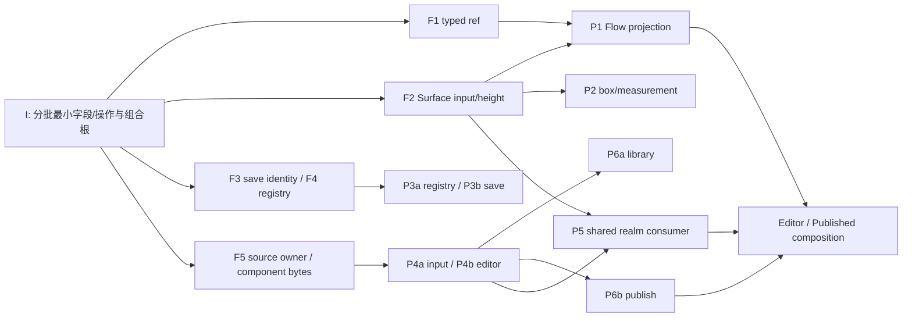

# 创作管线统一：执行补充方案

> 日期：2026-10-05。**本轮仅生成方案；以下产品工作包全部为 planned，等待 Owner 另行发出执行指令。**没有创建任务卡、转移当前源码锁、派发产品任务、运行测试／构建／模型或发布。
> 本文是本轮写域、依赖、模型与最小证据的执行入口；[总 N/L 执行计划](EXECUTION_PLAN.md)、[架构方案](ARCHITECTURE_AND_REFACTOR_PLAN.md)、[架构合同 §0](../ARCHITECTURE_CONTRACT.md#component-platform-contract)与[工作协议](../WORKING_PROTOCOL.md)继续有效。[UI 恢复方案](UI_REINTEGRATION_EXECUTION_PLAN.md)保留为前一恢复阶段的分工依据，不表示所有尾链已完成。冲突处按本文本轮安排执行，不恢复薄根、旧载体或历史额外门。

## 1. 真基线、优先级与复用证据

- 产品基线是实际 **THIRD**：`C:/Users/74755/.codex/worktrees/integration-post-measurement/果铃工作台`。HEAD 为 `6d93aca0aff3700e1ca42b7245b5e413904816f2`，另有已冻结的119项源码／测试和18项生成文件变更；交接索引为 `C:/Users/74755/.codex/scratch/integration-next-cut-20261005/third-cut-handoff.json`。这些计数是该回执的快照，不是核验门；D 的源码不等于此候选。可直接复用当前候选进入 ready 独占域，不为每包机械新建 checkout；确需新 worktree 时由 I 提供含最新成果的基线／补丁，不从孤立 HEAD 或默认 origin/main 假称带入未提交变更。只核对本包直接接口和实际锁，不要求本轮提交产品、全仓 clean、Hash 或重验旧绿。
- 当前直接可用性阻断是 **B Flow 无法打开**：`documentProjection.ts:57` 把正式实例 ID 编成111字符旧组件文件名，触发 Markdown 的80字符名称限制。修正式投影身份，不截短 ID、放宽旧门或要求模型改名。其次是动态布局和完整文档生命周期。保存／registry 的剩余收敛主要是维护与一致性问题，不能无新行为证据虚抬为产品 P1。
- 旧 B 输入仍使用 FIRST 下 `output/ai-generation-comparison/b-mcp-20261005/浸得越深，浮力一定越大吗？/浸得越深，浮力一定越大吗？.h5lesson`；FIRST 为 `C:/Users/74755/.codex/worktrees/component-platform-refactor/果铃工作台`。不重新生成作品掩盖 consumer 缺陷。

| 已有有效证据（I/E 回执） | 继续有效的范围／尚未证明 |
|---|---|
| `tests/unit/componentMeasuredWebBox.test.ts` 1/1；B P1 H1/SVG 实景完整、无默认片段滚动溢出 | 静态根盒修正有效；不证明新的按 Surface 动态策略。B Flow 尚无绿色打开／展开证据，P3 Published details 曾打开但答案被135px iframe裁切 |
| `tests/unit/htmlModuleClosure.test.ts` 1/1；原生模块 initial order/cycles/singleton/TLA 与源码替换后真实 dynamic 点击 | HTML 多模块图、native ESM/importmap 已接入，不能重做；作者编辑→保存→独立重开及新文档 load 生命周期尾链仍未闭合 |
| 正常保存重开续作：`tests/integration/g20SavedCourseContinuation.test.ts -t "retries a normally saved and reopened V10 work"`，1 passed/4 skipped；五阶 retry：`tests/integration/g20ExecutionEngine.test.ts -t "progressively retries five times"`，1 passed/43 skipped | 保留原目标、正式重开和不重放已提交结果；未证明展示写失败不影响权威 binding。只选择新条件，不扩大其余用例 |
| SECOND source-library alias 单例、current-project MCP 单例、CAS四例、style omitted clear 单例；THIRD 属性草稿同次选邻居、Flow caption、Spatial camera/pan与可见插入 | 保留各原属性；alias 资源例不证明新的 custom 多文件归属和原子组件文件插入，不把选中用例的 skipped 写成覆盖 |
| 相关两次 TS、最新 Main／Player 各一次构建通过；Main 默认20个 closure，Player 228 modules | 仅该稳定 cut 的工程产物；后续只因实际类型／consumer 变化安排必要检查，不把次数、字节数或 Hash 当质量门 |

工程候选、真实视觉／互动、Owner 接受分开报告。上述不是 D 已集成、完整 LUNA 已完成或发布授权；未改变的几何、资源、ACK、IME 与组件证据继续复用。

## 2. 本轮产品规则与最小接口

**F1 正式引用。** typed instance ref 只属于软件编辑投影：直接引用正式 `instanceId/id`，标题仅显示。PM、Markdown、源视图经同一 codec／软件引用映射往返，不退化成组件文件名，不另存第二份 Flow body，不要求用户或 AI 写新标记、编号或模板。复用既有对象 NodeView。

**F2 一根盒、按 Surface 消费。** frame 是外层 border-box／自由几何，内部内容拥有 paint／排版；物理与逻辑尺寸不重复生效。布局输入由宿主派生，字段名在第一接口片锁定，不让模型登记模式：

| 宿主输入语义 | 谁决定外部尺寸 | 运行时变化 |
|---|---|---|
| free-frame：Slide／Spatial | 正式 frame；初次装配为已知完整收展内容预留区域 | 状态不扩 frame／iframe 外边界、不推邻居；extent 仅诊断／命中。作者操作才改正式几何 |
| flow-content：Flow 普通响应 DOM | Flow 给实际可用宽度，组件按此宽度排版并报告自然高度 | Flow 接纳当前 scope/generation、同测量宽度的高度，更新临时块高度并自然推后文；不写 frame／History |
| flow-viewport：Flow 中 Canvas／依赖 vh/vw/media-query 的固定设计视口程序 | 既有定义／源码和作者 CSS 的设计区域，由 Flow 放置／fit | 保固定内部视口，不把内容 extent 倒灌为新 viewport；同一 Flow 可与自然高度正文共存 |

Sandbox 不再收到 extent 就无条件改 iframe width/height，也不让测量宽度反改 Flow 宿主宽度。高度上报是显示事实，只有 Surface/Flow 接纳；复用当前运行作用域与观察机制，不另建 layout 调度平台。普通文字/SVG 消除 UA 外边距和 baseline 错位，保留作者内部 auto/scroll/hidden/clip、组对子实例的必要 clipping、完整程序及显式内部样式。

软件能在确定宽度、同 CSS／字体／资源下测标准 details 的完整正文和自带状态组件的有限内容，Slide／Spatial 不能把 closed 壳 getBBox 当最大占位。任意 JS 的网络／无限追加／未来 Canvas 状态不能穷举：使用已分配 frame/context 约束、保源码和诊断，不要求 AI 列所有状态／算像素。完整耦合 HTML 保持内部布局关系；测量与可视 DOM 同源，不把每个片段变成不同的内部布局 owner。

**F3 保存事实。** 文档层发布实际保存身份／结果；Engine 是 run 关联与 journal 更新唯一 owner；timeline 只派生展示。权威 binding 不等待 `displayBuffers.flush`，展示失败不抹掉已保存事实。保留真实未知发布结果、冻结任务目标／文字范围、最终 CAS 与停止边界，不补造旧 A 没有的历史 binding。

**F4 工具注册。** 当前 live 工具的 schema、supports/capability、目标／effect 解析和 handler 来自同一注册项；Gateway 仍持权限／CAS，Engine 消费 effect/receipt 做恢复。消除 catalog、supported 名单、effectNames 的重复事实，不新增通用工具总平台或仅为一致性跑全 catalog。

**F5 源码与资源。** custom 作者文件有正式 owner、入口、逻辑路径文件集合及依赖／资源绑定，保存与库提炼不依赖编译产物。复用 `ComponentModuleSource`、`ComponentModuleDependency`、`resources.components` 和现 compiler；`code/css/artifact` 为派生。按 importer 所属 owner 解析 specifier，不把同名依赖扁平合并。库软件重绑依赖身份／资源引用，保源码 specifier；文件字节、归属和绑定进入同一次 canonical document/resource batch。Editor／Published 用同一 compilation-input 投影，HTML 已有模块图继续复用。

**F6 文档生命周期。** fragment mount 与 authored-document bootstrap 分开。完整 HTML 的 bridge／资源在真实 parser/load 前就绪，使用浏览器原生 readyState/DCL/load；不 fake dispatch，不将一次 innerHTML 替换伪称 document load。保现 bootstrap 租约、资源权限和 realm 清理；不再建 iframe 平台。

接口只冻结上述实际语义和直接字段：F1 ref、F2 layout 输入/高度报告、F3 saved identity、F4 注册结果、F5 source 输入、F6 bootstrap。按 consumer 一片片发布；一个缺字段只阻塞消费该字段的 hunk，不设置“全部共同合同完成”门。

## 3. 唯一 owner、精确写域与模型预设

`S/` 表示 THIRD 的 `src/`。brace 集合逐个现有文件；没有列出的文件不因 glob 获得写权。下面是**实施派发后的 planned owner 表**：执行指令到达后 M/I 明确整文件 transfer、释放原锁，再让表中 owner 开始写；本次文档不转移当前锁。转交后 I 排除该文件，不同时保留“I 也可写”的合同。

| 角色／包 | 精确模型／强度 | 单一职责 |
|---|---|---|
| M | 用户选择的当前主聊天模型及设置 | 只调度、接回执、交接资源与写权；不亲自做源码／命令／合入 |
| I／A | `gpt-6-astra` / `xhigh` | I 共享集成；A 处理真实未定语义／根因及工作协议 §3.1 的独立评审，不全 PR 签字或重复 review |
| P1/P2/P3a/P3b/P4a/P4b/P5 | `gpt-6.1-sol` / `xhigh` | 跨编辑、运行、保存或目标身份的关键包；边界已明确后的叶子可由 I/A 建议降为 high |
| P6a/P6b、独立测量叶 P2m（若实际需要） | `gpt-6.1-sol` / `high` | 清晰资源／投影／测量叶子 |
| E1–E3（按需要） | `gpt-6-luna` / `max` | 明确命令、候选检查、实际 UI 观察和回执；一个稳定 cut 的构建只一个 owner |

**I 保留的真正共享中心：** `S/shared/contracts/component-platform/{project,schema,operations,runtime,published,library}.ts`，`S/shared/document/{content,markdown,resources}.ts`，`S/shared/workbench/{document,documentSave,execution,executionDesktop,tools,componentCompilation}.ts`；`S/core/drivers/{CourseV10Driver,courseV10Operations}.ts`；`S/core/tools/DocumentToolGateway.ts`；`S/main/workbench/execution/{ExecutionEngine,ExecutionDesktopService,ExecutionSubmissionStore}.ts`；`S/renderer/store/{editorStore,editorStoreKernel}.ts`、`S/renderer/documents/{CourseV10DocumentBridge,DocumentProjection}.ts`；`S/renderer/components/CourseV10RuntimeView.tsx`、`S/player/componentPlatform/publishedPlayer.ts` 公共组合表达式与必要 Main/preload 注册。Session 只有实际合同缺口才改 `S/core/documents/DocumentSession.ts`，不新增 History。package／配置／生成入口仍 I 单 writer；其他包交明确类型、调用 hunk，不把完整业务交 I 重做。

| planned 包／可观察完成结果 | 独占写域、排除与交接 | 可立即做／真正等待 | 最小新增证据（未来执行） |
|---|---|---|---|
| **P1 typed Flow**：真实 B 正文能打开、layout/source 往返且对象身份不变 | `S/renderer/componentPlatform/surfaces/flow/{documentProjection,documentSelection,model}.ts`；`S/renderer/document/{documentAdapter,editorSchema,editorSession}.ts`、`SharedDocumentEditor.tsx`；`S/renderer/ui/FlowWorkspace.tsx`；`S/core/projectFiles/flowHtml.ts`。排除 I shared document 类型/codec公共字段、P4 程序文件投影。接收 P2 的 Flow 高度 hunk，消费 P5 runtime 报告 | 立即去掉 filename 作为V10身份，复用 object NodeView/source映射；仅等 F1 公共 ref 字段和 F2/P5 高度端口。先交 ref 小片，不等全动态布局 | 一个真实 ref parse→serialize→parse；B Flow 打开→编辑一块→保存→独立重开，同实例 ref/内容仍在。不重跑原正常save retry作为Flow证明 |
| **P2 根盒／表面策略**：同一内容在自由面不外推，在Flow自然增长 | `S/components/web/measuredFragmentBox.ts`；`S/main/workbench/contentApply/application/{html,plan}.ts`、`applyService.ts`；`S/core/contentApply/assembly/htmlAssembly.ts`；`S/player/components/componentPlacementStyle.ts`；`S/core/components/geometry/flowObjectExtent.ts`。必要测量文件仅 `S/main/workbench/contentApply/measurement/{browserCapture,ElectronHtmlDesignMeasurement,prepareMeasurementDocument}.ts`。排除 P1 FlowWorkspace、P5 Sandbox/contentRealm、P4 RuntimeHost；高度与盒接线 hunk 交各唯一 owner | 已有frame/测量/CSS即可做纯根盒与策略；第一片先给 F2 layout/helper。只等 P1/P5/P4 接受端口；不要保持旧 unconditional extent。若测量3文件有独立实际工作，可整组 transfer P2m，P2 随即排除 | 复用旧H1/SVG通过；只观察一次展开/收起：Slide/Spatial预留区完整、邻居/frame稳定；Flow高度增大且后文顺延。Canvas固定viewport不回授 |
| **P3a registry**：描述、解析、目标/effect、dispatch来自同一事实 | `S/core/tools/{ToolCatalog,HostToolServices,WorkbenchServiceTools,ProjectFileTools,AssetSourceTools,AgentFileTools}.ts`及派发前明确的 live 服务叶。排除 Gateway、Engine、retry规则、P4 projectFiles投影。注册/handler hunk 交 I，不能按函数并写 | 现 schema/handler 可立即收敛注册叶；仅等 F4 I 组合接口。`executionEffectScope/modelGenerationRetry` 的既有恢复原则复用，不顺手重写 | 一条公开本地写工具：同schema/target/effect从descriptor到Gateway→C1/Session→receipt；direct/batch及未知结果的必要共享解析用所选条件覆盖，不跑全工具名 |
| **P3b 保存事实**：保存身份不依赖展示，重开仍能续作正确目标 | `S/main/workbench/DocumentHostService.ts`；`S/main/workbench/execution/{DocumentSaveEvents,savedDocumentBinding,continuationTargets}.ts`。排除 P3a tools、I Engine/journal组合、timeline UI；Engine方法 hunk 交 I | 已有save事实与正常续作可直接处理内部binding/展示解耦；仅等 F3 saved identity 公共字段。权威事实先于timeline派生 | 在原正常save-reopen公开case只加“展示flush失败仍持久binding/正确续作且不二次提交”条件；已绿retry时序和其余case不重跑 |
| **P4a source 输入／命名空间**：custom 多文件有正式owner，Editor/Published同输入 | `S/core/components/compilation/{componentCompilationInput,types,InMemoryComponentCompilation}.ts`；`S/main/workbench/contentApply/compilation/{esbuildComponentCompiler,compileHtmlModules}.ts`；`S/components/web/moduleGraph.ts`；`S/player/components/runtime/ComponentRuntimeHost.ts`；`S/core/projectFiles/componentPlatform/{projection,coordinator}.ts`中实际程序源码投影整文件。排除 P5 Sandbox/contentRealm/resources、P6库/发布、I source schema/操作。runtimeHost 接收 P2 layout hunk，P5只消费图 | 现 compiler 已有entry/files/cache，可先做共享输入和 importer namespace；保 HTML 已绿算法。仅等 F5 正式 source字段+canonical组件文件操作；P6不等待全部图 | 一个 root+relative module 输入及同名specifier反例，经Editor/Published共享投影得到同解析图；改变运行时才追加一次真实import。既有HTML图不重做 |
| **P4b 源码编辑 consumer**：多文件可编辑并原目标提交、保存重开 | `S/renderer/components/ComponentSourceEditor.tsx`、`S/renderer/ui/DeveloperTab.tsx`、`S/renderer/components/ComponentAuthoringPanel.tsx`。排除旧未接入的 `ComponentSourcesEditor.tsx`、P4a编译/文件投影、Bridge/Store。所有迟到输入绑定原document/instance；正式操作交现Bridge | 可先保留现UI及捕获/draft/IME边界；真正文件列表与提交只等 F5 字段/操作，不造本地第二source真相或V9包 | 原组件源码编辑→切目标后的迟到提交→保存→独立重开；与P4/P5同输入尾链合用一个样本，不重复模型/编译矩阵 |
| **P5 authored document**：完整HTML真实parser/load，替换/关闭清理正确 | 整文件 `S/components/web/contentRealmImplementation.ts`、`S/renderer/components/SandboxComponentImplementation.ts`；`S/components/web/resources.ts`、`S/shared/html/documentKind.ts`仅必要。真实bootstrap纯叶可在 `S/components/web/`新增一个明确文件，名称在派发时锁定。排除 P4 moduleGraph/compiler/RuntimeHost、P6 Published model、Main现bootstrap租约、I两端组合根 | 现 HTML 图即可起跑，不等custom新图。**优先接收P2布局/P4模块consumer hunk，给短稳定接口切片，不等完整DCL/load任务结束才释放共同文件**；再做 F6 bootstrap。I转两端组合调用 | 一个完整doc真实readyState/DCL/load及relative模块→一次replace/close/remount、旧realm/listener退役，Editor/Published同样本；复用既有cycles/order/TLA/dynamic，不fake event/file绕路 |
| **P6a 库／原子资源插入**：提炼内容可在冲突工程插入且源码/资源保全 | `S/core/components/library/{extract,insert,references,rebindSource}.ts`。排除全部shared contracts/drivers/compiler/Web/renderer/player/publish | 立即按已有bindings/bytes做资源收集、身份映射和batch；仅最终接线等 F5 source owner/绑定值重绑/组件文件操作，不等文档load或几何 | 一份多文件package提炼→同名asset/依赖冲突原子插入→undo/redo→save/reopen；保源码specifier与实际资源内容。旧alias例复用但不冒称覆盖新组件bytes |
| **P6b 发布闭包**：源码发布消费共享input且真实资源闭合 | `S/core/publish/componentPlatform/{buildPublishedCourseV3,dependencies}.ts`。整文件从I排除；I将调用/合同hunk交此owner。排除 P4 compilation/Web graph、P5 Sandbox、I publishedPlayer组合根 | 可先删除custom发布私有单文件input、保现Web modulegraph调用；最终只等 P4/F5共享input，不等library完成 | 与P4/P6a合用同一package验证Editor/Published同输入及一次实际产物运行；只有改变的consumer补构建，不全格式矩阵 |

每包同时独占自己的最小检查文件，派发前记录精确路径；上表描述未来检查属性，不虚构尚未存在的测试名为可执行／已通过。需要未列直接helper时，作者给精确文件和原因，I/M先交接一个owner再写，不沿目录扩大权限。

重构依据、保留行为与评审触发以[工作协议 §1.1](../WORKING_PROTOCOL.md#refactor-evidence-and-preserved-behavior)及[§3.1](../WORKING_PROTOCOL.md#independent-structural-review)为唯一规则。派发时在现有 Outcome / Evidence 中说明本包结构调整的依据与边界，Acceptance 写明受影响的既有操作及已批准变化，Validation 引用本包最小检查与可复用证据；不增加任务字段或全产品台账。出现 §3.1 尚未确定的重要结构选择时，M/I 转交 A 技术判断，不以整个重构已授权代替本包依据。

## 4. 依赖图、真实并发与滚动 integration



箭头只表示最终接线依赖，不阻塞箭头前后已有合同上的独立部分。P5可用已有HTML图先做F6；P6a/P6b先做纯算法；P3两支先做内部叶。字段名/传参由直接consumer收口，不先造大型抽象。

**容量按真写域推导。** 六个主题拆成上表九个独占产品作者：P1/P2/P3a/P3b/P4a/P4b/P5/P6a/P6b。首起跑通常八域已有实际接口可做；P4b的最终文件提交只等F5小片，不占槽空等。若P2测量工作确实独立，可增加P2m至十域。加M/I/A/一个E为13或14计划槽；按需要启用E1–E3，则为15或16。数字不是人为并发上限／已派发数；21宿主槽包含所有角色，有新的真实独立consumer工作再释放剩余容量，不凑人数拆函数。

执行前先列现有agents、复用合适会话、结束已交付或空等会话；不得把本轮research会话数当产品派发数。显式model/effort真实交接，不伪称旧agent升级；thread limit同因不重复spawn或付费重试。

滚动次序不是波次停等：

1. **恢复点**：I/E核对THIRD实际切片；M/I落实表中整文件锁。I先收口F1与F2最小片；P1/P2/P3两支/P4a/P5/P6两支同时推进。P5先接共同consumer小hunk，避免变成新串行瓶颈。
2. **首真实用户链**：打开旧B→进入Flow→layout/source切换保持typed ref→编辑一段并undo/redo→展开内容自然推后文→原保存→关闭／独立重开→对应Published/Player同内容与展开行为。沿用一个实际样本，先解决真实Flow打开错误；首链不是全部恢复完成。
3. **继续释放**：F3/F4小片就接保存/registry；F5就绪后接P4b/P6最终字段，P4a的runtime hunk给P5、I两端组合根与P6b。Slide/Spatial同内容的固定预留属性与Flow链共享材料，分别证明其表面策略。
4. **源码尾链**：同多文件样本经编辑、库插入、正式保存重开、Editor/Published运行；完整HTML用原生load再替换/关闭。旧HTML图继续有效，不能把图已绿视为该尾链完成。
5. 一条consumer完成即滚动接下一真正ready工作；没有独立工作便交明确hunk/需求并释放槽位。其他未闭环LUNA目标保留，不因本计划首链通过而删除或标整体完成。

## 5. 验证、构建与停止条件

- **重要结构变化滚动合入前独立评审**：按[工作协议 §3.1](../WORKING_PROTOCOL.md#independent-structural-review)执行。M/I 安排未参与该候选实现的 Reviewer；I 参与实现时交 A，A 也参与实现时另交胜任的独立 Reviewer，不能以 I/A 角色名代替独立性。E 的机械检查不能代替技术评审。只补具体证据缺口，不全 PR 签字或增加全矩阵。
- **约束同步从当前进度采用**：M 重新读取本节及工作协议后同步在途作者；已完成但尚未合入的重要改动按现有候选核对。已批准的具体路线继续实施，未变证据继续有效，只处理相关缺口，不重启开发。本次文档更新不转移源码锁、不派发产品任务，也不改变本文件 planned 状态记录。
- 作者按表交最小候选、命令、真实输入和待证明属性；E核对实际测试定义、runner/lifecycle及过滤命中，零匹配不是pass。文档校核仅检查本次文本与引用，不触发产品测试、构建或模型调用。
- **稳定consumer切片短冻结**后E检查；作者可继续无关独占域或scratch。真实Renderer观察只冻结会影响该运行闭包/HMR的写域，不等整批完成／全repo clean。使用现有worktree/patch机制，不建snapshot调度平台或Hash身份门。
- 类型接口及共同接线稳定cut安排一次相关TS；Main或Player consumer实际变化时各准备一次必要build，由一个E owner执行，同一候选不并行改产物或踩同一窗口。失败回原作者/I，仅重验受影响属性；源码、测试定义和关键环境未变的证据不失效。
- 功能看行为、几何看针对性解析、视觉看真呈现；测试DOM rect、diag[]、传输ACK或产物存在不能替代打开/互动/保存重开。只记录命中数、exit、实际候选、产物及未证明边界。
- 最低成本有效检查通过就停止同义重复。真实失败只阻断依赖它的consumer验收，无关工作继续；余项只属未触发假设时停止扩查。新增产品取舍或本计划不能解决的真实边界由I/A给具体证据交Owner，不拿普通接口实现重复审批。
- 不新增全矩阵、付费CLI／真实生成模型调用、格式模板门、一般Hash门或发布步骤。已有源码/输入保留；不静默静态化、隐藏功能、造V9Like或第二writer/History。发布仍暂停。

## 6. Owner 发执行指令后可复制派发

以下文字只是计划模板，**当前不发送、不创建active卡**。精确writer锁与基线由I/E在真实派工前填入；`task_name`为实际包，未填占位不是可运行调用。

```text
按 AUTHORING_PIPELINE_UNIFICATION_EXECUTION_PLAN.md 开始本次已授权产品实施。
M 沿用当前主会话及设置，仅调度；I/A=Astra xhigh，关键P包=6.1-sol xhigh，资源/发布/独立测量叶=6.1-sol high，E=Luna max。
先列已有agents复用/交接，核对THIRD实际未提交切片和现锁。按§3唯一owner表落实整文件transfer，I排除已转出的文件。
按工作协议§1.1明确本包重构依据和保留行为；§3.1重要结构变化交未参与实现的Reviewer，未定选择先技术判断，候选合入前核对实际diff和行为证据。
立即释放所有ready非重叠域；最小字段片仅阻塞实际consumer接线，不等待完整共同合同。
P5先交布局/模块consumer稳定小片，随后继续真实document load。复用§1绿色回执，按§5冻结相关闭包后E验证，其他域继续。
首链是旧B Flow typed ref→编辑/展开→原保存→独立重开/Player；之后完成source/library/publish/load尾链与其他真实未闭环目标。
不运行付费CLI/生成模型或发布，不新增平台/模板/Hash门，真实失败回唯一作者；A按真实语义/根因请求参与。
```

单包消息可复制：

```text
你负责 planned [包号] 的可观察结果：[§3对应结果]。
模型：[精确ID/effort]；工作区/实际基线：[I/E确认的路径/切片]；唯一写域：[逐个文件]；排除：[§3对应共享/其他包域]。
先读本计划对应条目和直接合同/consumer，复用已有实现。立即做：[已有端口部分]；仅等待：[具体F接口]。
在现有任务/交接中按工作协议§1.1写明重构依据与受影响的保留行为；§3.1重要结构选择/候选交I/M安排独立技术评审，不削弱正确旧断言或缩减功能以通过验收。
共享hunk交：[该文件唯一owner]，交付原调用者+正式操作+真实consumer，不让I重做叶子业务。
将最小新case/命令/输入/未证明范围交E；不自行跑矩阵/模型/build，不写板卡，不触其他源码锁。
Flow自然高度推后文；Slide/Spatial动态固定预留。正式状态只有Session，运行高度不写History。
```

原生执行器参数采用 `model`、`reasoning_effort`、`fork_turns: "none"`；示意：`{"task_name":"actual_package","model":"gpt-6.1-sol","reasoning_effort":"xhigh","fork_turns":"none","message":"填入上面的实际单包任务"}`。这不是已创建agent，提示词不替宿主切换模型。

## 7. 技术依据

- [CSS Sizing](https://www.w3.org/TR/css-sizing-3/)：确定尺寸、内容尺寸与border-box分开；Flow自然高度与自由外框不是同一种尺寸owner。
- [CSS Containment](https://www.w3.org/TR/css-contain-2/)及[Intrinsic Size](https://www.w3.org/TR/css-sizing-4/#intrinsic-size-override)：containment／记忆尺寸不能穷举任意程序最大状态；paint containment可能裁内容，不能blanket套用。
- [ResizeObserver](https://drafts.csswg.org/resize-observer/)：观察当前盒而非未来状态；不由观察事件反写宿主宽度或作者历史。
- [HTML details](https://html.spec.whatwg.org/multipage/interactive-elements.html#the-details-element)与[tldraw shape示例](https://tldraw.dev/examples/custom-shape)：标准有限收展内容可由软件测量；明确几何与内部renderer职责可复用，不因此引入新编辑器总平台。

这些是方案选择依据，不是本产品已经实现或验收的声明。
