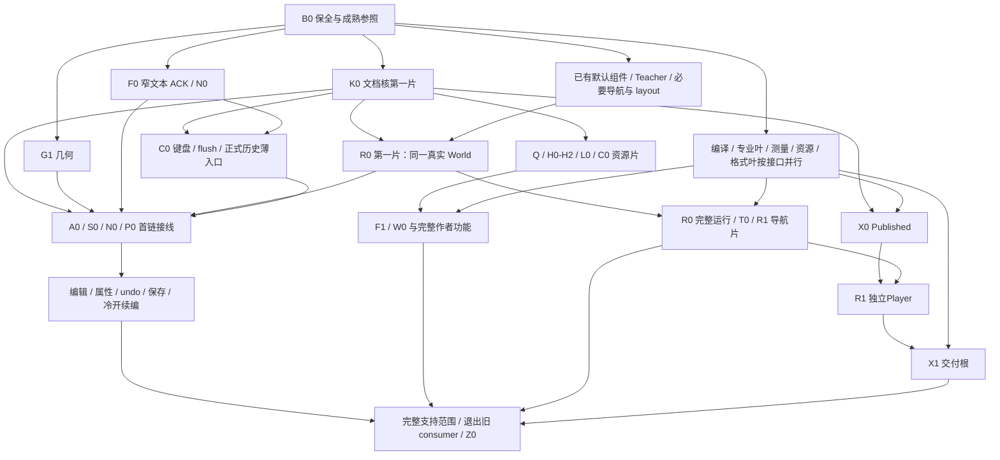

# 稳定基线恢复与 V10 渐进替换：完整并发开发计划

> 2026-10-05 修订。方案由 Root 撰写，关键架构、依赖与切换边界由 Astra 审阅。本次按六份独立评估与实际调用链核实结果修订；Luna 不承担方案设计、技术取舍或计划正文。
>
> **2026-10-05 Owner 已授权本计划全部产品开发目标。** 从 B0 保全开始实施，保留成熟前端、复用现 V10 模块，先形成真实编辑→撤销→保存→冷启动重开→续编闭环，再持续完成全部 N/L 目标。真实模型调用暂不授权，发布继续暂停。实际派发、工程证据与真实观察以当前任务卡及交付记录为准；正文中未来授权、仅方案表述是修订时历史，不再阻止本次已授权实施。
>
> 本文取代前轮 UI 恢复和创作管线方案的当前起跑安排。原统一组件目标继续有效；历史实现、未提交材料与有效证据保留，不能把本计划保存称为产品恢复。

## 1. 结论与目标

**先恢复 V10 前的成熟完整软件，再沿既有前后端解耦端口渐进替换 V9。** 保留成熟 App、三种工作区、专业面板、菜单、快捷键、焦点、输入法、草稿、剪贴板、试运行和交付流程。接口确实变化的直接 consumer 原位适配；已证缺陷可以合理优化；没有必要性评估，不全量重写 UI。

整体范围仍为原 N00a、N00b、N01–N10 与 L01–L26（含 L23a/L23b）。复用已有效的专业算法、DocumentSession、资源、文件、保存、Office、模型和浏览器服务。工作包重新划分是为降低共享写入冲突、尽早形成真实用户链，不是重新开发全部功能。

本次纠偏有具体源码依据：

- V10 数据迁移与 UI 内部行为替换绑在同批；通用组件数据入口存在 JSON fallback 与专业元数据缺口。当前文字、形状、表格、图表等专业分派仍在，不能称全部专业面板已经退化。
- 恢复中保留了 PM 和部分外壳，却漏接原 Flow 的 clipboard context、资源准备、prepared resources 与真实 ACK。
- source override 曾被当作失去专业身份，专业编辑入口因此退出。
- 提交、类型、后端用例和局部 DOM 证据曾被扩大为“完整 UI 恢复”的结论。

首次简化根的实际活动快照尚未找全；旧版已有的 CSS 声明是否同样造成呈现问题也未实机确认。不能把所有问题推为 V10 首次引入。Flow 更新循环的具体根因仍未证明。

本次修订保留成熟前端迁移路线，重点收口直接 consumer 的 owner、已有 V10 模块携入、首条真实用户链、运行与作者数据分离及交付能力。评估提出的固定手势阈值、光标数值门、全面 PM 更新抑制、额外会话失效 API 和重复审批不自动进入实施；修改由真实合同或已证失败决定。

## 2. 基线、保全与未来恢复步骤

### 2.1 精确候选与当前材料

| 对象 | 已确认事实 | 当前证据限制 |
|---|---|---|
| V10 前候选基线 | 027d588a3933b977cb0ef6ed9288d7aaa82d4e87；2026-10-04 13:12 +08；6d93 的直接父提交；该提交仅改文档，代码等同 5f6fa9d7 | 成熟行为有源码依据；本轮尚未实机确认它稳定，不能提前称“已验收稳定版本” |
| 更早参照 | 64d97fa2fb4f9c5a1a6f92177eb99d8d768d21c7 是 027d 的祖先 | 只在原版出现具体失败时定向对照；不机械试遍旧提交 |
| 当前 V10 材料承载 | D:/果铃恢复候选/20261005-authoring；codex/authoring-recovery-20261005；首版方案提交 b0076bc018643802119bdb6826aa883f00bb6bf4，本次修订开始时仍为该 HEAD | 本次修订开始时产品材料仍为 25 个 tracked 修改与 2 个 untracked，全部冻结；本次文档改动另计。实施时重取实际清单，不沿用历史数量 |
| Owner 工作区 | D:/果铃工作台及其中 Gemini 成果、Owner 窗口与真实用户文件 | 不覆盖、不重置、不以关闭 Owner 进程解决端口问题；旧 PID 仅是观察，不是永久身份 |

### 2.2 B0 的执行顺序（现在不执行）

1. Root/I 按实际工作树、分支和修改归属确定一份完整可恢复切片，给 E1 明确保存方式与路径。已归属的成果包含 tracked 与 untracked；用户无关修改保留原位，剩余范围记录清楚。不能只保存某个任务的 dirty 子集，也不叠加没有合同需要的多套备份或 Hash 门。
2. E1 使用实际 Git CLI 的 `git worktree list --porcelain` 核对承载、HEAD和分支，再以 `git -C <承载路径> status --short` 核对 tracked/untracked 与 dirty 状态；可复用工作树先交接其实际 owner。没有可复用承载时，以 `git worktree add -b codex/<分支> <独立路径> 027d588a3933b977cb0ef6ed9288d7aaa82d4e87` 建立迁移工作树；分支和路径在 B0 派发时明确，不把不存在的工具名当操作接口。
3. 保留原版源码、可运行物、独立 profile 和样本副本。启动参数使用既有 `--user-data-dir`，需要开发服务或调试端口时分配未占用端口。E3 在自己启动的原版实例记录将要改动模块的最小真实 UI 参照，后续模块按需补参照，不把六链全跑完设为全部开发前置。
4. 参照失败时定位具体症状，必要时对照相关早期差异。真实缺陷由目标 V10 模块负责修正，不为了把参照变成零缺陷版本先全面修复 V9。不得把提交标题当稳定证据，也不得假定回退自动解决当前 Flow 循环。
5. 以成熟前端为迁移底座，按完整模块及必要直接依赖携入已有 V10 Schema、Driver、Session、几何、运行、编译和发布实现。App、Store、工作区等混合文件原位接线；不整包 cherry-pick 含简化 UI 的巨提交，不逐提交重演 V10 历史，不重新实现已有效算法。
6. 原版继续可用。候选只操作测试工程副本；完整支持范围通过后，Owner 使用入口指向独立候选承载和 profile，不在 Owner dirty 工作区内 checkout 或覆盖。旧 V9 应用仍可打开旧原件；发布继续暂停。

不 reset 当前候选，不删除承载，不 stash 用户修改，不转换或覆盖用户原件。只有执行者自己启动的应用可由该执行者正常关闭。

当前候选与 Owner 工作区共享 Git common directory；独立分支／worktree 使用共享 Git 元数据属于 B0 的正常动作。保护对象是 Owner 工作树、index、当前分支及用户改动，不能把“禁止覆盖 Owner”扩大为禁止已授权承载的一切 Git 元数据写入。

### 2.3 渐进的单位

渐进的是代码与 consumer 的迁移批次。**同一文档同时只有一个正式 writer。**

- 原版 V9 应用独立保留；V10 候选的一个文档从 create/open、Driver/model、Bridge、History、Runtime 到 UI 端口均使用 V10。
- 可先接好候选中的一条完整 Slide 用户链，再加入 Flow、Spatial、源码和交付 consumer；尚未接好的候选功能如实标记未就绪，不能作为日常版本交付。
- K0 切换 Driver 的同一集成 cut 必须包含首链实际挂载的 App／Store／菜单／工作区 consumer，以及 Session、codec、文件格式识别和恢复稿支持。未接入模块不挂起旧 V9 writer；候选如实标记未就绪，不以删控件掩盖最终范围缺口。
- 不在同一文档按 surface 混用 V9/V10 writer，不把 V10 结果回灌 V9 History，不建 V9Like 整项目影子、转换器、双轨资源库或第二正式 History。
- 成熟 DOM、事件、菜单等行为模块保留；该模块读取和写入正式内容的实现切换到 V10。退出旧 consumer 与对应切换同批发生。

## 3. 可复用的既有解耦与必要接口

### 3.1 既有边界

| 已有接口／职责 | 保留内容 | V10 必要适配 |
|---|---|---|
| DocumentHostAPI：create/open/read/dispatch/lookup/save/subscribe | Main 文档 IO 与生命周期边界 | model、command、Driver 和资源读取实现 |
| CourseProjectLifecyclePorts.documents：ready/snapshot/create/createFrom/open/save/drain | 原 App 打开、保存、关闭、未完成输入流程 | 返回模型与正式提交端口 |
| DocumentProjection.attach(api, documentId, driver?) | Driver 注入与投影 owner | V10 Driver、正式 snapshot 和 ACK |
| CourseDocumentBridge | 订阅、未完成输入、ViewState；正式内容与 History 已在 Main | V10 model 与 captured target；不把正式 History 搬到 JSX |
| SlideLocationWorkspace(snapshot, ports)；Flow/Spatial CommandPort.run(target, intent) | 成熟工作区与动作语义 | V10 读取投影、捕获目标、canonical commands |
| PropertiesContextAdapter → readModel/binding | 原专业控件与提交用例边界 | definition/data、selection 和 captured 写入 |

旧 FlowBlock 已是通用 DocumentBlock alias，PM 正文不等于 V9 工程模型。3190e0e9、e3f0a018、05140b2e 等解耦成果可复用；不另建总线。

真实耦合集中于 CourseProjectDocument、LayerItem、session.history.present、SlidePhaserNode、V9 地址、V4 资源包及旧 Runtime mount。直接 consumer 必须改；不能用一份 V9 虚拟工程让原 writer 继续存在。

### 3.2 K0 分片提供的五个端口

1. **读取：** 正式 project 与同份 resources 的只读 snapshot。
2. **捕获：** documentId/epoch、surface/container、状态和 instance 的完整 captured target；异步开始时捕获，不能混用文档 A 的 snapshot 和当前文档 B 的 state。
3. **提交：** canonical edits → 真实 Promise ACK，以及 undo、drain。ACK 确认投影，不再生成同一作者 intent。
4. **资源：** definition、owner files、assets、instances 在同一 operation batch 中提交；准备失败可 discard，提交失败保 draft 与原捕获目标。
5. **几何与运行：** 正式 affine frame、父矩阵，以及 mount/update/dispose 的现有运行端口。几何算法由 G1 提供；Runtime 由 R0 持有。

同名资源类型不能强制转换：Main/workbench DocumentResources 是 assets bytes map 与 components owner→file→bytes；shared/document/resources 是 PM 语义 manifest 数组。F1/Q0/L0/C0 从捕获快照准备正式 edits 与软件映射；F0 只消费 prepare/pastePrepared/discard 与 ACK，不持正式资源库。

PM 保留 EditorView、本地草稿和选区，维持成熟实现“不安装 history 插件”的行为；PM 内撤销／重做也经正式 DocumentSession History，并先处理未完成输入与 ACK。源码编辑器在 Apply 前的本地草稿撤销可保留，不形成第二工程 History。失败保 draft 与原捕获目标；只有真实 ACK 后推进源码 baseline，拒绝 ACK 不授权全量回灌覆盖用户输入。

最终 CAS 仍由 DocumentSession 在串行正式事务内执行；组件字段 expectations 的纯校验与已知局部读取重规划沿用现行为。不把不同 mutation 未经过组件专用预检定性为漏洞，不以全面 revision 拒绝替代已批准的局部操作语义。R0 运行副作用只作用于有效文档／表面及其作用域，切换、暂停和退役按真实需要清理；不无差别停止文档级行为。

Phaser 按已批准方向退出主编辑几何，局部游戏／模拟仍可用它。旧 x/y/rotation 不能 cast 为完整 affine。普通专业内容继续使用适合的原生 DOM；外来源码复用现内容环境，不取得 Provider Secret 或任意 OS 权限。

## 4. 任何 UI 模块改动前的动机评估

每个包开工前，在现任务卡写五项短说明，不新建台账或审批平台：

1. 旧→新具体 contract/signature。
2. 旧 consumer 不能满足它的源码或实际行为证据。
3. 保留原实现、原位端口适配、局部替换三种选择及决定理由。
4. 保全哪些成熟行为，实际改哪些模块。
5. 对应最小真实 UI 链、失败 owner 和可恢复切片。

| 类别 | 可以执行的修改 | 判定要求 |
|---|---|---|
| A：新合同必需 | V9 target→captured、LayerItem→V10 frame、同步 .ok→Promise ACK、V4 包→owner files | 具体直接 consumer 与合同差异 |
| B：已证功能／体验／性能问题 | 真实命中、样式冲突、无效命令、已定位反馈循环 | 具体失败、收益和影响 |
| C：仅重构重写 | 组织代码、统一风格、“更整齐” | 不自动纳入迁移；无当前必要性或收益不执行 |

允许合理改造和优化，不要求每个模块重新向 Owner 审批。整模块重写必须先证明原位适配／局部改造无法满足真实需求，说明行为保全、收益、代价及验证，由 Root/Astra 做技术决定。不能先全量改写，再补理由。

不得通过删控件、隐藏未接线动作、静默静态化或降低操作能力获得通过。

## 5. 角色、模型、容量与共享 owner

| 角色 | 模型／强度 | 本计划职责 |
|---|---|---|
| M／Root | 当前主会话与当前设置 | 撰写方案、技术综合、派发、依赖、交接与沟通；不把计划设计交 Luna |
| I／共享文档核 | gpt-6-astra / xhigh | K0 正式合同、Driver、Session/恢复稿、Bridge/Projection、公共捕获与注册；App/Store 装配交 A0 |
| A／固定专家 | gpt-6-astra / xhigh | 基线／接口决定、首次真实 Main 切换、最终旧 consumer 退出三个节点，以及 Sol/I 明确提交的难题；不逐叶审查 |
| 功能叶 owner | gpt-6.1-sol / medium、high 或 xhigh，见第 6 节 | 实现、必要脚本与目标测试编写；主动交出共享 hunk |
| E1 | gpt-6-luna / max | 明确 Git、版本保全和事实记录；不设计、撰写或解释开发方案 |
| E2 | gpt-6-luna / max | 执行作者提供的必要检查与构建命令；不改测试逻辑或断言 |
| E3 | gpt-6-luna / max | 在获准实例执行明确真实 UI 链，记录动作、状态、截图与原始失败 |

当前宿主暴露 21 槽（含 M），只是容量观察。使用实际可用资源，依赖 ready 且写域独立的任务立即滚动释放，不设置 8/16/20/26 人为起跑门。任务域数量不等于同时运行 agent 数；不要启动进程充数。检查时保留 E 槽，其他时段可复用资源。模型不可用如实报告，不静默换 ID或同因反复重试。没有 service_tier/Fast 要求。

Sol 强度按实际耦合选择：独立专业算法／说明通常 medium；跨单一 owner 的 consumer 和运行适配通常 high；正式异步 ACK、资源单批、身份续作或多 owner 接缝通常 xhigh。难点升级交 I/A，简单已复用叶不因角色名称机械提高强度。E2/E3 可在不同固定 cut、样本副本和独立实例上并行执行，不重复同一证据。

同一文件同一时刻一个 writer。需要转移整文件时，原 writer 暂停并明确交出；其他包不能复制合同、DTO 或新平台来绕开共享 owner。

K0 独占：

- src/shared/contracts/component-platform/ 的公共合同；专业叶只消费，字段修改交 K0。
- src/core/drivers/CourseV10Driver.ts、courseV10Operations.ts、必要 V10 codec/schema 与 src/core/course/createCourseProjectV10.ts 的正式工厂接线。
- src/core/documents/DocumentSession.ts、DocumentRegistry.ts；src/main/workbench/{documentJournal,JournalBindingIndex,DocumentFileCoordinator,WorkspaceFiles,workspaceFilesDesktopService}.ts 的正式文档／文件 binding 与 V10 格式识别；src/shared/workbench/sourceFileKind.ts。执行续作消费归 H2，不把该业务塞进文件 owner。
- src/renderer/documents/CourseV10DocumentBridge.ts、DocumentProjection.ts。
- src/main/workbench/DocumentHostService.ts 的正式文档／Driver 注册；src/core/tools/DocumentToolGateway.ts 的公共文档入口。
- src/renderer/workbench/SelectionContextController.ts 与 src/core/tools/ToolTargets.ts 的公共捕获／target规则；原仅接受course-v9的captureCourseObjectSelection/captureFlowSelection按V10捕获端口原位替换，P0/F1/App不各自复制。
- 公共 ToolCatalog/ToolRegistration、src/main/workbench/workbenchToolServices.ts、src/main/ipc.ts、src/preload/{index.ts,desktop-api.d.ts}、src/shared/ipcTypes.ts 与 shared/workbench 的 document/desktop/documentSave/toolPorts 等公共协议接线；execution/MCP/观察等 feature 协议归 H2，ProjectFileTools 归 Q2。业务叶交 hunk，由 K0 顺序写入公共根。
- scripts/{generate-ai-capabilities,generate-component-builtin-sources}.ts、src/components/builtin-source/entries.ts、src/core/components/source/builtinSources.ts 与对应 artifacts/ai-capabilities、src/shared/generated 产物的唯一汇合；D0/T0 交源码，运行 map 在 R0。package/lock/config 的必要变化也由 K0 汇合，不为未改变的产物重复生成。

App 与 Store 装配归 A0，Slide slice 归 S0，Flow slice 归 F1，Spatial slice 归 W0；World 归 R0，Player 归 R1，交付根与混合样本归 X1。K0 不串行接全部业务。此分配降低共享接线排队，不把任务 writer 的旧安排误称为运行时架构违规。

以下写域相对未来迁移承载；不是修改当前冻结候选的授权。现路径缺失时先核对基线和现 V10 对应模块，绑定真实文件再派发，不按猜测建占位层。新 helper 归原包；测试使用任务专名，不能多作者改同一个测试文件。

### 5.1 直接 consumer 与共享文件交接

第 6 节列主文件及职责域。包开工前把本次必须修改的直接 consumer 与旧实现退出路径绑定到实际任务卡；首链先绑首链相关文件，其余随 ready 包滚动收口。未列名文件不能越域写入，也不要求在首批派发前穷举几百个 V9 字符串或全仓菜单。

- A0 持 Store 根、shell/structure/lifecycle slices、原工具栏／场景与工作台壳层；S0/F1/W0 持各表面命令及读取 consumer，公共捕获不复制。
- F0 持通用 PM 接口与直接适配 consumer；C0 持通用剪贴板，F1 持 Flow 捕获快照、资源准备与运行空间投影。旧 V4 资源实现只能作为算法来源，不能强转成 V10 正式资源事务。
- C0 持 crossSurfaceCommands.ts 整文件；先交首链键盘／正式 undo/drain 片，再交带资源复制片。需要抽出对齐／分布等 Slide 业务时，C0 先抽到 S0 所有的实际叶并明确交接，S0/C0 不同时按不同 hunk 写同文件。
- R0 持共享运行与 web realm bootstrap/resources；H0 持 web 作者数据及内容应用规划。交付、属性和 Player 消费同实现，不各自复制。
- Q2 持工程文件投影、协调与工具服务；H2 持 AI 执行／续作、MCP 编排与观察 consumer；H1 持正式内容应用服务。三者的公共 Gateway/IPC 接线交 K0。
- X2/X3/X4 持各格式必要专业 helper；X4 提前交纯 flowPageBox，X3 提前交 reading/index 中性类型/presentation。混合样本仅 X1 写，其他叶交需要的特征。

### 5.2 旧 consumer 退出责任

旧实现随新实际 consumer 切换退出，不把最终清理留给无主文件：Slide 旧后端／主编辑 Phaser consumer 由 S0（几何 G1）收口；Flow 旧 slice／作者适配由 F1 收口；Spatial 旧作者 consumer 由 W0 收口；旧运行挂载由 R0、旧 Player 由 R1、旧交付与格式 producer 由 X1–X4 收口；旧工程文件／工具分别由 Q2/H1/H2 收口。共享 V9 Driver/codec/schema/Bridge 与无人归属的公共残余由 K0 顺序收口，必要时 Root 调整直接 consumer owner。

Phaser 仅退出主编辑几何，局部游戏／模拟引擎继续可用。文件存在或含 V9 字符串不自动证明活 writer；按实际注册／调用和替代 consumer 决定删除或退出。只有修改既有 legacy inventory 时才持其专用锁，不另建退出登记平台。

## 6. 可执行并发工作包

每包交付：具体候选／diff、UI 动机评估、接口与保全行为、必要样本与明确命令、证据边界、失败 owner、可释放下游。代码与必要测试由作者写，执行交 E。直接复用未变化实现时，不为凑任务启动空包。

### 6.1 基线与成熟前端

| 包／owner | 独占写域 | 输入→输出／直接依赖 | 动机、保全行为与最低证据 |
|---|---|---|---|
| B0／Root、I/A 选择；E1/E3机械执行 | 新承载、版本/profile及事实记录；不写用户原件 | 当前冻结材料＋027d→可恢复来源、原版参照、独立迁移承载 | 原版实际功能组合参照一次；稳定需真实观察，不能 reset 当前材料 |
| K0／I Astra xhigh | 第 5 节共享核 | 现 V10 Schema/Driver/Session→五个端口；B0 承载 ready 后分片交付 | A：正式模型/目标/资源/ACK改变；保 HostAPI 与唯一 History。最小解析/操作/ACK证据，加 A0 首链实际保存重开；core通过不称UI通过 |
| A0／Sol xhigh | renderer/{App.tsx,main.tsx}、app/{ComponentPlatformApp.tsx,useCourseProjectLifecycle.ts,useMediaImport.ts,LessonWorkspaceHost.tsx,lessonDocumentPort.ts}、project/courseProjectLifecycle.ts、store/{editorStore.ts,editorStoreKernel.ts,slices/editorShellSlice.ts,slices/courseStructureSlice.ts,slices/courseLifecycleSlice.ts}、composition/designProductionActions.ts；ui/{Workspace,TopToolbar,ScenePanel,SceneThumbnail,ElementsTab,AddCourseContentMenu,ExportMenu}.tsx、ui/workspaces/WorkspaceRouteContext.ts、documents/{CourseEditorActionsContext,CourseEditorChromeContext,CourseLightToolbar}.tsx、media/{commitCourseMediaAuthoring,courseMediaLibraryImport}.ts及必要原壳层 consumer | 原完整 App＋K0 第一片／R0 第一片＋一条 ready surface→唯一实际 App/Store 根与 Main 接线 | A：model/Driver/生命周期端口改变。保布局、菜单、切文档、草稿、键盘、文件目的地和媒体输入；不同时启用成熟 App 与简化 ComponentPlatformApp 两个 writer 根。首链未提交输入 Ctrl+S→正常关闭自己的实例→新进程重开→继续编辑/undo；本包相关片再合并一次媒体导入、切文档后保存重开、保留恢复稿关闭/恢复，不扩矩阵 |
| G1／Sol high | core/components/geometry/index.ts；renderer/authoring/stageViewportTransform.ts；renderer/componentPlatform/surfaces/slide/{targets,freeTransformGesture}.ts | K0 frame/capture 小接口＋现纯数学→affine/父矩阵/自由手势；早交 S0/F1/W0/P0 | A：退出 Phaser 主几何、完整 affine。保手势语义，只有一个几何 owner；UI1/2 共证旋转编组拖动/undo。未变算法证据沿用 |
| S0／Sol high | renderer/ui/workspaces/{SlideLocationWorkspace,SlideWorkspaceConnector,SlideLayerSelectionOverlay}.tsx；renderer/ui/workspaceSlideAuthoring.ts；renderer/store/slices/{slideAuthoringSlice,slideOwnedCommands}.ts；renderer/componentPlatform/surfaces/slide/ 的 authoring 叶与 barrel（targets/freeTransformGesture 归 G1），旧 Slide 作者／主编辑 Phaser consumer 同切换退出 | 原完整 Slide＋K0/G1＋N0/P0/R0 第一片及 C0 提前交的窄命令→V10 读取/动作 consumer | A：LayerItem/PhaserNode/session→实例/capture。保 DOM、事件、选区、手柄、直线/编组、菜单和试运行现场；UI1/2 与 save，global/page 正式归属及邻项 frame 保全。实际呈现用同一 World，SlideSurfaceView 不成为第二作者界面；主编辑几何接管时退出对应 Phaser 职责 |
| N0／Sol high | renderer/ui/workspaces/useSlideNativeTextEditor.tsx；components/text/editor.tsx；必要公式编辑入口在派发时以真实文件绑定并从原 owner 交接 | K0 captured draft＋F0 窄字段接口→文字/公式原专业编辑入口 | A：TextNode{text,runs}不能无损表达inlines/math，sourceoverride不改变definition专业身份。保焦点/IME/工具栏；不摊平原子、不把普通文字换整篇正文UI。合并UI1，现jsdom退出1不能记通过 |
| F0／Sol xhigh | renderer/document/{SharedDocumentEditor.tsx,editorSession.ts,documentAdapter.ts}及通用 PM／源文直接接口 consumer；排除通用 clipboard（C0）、Flow 资源／运行空间投影（F1）、源码组件编辑（Q0） | 原通用 PM＋K0 ACK→先交 N0 窄文本 ACK/draft，再交 Flow 完整异步编辑协议 | A：consumer 需实际等待 ACK；当前类型已经允许 Promise，不能只改签名销账。保 EditorView、table/Markdown/selection/IME/草稿，正式 undo 归 Session。区分本地 intent、待提交草稿、自己的 ACK 与外部更新；拒绝 ACK 保 draft/target。先定位 feedback owner、effect 依赖与重复 intent，再修反馈环，不指定全面 stateChanged 抑制或统一 queueMicrotask |
| F1／Sol xhigh | renderer/ui/FlowWorkspace.tsx、ui/workspaces/{FlowLocationWorkspace,FlowWorkspaceConnector}.tsx、ui/flow/ 的正文／浮层／媒体／快捷栏 consumer；document/{flowDocumentResources,flowRuntimeSpaceProjection}.ts、store/slices/flowAuthoringSlice.ts、componentPlatform/surfaces/flow/ 的投影／选择／阅读锚 consumer；原 Flow 文字 controller | 原完整 Flow＋K0/F0/G1/R0 相关片；C0/L0 资源小接口→正文/阅读/浮层/专业动作 | A：Session/LayerItem/旧 target/V4 资源/旧 mount 改变。保 Enter、paper/world/viewport、锚定/裁剪/组内选择/菜单/portal；接回 clipboardContext/clipboardResourcePort，消费 preparedResources 并实际 await ACK。正文与实例/素材/源码从同份 captured V10 snapshot 准备成一批；course-instance 不能只 renew blockID 或保旧实例引用。普通加字进正文；显式 xy 只用于真实浮层。UI3/4＋save，异步不得 A 快照+B 状态 |
| W0／Sol high | renderer/ui/workspaces/{SpatialLocationWorkspace,SpatialWorkspaceConnector}.tsx、store/slices/spatialAuthoringSlice.ts、componentPlatform/surfaces/spatial/cameraCommands.ts、authoring/spatialAuthoringIntents.ts及原Spatial作者consumer；不写Player camera/graph（R1） | 原完整 Spatial＋K0/G1/R0→world/HUD实例投影与正式命令 | A：V9 view/target→affine/captured。保镜头、路径、关系、语义缩放、菜单、选拖；通用创建ports必须可用。global/world创建选中→平移缩放后拖动→undo/save，与Teacher链共证 |
| P0／Sol high | renderer/composition/properties/{usePropertiesAuthoringBinding.tsx,PropertiesAuthoringReadModel.ts}、renderer/ui/properties/ 的 adapter/ContextBuilder/presentation 与专业控件；ui/{ComponentPropertiesEditor,NodesTab}.tsx、workbench/NativeSelectionContext.tsx、editing/commands/slideLightCommands.ts、lessonWorkspace/lessonWorkspaceShell.css | K0＋surface selection/actions→先交首链专业属性，再完成全部原面板与轻工具绑定 | A：definition/data/目标变化；B：已证无效命令/CSS 问题局部修。保 enum/color/image/min/max/step、多选/locked、预设与素材流程；专业有 schema 时用原专业控件，不以通用 JSON 替代。无 schema 的真实自定义 data 可保 JSON fallback。NodesTab 当前已有平面/编组/Flow 边界，保其用户能力，不按行数或旧变量名判删除；旧 V4 manifest 控件语义适配 V10，不整文件搬回旧 writer。UI2：面板↔画布、一次邻项点击、替图同 captured port/undo，不二次弹选择器 |
| T0／Sol high | components/teacher-controller/{defaultController,index,types,data}.ts；原 src/shared/defaultTeacherControllerSource.ts 是行为参照，不作为第二 V10 实现 | 原 Teacher 行为＋现默认实现＋K0 TeacherControllerPort/API5→先携入默认 data/runtime，再完成纯 UI/wrapper；R0 提供实例端口 | A：V4 wrapper→API5。新建工厂默认创建控制台，首链携入既有默认叶和必要导航，不删默认控制台来省依赖；完整 T0 不阻首链。保圆入口、目录、进度、zoom、背景、弹层与作者/play 分离；默认52px与 custom 实际 footprint 区分，collapse 不改 formal frame。作者拖动由 surface 正式提交，play 偏移归运行 session。UI5 三 surface 显示/hit/拖动undo/save |
| C0／Sol high | renderer/composition/crossSurfaceCommands.ts、app/useEditorKeyboardRouter.ts、course/{editorActionRouting,editorActionTypes}.ts、documentFiles/fileDocumentClipboard.ts、document/{documentClipboard,documentClipboardContext}.ts；core/tools/slideClipboard.ts 的实际 V10 clone consumer/旧 consumer 退出归本包 | 先交 K0/F0 所需键盘保存、flush→正式 undo/redo 及 S0 窄命令；再消费 L0 closure＋F0 prepared 协议完成资源复制/剪切/系统粘贴 | A：资源/目标/克隆身份改变。保 keyboard 焦点，PM 正式 undo、源码草稿撤销和 canvas paste 各归原 owner；首片不等完整复制。复制软件重绑ID，移动保身份；course-instance 不能只 renew blockID，旧 V9 clone 不能整段搬作 V10 writer。UI4 带图/私有源码/同名素材→undo/redo/save，原目标不误写 |

### 6.2 运行、源码、内容与资产

| 包／Sol强度 | 独占写域 | 输入→输出／直接依赖 | 动机、复用与最低证据 |
|---|---|---|---|
| R0／high | renderer/components/{CourseV10RuntimeView.tsx,ComponentNavigationOwner.ts,SandboxComponentImplementation.ts}、renderer/documents/CourseV10DocumentView.tsx、ui/TeacherControllerAuthoringChrome.tsx；player/RuntimeHost.ts、player/components/{ComponentPlatformRuntime.ts,runtime/}；components/web/{contentRealmImplementation,authoredDocumentBootstrap,resources}.ts及 realm wrapper；renderer/runtime/ 试运行／互动 consumer（componentSourceAuthoring 归 Q0）、interactions/ 与 ui/InteractionEditor.tsx 的必要运行作者接线 | **第一片**：K0＋已有 text/shape/默认 Teacher 与必要导航/layout/theme 实现→同一真实 World 的 mount/update/dispose、surface bind；**后续片**：Q1 自定义源码、M1 新 layout、T0 完整 UI、R1 导航 ready 即接试运行/footprint/沙箱 | A：运行合同与资源改变。首片复用现预置实现及其直接依赖，不等整包 Q1/T0/R1，不造静态 React 呈现轨。保试运行、暂停继续、回初态、现场恢复与 native DOM；单实例单 lifecycle。首链实际呈现和关闭；后续 UI5/6 共证切页/暂停继续→回编辑→重新挂载无旧实例动作。有效文档／表面作用域约束副作用，文档级行为按需保留；HMR Context 错误不直接推缺 Provider |
| R1／high | player/componentPlatform/{publishedPlayer,ModelPlayer,modelProjection,spatialTargets,fragments,outputCapture}.ts；player/surfaces/spatial/componentPlatform/{camera,graph}.ts；player/surfaces/spatial/componentSpatialAdapter.ts；Runtime公共文件归R0 | 分两片：K0/G1小接口→先交graph/camera/spatialTargets/fragments/componentSpatialAdapter现导航几何给R0；X0＋R0→后接Published/ModelPlayer与捕获，不等整个Player才交helper | A：Published V3/API5变化。独立导出HTML/Player实际点击、资源与三surface导航；与X1共用一份混合样本 |
| Q0／xhigh | renderer/ui/{DeveloperTab,ComponentSourcesEditor}.tsx、runtime/componentSourceAuthoring.ts；renderer/components/ComponentSourceEditor.tsx仅复用必要helper，由本包唯一持有 | 原完整源码入口＋K0 F5/ACK＋Q1/Q2→共享definition与instance独立两种提交 | A：API4 Manifest/owner files变化。保草稿/切文件/面板/取消/载入基线/锁定/原生Undo/IME；新版instance-only UI不能整替共享N实例入口。UI6共享A/B，独立只改A，ACK→运行→save/reopen |
| Q1／xhigh | core/components/compilation/{componentCompilationInput,types,InMemoryComponentCompilation}.ts；main/workbench/contentApply/compilation/{esbuildComponentCompiler,compileHtmlModules}.ts；components/web/moduleGraph.ts | project/implementation/resources→entry/files/deps/cache/派生ESM；纯compiler早起 | A：正式源码输入/namespace。复用HTML图；保specifier，每importer正确解析。未引用缺依赖不预拒整份，实际used缺依赖清楚诊断、保源码。Q0/R0多文件实际运行共证；未变namespace证据沿用 |
| Q2／xhigh | core/projectFiles/componentPlatform/{projection,coordinator,index}.ts、core/tools/ProjectFileTools.ts；main/workbench/projectFiles/{projectFileServices,componentPlatformFileInput,componentSourceClosure}.ts；旧 core/projectFiles/ 的相应源文能力/consumer 同批归本包盘点退出 | K0 files 操作＋所需 Q1 import parser→完整 V10 工程文件投影、服务入口与 canonical batch | A：文件归属/新格式改变。当前正式实现是 ComponentProjectFileCoordinator；旧 ProjectFileCoordinator 只作材料。沿 pages/global/对象文件投影保页面、主题、正文、空间、组件、控制台及资产的必要源文使用能力；软件维护路径/身份，不复制旧 V9 十三个模块或整项目影子。公开工具、投影和 Skill 同源；技术细化不重复审批，真实能力取舍才升级。实际文件/MCP摄入→原 Source UI→save/reopen，dirty摄取尚未验证 |
| M0／xhigh | main/workbench/contentApply/measurement/{prepareMeasurementDocument,browserCapture,ElectronHtmlDesignMeasurement}.ts；core/contentApply/assembly/htmlAssembly.ts | HTML/CSS/designViewport/准备URL→无正式ID的草稿/frame/诊断；几何/资源小接口ready即可 | 复用P2测量；只新建/明确redo测量，不写History或重排旧页。静态bounds、程序区、details预留与closed初态分清；H0实际样本证明人工frame和邻居保全 |
| M1／high | components/web/measuredFragmentBox.ts；player/components/componentPlacementStyle.ts；core/components/geometry/flowObjectExtent.ts | K0 frame＋definition/实际宽度→只读layout input | A：统一layout接口。保内部CSS；Slide/Spatial外frame固定，Flow正文自然高，自由child/程序舞台保留。禁止extent→iframe自回授；展开推后文但不增正式revision/History |
| H0／xhigh | main/workbench/contentApply/application/{html,professionalHtml,plan}.ts；core/contentApply/planning/ 业务叶；shared/document/htmlText.ts、components/web/data.ts 的作者数据/专业语义 | M0＋资源草稿＋K0 container/edit→content/insert/style/redo 单批 | A：实例/身份/资源/顺序。content/style 不重排，insert 只增新根，redo 只授权范围。完整 HTML 保 head/lang/doctype，不因大小推整页 replace。原 UI 局部卡导入→手移动→局部改字→undo/save，邻居不动 |
| H1／high | main/workbench/contentApply/{applyService.ts,resources/contentResources.ts}、core/tools/ 的内容应用业务叶与旧 native authoring 工具 consumer；公共 DocumentToolGateway/ToolRegistration/ToolCatalog 由 K0 接线 | K0 session/capture＋H0／实际所需 Q1/L0→正式内容应用与可核实 receipt | A：现工具/file/project 指向 V10。软件维护身份/资源/事务；Host 公共根交 K0，App 交 A0，执行/MCP编排交 H2。listTools/schema/传输不算应用成功；确定性 Gateway→Session→UI→undo/save 共证，不要求真实付费模型 |
| H2／xhigh | main/workbench/execution/{ExecutionEngine,ExecutionDesktopService,savedDocumentBinding,DocumentSaveEvents,continuationTargets,ElementChangeTracker,ExecutionRunStore,observationModelInput}.ts 及该执行身份链直接 consumer；external/{ExternalMcpService,externalDesktopService,ResidentMcpServer}.ts；htmlImport/{HtmlImportDesktopService,CreateCourseFromHtml}.ts 与旧导入工具编排退出；observation/{ViewObservationService,ViewObservationDesktopService,ObservationImageStore}.ts、core/tools/{ViewObserveTools,HtmlImportTools}.ts、shared/workbench 的 execution/external/观察 feature 协议；必要 renderer/authoring/tools、generation、workbench/elementCards 执行 consumer | K0 文档/文件权威事实＋H1/Q2→AI执行、导入、MCP/观察与续作同源 consumer；按独立文件分片，不整组锁住未知修改 | A：执行路径/保存身份/新格式消费者。K0 提文件 binding 变更事实，H2 收口 run saved identity 与 continuation；改名→重开→续作一次证明不再打开旧路径。现桌面/Agent/MCP HTML 活入口已 V10，携入它们并同链验证正式应用/undo/save，不重新写旧 V9 导入；观察构建消费 R/X。公共根只交 K0，未改模型路由/Office/浏览器服务，不触发真实模型 |
| L0／high | core/components/library/{extract,insert,references,rebindSource,types,archive,index}.ts；renderer/components/{insertComponentPackages,courseComponentPackageTransactions,commitComponentPackageAuthoring}.ts；app/useComponentLibrary.ts、ui/{MediaTab,ComponentsTab,MaterialLibraryDialog}.tsx及素材库入口必要 port；main/workbench/assetSources 的直接库 consumer，正式媒体提交 helper 归 A0 | K0 snapshot/capture/edit→条目/bytes/privatefiles 闭包、软件映射与同批插入；不等整个 compiler | A：V4包→正式库资源。保 Picker 选择/搜索/确认/busy/error/异步目标。references 含缺 bytes 引用，C0 消费同 collector。选库 await 时切 doc 不误写，同名素材不覆盖，undo/save/reopen；不扩写供应商连接 |
| D0／medium；API5 wrapper 有实际难点时按 I/A 建议 high | 现 components/{text,media,image,shape,table,chart,input,choice,disclosure,popover,document-block}/ 的 data/definition/runtime/output 叶与 builtin-source 默认源码；文字/公式 editor 归 N0，table/chart 的 editor.tsx 归本包，通用 PM 归 F0，Teacher 归 T0，web/compiler 归 H0/M1/Q1/R0；共享 source entries/生成根归 K0、运行 map归 R0 | K0 data/API5＋原专业算法→预置 definition/默认运行；先携入首链已有默认叶，独立专业叶可并行 | A：wrapper/data合同。复用表格/图表/公式/SVG/媒体算法，保专业字段与导出。公式源为 builtin-source/formula.ts，不发明目录；document-block 先交现 definition/runtime/output 给 R0/F1与格式叶，正文编辑/投影仍 F0/F1。X1混合样本含 input/choice，D0/R0 共证实际作答/输入不抢导航键、运行答案不写作者 data；不逐组件全矩阵 |
| V0／high | player/behaviors/motion/；player/behaviors/navigation/{motion,NavigationTasks,shortcuts}.ts及既有行为叶；共享motion合同K0，Spatial作者camera W0、Playercamera R1，renderer/runtime/componentMotionAuthoring 的作者接线归R0 | K0状态/动作＋现engine→可编程行为/动效/取消/导航过渡与Player快捷键 | A：实例状态/生命周期。复用动效数学；不能靠固定小枚举/预算静态化。R0/W0一条状态效果→取消/切页cleanup，不写正式几何或第二History；Player快捷键在正文/答题/IME输入区域让路，与UI5共证 |

### 6.3 发布、输出、比较与说明

| 包／Sol强度 | 独占写域 | 输入→结果／依赖 | 最低证据与边界 |
|---|---|---|---|
| X0／high | core/publish/componentPlatform/；排除共享 Published 合同、compiler 与 Player | K0 project/assets/owner files＋实际所需 Q1 input→Published V3与局部诊断；消费 X1 传入的单 HTML mode | R1/X1 同份混合样本共证独立 HTML、资源和源码组本体捕获；offline-portable/online-lightweight 按既有资源来源选择嵌入或 URL，保持同一 Published 模型。局部失败不整份拒绝、不静默 fallback，pixels 需真呈现 |
| X1／high | renderer/app/{useCourseDelivery,courseDeliverySnapshot}.ts、export/componentPlatform/{delivery,buildHtml,capture}.ts、workbench/delivery/DocumentExportRenderer.ts；main/workbench/delivery/{DocumentDeliveryService,DocumentExportPort,componentProjectDelivery}.ts、workbenchDeliveryAdapters.ts；必要 exportSize/loadPlayerBundle/preflight 等交付 helper；本包专名 tests/fixtures 与混合贯通用例唯一 writer | K0/R0 ready 先交 snapshot/capture 端口，并及早产出共享混合样本；X0/R1与格式叶到达即接原 UI drain/目的地/取消/输出；App 注入 A0、保存权威 K0、续作身份 H2 | 原导出 UI→同份 snapshot/resources→正常选路径→实际打开结果；单 HTML mode 从 UI 贯通 delivery/build/publish，保两种既有模式。X1 产样本，叶 owner 交自身特征，E 只执行；含三 surface、专业内容、资源/源码和 input/choice，共证运行答案不写作者 data。rename续作机器层不归 X1，交付只消费正式文件事实 |
| X2 PPTX／high | renderer/export/componentPlatform/pptx/；renderer/export/drawingMlRotation.ts 与必要 pptxShared/pptxTextAndShape/pptxTableAndChart/pptxShapeGeometry helper | 专业 data/frame/resources/capture→PPTX | 实际打开一份可编辑文字/表格/图表、旋转编组；正式 style 不得被默认值覆盖。中性 rotation helper 唯一归本包，其他 consumer 不复制 |
| X3 DOCX／high | renderer/export/componentPlatform/document/{index,reading,wordProfessional}.ts；renderer/export/componentPlatform/presentation.ts；renderer/export/{docxAssembly,docxFilename,imageDimensions}.ts 与必要 flowDocxProjection/flowPrintPlan/drawingMlShapeGeometry helper | K0/D0 专业小片→提前交 reading 投影、index 中性类型和 presentation 给 X2/X4；消费 X4 早交的纯 flowPageBox→DOCX 完整组装 | 实际打开并编辑 richtext/table/math；px→pt 与标题语义正确。共享中性 helper 唯一归本包；格式整包不互等，PPTX/print 消费同实现 |
| X4 PDF／high | renderer/export/componentPlatform/print/；renderer/export/flowPageBox.ts；main/pdfExport.ts；旧 export/course/pdfPrintHtml.ts 的适用纸型/CSS能力或退出；聚合 delivery hunk交 X1 | 独立纯 flowPageBox 先交 X3；消费 X3 提前交的 reading/index 类型→阅读流/实际图面＋纸型→printHTML/PDF | 实际查看混合 Slide/Flow/Spatial PDF 页型/分页/图面；旧 .page 识别新 Flow 和 CSS 组装缺口收口。现分片依赖不构成整包死锁，不为此新增 helper 平台 |
| G0 投影比较／high | 既有隔离GJS/薄投影探针域，派发时绑定现真实文件；不改正式App/Store/工作区 | 原L08及现原型＋G1 frame小接口→A一次路线决定 | 只在能改变选型时做真实select/drag/affine→canonical对比；不造替代整UI，不成为三surface前置 |
| Z0 说明／medium | 相关docs、.agents/skills、工具样本；AGENTS不在写域 | 实际可用接口＋原目标→准确使用说明与最终记录 | 开发方案由Root/Astra维护；Luna只记录确定事实。教学方法仍在Skill，软件维护ID/装配/事务。能力未交付不能提前称工具可用；真实生成比较不自动触发 |

以上是累计工作域，不是同时运行的 agent 清单。组件默认叶可按现真实文件进一步拆分，但共享合同、注册和消费者保持表内唯一 owner。

### 6.4 补扫后明确的能力与直接 consumer

以下补充第 6 节已有包的写域和最低证据，不新增产品能力或首链前置。纯解析、几何、像素算法继续复用；仅改本次确需适配的 consumer。A0 的独立导入叶可按精确非重叠文件委派，App/Store 根仍只有一个 writer。

| 能力 | 唯一 owner 与补充写域 | 最小操作证据与必要边界 |
|---|---|---|
| PPTX 导入 | A0 持 renderer/project/{pptxCourseCreation,pptxImportTransaction,pptxImport}.ts、confirmPptxLosses.tsx 及必要 pptx 解析 consumer；ui/productivity/{PptxImportForm,ProductivityDialog}.tsx、lessonWorkspace/view/WorkspaceFilesTree.tsx 的导入入口接线；App 注入仍归 A0，正式文档/资源事务归 K0 | 原入口选择 PPTX→页面与代表专业对象可编辑→编辑/撤销→保存重开，资源可读。当前 pptxCourseCreation 已产 V10，携入既有实现，不重新写解析器；原母版/版式/页顺序语义按适用样本保全。X2 只负责 PPTX 导出，不能用导出完成代替导入；现实现存在不等于真实入口已验收 |
| 页面管理 | A0 补 ui/{BottomSceneNavigator,SceneStateStrip}.tsx，与现 ScenePanel、courseStructureSlice 接线；Slide 展示状态的正式动作由 S0 提供，公共捕获/事务 K0 | 原页面菜单新增→改名→排序→删除→撤销恢复→保存重开，页面顺序/内容/归属正确；展示状态使用原入口操作。与 A0/S0 同份样本合并证明，不另建页面数据或 History，不因底部导航存在就判页面管理通过 |
| Spatial 路径与停靠点 | W0 补 renderer/ui/{SpatialCameraPanel,SpatialPathEditor}.tsx、course/{spatialCameraCommands,spatialPathCommands,spatialRelationCommands}.ts 及必要作者 consumer；ui/properties/ 中外层专业面板仍归 P0；空间源文投影 Q2，播放 camera/graph/fragments R1，导航过渡/快捷键按 V0/T0 既有边界 | 相机/路径/停靠点编辑→undo→保存重开→实际到站和站内分步→下一站，保已批准的镜头跟随、站内 fragment 和存活实例语义。作者正式镜头与播放会话相机分离；不把“创建对象、平移缩放、拖动”当全部空间能力证明。复用 UI5/混合样本，不扩全矩阵 |
| 局部 redo 与专业内容适配 | H0/M0 负责授权范围、设计视口/内容边界与装配；H1 的 applyService 消费规划，K0 正式提交；D0 提供实际需要的专业 data adapter，F1 持 Flow 专业回写 | 手工移动目标与邻项后，仅重做明确选择范围→检查范围外对象/data/frame/资源保全→undo/save。content 局部改字的证据不能替代 redo；整页 HTML 输入本身不授权整页重排。非 web 专业对象的 HTML adapter 适用范围及缺口明确诊断，仍可用的专业 data/源文入口保持可用；不把某种 HTML 请求拒绝扩大成全部专业编辑故障 |
| 图片裁剪、变换及恢复 | D0 补 components/image/{edit,transform}.ts 及既有图片算法；P0 持专业操作控件，A0 持 captured 媒体提交/helper，K0 持作者数据与派生资源单批，几何/所在 surface 归 G1/S0/F1/W0 | 从原专业入口进行显示裁剪/像素变换，并恢复原图→undo→保存重开；派生图不覆盖原件、共享素材或人工 frame。分别保留显示裁剪与像素裁剪语义，复用现像素/资源服务，不为默认图像编辑启动新模型或收费路径。与 UI2/UI4 共证，算法单测不替代接线 |
| 定制后恢复默认 | Q0 持已有源码/属性维护入口与 implementation 操作，D0/T0 提默认定义，R0 实际运行；目标捕获与 ACK K0 | 有默认定义的定制实例从原维护入口恢复默认→默认实现实际运行→undo恢复定制→保存重开；专业 data、人工 frame、素材引用和其他同类实例不被清空。该能力并入 UI6，不注入播放画面恢复按钮，不为未知自定义程序伪造默认实现 |
| L03 资源预览实际 consumer | H1 牵头核对 contentResources 的准备入口，实际运行/捕获由 R0/H2/X0消费；若已有另一条真实预览路径，绑定其实际 owner并复用 | createContentPreviewResource 当前只查到 unit 调用，且是 1×1 seed，不是渲染截图。本项是待核实的 consumer/证据缺口，不能据此判整套预览不可用，也不为让 helper有调用方而硬接它。以源内容/引用资源→实际可见或可运行预览证明 L03；只有真实缺口才修，保局部诊断/可用内容 |

## 7. UI 包的必要性决定摘要

开工仍需第 4 节的实际 consumer 证据；下表不是免评估许可。

| 包 | 新合同／已证问题 | 决定 |
|---|---|---|
| A0 | course-v9 model、surface session、旧生命周期返回值→V10 | 保完整 App、布局、菜单、打开保存/退出草稿；唯一 App/Store 根装配，携入既有 V10 保存恢复修复 |
| S0/G1 | SlideEditorView/PhaserNode/backend.history→实例、affine与捕获 | 保DOM/事件/菜单和手势；必要主几何替换，纯算法提前共享 |
| N0 | text/runs不能无损表达inlines/math；override误判专业身份 | 保原输入习惯，窄字段适配和definition分派；不flatten |
| F0 | consumer 的真实 ACK、草稿与通用 PM 准备协议 | 保 EditorView 和 PM 算法；正式 undo 归 Session，实际消费 ACK，不造新 editor，不预定反馈环修法 |
| F1 | Session/LayerItem/target/资源包/mount变化，原clipboard端口丢失 | 保完整Flow及浮层/菜单，恢复原资源准备与ACKconsumer |
| W0 | world/HUD读取与目标/矩阵变化 | 保镜头、路径、关系、缩放及创建菜单；通用ports不能空挂 |
| P0 | definition/data/SelectionContext 变化；专业 metadata/fallback 缺口与真实 CSS/无效命令 | 保已有专业分派和图层分组；缺失控件按 V10 schema 适配，不整搬 V4 实现 |
| T0/R0 | V4 wrapper/handle/ShadowRoot/旧Published→API5 | 先携入默认 Teacher 与同一 World 的真实呈现，后接完整 UI/运行；author/play 与 footprint 语义保持 |
| C0/L0 | 正式键盘/历史薄入口；package、owner files/bytes、移动与复制身份不同 | 键盘/undo 首片提前，资源 clone 后交；保 Picker/prepare/discard/目标冻结，同正式事务 |
| Q0 | 共享定义/实例独立作用域、正式文件/ACK变化 | 保旧源码入口完整草稿与取消/应用习惯，两作用域不混 |
| R1/X1 | 新 Published 与 drain/snapshot/output 端口，单 HTML mode 传递缺口 | 保原试运行/导航/销毁/输出对话框及两种 HTML 模式，X1 负责混合样本 |
| D0/V0/H1/H2 | 专业 data/API/motion/内容、执行与保存绑定合同变化 | 保算法和成熟动作；内容应用归 H1，执行续作/导入编排归 H2；运行答案不写作者 data |

## 8. 依赖 DAG、滚动并发与集成节奏

波次只说明接口就绪顺序，不设“等齐一批”的屏障。

1. **B0** 保全并产生独立成熟承载，当前材料和原版均保留。原 UI 参照在副本记录；纯算法准备可并行，改 UI 前只需相关原版行为参照，不先全跑全部工作区。
2. **第一组独立准备：** K0 文档核第一片、G1 纯几何、F0 窄文本 ACK/draft、N0 接口、已有 D0 默认组件与 T0 默认 Teacher 小片、C0 首链键盘/正式历史薄入口。Q1、完整 T0、其他专业叶、R1 导航叶、M0/M1、格式叶及有信息增益的 G0 同时按实际依赖准备；未到接口只做独立叶，不造假接口。
3. **R0 第一片与壳层接线：** 先携入已有 ComponentPlatformRuntime、同一文档 World 与默认 text/shape/Teacher 实现及其必要导航/layout/theme/静态依赖；K0 和默认叶 ready 后交真实 mount/update/dispose/表面 bind。A0/S0/N0/P0 依所需小接口接线，不等完整 Q1/T0/R1/C0，也不另造静态 renderer。已有默认叶无需重新开发；自定义源码和完整试运行后续接入。
4. **首真实 Main：** 新建→插入中文与形状→选择/专业属性→正式 undo→未完成输入时 Ctrl+S→正常关闭自己的实例→新进程从落盘重开→继续编辑并撤销。K0/A0/S0/N0/P0/R0 第一片及 C0 必需键盘历史片共证；复制、复杂程序、完整教师运行和独立 Player 不作该链前置。该结果仅是局部工程候选，不能替 Owner 日常版本。
5. **后续真实依赖：** F0 完整 ACK→F1；L0 closure＋C0 资源片→F1 跨文档粘贴；G1→各表面/P0和 R1 导航几何；Q1 所需编译片→R0 自定义程序/X0/Q2 源码输入；T0 与 R1 所需导航片→R0 完整教师运行；M0→H0→H1，H2/Q2 消费同份文档与正式应用。F1/W0 ready 即加入同一 V10 文档，不等后续整组完成。X0＋R0→R1 Player，R1/格式叶→X1 交付；X1 的混合样本先交，相关叶补特征。X4 flowPageBox→X3 reading/index 类型/presentation→X4/X2 是小片单向交付，不是格式整包互等。
6. **开发与证据并行：** E2/E3 对固定 cut 验证相关属性，其他独立叶继续；不同实例/样本可并行。失败仅阻断依赖失败属性的切换，不冻结全部开发，不重复同一证据。
7. **最终切换：** 所有支持工作区、库、工具、保存/恢复、运行、Player与对应输出完成，旧 consumer 随各包切换退出，K0 收口公共残余，Z0 同步实际能力。记录中的真实 IME 等未观察项需在相关最终验收中明确处理；整体结果达标后才把使用入口指向独立候选。

图表示首链与后续能力汇合，分组节点不是整组门；实际派发按上述小接口边。完整范围仍需各工作区、运行/输出及受影响真实链，首链通过不代表 Final 通过。新建工厂默认 Teacher 的静态依赖必须携入，不能以删除默认内容或隐藏失败来获得首链 green。

## 9. 后端证据不能替代前端交互

### 9.1 证据与切换条件

提交、类型、build、后端unit与DOMcase只证明各自属性。按钮存在、函数返回ok、component mount、schema接受、story/demo以及同进程刷新不能代替真实交互或独立落盘重开。

每个UI小批的切换依据：

**真实Main入口 → 实际受影响动作 → 可见状态／关键截图 → 同正式target、resources与History → 涉及持久化时保存并独立重开。**

纯算法到直接consumer时合并证明，不给每个纯叶生造UI矩阵。未变实现、依赖、验证定义与关键环境的既有证据继续有效；不因压缩、reviewer变化或无关编辑重复跑原版。

固定源和产物cut；E3观察时不修改该实例输入。HMR可用于诊断，但关键Provider/Store/PM生命周期结论用正常冷启动。只有相关Main/Renderer/generated输入改变或真实集成需要才准备一次构建，不每条case重新构建全产品/Player，不隐式触发CLI或付费矩阵。

独立重开要求旧文档实例／Session已结束，并确实重新读取落盘内容。正常关闭后新Session或新进程均可；仅切tab、刷新或file.open复用旧Session不算。无法证明Session结束时，用E3自己的新进程，不扩大为固定全矩阵。

本次首链使用自己的新进程冷开，并继续编辑、撤销一次，证明落盘内容与新 Session 都可用。既有后台 Session/journal 往返证据按覆盖属性复用，不为证明重开专门新增会话失效 API。A0 后续恢复稿片用同一副本证明“保留恢复稿关闭→恢复→继续编辑/保存”，与正常保存重开区分。

### 9.2 可合并的六类真实短链

这六类是方法，不是把六个症状当全部软件范围。每包从原模块实际commands/menus/shortcuts列出受影响动作；新证据指向更广依赖时才扩大。

| 链 | 实际操作 | 应证明的属性／owner |
|---|---|---|
| UI1 文字与几何 | UI 插入→单击选中→文本内双击→可见 caret 输入→inline 原子前后编辑→属性/旋转编组拖动→切焦点正式 undo；首链含未完成输入保存/冷开续编 | focus/PM 位置、原子无损、未选邻项/人工 frame 保全、global/page/world正确归属；N0/S0/G1/K0/A0/R0/C0相关片。手势与光标按实际行为判断，不新增固定4px或光标数值门 |
| UI2 属性与选择 | 专业面板改值→一次点击邻图→快捷栏/inspector→替图→Ctrl+Z | 同ID、实际命中、专业值↔画布、非text无无效字体项、captured替图不二次dialog；A0/P0 |
| UI3 Flow | 标题→Enter→连续正文→表格/公式→paper 浮层选移→正式 undo；相关 ACK 片另含一次延迟/拒绝提交保稿 | 顺序与浮层归属、实际 ACK、无对应递归故障/重复作者 intent、纸面锚/滚动/自然高度；F0/F1/G1/M1。拒绝后输入仍可恢复，观察来源不能靠全面屏蔽回调获得 |
| UI4 资源与复制 | 原 Picker 选含图/私有源码条目→await 时切页/文档→跨 doc paste→undo/redo；媒体输入片共证一次导入 | 写原捕获目标或明确取消，实例与引用同批重绑、同名原素材保全、relative 文件可运行、无孤儿；C0/L0/F1/Q/A0。移动保身份，复制创建新身份，旧 V4 资源不强转 |
| UI5 教师与运行 | 圆入口→完整 controls；三 surface 作者选/拖/undo；play 翻页/目录/zoom/session drag；至少一个 input/choice 实际作答→回编辑→退出重进 | 真实形状/hit/footprint，作者 frame可撤销保存，play 偏移与作答不写作者 frame/data、不产生作者答案 History；输入不抢导航键，单生命周期无退役后动作；T0/R0/R1/V0/D0/surface 与 X1样本共证 |
| UI6 源码与保存 | 原入口共享定义改A/B→实例独立副本→切文件草稿/取消/应用→tryRun点击→保存/独立重开 | 共享/独立作用域正确、ACK才推进baseline、draft/bytes/资源/人工frame保全；Q0/Q1/Q2/A0/K0/X1 |

第 6.4 节的页面管理、PPTX 导入和局部 redo 在对应包接线时用具名操作补证；Spatial 停靠点链与 UI5 合并，图片裁剪/变换与 UI2/UI4 合并，恢复默认与 UI6 合并。表中能力不因首链提前而删减，也不全部成为首链门。

普通保存／重开可以同一组合样本共享；不要六链各跑整份相同矩阵。独立HTML、PPTX、DOCX、PDF分别实际打开一次证明对应交付属性，不能用OOXML或截图存在替代。

混合样本与贯通用例由 X1 及早交付，R0/R1/D0和格式叶补入自己实际消费的特征；E2/E3 不代写样本，Z0 不充当实现作者。单 HTML 两模式保全在受影响交付链证明对应资源策略，不把 mode 只保存于 UI 状态当能力完成。

Windows真实中文IME不能用keyboard.type中文或合成composition冒充。若获准工具无法合法驱动系统候选/选词提交，记录自动支路与未观察项，安排Owner或测试者做短现场输入抽查；不伪造通过、不新造OS注入绕路。缺口不阻无关算法开发，但未观察不能称完整输入法验收。

画布点击优先真实role/name/label；无语义节点时用当下CSS坐标、getBoundingClientRect与elementsFromPoint确认一次。滚动缩放后重算，不用DPR截图像素、旧常数或forceClick作证。E3记录document/surface/profile及自己的实例身份。

### 9.3 失败、恢复与停止条件

失败交唯一writer，附cut、样本、前后动作/state/截图、正式target/资源/History、console与原始stack。E不修改断言、不skip；零匹配不是通过。同因重试需相关实现、环境或新假设变化；无信息增益停止，不能重复收费碰运气。

失败切片保留，稳定原版不覆盖。回上一个已证候选接口或修原owner；不恢复同文档V9双writer，不在widget外挂第二状态。没有合同必要性或收益、且破坏成熟行为的改写撤回，回成熟模块再适配。

最低成本有效检查通过即停止同义重复；扩展只因新失败、新假设、相关变化或真实集成属性。Hash／字节比较只用于确需制品身份/完整性的合同，不作为一般正确性门。

保留独立原版与受影响链切换条件，可以避免未验证候选替换它；不能承诺候选零bug。完整支持范围仍有核心交互、数据、保存、重开、运行或输出错误时，不称整体完成。

## 10. 当前已知反例、已有修复与待观察项

本节以 b0076bc0 与本次修订开始时冻结产品树的实际调用链为准。源码断点、既有修复、定义存在和真实行为观察分别记载；独立评估的推演不自动成为产品故障。

| 反例／材料／未证明项 | 处理 owner | 当前边界与下一证据 |
|---|---|---|
| Flow Max-depth | F0/F1；正式提交端口 K0 | 已有实机警告，文本已正式提交；根因未证明。editorSession 外部 update 不经 publish，canonicalUpdate已有 consumer，不能凭 stateChanged/setState边推“必然重提交”。定位 effect依赖与实际 intent来源后修，不全面屏蔽外部更新/工具栏 |
| Flow clipboard资源与Promise ACK | F1 正文/资源批次、F0 ACK、C0/L0 clone/闭包 | FlowWorkspace 的 SharedDocumentEditor 未传两个 clipboard port；submit 忽略 preparedResources、void editCaptured 后同步返回 true，是当前静态断点。实际延迟/拒绝ACK与跨文档资源链尚未证明；现允许Promise的类型不能代替consumer等待 |
| rename/reopen续作旧路径ENOENT | K0 文件 binding权威、H2执行续作；A0/X1只消费正式事实 | 已有真实失败，未修。DocumentFileCoordinator改名更新Session/journal，但ExecutionEngine只在saved事件刷新run binding，ExecutionDesktopService续作仍open旧path。dirty中只有对应新增反例，不称实现已修；H2收口实际消费链，不用display title推路径 |
| 单HTML双模式 | X1 mode贯通、X0资源策略 | ExportMenu仍有offline-portable/online-lightweight，useCourseDelivery接收mode但build未传，是当前活路径缺口。保两模式及既有resource source语义，同一Published模型；实际打开受影响结果证明 |
| Session revision与恢复稿格式 | K0携入、A0生命周期接线 | 当前DocumentSession已读取V10 revision，documentJournal/JournalBindingIndex/WorkspaceFiles已接受V10，不能称当前候选必丢稿。既有componentPlatformSession用例定义覆盖重开续编与新Host恢复，旧结果按覆盖范围复用；迁移须携入窄修复，真实UI重开后继续编辑及恢复稿链仍需观察 |
| HTML导入与AI文件创建 | H2现入口编排、H1/Q2应用、K0公共根 | 现桌面HtmlImportDesktopService只接V10；Agent/MCP走CreateCourseFromHtml的V10创建→project.apply→save。旧HtmlImportService的V9判断不代表三个活入口仍V9；携入现服务和直接consumer，退出旧注册/脚本调用按实际情况，不宣称本轮已实机通过 |
| PPTX导入与完整编辑能力 | A0页面/导入，W0/P0空间作者，D0图片，Q0恢复默认 | 当前PPTX创建/事务已有V10实现，图片edit/transform及实例恢复默认入口也已有实现；缺的是计划中的明确写域与实际接线证明。按第6.4节携入/适配并共证，不能由源码文件存在或PPTX导出通过销账 |
| 局部redo与专业HTML adapter | H0/M0规划测量、H1应用、D0/F1专业适配 | 当前非web专业对象的HTML content请求有明确adapter拒绝分支；普通专业data编辑不是同一入口。redo的范围/邻项保全尚需独立行为证据，不从已有局部content证据推通过，也不据静态分支提前定所有专业编辑故障 |
| L03实际预览路径 | H1牵头、R0/H2/X0实际consumer | 当前只查到createContentPreviewResource的unit调用；其1×1 seed不能证明内容已渲染。核实现有真实预览路径后绑定owner/证据，有替代路径就复用，不为unused helper增加机械调用或预设整项不可用 |
| sourceoverride专业身份、异步A快照+B状态 | N0/P0/F1/A0/K0 | 新consumer必须实际闭合，不凭slice存在销账 |
| 专业属性与NodesTab保全 | P0 | 当前专业文字/形状/表格/图表入口仍分派，NodesTab已有平面分组、Flow正文边界与编组递归；JSON fallback和元数据范围需按实际专业字段补齐。文件行数或旧变量名缺失不证明能力丢失；UI2证明专业值与画布、选择及锁定行为 |
| Spatial创建与Flow图片快捷栏 | W0、F1/P0/A0 | 历史unavailable症状不能原样定当前故障；Flow快捷栏替图静态链已接入媒体提交helper，Spatial入口形态也有变化。相关包按实际入口观察、绑定owner，只有真实失败才修，不回退已接通链 |
| Teacher显示/footprint/三surface命中拖动 | T0/R0/G1/surface | 已有2/2 DOMcase，不是像素、真实hit或canonical拖动证明 |
| Slide指针、双击与切页作用域 | S0/N0/G1、R0/A0 | hit-plane存在但有事件守卫，现手势已有3px click slop；不能称1px必拖。实际命中/双击/caret/输入、非活动表面副作用仍需真实短链；不先放行全部程序交互或停所有后台实例 |
| PDF页型/CSS、DOCX px→pt、PPTX style、sourcegroup捕获 | X1–X4/R1 | 已定位实际适配缺口，尚未修/实机打开，不称完成 |
| NativeText聚焦用例 | N0/F0 | 断言通过但Vitest因PM/jsdom getClientRects退出1；整体不能记green |
| HMR Context报错 | R0/A0 | 当时存在多版本URL污染；静态Provider实际包裹Workspace，不据此盲加Provider |

## 11. 复用来源与证据边界

| 材料 | 可复用内容 | 不能扩大为 |
|---|---|---|
| 027d/5f6f及3190/e3f0/0514 | 完整UI/PM/专业/菜单/keyboard/lifecycle/端口 | 本轮已验收稳定，或旧writer可以并入V10 |
| 6d93 | 独立V10 Schema/Driver/geometry/runtime/默认组件/producer叶 | 整包cherry-pick；混有缩减UI与Store改写 |
| f61a6c9c、51055e4e、ecccb197 | P2测量/根盒/专业草稿、完整HTML head/lang/doctype、htmlText | 完整Flow或实际pixels通过 |
| ce272916、8b53ab4f | 库workspace/bytes原子闭包、隔离/循环替换两个窄green | 新成熟Picker或跨文档UI通过 |
| 2d401515、cf93bd70、6cf440b4、8d954564 | 编译input/workspace/namespace、Source捕获/字节/草稿/ACKhelper、unusedbinding不预拒单例 | 新instance-only UI可取代共享入口；当前dirty摄取7文件/新增case已green |
| f1619158、2acf6188相关hunk、d145143c | Published ownerfiles/合同/Player/output接线、局部失败/sourcegroup候选 | 实际新Player、捕获pixels或Office视觉通过 |
| c1b44439 | Main global container/hit/edit/undo单例经验 | 后续Spatial/Flow dirty增量已验 |
| be881d66、2d00a838、3b702fb6、61800376 | 控件/native text/Teacher纯UI/clone候选经验 | NativeText退出1可当green，Teacher DOM可当实机，clone尾段可继承旧green |
| 本次修订开始时冻结25 tracked修改＋2 untracked | 后端/集成/测试，以及UI、PM、剪贴板与运行修复材料，按模块评估 | 已提交、全树一致或完整可用；不能统一称纯backend后整包覆盖成熟UI |

独立后端/算法/运行模块按完整模块及必要依赖复用；混合UI文件才按明确接线hunk适配，确认实际consumer。不盲搬巨提交，不因版本变化重跑全部算法。已完成的Session/恢复/文件创建修复应随对应模块携入；当前局部已通过证据只沿其属性继续有效，新的集成属性到consumer才验证。

## 12. 原 N/L 目标完整覆盖

映射用于防遗漏，不是重发旧包或自动勾done。原定义见[原执行计划](EXECUTION_PLAN.md)第6/7节。

| 原任务 | 本计划owner／结果 |
|---|---|
| L01自由几何 | G1/S0/W0 |
| L02测量装配 | M0/M1/H0 |
| L03资源预览 | H1牵头核实真实consumer，Q1/H2/X0/R0对应准备/运行，见6.4；seed/unit不算实际预览 |
| L04内存编译 | Q1 |
| L05实例运行 | R0/D0 |
| L06动效取消 | V0/R0 |
| L07导航控制台快捷键 | T0/R0/A0/C0；Player导航过渡/快捷键V0，空间camera/fragments消费R1 |
| L08编辑投影比较 | G0/G1 |
| L09正式局部编辑 | K0/S0/F1/W0/P0 |
| L10 Slide | S0/N0/P0/C0/G1，页面管理与PPTX导入A0 |
| L11 Spatial | W0/P0/V0/R1，含相机/路径/停靠点作者及站内分步，空间源文Q2 |
| L12 Flow | F0/F1/C0 |
| L13文字公式 | N0/D0 |
| L14图片 | D0/P0/A0，含image edit/transform、原图保全与正式资源单批 |
| L15形状SVG | D0/G1/H0，定制后恢复默认与data/frame保全归Q0/UI6 |
| L16表格 | D0/F0/P0 |
| L17图表 | D0/P0 |
| L18输入、选择与默认功能组合 | D0/R0/F0，X1样本实际作答且不写作者data |
| L19内容应用 | H0/H1/H2/M0/C0/L0，含现HTML UI/Agent/MCP活入口及局部redo范围/邻项保全 |
| L20项目文件 | Q2完整投影/服务、K0正式事务、A0/H2直接consumer |
| L21 Published | X0/Q1 |
| L22 Player | R1/R0 |
| L23a/L23b格式交付 | X1/X2/X3/X4 |
| L24库与提炼 | L0/C0 |
| L25方法与使用说明 | Z0/H1/H2/Q2；同源能力生成公共根K0 |
| L26混合组合与验证 | X1产混合样本/用例，相关叶补特征，E2/E3实际贯通，Z0说明 |

N00a共享基础/默认组件/资源与发布；N00b几何投影与GJS取舍；N01人AI局部共编；N02定制编译运行；N03三surface自由交互和镜头；N04 Flow交互；N05专业组合；N06动效导航；N07内容应用/文件；N08发布/Player/输出；N09混合样本/比较；N10旧consumer退出/沉淀。

N01/N07 的AI/MCP执行consumer明确落H2、正式内容应用落H1、工程文件落Q2；N09样本由X1产出，三路真实创作比较按后续授权执行；N10按第5.2节各包退出旧consumer、K0收口公共残余。此映射不把旧文件全部存在当双写，也不以角色/目录登记代替实际用户结果。

历史J1文字/位置/保存重开、Spatial拖动/preview、四页PDF、N09 HTML/trusted click和部分types/build只证明当时cut与范围。完整多surface、系统IME、必要GJS比较、Flow资源ACK续编、Spatial组合、专业输出、资产提炼、旧consumer退出、相对质量及Owner接受尚不能据此判通过。

## 13. 实施、交付与完成定义

当前仅修订本主计划，不修改AGENTS、任务板或产品源码。不创建本轮产品任务卡，不执行回退/新worktree/产品检查/真实模型/创作，保留产品freeze。计划diff与一致性核对只证明文档修订完成。

Owner以后明确开始实施后：

1. Root先派B0与固定I/A/E；实际派发才建卡。核对旧active卡的实际执行者、冻结材料、锁与未完成范围；暂停写入和切片保全确认后，由Root交接/释放已不再使用的锁，更新旧卡被取代的范围及仍开放结果，再按实际新写域建卡并生成任务板。不直接删卡、抹掉历史或把只读核对冒称产品并发。
2. 按第6/8节滚动释放ready leaf；给精确模型/强度、独占文件、实际接口、动机、最小证据、失败owner及专家联系。共享hunk回唯一owner。
3. 成熟切片及时由E1保存Git；E2/E3对固定cut流水验证，独立开发继续。X1负责混合样本/用例，E执行者不代写；同cut未变证据继续有效。计划数量、派发、候选、提交、真实观察和Owner接受分别报告。
4. Root/Astra负责开发方案及技术取舍。Luna只能执行已确定机械动作，不能代写计划或从失败自行发明新路线。
5. 整体工程完成需要所有原目标有实际consumer，成熟完整UI与V10数据/资源/undo/保存独立重开/运行/Player/相关输出可用，无实际核心阻断，旧owner随切换退出。视觉/互动和Owner接受另记，不能用艺术复核待定掩盖可继续修的工程缺口。
6. 三路创作比较在核心可用后，按Owner后续安排与实际授权模型/route/account billing执行；本计划不触发真实调用、CLI或新收费路径。发布继续暂停。

### 13.1 未来可复制派发正文

仅在Owner以后授权实施时使用：

> 从B0已保全并对相关行为观察的成熟前端基线完成本包。按完整模块及必要直接依赖携入已有V10核，不逐提交重演历史；混合UI文件原位接线。先写旧→新实际contract、必要性证据、保留/适配/局部替换选择及保全行为；仅写已交接独占路径。保成熟DOM/事件/焦点/草稿/IME/菜单；无评估不得全量重写UI。共享文件交唯一owner，不建立V9整项目影子、第二History或新平台。K0正式文档核、A0 App/Store、各surface作者slice、R0同一World、H2执行续作、Q2工程文件、R1 Player、X1交付/样本分别负责。
>
> ready叶立即并发，不等全合同或GJS。首链先交R0真实默认呈现/生命周期与既有Teacher/必要导航小片、C0键盘/正式历史薄入口，不等完整源码编译/教师/Player/资源复制。PM正式undo归Session，ACK拒绝保稿，不预定Flow循环修法。代码、样本与必要脚本由作者，E执行确定命令。ID、资源、装配和事务由软件维护。类型/build/后端green按各自属性报告；UI真实Main操作、观察同target/资源/History；首链未完成输入保存后新进程冷开并继续编辑撤销。未变证据复用，最低有效检查通过即停。
>
> 失败回原owner/固定专家并保全切片；不覆盖稳定原版，不删功能、隐藏缺口、静态化、skip或零匹配求green。完整范围达标才称工程候选，Owner接受另记。开发方案与技术取舍由Root/Astra完成，Luna只机械执行。

### 13.2 最终交付记录（复用现任务卡与review文档）

每个完成包记录：实际commit/candidate与承载、受影响consumer、动机与保全行为、最小工程证据、真实UI动作/state/截图、资源与保存独立重开、未观察项、已解除依赖。最终汇总按原目标和用户可用结果，不按进程数或测试数证明质量。

## 14. 参考与使用边界

本地路线由源码与真实行为决定；外部案例只帮助选择迁移方法，不能证明本地根因。

本次独立评估来源：[Claude](D:/果铃工作台/2026-10-05-claude-opus-5.5-review-of-baseline-first-v10-plan.md)、[KimiCode](D:/果铃工作台/BASELINE_FIRST_V10_EXECUTION_PLAN-审查报告-KimiCode独立审查-2026-10-05.md)、[Antigravity](D:/果铃工作台/Antigravity评估报告.md)、[DeepSeek](D:/果铃工作台/DeepSeek评估报告.md)、[Grok](D:/果铃工作台/BASELINE_FIRST_V10审查报告-Grok评估-20261005.md)、[MuseSpark](D:/果铃工作台/BASELINE_FIRST_V10审查报告-MuseSpark评估-20261005.md)。采纳已核实的owner/首链/ACK/续作/输出缺口，修正已过时或把静态存在推为活故障的论断；具体事实与证据边界见第10节，不以评估数量证明方案或产品通过。

- [GitHub 官方：Removing jQuery from GitHub.com](https://github.blog/engineering/engineering-principles/removing-jquery-from-github-frontend/)：分步替换与保全实际调用边界的案例。对本计划的推论是沿成熟动作端口迁移，不复制其历史兼容机制。
- [VS Code：Getting started with Notebooks](https://code.visualstudio.com/blogs/2021/08/05/notebooks)、[VS Code：Custom notebooks](https://code.visualstudio.com/blogs/2021/11/08/custom-notebooks)：编辑器复用与实际体验演进的案例。对本计划的推论是需要旧→新行为参照，不能由复用editor推完整体验已保全。
- [ProseMirror 维护者：从外部更新文档内容](https://discuss.prosemirror.net/t/how-to-update-content-of-the-document-from-outside-source/1631)：状态更新、选区与History的讨论。对本计划的推论是保EditorView会话、通过合法事务消费ACK；不是本地Max-depth根因证据。

相关权威入口：[总架构方案](ARCHITECTURE_AND_REFACTOR_PLAN.md)、[架构合同](../ARCHITECTURE_CONTRACT.md)、[工作协议](../WORKING_PROTOCOL.md)、[任务板](../TASK_BOARD.md)。[旧UI补充方案](UI_REINTEGRATION_EXECUTION_PLAN.md)与[旧创作管线方案](AUTHORING_PIPELINE_UNIFICATION_EXECUTION_PLAN.md)保留为历史材料，不自动派发。
