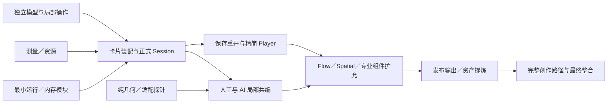

# 统一组件重构：当前计划与历史任务索引

> **2026-10-05 唯一当前执行方案：** [稳定基线恢复与 V10 渐进替换完整并发计划](BASELINE_FIRST_V10_EXECUTION_PLAN.md)。先保全全部 V10 材料，再恢复 V10 前成熟完整前端，沿既有端口渐进替换。任何 UI 模块改动前必须评估新合同必要性或已证问题，不经评估不全量重写。
>
> **当前仅方案，未授权实施。** 不回退、不改产品源码、不运行产品检查、真实模型或课件创作；发布继续暂停。方案由 Root 撰写、Astra 技术审阅；Luna 只承担未来明确机械动作，不参与方案设计或正文。
>
> 新计划定义精确写域、分级模型、接口 DAG、文档级唯一 writer、真实 UI 与独立保存重开证据。原 N00a/N00b、N01–N10、L01–L26/L23a,b 目标仍有效。计划不表示派发，实际状态看[任务板](../TASK_BOARD.md)。[UI 恢复补充方案](UI_REINTEGRATION_EXECUTION_PLAN.md)与[创作管线补充方案](AUTHORING_PIPELINE_UNIFICATION_EXECUTION_PLAN.md)保留为历史资料，不作为当前起跑指令。

## 1. 当前执行与历史使用

当前派发只使用[新计划第 6–8 节](BASELINE_FIRST_V10_EXECUTION_PLAN.md#6-可执行并发工作包)，UI 动机使用第 4/7 节，真实验证与切换使用第 9 节，未来启动正文使用第 13 节。候选基线 027d588a 尚需实际观察，不能称本轮已确认稳定。

**以下内容是原 N/L 拆解和旧阶段安排的历史索引。** 保留目标定义供新计划映射；其中旧模型、M 仅调度、旧基线、UI/P 起跑和检查安排不覆盖新计划。开发方案与技术取舍由 Root/Astra 完成；旧入口不能自动启动实施。

<a id="model-routing"></a>
### 1.1 模型与思考强度：派发时显式指定

本表保留总 N/L 与 UI 恢复阶段的调度配置；当前创作管线 P 包按[新补充方案 §3](AUTHORING_PIPELINE_UNIFICATION_EXECUTION_PLAN.md#3-唯一-owner精确写域与模型预设)配置，不沿用历史全 L 初始档位或14个 U 并发数。不修改果铃产品默认模型，也不替代真实课件生成测试的已授权 provider 配置。模型名称必须用精确 ID，尤其 `gpt-6.1-sol` 不能误写成上一代 `gpt-6-sol`。

| 角色 | 精确模型 ID | reasoning_effort | 负责 |
|---|---|---|---|
| M 总调度（当前恢复期） | 沿用用户选择的当前主会话 | 沿用当前设置 | 按规则派发、依赖协调、写域交接、转交问题和进度沟通；职责只调度 |
| I 共享集成 | `gpt-6-astra` | `xhigh`（当前恢复期） | 公共合同、driver、Store 组合根、Bridge/Projection、统一选择与 ACK/history、必要注册；App/World 交独立 owner |
| L01–L26 实现，包括 L23a/L23b | `gpt-6.1-sol` | 按 §1.2 的 `medium`／`high`／`xhigh` | 具体实现、脚本／测试编写，主动识别并提交需专家处理的问题 |
| A 固定专家角色 | `gpt-6-astra` | `xhigh` | 固定节点的方案／架构决定，承接 Sol/I 提出的高难根因、取舍与必要修复 |
| E 机械执行池 | `gpt-6-luna` | `max` | 执行明确命令、构建、测试、截图和记录；失败事实直接交原作者／I |

M 可以读取调度必需的方案、工具说明和回执；代码阅读分析、diff 审查、脚本运行、工作树操作和文档落盘均委派给适合的子智能体。M 不以“只是小改”例外替代实现者。E 可以按已确定内容更新日志／任务卡，不能自行作架构解释或改产品／测试逻辑。

配置只指定模型与思考强度。所有 L 任务仍由 Sol 默认实现；A 是明确的专家职责，不替代全部开发。M 按任务表或 Sol/I/A 的明确技术建议选择强度，不自行把“耗时长”“重要”解释为应升档或换模型。

### 1.2 每个任务的初始强度与调整规则

下表按当前范围给出明确的初始分配，不是性能已实测的结论。模型负责实现与必要脚本／测试编写，已确定命令的实际执行交 E。medium 用于复用既有实现与边界明确的 adapter，high 用于常规多文件开发和集成，xhigh 只集中在尚有较大设计不确定性的工作。

| 任务 | 工作 | 模型／强度 |
|---|---|---|
| I | 正式合同、driver 与共享接线；恢复期精确职责见补充方案 | `gpt-6-astra` / `xhigh`（当前恢复期） |
| L01 | 自由几何与组内变换 | `gpt-6.1-sol` / `high` |
| L02 | 设计视口测量与装配 | `gpt-6.1-sol` / `xhigh` |
| L03 | 资源与预览 producer | `gpt-6.1-sol` / `medium` |
| L04 | 内存编译与缓存 | `gpt-6.1-sol` / `high` |
| L05 | 组件实例与功能运行 | `gpt-6.1-sol` / `high` |
| L06 | 动效与取消 | `gpt-6.1-sol` / `high` |
| L07 | 导航、控制台与快捷键 | `gpt-6.1-sol` / `high` |
| L08 | GJS／薄编辑层探针实现 | `gpt-6.1-sol` / `high` |
| L09 | 编辑投影与正式局部操作 | `gpt-6.1-sol` / `xhigh` |
| L10 | Slide 自由编辑 | `gpt-6.1-sol` / `high` |
| L11 | Spatial 世界与镜头 | `gpt-6.1-sol` / `high` |
| L12 | Flow 会话与互动 | `gpt-6.1-sol` / `high` |
| L13 | 文字与公式 | `gpt-6.1-sol` / `medium` |
| L14 | 图片 | `gpt-6.1-sol` / `medium` |
| L15 | 形状／SVG | `gpt-6.1-sol` / `medium` |
| L16 | 表格 | `gpt-6.1-sol` / `medium` |
| L17 | 图表 | `gpt-6.1-sol` / `medium` |
| L18 | 输入、选择与功能组合 | `gpt-6.1-sol` / `medium` |
| L19 | 内容应用与身份／顺序 | `gpt-6.1-sol` / `xhigh` |
| L20 | 项目文件与交付入口 | `gpt-6.1-sol` / `high` |
| L21 | Published producer | `gpt-6.1-sol` / `high` |
| L22 | 独立 Player | `gpt-6.1-sol` / `high` |
| L23a | PPTX 输出 | `gpt-6.1-sol` / `high` |
| L23b | DOCX／PDF／静态输出 | `gpt-6.1-sol` / `high` |
| L24 | 资产库与提炼 | `gpt-6.1-sol` / `medium` |
| L25 | Skill、示例与入口说明 | `gpt-6.1-sol` / `medium` |
| L26 | 样本、测试脚本与比较夹具 | `gpt-6.1-sol` / `high` |

初始共 9 个 medium、15 个 high、3 个 xhigh 叶子（L23 分两支计）。xhigh 的三个重点是 L02 保真装配、L09 编辑／ACK／历史边界、L19 意图与局部应用；这些边界确定后，常规接线、修补和新增适配可以按实际内容降到 high／medium，不永久绑定高档。

明确的子任务按其自身难度选档：专业组件若只是复用数据／render／属性 adapter 用 medium；若需要新的编辑算法或跨会话状态处理用 high；尚未收口的 C0/C1 公共语义或无法解释的并发根因可用 Sol xhigh。L26 的比较方法／有效性判断用 high，已确定规则下的 fixture／简单脚本编写可用 medium。机械执行仍归 Luna，不因编写任务简单而把代码工作转给 E。

不因一次普通编译错误或测试失败自动升档，不设固定失败次数；依据原作者给出的具体不确定性调整该子任务。接口已清楚、行为证据稳定时复用原成果，不用高档模型重新做一遍。当前接口若不能调整既有会话强度，在明确的任务交接点新派合适会话，不能伪称已改档，也不为每个微小步骤重建智能体。

以上为任务分配判断，不保证某个档位必定更快或正确；不为定档另建全面模型评测。[官方推理强度说明](https://developers.openai.com/api/docs/guides/reasoning)指出较低档倾向更低推理开销，具体质量仍由实际任务结果判断。

### 1.3 固定专家职责与无需 Luna 裁决的问题路由

启动时固定建立一个 `gpt-6-astra`／`xhigh` 专家 A，与 I 和独立叶子并行。A 对具体方案／架构判断和高难根因负责，I 对实现／接线和唯一正式写入负责；M 不裁决技术问题，也不判断某个请求“够不够难”。

| 明确参与点 | 提供输入者 | A 的有界交付 |
|---|---|---|
| N00a：C0/C1/R0 首次收口 | I、L05、L09、L19 | 尚未定的作者数据归属、局部操作／ACK／历史和生命周期边界的具体决定 |
| N00b：编辑适配选型 | L08、I | 根据实际探针确定 GJS 采用、局部保留或退出；不凭库宣传定案 |
| N08：P0 与实际运行边界首次收口 | I、L21、L22 | 作者数据到发布物、运行资源和既有权限边界的对应关系，解决具体跨域分歧 |

以上是专家参与决策的固定时点，不是给每个提交增加专家批准。已明确的规则直接落实，既有有效结论复用；只等待真正依赖未决问题的接线，其他实现／验证继续。A 不从头重写总方案，不全量审查每个 L 任务，不重复跑矩阵。

任一 Sol 原作者或 I 可以明确提出“交专家 A”，附具体问题、相关文件／候选、已有证据和需要决定的事项。**M 收到后直接转交或按既有问题会话续接，不得自行驳回、降级成普通任务或要求先多试几轮。**A 判断问题如何解决，结果交 I／原作者落实。若执行器支持子智能体直接通信，可直接联系 A 并同步 M；否则由 M 原样转发，不能让接口差异阻断求助。

测试执行者 E 只把失败事实交原作者／I，是否需要专家由技术执行者决定。原作者提出的高难定位、多个方案取舍、跨模块数据／状态问题均可调用 A，不设固定重试次数；普通已定位错误由原作者修复即可。

固定专家角色不意味着无任务时永久占一个运行槽。保存 A 的会话 ID 和已定结论，必要时释放槽位；固定节点到达或 Sol/I 发出请求时，M 必须恢复该专家或按相同模型／强度续建并交接，不再次判断是否值得启动。A 忙时由 A／I 给出技术依赖，M 按队列协调，不另起重复专家审查。

### 1.4 显式派发与低负担记录

创建 L 实现子智能体时必须显式填写 `model: "gpt-6.1-sol"`，并按 §1.2 填入实际 `reasoning_effort`，避免继承 M 的设置。当前恢复期 I/A/U/E 的配置和真实模型交接按补充方案 §2；不能把前 I 会话假称已经升级。新派的明确简单 L 任务用 medium，未单列的一般多文件实现默认 high，不能默认全部 xhigh。字段名按执行器文档映射，不猜别名或省略强度。

模型、强度、agent ID 和目标工作区写入现有任务卡的 Owner／Evidence 或同一简短运行记录；不新增一套登记平台。六字段任务卡结构不变。实际不支持的模型／强度如实说明，不静默替换。

每次派发只传该任务的结果、相关计划条目、直接接口、允许写域、必要验证和运行信息，并提供专家 A 的实际会话 ID／转交方式，要求技术执行者主动提出方案、架构与高难问题。默认不复制整段历史或全文方案给每个子智能体；确实需要前文上下文时才继承。所有开发委派必须传递最小充分验证和无额外门的原则。

### 1.5 测试流水线与返修

1. Sol／Astra 编写必要的检查，并交付明确候选、命令、输入和待证明属性。E 在隔离工作区或固定候选上执行；运行期间不让另一个执行者修改测试正在读取的代码或产物。
2. M 在测试期间继续派发已就绪实现任务；原作者可在另一工作区继续后续工作。只有下一步真正依赖测试结论时才等待，不反复轮询全部智能体。
3. E 回报实际候选、命中用例、退出结果、产物及失败信息；源码问题由原作者／I 分析。E 不改断言、不补产品逻辑、不通过 skip 或重复重试消除失败。
4. 优先将失败交回原作者，保留上下文；原作者不便接手且范围可独立移交时，派 `gpt-6.1-sol` 返修，强度依据原作者／I 对修复范围的说明。Sol/I 明确请求专家时按 §1.3 直接转交 A，不由 M 再作难度判断。
5. 同一文件不能同时由原作者和返修者写。M 协调写权转交，I 处理技术冲突，E 执行已确定的机械应用。修复后只重验受影响属性，未变化证据复用。
6. 测试失败只限制真正依赖该失败属性的合入／验收，无关开发继续。代码写完、局部测试通过、集成通过与 Owner 接受分别报告，不互相替代。

任务记录／任务板只由一个指定 E 写入；并行测试 E 各写独立日志。已完成且没有相关后续任务的智能体及时关闭释放执行器容量；修复可恢复原会话或携带必要上下文新建，不用一群空闲智能体占满并发槽。

## 2. 当前起点与实施边界

### 2.1 已知基线

- 当前代码仍有 V9／Published V2／Component API 4。GJS 只做过隔离原型，未接入正式 Session／Player；不能以原型 JSON 往返替代保存证据。
- 已有 `DocumentSession`、`CourseV9Driver`、工程资源、保存恢复、ProjectFileCoordinator、DocumentDeliveryService、专业 DOM/SVG、Flow 与 Player 可复用。
- 当前任务板仍有旧 `creation-restructure` 等 active 记录及粗粒度写锁。实施前查明其实际剩余范围并协调锁；不凭标签推断仍有子智能体运行，也不直接删除旧卡或宣称任务完成。
- 工作树含已有未提交改动。新 worktree 不能仅从 HEAD 创建后就假定包含这些成果；I 明确本轮需要的基线，E 按确定指令用经核对的补丁或既有授权的提交同步。保留无关用户修改，不自行 stash、reset 或混入。
- `npm test` 和 `npm run test:e2e` 有构建／fixture 前置。本轮局部检查优先直接运行已明确的 Vitest／Playwright 用例，避免暗中触发完整构建和模型矩阵。

### 2.2 已确定、不再让各线自行解释的规则

| 主题 | 执行决定 |
|---|---|
| 正式模型 | 果铃独立 Schema，编辑库只投影；无第二 writer／历史 |
| 布局 | Slide／Spatial 保存 frame 与组内关系；Flow 保存阅读顺序；组件内部自有布局 |
| 内容应用 | 改内容、插入、改主题样式、明确重做四类意图；输入 HTML 大小不决定替换范围 |
| 可编辑对象 | 卡片／编组、文字框、图片、专业／程序组件；不拆行内强调或程序内部绘制 |
| 运行 | 预置默认实现共享，定制代码优先内存执行；保留真实解析／依赖／权限／清理，不加静态后备必经门 |
| 变更 | 身份定位的语义局部操作；手势合并，ACK 不重提交，人工和 AI 编辑均可撤销 |
| GJS | 可修补、可局部保留、可退出；几何和数据链路不依赖它 |
| 复用 | 保留专业算法和通用服务，替换旧 driver／carrier；不因文件名旧而整文件重写 |
| 验证 | 对应结果的最小证据，变化未触及的证据复用；不按日历、并发数量或审查者变化重跑 |

不在本轮建设：兼容迁移器、通用插件市场、调度平台、可视化脚本语言、全局断言 DSL、复杂威胁评分、全量响应式页面引擎。Office、模型目录、工作台外观和浏览器连接只复用实际所需接口。

## 3. 文件所有权与并发规则

### 3.1 共享集成 owner：I

当前恢复期 I 是 `gpt-6-astra`／`xhigh` 的集成子智能体，不是总调度 M。精确中心写域与功能 owner 见补充方案 §3–4；App、运行世界/Player、delivery、导入不再集中给 I 实现。尚未收口的公共语义由 A 按需参与决定。A 确需直接修改共享文件时，M 明确移交，I 暂停对该处写入，完成后交回，不能形成两个架构 writer。

I 持有以下共享文件的最终写入权，其他线可以提出小而具体的接口改动，不直接交叉编辑：

- `src/shared/contracts/component-platform/**`：基础节点、frame、操作、运行端口和发布公共类型。
- `src/shared/workbench/document.ts`、`src/main/workbench/DocumentHostService.ts` 及必要 schema／Session 接线；后者当前通过 `createCourseV9Driver` 注册课件 driver，是已核实的切换点。
- 新 `src/core/drivers/CourseV10Driver.ts` 和当前文档／文件驱动选择位置。
- 现有 `src/renderer/store/editorStore.ts` composition root、`src/renderer/store/editorStoreKernel.ts` 必要共享读写端口与工具注册点；恢复期 App/应用路由整组交 U0，三表面原 consumer 交 U4/U5/U6，`src/player/surfaces/CoursePlayer.ts` 与运行世界交 U11。
- 恢复期 `src/renderer/export/course/buildPublishedCourse.ts` 发布调用切换与 `src/main/workbench/delivery/DocumentDeliveryService.ts` 整组交 U12；导入／文件应用交 U13。公共类型补丁返回 I，不让叶子只交 adapter 等 I 接完业务。
- `package.json`、lockfile、构建／测试配置、共享 generated index。
- 正式合同、总方案入口与实际任务锁的协调；已确认的叶子文档可交给相应 owner。

这不是让 I 全部实现这些领域。可以将一个精确文件的写权明确移交某叶子，完成后接回；同一时刻只能一个 writer。公共合同中独立文件也可这样移交，但不能由各线新增同义 DTO、私有协议或包一层兼容类型。

N00a 由 I 集成，不再起第二个“核心架构实现者”同时改相同类型。新 driver 复用 Session 的历史与保存，而不是复制 Session。现有内核只有确实不支持新数据／操作时才改必要入口。

### 3.2 叶子写域

§6 的路径是建议落点，现有文件用作复用依据，新路径明确为待创建。I 以实际文件细化，M 据此派发；路径调整是工程选择，不需要再征求产品批准。所有 L 任务的模型／初始强度遵循 §1.2，具体强度调整由技术执行者说明，M 负责执行，不自行恢复旧的高比例 Astra 实现分配。

每个叶子同时拥有自己的针对性测试，例如 `tests/unit/componentPlatformL01.test.ts`；这些名称是计划，不是已经存在的通过证据。公共 S1–S5 fixture 由 L26 维护，各线只提交需要加入的变化，不同时编辑同一大样本。

默认组件建议各用 `src/components/<kind>/` 独立包目录，数据／render／editor／output 使用明确入口。Player 只消费 render／runtime，不因统一目录把 React 编辑 UI 一起带入。这个目录是代码组织，不是新包管理平台；总方案已有模块边界不因目录名字改变。

### 3.3 调度与资源

- 采用就绪队列：输入接口存在且当前写域可独立实现，就启动；不以“整个 N02 未验收”为理由阻止一个只需已稳定类型的组件叶子。
- M 每次收到完成、接口可用或阻塞解除的回执，都立即补充所有可运行的空闲槽位；不等一波全部结束。不把本计划的 26 个任务域当并发上限，必要时可在真实独立写域上继续拆分，例如文字／公式、PPTX／文档输出，但不得重复同一工作。
- 并发以实际执行器槽位、真实服务限制及非重叠就绪任务为边界；不承诺未经核实的固定人数，不另加人为配额。优先使 I 和必要 E 能运行，避免把全部槽位占给等测试／等接口的空闲实现者；完成或可明确交接的会话及时关闭、需要时恢复。
- 不为凑并发把一个十几行函数拆成多个需要同步的任务。子线遇到共享文件需求时交给 I，继续自己的独立工作。
- Worktree 隔离写入不等于接口隔离，必须基于同一已记录的相关基线。交接不以长报告代替实际 diff／代码。
- 模型并发可高，昂贵 Electron／截图／全构建按真实机器承载协调；同一集成产物只构建一次供相关验证共享。出现 CPU／内存竞争就减少重型命令并发，不减少已独立的代码工作。
- 模型任务和本地重型命令分开安排：一个 Electron 实例繁忙不意味着其他 Sol 必须停止编码；同一共享文件必须单 writer 也不意味着所有文件只能由 I 串行编写。I 可按明确交接移交独立文件的接线工作，避免成为吞吐瓶颈。
- 当前环境若不足以提供全部执行者，按 §5 的关键依赖优先。计划中的并发不是保证可用工具数量，更不能声称未启动的智能体在工作。
- 不新增任务计时、固定调用数或文件数门。外部服务真实限制、主动停止与未知副作用查询照常保留。

## 4. 用真实样本收口的最小接口

接口按需要推出，不先冻结一个完整 SDK。下表说明谁提供什么、谁可据此开工；不规定每次变化都要发布新版本或重新走审批。

| 接口切片 | 提供者 | 足够让下游使用的内容 | 直接 consumer |
|---|---|---|---|
| C0 作者内容 | I，数据需求来自专业叶子 | 实例／定义引用、独立专业数据、单一父子关系、frame／Flow 位置、资源引用 | 默认组件、装配、几何、driver |
| C1 局部操作 | I 与 L09/L19 的实际操作对齐 | 字段／正文／frame／结构／实现操作，基线与回执；一次事务及逆操作归 Session | 人工编辑、文件 apply、保存／撤销 |
| R0 实例运行 | L05 提案，I 收公共类型 | mount/update/dispose 最小语义、目标／事件／状态作用域，取消／清理 | 默认组件、行为、编辑预览、Player |
| R1 临时表现 | L06/L07/L11 提案，I 收公共类型 | motion replace/cancel、导航请求／状态、camera 适配；只做真实用到的部分 | 动效、控制台、空间、Player |
| A0 内容计划 | L19 提案，I 收公共类型 | 内容来源／意图／目标、资源与对象变化计划、明确三态结果 | 项目文件、MCP、导入、交付 |
| P0 发布投影 | L21/L22 提案，I 收公共类型 | 从正式数据生成的精简组件／表面／依赖数据，运行初态 | 独立 Player、输出与资产 |

C0 可先表达真实卡片与形状，再按专业实例增加必要数据接口。R0 不提前塞入全部导航、媒体、作业和任意 OS 能力。临时 stub 可以帮助私有开发，但结束证据必须接真实接口；公共合同不为了占位预建几十个空方法。

局部操作的具体测试实例应在 N00 给出：拖动卡片只产生 frame 操作；改标题只产生内容操作；同一次 ACK 不增加 revision；一次撤销还原相应变化；相邻对象和未改运行实例保留。

## 5. 开发顺序与关键路径

### 5.1 启动面

**当前恢复期起跑覆盖：** 按补充方案 §5 在既有 I 候选上接原 UI，先真实交接 Astra xhigh I，再按已有接口释放 U0–U13。下述原 N/L 起跑集合是总体依赖参考，不表示重做已有算法、等待全合同或重新启用简化 UI 根。

启动时建立 A 专家角色，I 同步已有任务锁／基线并搭最小 C0/C1／driver，A 并行处理首次合同收口中的未定问题；同时启动以下独立叶子：

| 可先行任务 | 为什么不必等待完整新 Schema |
|---|---|
| L01 纯几何 | 输入／输出为数学变换，不需 GJS 或工程持久化 |
| L02 浏览器测量 | 输入 HTML、视口、字体／资源，输出装配中间数据；接正式节点由 L19/I 完成 |
| L03 资源处理 | 有效图片、解码和引用解析复用已有资源服务 |
| L04 内存编译 | 源码／依赖到运行模块，不需要页面格式；缓存不是作者存储 |
| L06 动效基础 | 可取消的 DOM 表现／时间线算法不依赖具体页面格式 |
| L08 编辑适配探针 | 比较同一卡片上的输入、选取、IME 和变换，不注册产品 writer |
| L15 形状能力 | 提取既有 SVG／路径算法和最小数据接口，避开旧 carrier 依赖 |
| L26 贯通样本 | 保存原始输入、字体／资源与行为基准，不需要新产品已实现 |

这些任务不是先写完整旧路径修复。纯输出在相关接口就绪后接入新链路，发现现有通用服务已能承担职责就直接复用，不为了产生 diff 再造实现。

### 5.2 滚动放量

- C0/C1 出现可用最小形状后，L05、L13–L18、L19、L21 立即接入；无需等 GJS 探针结束。
- R0 可用后，L07、L12、L22 开始真实接线；未依赖运行时的 UI／专业数据部分可以更早写。
- L01 变换和 L08 取舍有证据后，L09、L10、L11 完成编辑接线；不把空间挂到 GJS 无限画布。
- A0 接口可调用后，L20 接项目路径／MCP；C0/R0/P0 可用后，L23/L24 做目标格式／资产；L25 只在真实入口可用时更新 Skill 交付能力。
- 一条线完成立即移去当前就绪的下一条，不等待整波“全绿”。共享类型变化只通知直接 consumer，不召回所有线重做。

### 5.3 贯通作品的集成次序



关键路径是最小操作／driver → 装配结果入 Session → 保存／Player → 编辑往返 → 真实组合输出。GJS 不是公共数据链路的前置，资产与输出 adapter 不必等整个 UI 完美。

N00a 以直接操作证明数据与运行，N00b 以真实鼠标／键盘证明编辑。它们共享一份卡片样本，不能互相借用未覆盖属性。之后逐步加入 Flow 与空间、复杂行为和专业输出，最后完成同提示词创作比较。

## 6. 可直接派发的任务清单

以下任务全部为计划定义。实际派发时填入执行者、精确文件清单、当前基线与目标用例，使用既有六字段任务卡即可，不复制一套新的台账。

### L01 — 自由几何与组内变换（N00b／N03）

- **结果**：同一矩阵逻辑支持 Slide 与 Spatial 的命中、拖动、缩放、旋转和组内坐标；屏幕包围盒不代替作者 frame。
- **输入／复用**：`src/shared/geometry.ts`、`src/renderer/composition/compositionLayout.ts` 的可复用数学；最初可用独立数学输入，接 C0 的 frame。
- **独占落点**：新 `src/core/components/geometry/**`；不得改 editorStore、GJS 状态或表面注册。
- **实现顺序**：矩阵组合／求逆 → 固定锚点缩放与旋转 → 编组／解组保留视觉位置 → 可供所有表面调用的窄函数。
- **最小证据**：一个嵌套旋转组在不同镜头缩放下，指针往返与成员位置正确；集成真实拖动由 L10/L11 共享验证，不本线再造测试编辑器。
- **交接**：纯函数、坐标单位／方向和支持的仿射范围。缺少必要表达时向 I 提 frame 需求，不私增第二种坐标类型。

### L02 — 设计视口测量与装配粒度（N00a／N07）

- **结果**：普通 HTML/CSS 按设计尺寸形成忠实的对象／编组测量，首次装配不依赖工作台窗口。
- **输入／复用**：`src/shared/layoutMeasure.ts`、现有 HTML import 测量和 `pageHtml.ts`／`spaceHtml.ts`；使用 L26 原稿、L03 资源结果。
- **独占落点**：新 `src/main/workbench/contentApply/measurement/**`、`src/core/contentApply/assembly/**`。不自己提交工程。
- **实现顺序**：视口／主题／字体／图片准备 → 一次采集后统一转换 → 人类可指认粒度 → 输出原始变换、样式与内容关系；复杂程序保留源区域。
- **最小证据**：一张卡片与原稿在相同设计视口的关键矩形和实际呈现相符；一次必要重复确认测量不漂移，按已校准容差而非哈希判定。
- **交接**：装配数据及具体缺资源诊断，L19 负责赋身份、排序和正式操作。不能以缺一个资源拒绝全部可用内容。

### L03 — 资源与有效预览 producer（N00a／N07）

- **结果**：程序／HTML 共用有效图片和资源处理，消除软件自产坏占位图导致的失败。
- **输入／复用**：`src/core/projectFiles/programs.ts`、`src/main/workbench/htmlImport/prepareHtmlCourseCandidate.ts`、现有 resource／sharp 服务。
- **独占落点**：新 `src/main/workbench/contentApply/resources/**`；旧调用点由其 writer/I 同批接线，不能本线和 L19 同改 coordinator。
- **实现顺序**：复用可解码占位 producer → 真实资源引用与缺失诊断 → 渲染后可选捕获更新；不把捕获当导入前置。
- **最小证据**：共享 producer 的真实输出可以解码；一个缺资源输入仍保留可用内容并定位缺口。
- **交接**：资源准备结果与必要引用修改，不维护独立资源数据库或重复包登记表。

### L04 — 定制模块内存编译与缓存（N00a／N02）

- **结果**：普通局部源码不先写磁盘构建包即可解析／转译／加载，源码和依赖未变时复用缓存。
- **输入／复用**：已有构建、模块依赖解析和缓存基础；后接 R0，不依赖 GJS。
- **独占落点**：新 `src/core/components/compilation/**` 与必要的 `src/main/workbench/contentApply/compilation/**`。I 承担 IPC／构建注册共享点。
- **实现顺序**：真实语法与入口 → 依赖解析 → 内存模块 → 以源／选项／依赖版本区分缓存 → 错误保留源码与诊断。
- **最小证据**：一个真实模块首次运行、同源命中缓存、源码改变后更新；语法坏输入只影响相应模块。记录实际冷／热结果，不设无证据 5 ms 门。
- **交接**：加载／释放接口和可恢复诊断；不得靠解析器承诺任意 JS 生命周期安全，不删除必要的打包／发布能力。

### L05 — 组件实例与功能运行内核（N00a／N02）

- **结果**：定义、实例、数据、行为和运行状态在编辑预览与 Player 中使用同一实现。
- **就绪条件**：最小 C0；本线与 I 从真实实例收口 R0。源码加载消费 L04，预置实现不进入编译路径，不等待自身尚未产出的完整 R0 才开工。
- **独占落点**：新 `src/player/components/runtime/**`、`src/core/components/definitions/**`。不改各专业组件包。
- **实现顺序**：共享默认实现 → 实例作用域与目标／事件／状态 → update/dispose → 私有覆盖与恢复 → 必要跨容器 adapter。
- **最小证据**：一个无外观行为驱动真实答案区，编辑预览／Player 均运行；卸载后旧事件和动效不再作用目标。
- **交接**：生命周期与实际端口；运行逻辑只一份，宿主差异只在 adapter。不要实现无人使用的完整权限／事件平台。

### L06 — 可编程动效和取消语义（N00a／N06）

- **结果**：默认动效是可改源码的模块，支持任意逐帧算法，replace/cancel 不留旧写入。
- **输入／复用**：`PublishedDomInteractionSurfacePort.ts` 和已有 WAAPI／reduced-motion 行为；算法阶段只需 DOM 目标，正式阶段接 R0/R1。
- **独占落点**：新 `src/player/behaviors/motion/**`；不拥有 camera 正式位置或导航顺序。
- **实现顺序**：作用域任务／清理 → 表现层与 frame 变换合成 → 一份可编辑默认效果 → 连续替换与取消。
- **最小证据**：同一对象保留人工旋转，动效可正常完成和中断；取消后晚到回调不改画面。
- **交接**：表现与取消 API、默认源码；不扩为时间线平台，不靠固定效果枚举限制生成。

### L07 — 导航过渡、控制台与快捷键（N06）

- **结果**：页面／步骤／镜头使用唯一导航事实，控制台可深改或关闭后独立导航。
- **就绪条件**：R0、所需 R1 及 L06；消费各 surface 的位置端口，不持有第二个位置清单。
- **独占落点**：新 `src/player/behaviors/navigation/**`、`src/components/teacher-controller/**`。旧全局注册和顶层快捷键接线交 I。
- **实现顺序**：导航请求任务 → 目标准备／视觉过渡／完成与取消 → 控制台默认源码 → 键盘与翻页笔让路规则。
- **最小证据**：连续翻页／切镜头最终停在最后有效目标；输入框／IME 不被方向键抢占；关闭默认控制台后独立按钮仍使用同一导航。
- **交接**：控制台定义、所需宿主端口和实际快捷键注册位置，不复制课程状态机。

### L08 — GJS 与薄编辑投影对比（N00b）

- **结果**：用有界样本决定 GJS 采用、局部保留或退出；不把未验证库能力当产品承诺。
- **输入／复用**：已有 GJS 0.23.6 隔离样本、现有 WebComposition，候选 Moveable／Selecto；浏览器操作按可用浏览器 Skill 执行。
- **独占落点**：新 `scripts/quality/component-platform/adapters/**`、`tests/fixtures/component-platform-adapter-probe/**`；生成输出进入 `output/architecture-spike/component-platform-adapters/`，不独立修改产品依赖／lockfile。
- **实现顺序**：同卡片／旋转组 → 选取与行内粒度 → 文本输入／IME → iframe 焦点／坐标／AI 目标映射 → 与薄投影比较适配成本。
- **最小证据**：真实指针／输入和目标绑定演示，附具体采用／降级理由；无须形成多库大评测报告。
- **交接**：可保留代码和明确不适用能力。需要第二历史、全页重载、修改库核心才能接线时按总方案退出条件执行。

### L09 — 编辑投影到正式局部操作（N00b／N01）

- **结果**：编辑库可变状态转 C1，ACK 局部更新不重复提交，不以 reload 页面同步。
- **就绪条件**：C0/C1；采用何种 view 由 L08 决定，binding 的正式操作不依赖 GJS JSON。
- **独占落点**：新 `src/renderer/webEditor/binding/**` 和选定的 `src/renderer/webEditor/adapters/**`。
- **实现顺序**：目标映射 → 事件到操作 → 本地待 ACK 投影 → ACK 抑制与外部更新 → 手势／文字历史合并。
- **最小证据**：人工拖动、AI 改字保持位置；ACK 不多一条历史；撤销／重做能还原人工及 AI 变化，IME 期间无关更新不打断输入。
- **交接**：统一编辑端口和注册需求；不引入第二 store／undo manager。

### L10 — Slide 与共用自由编辑交互（N01／N03）

- **结果**：常用自由编辑完整可用，不止鼠标拖坐标。
- **就绪条件**：L01、C1、L09；专业对象 view 可逐个到达，不等全部组件齐全。
- **独占落点**：新 `src/renderer/surfaces/slide/**`、`src/renderer/webEditor/geometry/**`、`src/renderer/webEditor/selection/**`。
- **实现顺序**：选取／多选 → 拖拽／缩放／旋转 → 编组／解组 → 对齐／分布／吸附／参考线／层级／复制 → 工具条与当前选区 AI。
- **最小证据**：同一旋转编组完成相关手势且一次撤销；独立图片等比缩放；局部编辑不动邻居。依据实际变化选操作，不逐项全组合测试。
- **交接**：Spatial 可复用的手势服务；对应旧 Phaser consumer 的替换清单由 I 成套切换。

### L11 — Spatial 世界与镜头（N03）

- **结果**：自有视口／世界变换承载自由对象和镜头路径，不依赖 GJS infinite canvas。
- **就绪条件**：C0、L01；编辑消费 L10 窄手势，运行消费 R0，导航消费 L07。
- **独占落点**：新 `src/renderer/surfaces/spatial/**`、`src/player/surfaces/spatial/componentSpatialAdapter.ts`、`src/player/surfaces/spatial/componentPlatform/**`。
- **实现顺序**：世界／视口矩阵 → 对象渲染与命中 → 镜头状态端口／停靠点 → 状态保持 → 有瓶颈再加必要离屏处理。
- **最小证据**：代表性大世界中旋转组命中与拖动正确；镜头切换不改作者 frame，不无故重建实验状态。
- **交接**：camera 的实际读写／过渡端口；不另存导航序列，不给每张卡片常驻 GJS。

### L12 — Flow 同一编辑会话与深度互动（N04）

- **结果**：正文、随文块和范围行为共用编辑／历史；阅读流保真并可持续修改。
- **就绪条件**：C0/C1、实际 R0；可先复用正文操作，不依赖 L08/L09 的 GJS 分支。
- **独占落点**：新 `src/renderer/surfaces/flow/**`、`src/player/surfaces/flow/componentFlowAdapter.ts`、`src/player/surfaces/flow/componentPlatform/**`。
- **实现顺序**：正文／块输入映射 → 范围与阅读锚点保持 → 块重排 → 收展／跳转 → 接 L18 的输入／选择与功能浮层。
- **最小证据**：一份讲义中改字、中文输入、块换位和收展正确；收展推移后文，弹层不占文档流；修改后阅读位置保持。
- **交接**：Flow 端口与必要字段；不得建立多个正文副本或按段落创建自由图层。

### L13 — 文字与公式默认组件（N05）

- **结果**：富文本／公式、行内格式与专业输入可编辑，文字高度策略明确。
- **就绪条件**：C0；可以先整理既有正文／公式算法，R0 到达后接 render。
- **独占落点**：新 `src/components/text/**`、`src/components/formula/**`。不得改 Flow 根会话或默认全局字体登记。
- **实现顺序**：专业数据／render → 编辑 adapter → grow-height／fixed／shrink 策略 → 范围效果／源码覆盖所需接口。
- **最小证据**：带行内强调和公式的文字框修改后格式保留、固定位置不变，长文字按策略增长或诊断。
- **交接**：专业数据与 render/editor/output 窄入口；默认实例无独立编译，输出 adapter 由 L23 调用。

### L14 — 图片默认组件与局部变换（N05）

- **结果**：原件、裁切、fit、遮罩／滤镜与派生资源有清楚归属，AI 修改同一对象。
- **就绪条件**：C0 与 L03；复用实际图片处理，不新接收费图像模型。
- **独占落点**：新 `src/components/image/**`，专用图片处理 adapter 在该包内声明后由 L03/I 接资源服务。
- **实现顺序**：原件引用 → 显示参数与裁切 → 手动／AI 数据修改 → 实际支持的像素派生与可恢复原件。
- **最小证据**：局部改图／裁切后保存重开正确，原资源和其他实例不被覆盖；背景／srcset 未支持范围如实诊断。
- **交接**：资源请求、专业属性与输出数据，不复制资源索引。

### L15 — 形状与 SVG 深改（N00a／N05）

- **结果**：原生形状可以就地改数据／路径／实现，保持身份和人工几何。
- **输入／复用**：`nativeLineGeometry.ts`、专业 SVG／shape render，先复用纯算法，再接 C0/R0。
- **独占落点**：新 `src/components/shape/**`。共享 geometry 只调用 L01，不重造变换库。
- **实现顺序**：数据与绘制 → 路径／样式编辑 → 一次定制实现 → 恢复默认保留 frame。
- **最小证据**：S1 形状局部定制与恢复，未选同类实例不变，重开保留作者数据。
- **交接**：专业 schema／adapter 需求与默认实现，测试不以 SVG 字符串存在替代实际效果。

### L16 — 表格默认组件（N05）

- **结果**：单元格、合并、行列和格式继续专业编辑，进入统一组件与输出。
- **就绪条件**：C0，复用现有 Table／FlowTable 数据算法，提取必要中立部分。
- **独占落点**：新 `src/components/table/**`。
- **实现顺序**：专业数据 → render/editor → 实际合并与尺寸操作 → output adapter。
- **最小证据**：代表性合并表格改内容／尺寸后重开、语义输出正确；不重新建设表格引擎。
- **交接**：包入口给 L12/L21/L23，不能通过“组件统一”把表格变截图。

### L17 — 图表默认组件（N05）

- **结果**：真实数据、系列、坐标与图例可改，支持局部样式／行为和专业导出。
- **就绪条件**：C0/R0，复用 `src/shared/nativeChartView.ts` 等现有专业数据／绘制；不把评审提到的 ECharts 当作已存在依赖，也不因此新增图表库。
- **独占落点**：新 `src/components/chart/**`。
- **实现顺序**：数据／默认 render → 编辑 → 行为接口 → 可支持目标格式的专业输出。
- **最小证据**：改一组真实数据后编辑预览／Player一致，输出仍保持真实系列；源码深改造成输出限制时明确反馈。
- **交接**：专业数据而非 screenshot，现有图表库只按实际需要加载。

### L18 — 输入、选择与默认功能组合（N04／N05）

- **结果**：填空、选择、反馈、条件显示和浮层用统一组件／行为组合，非新互动 DSL。
- **就绪条件**：C0/R0；复用 `src/player/composition/nativeInput.ts` 的有效 IME／输入行为。
- **独占落点**：新 `src/components/input/**`、`src/components/choice/**`、`src/components/disclosure/**`、`src/components/popover/**`。
- **实现顺序**：运行值与作者答案分离 → 输入／选择 → 状态联动与反馈 → 少量可改源码默认范式。
- **最小证据**：同一答题组件在 Slide 和 Flow 工作，输入不抢导航键，运行答案不写作者工程；核心分支实际点击验证。
- **交接**：可复用定义与输入角色给 Flow／资产库，不能为每种效果新增宿主协议分支。

### L19 — 内容应用与身份／顺序装配（N07）

- **结果**：四类意图形成正确局部操作；身份、分组与最终顺序由软件生成。
- **就绪条件**：C0/C1；本线向 I 提出并收口 A0，消费 L02/L03/L04。可以先写纯 plan，不提前改正式 writer，不把本线 A0 产出当自我开工门。
- **独占落点**：新 `src/core/contentApply/planning/**`、`src/main/workbench/contentApply/applyService.ts`、`src/main/workbench/contentApply/application/**`。
- **实现顺序**：识别意图与当前范围 → 普通内容／程序保真 → 资源与布局计划 → 身份／顺序一次合成 → 正式服务调用及三态诊断。
- **最小证据**：插入新对象不打乱旧层序；局部整页 HTML 输入只改目标；缺资源局部可用；明确重做才覆盖布局。
- **交接**：一个 apply 服务供人工／文件／MCP 共用，不把“应用”和“导入”做成两个正式 writer。

### L20 — 项目文件视图、路径应用与交付入口（N07）

- **结果**：模型按路径读取／应用当前工程内容，软件处理包装和当前状态交付。
- **就绪条件**：A0/C1；读取现有 `ProjectFileCoordinator.ts`、`projectFileServices.ts` 和 `DocumentDeliveryService.ts` 的直接 consumer。
- **独占落点**：现有 `src/core/projectFiles/ProjectFileCoordinator.ts`、`src/main/workbench/projectFiles/projectFileServices.ts`，新 `src/core/projectFiles/componentPlatform/**`、`src/main/workbench/delivery/componentProjectDelivery.ts`。工具根注册和主 DeliveryService 最终分发由 I 改。
- **实现顺序**：当前内容投影含人改 → file-from 输入通用化 → 四意图到 L19 → 当前正式状态保存／导出 → 老工具委托同服务并退出。
- **最小证据**：只改本地内容文件一次 apply 后保留人工 frame；指定合法新目录能保存；过期句柄不再是导出必填；已保存结果不重复导入。
- **交接**：可执行薄入口与三态结果供 L25，路径投影不成第二份工程。

### L21 — 发布 producer 与资源依赖（N08）

- **结果**：独立 Project V10 生成 Published V3，专业数据和有效实现不丢失，实际资源可闭包。
- **就绪条件**：C0 与所需 R0 实现入口；本线和 L22/I 共同收口最小 P0，不等待完整发布合同先定稿，也不依赖编辑器选型。
- **独占落点**：新 `src/core/publish/componentPlatform/**`。现有 `buildPublishedCourse.ts` 顶层切换交 I。
- **实现顺序**：最小卡片运行数据 → 定义／实例／资源依赖 → 三表面／全局组件 → 默认状态／输出捕获策略。
- **最小证据**：S1 正式状态生成后由 L22 真实运行；发布没有编辑器、会话或凭据；缺少离线资源如实报告。
- **交接**：P0 producer 与诊断，不再为 Player 生成第二套内容真相。

### L22 — 独立 Player 与表面组合（N08）

- **结果**：不加载 GJS 的精简 Player 消费新发布物，同一组件实现可真实运行。
- **就绪条件**：P0/R0、L21；按需消费 L11/L12 的运行 adapter 与 L07 导航。
- **独占落点**：新 `src/player/componentPlatform/**`；既有 `CoursePlayer.ts` 顶层最终替换由 I。
- **实现顺序**：最小运行主机 → 组件生命周期 → 三表面 adapter 组合 → 资源 URL／离线 → 状态保持与取消。
- **最小证据**：新进程／独立窗口重开运行 S1，随后混合样本跨表面正常；验证真实目标动作，不只检查渲染完成事件。
- **交接**：顶层挂载端口与构建入口需求；不要在本线复制专业 render 和几何。

### L23a／L23b — 格式输出 adapter（N08，可并行）

- **共同结果**：输出消费当前正式数据，专业可编辑与静态后备分别说明；不让模型填写 revision 或层序。
- **L23a 写域**：新 `src/renderer/export/componentPlatform/pptx/**`，复用 `buildCoursePptx.ts`、现有文字／形状／表格／图表映射；由 I 接顶层路由。
- **L23b 写域**：新 `src/renderer/export/componentPlatform/document/**`、`src/renderer/export/componentPlatform/print/**`，复用 Flow DOCX、打印与实际捕获；不改 PPTX 文件。
- **就绪条件**：C0/P0，直接消费 L13–L18 的 output adapter，不复制专业数据 schema。
- **实现顺序**：代表性专业对象 → 页面／阅读顺序 → 图像／程序后备 → 实际格式产物。
- **最小证据**：PPTX 一个混合专业页面实际打开／解析保持语义；DOCX／PDF 一个阅读流样本符合目标分页和视觉。输出目标有差异才增加对应 consumer 检查，不全格式×全组件矩阵。
- **交接**：真实支持和限制，不能只以位置正确就宣称图表仍可专业编辑。

### L24 — 组件库与从工程提炼（N09）

- **结果**：专业、视觉与无外观功能都能提炼为可复用条目，插入不会改写库原件或原实例。
- **就绪条件**：C0/R0、L03 与实际实例数据；最小条目类型尽早由 I 纳入合同，不等本线结束。
- **独占落点**：新 `src/core/components/library/**`、`src/renderer/components/componentPlatformLibrary/**`；现有库的顶层格式／入口切换交 I。
- **实现顺序**：定义＋实现＋示例＋输入角色＋实际依赖 → 从实例提炼 → 新工程插入 → 私有定制／恢复默认。
- **最小证据**：从混合作品提炼一个卡片编组和一个功能组件，插到另一工程后可运行／编辑；源工程与库原件未被局部定制影响。
- **交接**：条目和迁移的 consumer，不建设市场、审核或联网版本平台。

### L25 — Skill 与简洁执行入口说明（N07／N09）

- **结果**：专业方法能调用已交付能力，模型无需内部编号、登记和重复发现。
- **就绪条件**：L20 至少一条真实入口已通过，相关素材／观察能力事实明确。可先准备草案，不提前同步为产品可用 Skill。
- **独占落点**：`.agents/skills/orchestrate-courseware/**`、`.agents/skills/edit-content/**`、`.agents/skills/build-courseware-project/**`。内置和用户级副本由既有生成／安装方式统一同步，实际共享产物由 I 接管。
- **实现顺序**：短方法与阶段成果 → 项目内局部 apply 示例 → 特殊能力按需参考 → 两三份实际功能代码范式 → 删除旧载体规避提示词。
- **最小证据**：用已交付入口完成一次计划／框架／局部完善的真实路径；模型验证留到需要证明 Agent 使用时，不让文档检查触发收费调用。
- **交接**：真实工具名称、短调用示例、尚不支持的能力边界；不把创作阶段变成通用执行器门。

### L26 — 贯通样本、比较输入与相关验证（N00–N09）

- **结果**：所有线共同使用可复核的原始输入与最小样本，区分模型错误、软件衰减和局部修订。
- **独占落点**：新 `tests/fixtures/component-platform/**`、`scripts/quality/component-platform/fixtures/**`、`tests/integration/componentPlatformJourney.test.ts`、`tests/e2e/componentPlatformJourney.spec.ts`。L08 探针目录不在其写域。
- **实现顺序**：S1 原稿／设计尺寸／资源／实际动作 → 相同输入两载体比较 → 逐步添加 Flow／Spatial／输出 → 必要的同提示词模型对照。
- **最小证据**：每个声称通过的属性有实际执行结果；占位脚本／零匹配／子线口头回报不算。校准静态像素／几何差异并保留真实视觉和动作证据，不设泛化像素准入门。
- **交接**：输入、命令、结果和未覆盖属性。L26 不替每个开发者重跑其全部单测，也不每轮做昂贵全课截图。

## 7. 与 N 工作包的对应

| 原包 | 直接执行域 | 集成责任 |
|---|---|---|
| N00a | I + L02/L03/L04/L05/L15/L21/L22 的最小切片，L26 样本 | I 使 driver／保存／真实运行贯通；不等待各域全部完成 |
| N00b | L01/L08/L09/L10 的最小切片 | I 收编辑取舍、frame 操作与 ACK／撤销；不阻塞非编辑域 |
| N01 | L09/L10 | I 接主 UI／投影根；叶子只交付自己的 view 与事件 |
| N02 | L04/L05 | I 收公共类型与主进程／内容环境接线 |
| N03 | L01/L02/L10/L11 | 对应 consumer 切换时退出主 Phaser 几何 |
| N04 | L12/L18 | Flow 同一会话与相应运行行为 |
| N05 | L13–L18 | 专业默认组件分别完成，I 只接注册，不串行重写 |
| N06 | L06/L07 与 L11 camera 端口 | 一份导航事实与可编程表现 |
| N07 | L02/L03/L19/L20/L25 | 单一 apply 与已交付入口，无新发现仪式 |
| N08 | L21/L22/L23a/L23b | producer／consumer／输出成套接通 |
| N09 | L24/L26 与实际各线集成 | 混合作品、资产复用和相对质量结论 |
| N10 | I + 对应旧 consumer 的原叶子 | 删除剩余无引用旧路径、更新状态；不集中补做之前欠下的正式接线 |

## 8. 切换与删除的执行顺序

1. **切片开发**：新类型不 import 旧载体类型；专业算法需复用时提取中立数据／函数，不制造 `V9Like` 替身。旧应用可暂未切换，新样本有独立清楚的入口。
2. **文档入口切换**：新 driver、保存与新 Player 能接同一最小工程后，由 I 切相应创建／打开入口；不先让用户保存一份无人能读的新格式。
3. **表面切换**：L10/L11 接主编辑入口的同批关闭对应旧 Phaser 选取／拖拽 consumer。不得在一个窗口同时执行两份坐标写入；代码尚存不等于可以双启。
4. **内容工具切换**：L20 接一套 L19 服务，旧工具名必要过渡仅委托同服务。Skill 和工具目录跟着真实可用入口改，不继续为两条流程分别教模型规避。
5. **资产／输出切换**：新条目、发布物和目标格式 consumer 同批注册，旧库几乎空也不能静默破坏用户文件；本轮不建转换器。
6. **删除**：对应直接／动态 consumer 已转移后删除旧 owner 和无用门；做一次相关引用检查及目标行为验证。I 只最后清理残余文件和记录，不将所有删除、测试或集成拖到 N10。

过渡代码不产生旧新双存储或自动往返。无兼容意味着新版本不承担旧格式读取；不意味着任意覆盖旧作品、删除历史证据或先停止全部可运行路径。

## 9. 最小充分验证的具体执行方式

### 9.1 每个叶子

每个叶子默认一条针对真实算法／操作的检查，必要时补一条真实 carrier 行为；简单低影响包装和文档不为凑数写实现镜像测试。验证范围跟随变化，不跟随任务名字扩大。

新用例可采用如下调用形状。文件和用例必须先实际存在，执行结果必须显示命中；这里不声称这些用例已经建立：

```powershell
npx --no-install vitest run tests/unit/componentPlatformL01.test.ts -t 'rotated group keeps local geometry'
```

需要浏览器／Electron 的目标，可在准备好实际依赖产物后直接运行相应用例：

```powershell
npx --no-install playwright test tests/e2e/componentPlatformJourney.spec.ts --grep 'drag then edit preserves placement' --workers=1
```

`--workers=1` 仅避免该真实交互样本内部争抢一个实例，不限制代码并行。命令是否适用按当时测试配置与脚本核实；发现该样本实际在 Vitest／专用脚本中就使用其真实入口，不能添加永远跳过的同名壳。

### 9.2 共享集成证据

| 检查 | 应证明的属性 | 不扩大到 |
|---|---|---|
| J1 装配与重开 | S1 按设计尺寸装配，Session 提交，保存／独立重开／Player 行为 | 全部旧 fixtures 或完整外部模型矩阵 |
| J2 编辑往返 | 拖动→局部改字→ACK→撤销／重做，位置／格式／IME 正确 | 每个默认组件重复相同历史测试 |
| J3 混合运行 | Flow 阅读流、Spatial 镜头、行为取消与状态保持 | 所有效果×全部表面穷举 |
| J4 输出与资产 | 代表性专业导出、实际离线依赖、提炼再插入可用 | 发布安装器、旧格式兼容、插件市场 |
| J5 创作质量 | 固定输入的承载对照与必要同模型同提示词流程分开 | 对一个快模型知识错误作产品全局否定 |

J1/J2 从 N00 形成，后续只复验被实际变化触及的属性。类型检查按受影响编译目标选择；完整 build 只在新跨目标集成候选或实际产物需求时运行。全套 `verify`、真实 CLI 矩阵、发行打包不是叶子结束门。

共享构建命令由 I／相关实现者确定，交 E 执行一次。各线引用该产物与通过记录；遇到相关变更再准备，不能一边改同一 build output 一边互相把结果当有效。M 不亲自运行构建或测试。

### 9.3 质量与成本边界

先用本地既有内容证明软件属性，再运行确需模型才能证明的创作路径。真实调用核对已授权 provider、实际 ID／配置与计费；`deepseek-flash` 不混写成 `deepseek-v4-flash`，不把别名永久推断成固定上游版本。

不设人为轮数预算，也不无限重复同因失败。新的内容修订或不同假设才触发重试；模型原始错误、软件处理新增问题和人工／AI 局部修订分别记录。截图／像素／状态各证明对应属性，不混写成艺术接受。

## 10. 派发与回报模板

使用现有任务卡的六项，示意如下。实际派发时将路径和用例替换为真实值，不把整份总方案复制给每个模型：

```text
Status / Owner: 实际状态和唯一执行者
Outcome / Evidence: 要改变的结果、当前直接事实与对应 Lxx
Write scope: 精确文件／目录、需要消费的窄接口、共享文件交 I
Write locks: 由 I 持有粗锁并委派非重叠叶子，或分配独立锁
Acceptance: 本任务结束时必须为真的一个用户可观察属性
Validation: 1–3 项必要检查及需要的真实 carrier；已可复用证据
```

所有委派继续传递：内容优先可用、机械任务归软件、无旧兼容、不加无依据门、最小充分验证。回报给实际修改、运行结果和未证明部分；不是提交十页过程报告。I 核对 diff 与相关证据并实施集成，E 执行确定性命令及记录，M 根据这些回执调度，不亲自审代码或凭“已完成”三个字确认。

## 11. 本文完成与实施开始的区别

本文完成意味着可直接确定下一项任务的输入、写域、依赖、结果和必要证据。本文没有创建产品任务卡、派发子智能体、写新 Schema、运行模型或生成发行包。

Owner 将[启动提示词](LUNA_EXECUTION_PROMPT.md)作为新的实施指令发送后，M 固定建立 A 专家，派 I/E 核对真实基线／锁，启动当时全部已就绪任务，同时推进 N00a 的最小共享接线。起跑叶子按 §1.2 分级使用 Sol，E 按真实机械工作量调度；专家参与遵循 §1.3，不由 M 自行决定是否派发。没有额外“评审全部字段”或“再批准技术路线”的通用前置。任务完成立即释放／补充槽位，持续推进 N00–N10 整体目标，不按波次结束或请求继续。遇到具体新成本或授权外变化才单独讨论，独立工作继续。
