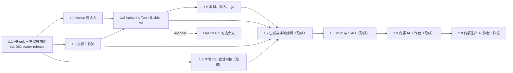

# v1.1–v2.0 正式开发路线

本目录以 [当前开发总纲](../../../COURSEWARE_DEVELOPMENT_PLAN.md)、[架构合同](../ARCHITECTURE_CONTRACT.md)、[工作协议](../WORKING_PROTOCOL.md) 和 [1.1 正式路线](1.1/README.md) 为正式权威链，把 1.1–2.0 转成可执行任务 DAG。本文只定义路线和发布门，不保存 `queued`、`active`、`blocked` 等协调状态；当前协调状态仍只看 [任务板](../TASK_BOARD.md)。

## 不可退化边界

所有版本都必须保留已经支持的人工能力：V9 工程、演示页 / 流式讲义 / 无限画布三 Surface、保存 / 恢复 / Save As、撤销 / 重做、预览 / Player、Runtime / Component、Builder、诊断，以及当前所有导出。新增的 AI、导入、生成或批量能力失败时，人工编辑仍能继续，且不得把半成品写进权威工程。

Course Project V9、Published Course V2、Runtime API 2/3、Component API 4 继续有效。V9 既有字段、判别器和语义软冻结；任何 additive 字段必须先形成独立合同并保持严格解析。不存在 V10 迁移，也不恢复 V8 导入。

## 启动与完成规则

任务节点只有同时满足下列条件才可按工作协议实例化：

1. 在当前工作树 HEAD 上复现该节点要补齐的行为，确认不是已经完成或已被替代的能力。
2. 表格列出的全部依赖已经通过其 Acceptance，并留有实质 diff / commit 与有效证据；可选节点永远不能成为核心节点的隐含依赖。
3. 按工作协议取得表格列出的写锁；存在重叠锁时不得并行写同一所有权面。
4. 涉及 Schema、Published、Surface、Runtime / Component、网络、导出、稳定身份或 AI 会话时，先落定对应合同。
5. 只有工作协议规定的多执行者、重叠写入、跨会话、交接或真实阻断场景才建任务卡；建卡时写明一个可观察结果、精确文件范围和最多三个最能证伪结果的目标测试。单执行者单会话节点直接执行，版本路线本身不预建状态。

节点完成必须同时满足：实现与合同一致、目标测试通过、受影响的保存 / 重开 / Player / 导出路径通过、诊断无新增错误、没有降低人工能力，并留下可由下一依赖节点复用的证据。自动化最多给出 `engineering candidate`；固定课例的真实视觉、互动和教师复核才能给出 `art candidate` / `accepted`。

## 实现 DAG



实现可在依赖和写锁允许时并行；版本发布门按 1.1 → 1.2 → 1.3 → 1.4 → 1.5 → 1.6 → 1.7 → 1.8 → 1.9 → 2.0 串行。1.6 的实现从 1.1 基线即可开始，但它的版本发布节点等待 1.5 发布完成。

## 版本规格与制品

| 版本 | 规格 | 用户结果 | AI 可见性 | 发布制品 |
| --- | --- | --- | --- | --- |
| 1.1 | [README](1.1/README.md) | V9-only、Owner 模块化稳定底座与既有人工能力保持 | 无 AI | 源码 tag + 固定课例离线 HTML |
| 1.2 | [README](1.2/README.md) | Table / Chart Native 节点、线条与背景直接可编辑 | 无 AI | 源码 tag |
| 1.3 | [README](1.3/README.md) | 高频页面 / 互动配方、克隆、批量替换、Token 与快速诊断 | 无 AI | 源码 tag |
| 1.4 | [README](1.4/README.md) | 三 Surface 与动态载体统一进入可验证 Authoring Tool / Builder V2 | 无 AI | 源码 tag |
| 1.5 | [README](1.5/README.md) | 素材、PPTX 导入、风格 Remix 与内容 QA | 无 AI | 源码 tag |
| 1.6 | [README](1.6/README.md) | Codex / Claude / OpenCode 本地 CLI 会话内核 | 默认隐藏 | 源码 tag |
| 1.7 | [README](1.7/README.md) | 单页、整课、局部编辑与动态载体的自动生成 / 修复 | 默认隐藏 | 源码 tag |
| 1.8 | [README](1.8/README.md) | 产品 MCP Authoring Server、CLI profiles 与课件 Skills | 默认隐藏 | 源码 tag |
| 1.9 | [README](1.9/README.md) | 内部聊天工作台、工具轨迹、Stop / Undo / stale 防护 | 默认隐藏 | 源码 tag |
| 2.0 | [README](2.0/README.md) | 三种 CLI 的内部生产 AI 作者工作流和数据边界 | 内部正式开放 | 源码 tag + 固定课例离线 HTML |

v1.1.0 的既定制品为源码 tag 与固定课例离线 HTML。1.2–1.9 不发布离线 HTML，2.0 恢复固定课例离线 HTML；本路线不发布安装器。

## 跨版本接口与数据合同

- **Native 内容**：Table / Chart 是 V9 Native 判别器；Published Course V2 只做读取它们所需的窄增量。线条和背景沿用既有对象 / Surface 所有权，不另建旁路状态。
- **Authoring target**：所有写操作解析为 canonical target，至少包含工程稳定身份、Surface、容器、对象 / 内容路径与版本前提；工具回执必须报告实际落点和新版本。
- **动态载体**：Component 注册身份固定为工程 / package / version / source / content；动态引用资产必须进入 Published 闭包；实例异常必须隔离并销毁旧实例，显示可见错误或 fallback。
- **CLI 内核**：`LocalAgentCliAdapterV1` 是 Agent core 边界。应用只负责进程 / 会话 harness、staging、自动准入、产品命令适配和 1.8 起的 MCP 工具，不重写模型规划循环。
- **工程写入**：1.7 的 CLI 只接收不可变最小 snapshot 并输出 strict typed candidate/dynamic manifest；它没有 live project API，宿主重校验后通过 1.4 canonical commands 原子提交。1.8 起 CLI 发起的 live read/write 只能通过产品 MCP Authoring Tools。candidate 可默认经结构化 stdout / artifact channel 返回；只有 adapter 启用通用文件工具时才要求文件工具只写当前 session staging。Native/Recipe/Existing Component 不等待动态宿主准入，Generated Component/Runtime 才执行静态与宿主 gate；拒绝、Stop、stale 或适用的准入失败不得进入工程。
- **本地会话**：会话和工具轨迹按“工程 ID + 规范化文件位置”隔离；Save As 创建新身份且不复制旧会话。它们可按会话 / 工程 / 全部删除，不进入 `.h5lesson`、Published payload、Component / Runtime 包或任何导出。
- **可信扩展边界**：自动 gate 通过后可获得当前已批准的可信 Runtime / Component 宿主能力；仍不得获得 Provider secret、原始 Electron Main、任意 OS 控制、未批准脚本或未批准宿主 API。

## 统一验证与发布门

任务表的 Acceptance 是逐项退出门，不能用未命名的替代性检查、通配符或只比较 Hash 替代行为证明。正式路线出现的每个 `tests/` 路径在路线落地时必须真实存在，路线检查器逐项验证；未来节点默认在版本文档指定的现有文件中增加命名用例。若确需新测试文件，先在该节点的实质 diff 中创建文件并同步更新路线，不能预先把未创建路径写成可执行入口。常规候选至少执行这些仓库现有命令：

```text
npm run check:contracts
npm run check:ai-capabilities
npm run typecheck
npm run test:product
npm run verify
git diff --check
```

是否需要执行到 `verify` 由工作协议的风险和发布阶段决定；单个节点先运行其版本文档列出的精确目标测试。当前 `verify:release` 强制检查 Portable/win-unpacked/app.asar，而本路线 1.1–2.0 均不交付安装器，因此不得把它用作版本通过门；源码候选使用 `verify`，其中已经包含 `check:examples`、固定 HTML 准备和真实浏览器互动，不得在输入未变时重复执行同一 example check。离线 HTML 版本还需由 Owner 真实打开冻结后的同一文件。每版发布节点还必须满足：

1. 所有非可选节点逐项通过 Acceptance；可选节点未完成时明确记录，但不得阻断发布。
2. 固定课例通过人工创建 / 编辑、保存、重开、运行 / Player、适用导出、诊断检查；涉及三 Surface 或动态载体的版本覆盖相应载体。
3. 自动化证据与版本发布制品匹配；不依赖历史提交哈希识别制品。
4. Owner 观察固定课例的真实视觉和互动后签署 `accepted`，再创建该版本源码 tag；1.2–1.9 不附加未承诺制品。
5. 在同一候选把本版已验收的新行为晋升到 `PRESERVATION_MATRIX.md`，并更新受影响的 `FEATURE_CONSUMER_OWNER_LEDGER` / dependency ratchet；证明没有新增 raw Store consumer、跨 Owner deep import / 运行时依赖环、第二 Store/History/Session/writer 或重复 registry/catalog。未改变的证据按工作协议复用，不建设架构评分或常设治理流程。

## 1.1 主动模块化边界

1.1 在 Legacy 清零之外主动治理当前已证实的热点：`editorStore.ts` 按 Core/App/Slide/Flow/Spatial/Feature owner 拆分，`App.tsx`、`Workspace.tsx`、`PropertiesTab.tsx`、`FlowWorkspace.tsx` 按组合与 Surface UI 拆分，Slide Published adapter 与 Course package builder 各抽出一个真实消费边界。完成标准是旧职责和依赖从原文件消失、组合根只接线、依赖棘轮收紧且保存/历史/Surface/Player/导出行为不降级；不按 LOC 建门，不创建第二 Store、万能 Facade、通用 Surface DSL 或无真实 consumer 的平台。

`buildPublishedCourse.ts`、V9 Schema/health、动态宿主、Flow/Spatial host 与 Main/Preload 暂不机械拆分：先冻结跨 Owner 增长；出现第二正式 consumer/owner、方向反转或已批准 lane 冲突时，按架构合同同一触发门拆分。1.1 的详细执行顺序和每步回滚点只看 [1.1 独立规格](1.1/README.md)。
