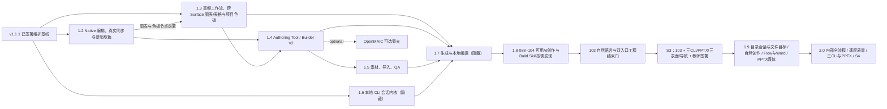

# v1.2–v2.0 正式开发路线

本目录以 [当前开发总纲](../../../COURSEWARE_DEVELOPMENT_PLAN.md)、[架构合同](../ARCHITECTURE_CONTRACT.md) 和 [工作协议](../WORKING_PROTOCOL.md) 为正式权威链，把 1.2–2.0 转成可执行任务 DAG。本文只定义路线和发布门，不保存 `queued`、`active`、`blocked` 等协调状态；当前协调状态仍只看 [任务板](../TASK_BOARD.md)。已完成的 1.1 / 1.1.1 执行路线由 Git 历史保存，当前保全事实由 `v1.1.1` 标签、保全基线和不可降级矩阵承载。

## 不可退化边界

所有版本都必须保留已经支持的人工能力：V9 工程、演示页 / 流式讲义 / 无限画布三 Surface、保存 / 恢复 / Save As、撤销 / 重做、预览 / Player、Runtime / Component、Builder、诊断，以及当前所有导出。新增的 AI、导入、生成或批量能力失败时，人工编辑仍能继续，且不得把半成品写进权威工程。

Course Project V9、Published Course V2、Runtime API 2/3、Component API 4 继续有效。V9 既有字段、判别器和语义软冻结；任何 additive 字段必须先形成独立合同并保持严格解析。不存在 V10 迁移，也不恢复 V8 导入。

## 启动与完成规则

任务节点只有同时满足下列条件才可按工作协议实例化：

1. 在当前工作树 HEAD 上复现该节点要补齐的行为，确认不是已经完成或已被替代的能力。
2. Dependencies只列开始开发必须满足的硬前置；所列依赖已通过其Acceptance并留有有效证据。已定窄接口上的独立叶子可按规格并行，真实consumer接线与完整Acceptance仍约束本节点完成；最终汇合门显式保留各必选线。可选节点永远不能成为核心节点的隐含依赖。
3. 按工作协议取得当前批次实际写域所需锁；路线Write locks列可能范围。粗锁覆盖不同叶子时由唯一协调Owner持锁并委派隔离的非重叠文件，同一实体文件保持单writer，共享接线顺序集成。
4. 涉及 Schema、Published、Surface、Runtime / Component、网络、导出、稳定身份或 AI 会话时，先落定对应合同。
5. 只有工作协议规定的多执行者、重叠写入、跨会话、交接或真实阻断场景才建任务卡；建卡时写明一个可观察结果、精确文件范围和最多三个最能证伪结果的目标测试。单执行者单会话节点直接执行，版本路线本身不预建状态。

节点完成必须同时满足：实现与合同一致、目标测试通过、受影响的保存 / 重开 / Player / 导出路径通过、诊断无新增错误、没有降低人工能力，并留下可由下一依赖节点复用的证据。自动化最多给出 `engineering candidate`；固定课例的真实视觉、互动和教师复核才能给出 `art candidate` / `accepted`。候选标签统一为 `vX.Y.Z-rc.N`，不携带 accepted 语义；无后缀 `vX.Y.Z` 只在对应 Owner 签署点创建。

## 实现 DAG

2026-09-09路线以[开发计划](../AI_ASSISTANT_DELIVERY_PLAN.md)、[AI编辑最短路径统一方案](../../../AI编辑最短路径产品决策报告.md)及[产品与创作优化方案](../AGENT_AUTHORING_LONG_TERM_PLAN.md)为准。1.8的089–104相关实现已集成，当前在原Owner内关闭已核实的图片、配置、消息、发现、终态与失败收敛缺口；9月8日四项审查及旧W包保留为历史证据，不重新启动已集成节点。已通过且相关实现/依赖/环境未变的证据继续复用，103汇合受影响的三CLI/双入口证据，原050、PPTX、三表面、导航及060/S3仍保留。

1.8按[当时执行包](1.8/FIRST_BATCH_EXECUTION.md)完成统一方案A/B/C/D四类工作：A并行修正确性、配置和可读消息、发现/提示，并补真实用量与最小计时；B在090共同合同下接齐必要完整卡、097短传输、100条件终结/结构化失败/预算/回执和101/102同一状态；C先用已有patch/多步候选完成复杂修改，其接线可随A/B进行，深入优化按实测触发；D以精确小修改、整页/批量关系调整和实际动态互动分别验收，固定实际模型/强度/服务档比较首次正确可用结果，保留失败和生命周期证据。这是1.8历史顺序，不是当前开工入口；不新增节点、依赖或协调状态。计量不阻塞已知正确性修复。当前实施只按[1.9完整实施方案](../R19_FRONTEND_SPECIAL_IMPLEMENTATION_PLAN.md)。

2026-09-18：1.9按[完整实施方案](../R19_FRONTEND_SPECIAL_IMPLEMENTATION_PLAN.md)交付目录会话/文件目标、首存连续、材料直达、按任务创作与明确审稿、自然聊天/项目会话管理、两种编辑位置和连续文件/Flow/Word；051 PPTX并列，050/060汇合。已实施结果按受影响范围复用，无本轮代码/测试行动。2.0完整QA/修复及S4后续，既定三Surface与导出门保留，不新造V10/Agent循环/工程历史。

实现可在依赖和写锁允许时并行；版本标签仍按 1.2 → 1.3 → 1.4 → 1.5 → 1.6 → 1.7 → 1.8 → 1.9 → 2.0 串行。1.6 的实现可从 `v1.1.1` 基线开始，但它的候选节点等待 1.5 发布完成。Owner accepted 只在 S1（1.3）、S2（1.5）、S3（1.8）、S4（2.0）四处签署。

## 版本规格与制品

| 版本 | 规格 | 用户结果 | AI 可见性 | 标签 / 制品 | Owner 签署 |
| --- | --- | --- | --- | --- | --- |
| 1.2 | [执行包](1.2/README.md) | Flow 图文/图形浮层与连续 DOCX、Slide input、Table/Chart 真实作者同步、Line、Background、常用色/连续调色与统一图表入口 | 无 AI | `v1.2.0-rc.N` 源码 | S1 在 1.3 统一签署 |
| 1.3 | [README](1.3/README.md) | 高频页面/互动配方、分类、Component 排序、克隆、批量替换、项目色板/Token、Flow/Spatial Chart/Table 与快速诊断 | 无 AI | `v1.3.0` 源码 | S1 创作力 |
| 1.4 | [README](1.4/README.md) | 三 Surface 与动态载体统一进入可验证 Authoring Tool / Builder V2 | 无 AI | `v1.4.0-rc.N` 源码 | S2 在 1.5 统一签署 |
| 1.5 | [README](1.5/README.md) | 共享 WorkspaceIdentity、素材、PPTX 导入、风格 Remix 与内容 QA | 无 AI | `v1.5.0` 源码 | S2 工具与素材 |
| 1.6 | [README](1.6/README.md) | Codex / Claude / OpenCode 本地 CLI 会话内核 | 默认隐藏 | `v1.6.0-rc.N` 源码 | S3 在 1.8 统一签署 |
| 1.7 | [README](1.7/README.md) | 单页、整课、局部编辑与动态载体的自动生成 / 修复 | 默认隐藏 | `v1.7.0-rc.N` 源码 | S3 在 1.8 统一签署 |
| 1.8 | [README](1.8/README.md) | 完整原生CLI必要接线、当前工程观察/编辑反馈、按需能力和Builder效率基础 | 默认显示聊天入口 | `v1.8.0` 源码 | S3 可用AI与既有人工能力 |
| 1.9 | [README](1.9/README.md) | 目录会话/文件目标、按任务创作与明确审稿、两种编辑位置、045–049/051 保全、050/060 收口 | 默认显示聊天入口 | `v1.9.0-rc.N` 源码 | S4 在 2.0 统一签署 |
| 2.0 | [README](2.0/README.md) | 全流程软件内完成、完整内置Skills、速度与成品质量、CLI对等及三CLI/PPTX验收 | 内部正式开放 | `v2.0.0` 源码 + 固定课例离线 HTML | S4 AI 产品 |

`v1.1.0` 标签保持不可变；`v1.1.1` 已经 Flow 文字格式维护闭环与 Owner 验收创建新源码标签，并重新固定同一课例的离线 HTML。1.2–1.9 不发布离线 HTML，2.0 恢复固定课例离线 HTML；本路线不发布安装器。无后缀版本号绝不同时表示“仅自动化通过”和“Owner 已验收”。

PPTX 人工导入的跨版本增强与发布节点见 [能力增强计划](../PPTX_IMPORT_ENHANCEMENT_PLAN.md)。1.5 完成常用内容可编辑映射与明确的部分导入，1.6–1.9 逐步增加样式、图表、图示与媒体的可编辑覆盖，2.0 完成内部生产验收；这些人工入口不随 AI 默认隐藏。

## 跨版本接口与数据合同

- **Native 内容**：Table、Chart 与 Slide-only input 是获批的 V9 Native strict 窄增量；Published Course V2 只做匹配读取与运行所需的窄增量。input 的提交值先原子写入已声明状态键再求规则条件，只映射 PPTX；Flow 作者浮层进入一份连续 DOCX。线条和背景沿用既有对象 / Surface 所有权，不另建旁路状态。
- **Chart/Table 与取色版本边界**：1.2闭合真实Native同步、图表入口和共享取色；1.3的Flow正文及Spatial world Chart/Table已有正式分支和consumer，沿用FlowTableBlock，不能按旧“待实现”文字重新限制当前能力。两个Chart和两个Table delivery保留原S1依赖和验证边界，1.4工具显式承接。当前是否支持以Schema/consumer和有效证据为准，整合不扩Flow overlay/Spatial shared/global的有效域。项目色板复用`designTokens.colors`，不提前创建持久主题绑定。
- **1.2 复审修复门**：当前收尾按 [1.2 执行指南](1.2/EXECUTION_GUIDE.md) 闭合作者增量、正确 owner/state 写入、input 及表格/图表/颜色的已确认可见缺口；未通过的共享能力不能被 1.3 图表/色板 delivery 当作完成前置。1.3 无关节点仍可按自己的依赖推进，S1 不替代 1.2 基础修复及 engineering candidate 验证。
- **Recipe 互动**：分类使用声明式“选中项目→选中目标组”；排序的真实可见重排使用当前 Component 载体并公开可编辑参数，不扩拖放/放置触发器或顺序动作，也不要求先完成通用组件化。
- **Authoring target**：所有写操作解析为 canonical target，至少包含工程稳定身份、Surface、容器、对象 / 内容路径与版本前提；工具回执必须报告实际落点和新版本。
- **动态载体**：Component 注册身份固定为工程 / package / version / source / content；动态引用资产必须进入 Published 闭包；实例异常必须隔离并销毁旧实例，显示可见错误或 fallback。
- **CLI 内核**：版本化adapter连接完整原生CLI与GUI。相同账号、配置、授权下保留原生文件/终端/网络、工具与连接、Skills和子任务；按需上下文服务效率，不作权限裁剪。应用不自建模型循环或MCP/通用工具RPC平台，原生CLI已有连接不受此限制。
- **工程写入**：宿主提供不可变观察并消费strict candidate，重校验后通过canonical commands原子提交。1.8–2.0演进为任务内多次观察、结果和原生续轮，仍不暴露live Store。candidate root realpath闭合只约束宿主摄取，不锁住CLI整体文件权限。Native/Recipe/Existing Component只走自身门，Generated Component/Runtime另经动态准入。当前未提交失败/Stop/stale候选零工程写入，前面已提交阶段明确部分完成。
- **WorkspaceIdentity 与本地会话**：1.5 的共享基础节点唯一规定 `projectId + normalizedPath`；材料域和 AI 会话域分别依赖它，不相互承载私有语义。会话和工具轨迹按该身份隔离；Save As 创建新身份且不复制旧会话。它们可按会话 / 工程 / 全部删除，不进入 `.h5lesson`、Published payload、Component / Runtime 包或任何导出。
- **可信扩展边界**：自动 gate 通过后可获得当前已批准的可信 Runtime / Component 宿主能力；仍不得获得 Provider secret、原始 Electron Main、任意 OS 控制、未批准脚本或未批准宿主 API。

## 统一验证与发布门

任务表的 Acceptance 是逐项退出门，不能用未命名的替代性检查、通配符或只比较 Hash 替代行为证明。正式路线出现的每个 `tests/` 路径在路线落地时必须真实存在，路线检查器逐项验证；未来节点默认在版本文档指定的现有文件中增加命名用例。若确需新测试文件，先在该节点的实质 diff 中创建文件并同步更新路线，不能预先把未创建路径写成可执行入口。局部节点只执行受影响的命名用例和必要准备，具体按[开发计划6.1](../AI_ASSISTANT_DELIVERY_PLAN.md#61-准备与局部验证)。纯文档/Schema、产品局部检查、真实CLI纵切和版本集成分别选择证据，不能统一要求contracts、capabilities、typecheck、全量test再加一次verify。npm生命周期钩子会额外构建/准备；同一候选所需制品只按变化准备一次，综合E2E必须明确筛选本次用例，零匹配/被排除不算通过。

1.8当前批次将高频准确编辑与复杂批量/动态编辑并列验收，主指标为请求到首次正确可用结果，另记任务终态、失败和返工。固定输入副本、CLI版本、实际模型/强度/服务档及测量边界，冷启动与连续会话、auto与preview分开；用户等待单列。有效PNG正例与原坏输入负例分别验证，不以二者计算提速率，不默认降低用户强度，不以少量样本宣称P95。新增性能对照与原103/S3有限三CLI门分开，既有发布门不削减，也不让每个局部修复重复整套付费矩阵。

版本源码候选仍执行规定的verify及真实验收，复用有效证据，不先重复其内含整套检查；当前路线不交付安装器，安装包检查不是版本通过门。固定离线HTML在签署前准备并冻结，签署后沿同一制品核验。每版发布节点还必须满足：

1. 所有非可选节点逐项通过 Acceptance；可选节点未完成时明确记录，但不得阻断发布。
2. 固定课例通过人工创建 / 编辑、保存、重开、运行 / Player、适用导出、诊断检查；涉及三 Surface 或动态载体的版本覆盖相应载体。
3. 自动化证据与版本发布制品匹配；不依赖历史提交哈希识别制品。
4. 候选节点在自动化与本版目标测试通过后创建 `vX.Y.Z-rc.N`，不签署 accepted；S1–S4 签署点由 Owner 观察合并范围内固定课例的真实视觉和互动后签署 accepted，再创建无后缀 `vX.Y.Z`。
5. 只在 S1–S4 的同一 accepted 候选把覆盖版本已验收的新行为晋升到 `PRESERVATION_MATRIX.md`，并更新受影响的 `FEATURE_CONSUMER_OWNER_LEDGER` / dependency ratchet；证明没有新增 raw Store consumer、跨 Owner deep import / 运行时依赖环、第二 Store/History/Session/writer 或重复 registry/catalog。未改变的证据按工作协议复用，不建设架构评分或常设治理流程。

四份固定验收清单：`docs/development-plan/acceptance/` 下的 [`S1-authoring.md`](../acceptance/S1-authoring.md)、[`S2-tools-and-materials.md`](../acceptance/S2-tools-and-materials.md)、[`S3-ai-core.md`](../acceptance/S3-ai-core.md)、[`S4-ai-product.md`](../acceptance/S4-ai-product.md)。每份使用“编号步骤 + 预期结果 + 通过/不通过”。S1、S2 是已签署记录；S3、S4 是各自签署点的待执行清单，其步骤在签署点按步执行，**创建清单不等于该签署点通过**。

## v1.1.1 维护基线与后续模块化边界

`v1.1.1` 已在 Legacy 清零之外完成已证实热点的主动治理：`editorStore.ts` 按 Core/App/Slide/Flow/Spatial/Feature owner 拆分，App/Workspace/Properties/Flow 按组合与 Surface UI 拆分，Slide Published adapter 与 Course package builder 各形成真实消费边界。后续版本必须保持组合根只接线、依赖棘轮不倒退且保存/历史/Surface/Player/导出行为不降级；不按 LOC 建门，不创建第二 Store、万能 Facade、通用 Surface DSL 或无真实 consumer 的平台。

`buildPublishedCourse.ts`、V9 Schema/health、动态宿主、Flow/Spatial host 与 Main/Preload 暂不机械拆分：先冻结跨 Owner 增长；出现第二正式 consumer/owner、方向反转或已批准 lane 冲突时，按架构合同同一触发门拆分。已完成阶段的执行顺序和回滚点只从 Git 历史追溯。
