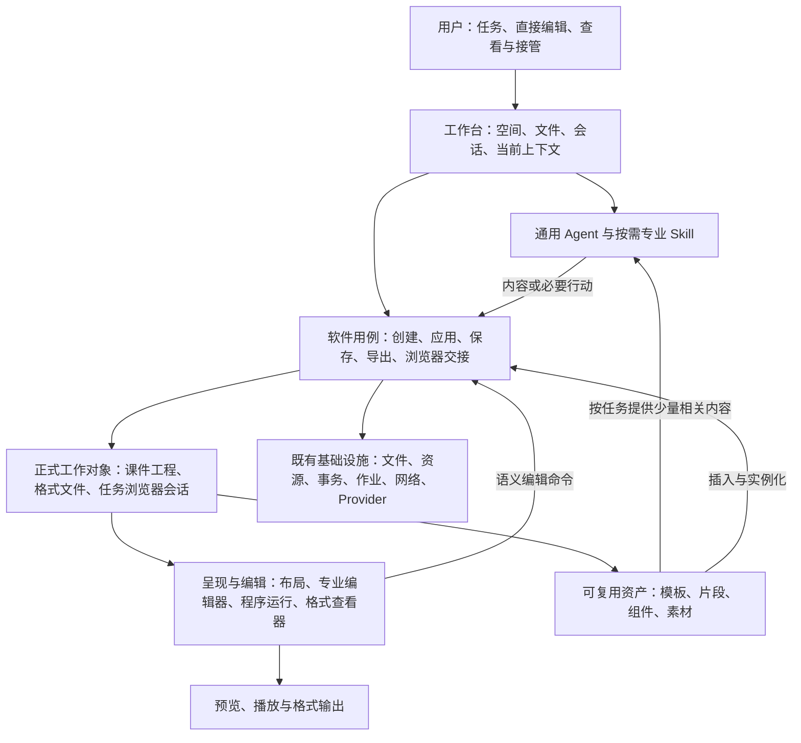

# 果铃统一内容架构与重构方案

日期：2026-10-03。状态：**原范围及 F00–F07 已形成工程候选；相对创作质量记录完成，尚未取得 Owner 接受。**

Owner 已于 2026-10-03 指令“开始按照方案执行”。正式内容合同已接入 V9/Published V2 及真实 consumer，见[架构合同 §1.2](../ARCHITECTURE_CONTRACT.md#12-统一内容布局与应用2026-10-03)；当前实现、证据与未完成范围见[实施记录](EXECUTION_LOG.md)，不因授权自动视为全部通过。

本方案依据本轮讨论和当前源码核查，回答三个问题：模型与软件各自负责什么；重型编辑器如何保留自由创作质量并形成可复用资产；如何把这些决定落实到通用工作台、课件内容、布局、编辑和交付。

本文是方案总入口；[内容模型与设计语言](CONTENT_AND_DESIGN.md)定义具体编辑语义；[重构实施方案](REFACTOR_PLAN.md)定义依赖、源码迁移与验证；[事实依据与讨论追踪](EVIDENCE.md)保留调查时的现状、推断和待证明目标。它们沿用既有开发入口与协调协议，不修改 2.0 已签收状态。

2026-10-03 评审后的修正顺序、修改边界和最小验收见[后续修改计划](FOLLOWUP_PLAN.md)。Owner 已指令“完成调整并继续实施”：主画布直接编辑和选中内容 AI 精修为核心交付；教师演示默认1280×720、长文优先连续正文/Flow，显式规格优先。该计划沿用同条件相对质量标准，不新增架构方案；当前实施事实见实施记录。真实 Engine、Skill、准入、保存重开和 Player 已通过，首稿对照各有长短，不能无保留签收“不弱于裸稿”，见[F07报告](../../../output/unified-content-architecture/f07/F07_REPORT.md)。自动 Flow 创建与组合自然高度仍属 F08 后续范围。按可运行轨道组织存档，本轮无 Git 提交或发布授权。

## 1. 总体结论

建议将果铃收敛为：**通用 Agent 工作台，承载多种专业文件；课件采用浏览器布局、结构化内容和专业节点融合的可视编辑内核。模型负责内容与设计，软件负责确定性的应用和交付。**

重型编辑器的价值落在持续修改、专业对象、互动编排、组件复用和可交付工程上。创作时，不再让模型逐个填写内部节点及坐标；编辑时，不把作品降为只能改字换图的整页黑盒。

新的默认链路是：

```text
用户意图与当前工作对象
  → 加载相关专业 Skill，提供必要材料与少量合适资产
  → 模型生成内容、布局关系、视觉样式和互动逻辑
  → 软件解析、建立正式内容、整理资源、排版并应用
  → 同一份作品支持人工编辑、AI 续改、播放、保存和导出
  → 从实际优质作品提炼模板、片段、组件和素材
```

已有第三方 HTML 可以直接进入这条链。导入是把内容纳入可持续编辑与复用的工程，不再被理解为“将成品截图放进画布”。普通 HTML/CSS 是自然创作输入；复杂程序保持自己的源码与行为；软件不要求作者承担编号、登记和宿主包装。

### 1.1 两层统一，两个边界

| 统一范围 | 统一内容 | 保留差异 |
|---|---|---|
| 通用工作台 | 空间、文件、会话、任务上下文、执行、结果、人工接管 | 课件、Word、Excel、PPT、PDF、图片、网页各自的格式与编辑语义 |
| 课件内核 | 适用的内容结构、容器布局、专业节点、选区身份、命令、历史、资产与呈现输入 | 演示的分页/步进、文档的阅读流、空间的世界/相机，以及各格式导出策略 |

不把 Excel 单元格、PDF 页面和网页会话塞进课件节点；不把三个 Surface 强行变为可无损互换的视图。

### 1.2 本次推荐固定的架构决定

1. 继续使用现有通用执行器、每文档唯一正式 writer 和文件服务；新增职责优先归还已有 owner。
2. 每个内容区域只有一个正式来源；DOM、计算坐标、缩略图和导出物是投影。
3. 课件正式内容采用“组合结构＋样式规则＋专业数据＋程序区域”；不把所有内容压入现有有限 Native 类型，也不把整课改为不可理解的源码包。
4. 浏览器负责适合它的文字、CSS 和容器布局；专业节点保有数据、行为及编辑语义，可用 DOM、SVG、Canvas 等呈现。
5. 自由布局与自动布局并存；父容器负责外部排列，内容节点负责自身含义，程序组件负责自身内部行为。
6. 已绑定目标的创作步骤以内容为输出，软件自动应用；研究、未知网页和跨文件判断仍保留 Agent 的观察/行动循环。
7. Skill 承载专业方法和可复用创作知识；能力是软件可完成的事情，工具只是按需暴露给模型的调用入口。
8. 先交付能够直接使用的内容，再扩大结构化编辑覆盖；不以是否满足私有作者格式决定能否导入。
9. 每一批持久化变更同时接入保存、真实呈现和直接发布 consumer，不积累“编辑器已完成、播放器以后补”的半套模型。
10. 质量目标通过首稿对比、持续编辑和异内容复用分别证明，不以架构名称或测试数量代替效果。

这些是本方案的推荐决定；具体正式 Schema 变更、数据处理政策和实现启动仍须在 Owner 授权后按现行工作协议执行。

## 2. 要消除的根因

当前系统已经自动处理了不少资源、身份、候选和提交事务；问题并非一切都由模型手工操作。当前缺口集中在四处：

| 缺口 | 用户后果 | 重构落点 |
|---|---|---|
| 专业创作与宿主操作协议仍耦合 | 模型读说明、选择句柄、依次创建/导入/保存；没有目标时还可能看不到需要的能力 | 已知任务的软件编排与内容输出通道 |
| 自由 HTML 主要被整页程序载体接住 | 首稿视觉好，但布局/结构精修与片段复用弱 | 结构化 Web 内容与专业节点融合 |
| LayerItem 以绝对 frame 为主，排版关系没有持续保存 | 改字、改比例、换设备后容易需要重新手排 | 正式布局关系与相应编辑命令 |
| 资产与能力主要以技术目录呈现 | 创作不易找到合适组件，完成作品不自然转化为可复用积累 | 预览、用途、实例参数和依赖完整的资产工作流 |

原“机械导入不可用”样本的证据指向：没有创建课件目标，模型停留在普通 HTML 与能力发现环节，未实际调用导入后端。它证明入口与编排存在阻断，不证明导入器整体失效。浏览器空白问题则来自无网页上下文的接管入口，可独立修复。见[事实依据](EVIDENCE.md)。

## 3. 完整架构层级

以下是职责层级，不要求一层对应一个新服务、注册表或目录。



| 层 | 负责的输入与输出 | 正式 owner / 现有基础 | 不承担的责任 |
|---|---|---|---|
| L0 用户工作层 | 任务意图、当前选择、拖拽与修改；得到作品和真实状态 | 工作台、编辑器、文件视图 | 暴露 revision、资源登记、候选协议 |
| L1 通用智能层 | 目标与上下文→内容、判断、必要行动 | ExecutionEngine、上下文投影、Skill 服务 | 固定教学方法、专有坐标填表、决定提交是否成功 |
| L2 软件用例层 | 明确的用户操作/内容输出→创建、应用、保存、导出、交接 | EditSession、文件/导入服务、Gateway 等既有用例 owner | 自创第二个模型编排器或通用自然语言工作流平台 |
| L3 正式内容层 | 保存内容结构、样式、专业数据、源码、资源引用及实例 | 课件 DocumentSession；各文件格式自己的内容 owner | DOM、测量 frame、截图充当第二份真相 |
| L4 布局与专业执行层 | 正式内容＋目标规格→布局、绘制、互动、命中几何 | 浏览器排版、Native 渲染、Runtime/Component、格式引擎 | 改写作者内容、拥有第二套历史 |
| L5 呈现与交付层 | 编辑/预览/播放/导出共享内容；按目标输出 | Surface、Player、导出器、文件查看器 | 分别猜测布局或将静态导出伪称交互结果 |
| L6 基础设施层 | 文件字节、资源、事务、计算作业、网络与连接 | 现有 FileService、资源服务、DocumentSession、Compute/MCP/Provider | 专业教学、审美判断、第二套项目模型 |

Skill 与资产是被相关层消费的资源，不是绕过正式 writer 的执行层。上表中的 DocumentSession 同时支撑 L3 的内容所有权和 L6 的事务机制，是同一个 owner，不新增两个 Session。

### 3.1 依赖与写入方向

- Agent 与界面通过用例层请求变化；实际正式写入仍走已有 canonical transaction。
- Core 只依赖明确的数据与窄接口，不依赖 renderer Store 或具体 Surface。
- Player 消费 Published 投影；发布是从正式内容到交付表示的单向转换。
- 布局结果与运行 DOM 可以被观察；反向修改必须先转换成真实内容、样式、参数或源码的编辑命令。
- 同一修改只产生一份正式历史。UI 预览态、生成暂存态与已应用内容分开，但不成为长期并行文档。

## 4. 模型与软件的责任合同

| 事项 | 模型/作者 | 软件 |
|---|---|---|
| 内容与教学 | 事实、结构、表达、教学策略与互动设计 | 提供材料和真实观察结果 |
| 视觉与布局 | 左右关系、层次、比例、间距、字体、颜色、响应式意图 | CSS 排版、几何计算、测量、命中与尺寸传播 |
| 专业对象 | 图表数据、公式、表格含义、组件参数 | 保留对象语义，呈现与直接编辑 |
| 交付操作 | 仅在真实歧义时选择目标/文件类型 | 准备目标、身份、版本、包装、资源引用、应用和保存 |
| 修改 | 基于当前正式内容提出所需变化 | 精确目标绑定、历史、冲突处理与结果回执 |
| 资产 | 选择值得复用的边界，提炼用途和参数 | 打包真实依赖、实例化、存储、预览 |

“机械装配”不意味着软件猜设计。把“左侧问题，右侧模拟，右栏稍宽”变成布局仍需要比例/约束的表达；模型可以自然地用 HTML/CSS 表达，而无需填写宿主内部接口。

### 4.1 已知目标的生成步骤

以“改当前卡片的讲解”与“从 HTML 创建课件”为例：

1. 宿主从当前文档、选区或创建操作绑定目标、权限、预期结果类型和应用方式；复用 EditSession/当前 run 的上下文。
2. 模型获得当前正式内容、必要设计上下文和输出约束；结果通过该步骤专用的内容通道返回。身份与版本元数据在软件外层，模型不复写。
3. 软件准备资源与候选，应用到正式内容；简单编辑直接事务提交，程序/构建按实际需要使用已有 staging 与运行检查。
4. 软件记录“已生成、已应用、已保存”事实。保存失败时仍保留已应用的未保存作品，不假报完成，也不重新生成整份内容。

这是现有执行器内的一种步骤，不新增第二种 Agent。普通聊天文字不自动成为作品；开放式聊天中尚未确定结果类型时，保留一次必要的语义选择或简短澄清。用户可以预览/撤销；只有当前权限模式要求时才请求应用确认。

### 4.2 保留 Agent 行动的场景

网页研究、检索资料、未知网站操作、跨文件语义选择、外部应用执行需要观察后决定下一步，仍使用工具。工具不必全部消失；需要消失的是模型对已知软件流程的机械搬运。

## 5. Skill、能力与执行方式

| 概念 | 定义 | 示例 |
|---|---|---|
| Skill | 任务专业知识包：方法、例子、约束、参考资产、必要脚本 | 课件创作、课件局部编辑、报告、电子表格分析 |
| 能力 | 软件实际上能完成的操作与结果 | 导入 HTML、重排容器、保存文件、执行脚本 |
| 工具 | 需要模型主动选择时暴露的能力入口 | 搜索、查看文件、浏览器操作、启动计算 |
| 脚本/CLI/库/MCP/内部服务 | 能力实现或接入方式 | Office 文件生成 CLI、图像裁剪库、HTML 导入服务 |

当前已存在按需 Skill 与通用执行后端；缺口不在于再建立一套加载系统。改造重点如下：

- 常驻上下文只保留通用 Agent 核心与短 Skill 范围说明；命中任务后加载相关专业方法和代表例子。
- `create/build/edit` 是工作阶段，不必各自复制一整套专业知识。创作 Skill 负责内容，编辑 Skill 强调保留现状与局部变化；Build Skill 仅在表示选择或专业构建有判断时参与。
- 纯 `创建目标→导入→保存` 下沉软件；不要求模型为此先读 Build 文档。用户提供外部 HTML 时可直接发起该用例。
- 能力“存在”与“当前目标已准备好”分开。缺少课件目标不应令“从 HTML 建课件”的入口消失；软件负责创建合适目标。
- Skill 内的脚本只封装重复且有实际价值的操作。已有内部服务直接调用，不为了让 Skill 看起来可执行而包一层脚本。
- 脚本运行复用作业、权限、输出资源与取消机制；`skill.read` 负责读取，不暗中执行文档代码。
- 专业 Skill 提供少量优质布局/组件示例；详细参数仅在真正使用时读取，避免反复微型发现占满上下文。

公开产品的 Skill 实践能支持“按需知识＋可选脚本资源”，不能证明它们已经把机械应用完全下沉。来源与证据限度见 [EVIDENCE.md](EVIDENCE.md#5-外部参考)。

建议按专业领域组织 Skill，再按任务读取其创作/构建/编辑部分，避免一个全知 build Skill 或同一专业知识复制三份：

| 场景 | 进入方式 | Skill 应包含 | 软件直接承担 |
|---|---|---|---|
| 新课件创作 | 沿用 `orchestrate-courseware` | 教学策略、内容完整性、视觉/互动例子 | 目标、组装、应用与保存 |
| 已有内容构建/导入 | 直接软件用例；需要表示判断时读瘦身后的 build Skill | 确有歧义的分页、专业组件选择、交付取舍 | 解析、包装、资源与文件操作 |
| 课件局部编辑 | 根据选择加载编辑知识；独立任务足够明确时成为 edit Skill | 保留上下文、局部修订、适用例子 | 选区身份、实际写回与历史 |
| Word/Excel/PPT | 各自的专业 Skill，按需读创建/修改参考 | 正文/公式/幻灯片语义、优质样例、必要格式脚本 | OOXML 簿记、计算/打包、应用和保存 |
| 研究/数据 | 沿用对应通用专业 Skill | 研究或分析方法、来源/数据表达 | 工具执行、计算作业和制品交付 |

脚本的输入文件、目标路径和输出收集由软件绑定；模型只需提供该脚本真正需要的业务数据或设计选择。每个 Skill 只有在需要重复算法/格式操作时附带脚本，不设“必须有脚本”的形式指标。

## 6. 统一课件内核与重型编辑器定位

建议主路线是**结构化可视编辑＋浏览器布局＋专业节点/程序组件**。这里要分别决定三件事：

| 维度 | 方案选择 |
|---|---|
| 创作表达 | HTML/CSS、共享正文、专业数据、成熟组件均可；不用宿主内部 JSON 作为默认作者语言 |
| 正式来源 | 可编辑结构、样式规则和专业数据；复杂程序区域保留源码/数据/参数 |
| 呈现方式 | 浏览器负责 Web 排版；按内容使用 DOM、SVG、Canvas 等，统一外部布局与编辑命中 |

原生不等于固定坐标或 Canvas。一张图表可以保持原生数据编辑，以 SVG 呈现，外部宽高由 Grid 容器计算。一个 Web 卡片也可以位于自由画布上。

普通 Web 结构拥有样式/结构编辑，专业节点拥有图表/公式/表格等语义编辑，程序区域拥有参数/源码和能够可靠定位的内容编辑。这些能力在同一个选择与属性界面中呈现，不能成为两套互不相通的编辑器。

### 6.1 为什么不能仅把 HTML 转一次坐标

浏览器计算出的坐标只是某次排版结果。只保存这些坐标，改文字或尺寸之后仍会失去排版关系。新体系保存布局意图并重复计算；原生自由定位保留作者 frame，Web 自由定位保留相应 CSS，二者不为同一对象双写。具体布局、作品视口及人工操作规则见 [CONTENT_AND_DESIGN.md](CONTENT_AND_DESIGN.md#4-布局合同)。

### 6.2 对第三方 HTML 的增强边界

增强目标是：文本/图片之外，可以修改受支持内容的结构、容器、间距、比例、样式与排列，并在保存重开后持续有效。

任意 JavaScript 运行结果无法全部逆推成专业节点。含复杂共享 CSS/JS 的内容保留足够大的程序边界；Canvas/WebGL 不按截图反推对象。原有交互必须继续运行，不能为了可选中而静态化。原始输入可保留为来源与恢复材料，但不继续作为另一份可独立覆盖工程的正式版本。

### 6.3 为何值得这次重构

历史路线确实保护了教师高频直接编辑、专业对象与格式导出；没有找到完整评估并否决可视化 Web 编辑器的初创记录。当前新的优先级是模型自由创作质量、持续布局、第三方内容编辑和资产复用。新路线把这些能力纳入正式内容模型，而不再让它们长期停在导入边缘。

成本集中在结构与源码映射、样式作用范围、自动布局编辑、混合呈现以及导出。它是内容与编辑合同级重构，不能包装成几个换算脚本。主路线值得采用，但“不弱于裸 HTML”的质量目标仍需真实对照证明。

## 7. 工作台与产品设计语言

用户始终围绕“文件/作品、当前选中内容、任务和结果”工作。课件内部使用“页面、文档、空间、容器、元素、组件”；技术名称 Native、Runtime、Surface、candidate 不作为常规操作标签。

通用操作统一为：打开、创建、修改、插入、替换、排列、预览、运行、保存、导出、提取复用。相同操作在菜单、快捷条和 AI 卡中采用同一语义与命令；专业差异随选中对象出现。

任务浏览器展示真实任务页面，需要登录时交接同一个会话；默认浏览器中的 Provider OAuth 继续是另一条登录流程。嵌入网页、PDF 与图片视图共享工作台的停靠、焦点、返回任务与状态表达，各自保有自己的内容/会话 owner。PDF/图片预览不依赖浏览器重构；轻编辑需要各格式的真实编辑、撤销和保存实现。

Office 同样按专业 Skill＋格式执行器接入：Word 段落/分页、Excel 公式/计算、PPT 页面/对象各自负责，不通过课件 HTML 中转。统一的是工作方式与软件交付责任。

## 8. 资产如何成为质量优势

软件自动保存作品结构、素材、样式、源码和依赖。用户或模型从真实好作品中选择值得复用的内容，提炼变量与用途。资产不是“保存了很多 HTML 文件”的同义词。

资产分为整页模板、布局片段、专业图示、互动组件与媒体；实例具有自己的文字、参数与状态。共享定义与单个实例的修改范围必须明确，不因编辑一个实例静默改掉所有作品。

创作时优先提供少量匹配的视觉预览、适用说明和短使用例；允许模型自主创作与改写。最少用一次不同内容的复用，验证模板能容纳新文字、组件能保持互动、依赖完整且没有跨实例串状态。

## 9. 实施路线与成功标准

详细工作包见 [REFACTOR_PLAN.md](REFACTOR_PLAN.md)。建议依序推进：

1. 收回创建/导入/保存的机械编排，并修正浏览器无上下文接管；均不依赖内容大重构。
2. 固定正式内容、样式所有权与布局合同，完成“正文＋两栏＋图表/局部互动”的纵向切片，连通编辑、保存、重开与 Player。
3. 做同提示词创作对照；若瓶颈仍在表现能力或表达损失，先修这条链，再扩大覆盖。
4. 扩展三表面共享编辑、响应式/尺寸规则、第三方 HTML 深编辑与真实导出。
5. 形成资产提取—异内容复用闭环；并行推进任务浏览器与多格式工作台视图。

三种成功证据独立记录：同一作品导入后的保真与互动；人工/AI 持续编辑后的可靠保存；同模型、同提示词、同素材与相近预算下的首稿质量和修订成本。高质量承载不自动证明高质量创作，单个漂亮页面也不能证明整体目标已经实现。

本轮交付仅为上述架构与实施设计。未运行产品测试，未调用真实模型，未修改正式 Schema、产品代码、AGENTS 或任务登记。
