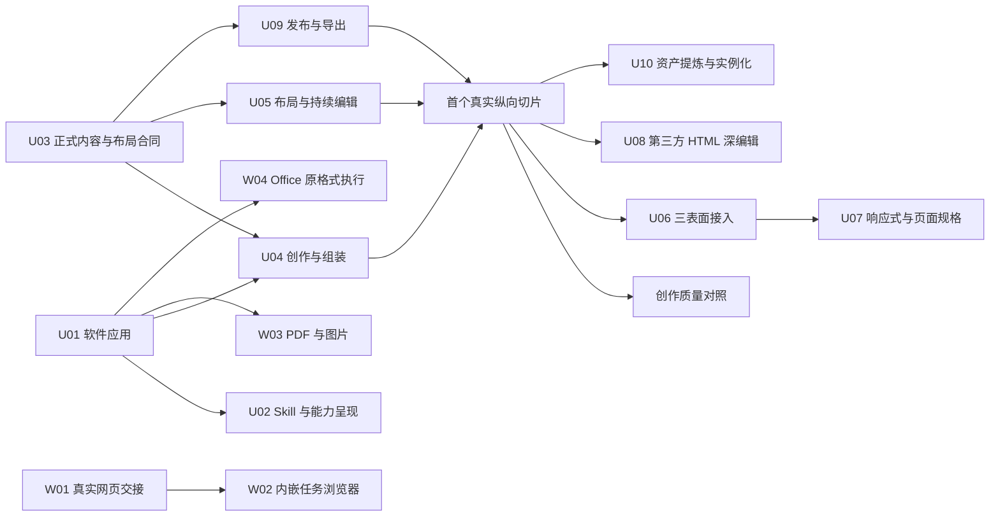

# 重构实施方案

日期：2026-10-03。状态：**已获授权，实施中**。Owner 在方案讨论后明确“开始按照方案执行”；原文的只形成文档限制属于上一轮提案阶段。当前实现与验证见[实施记录](EXECUTION_LOG.md)，协调状态见任务板；工作包编号不自动代表通过。

架构与概念分别见[总方案](README.md)、[内容与设计合同](CONTENT_AND_DESIGN.md)。执行纪律沿用[工作协议](../WORKING_PROTOCOL.md)，本文只补具体结果、迁移边界与最低有效证据。

## 1. 实施目标与优先级

完整重构需要同时解决三个结果：

1. 用户要求创建/导入/修改时，模型无需机械搬运软件内部接口，作品能够真正保存和继续使用。
2. 作品能够保持 HTML/CSS 级表现力，同时让高频结构、布局与专业内容在编辑器中持续修改。
3. 完成作品能提炼成资产，在另一份内容中复用，从而形成超越单次裸写 HTML 的长期质量与效率优势。

先完成内容生成到软件交付，再完成一个包含正式结构、布局、编辑、Player 的纵向切片；随后按真实 consumer 扩大范围。不能只减少工具数量后宣布本轮编辑器重构完成，也不能要求先建好全部抽象才修复当前导入入口。

| 分线 | 内容 | 与核心课件重构的关系 |
|---|---|---|
| A 软件应用 | 目标绑定、直接内容输出、机械创建/导入/保存、Skill 调整 | 可先交付；为新内容 consumer 提供入口 |
| B 内容与编辑 | Web/专业节点融合、布局、可视编辑、三表面、第三方 HTML | 核心重构 |
| C 交付与资产 | Player/导出同步迁移、提取与实例复用、创作质量验证 | B 每阶段的直接完成条件 |
| D 工作台扩展 | 真实浏览器交接/嵌入、PDF/图片、Office | 共用 A 的任务/交付原则；不阻塞 B |

## 2. 分阶段路径

### 阶段一：软件负责已知流程

交付 U01、U02 与 W01。用户给出 HTML 时从无课件目标起完成创建、导入、保存；明确选区改写直接接收正文；无网页任务不再出现误导登录接管。此阶段复用现有载体，不承诺新增结构化布局编辑。

### 阶段二：完整纵向切片

U03 固定最低正式合同；U04、U05 和 U09 的首个真实 consumer 连通一页“问题卡片＋两栏＋专业图表＋局部互动”。输出必须同时具有：

- 模型熟悉的作者表达，软件建立正式内容与资源；
- 改长文字、调整栏宽、重排顺序与自由定位的清楚语义；
- 人工编辑→AI 局部续改→撤销/重做→保存/重开；
- 同一规格的真实 Player，互动不因尺寸变化而重置；
- 既有自由节点和该页支持的真实导出仍可用。

这里包含共享层的首个实现，但不先造一个无 consumer 的“统一布局框架”。通过后运行最少的 Q03 创作对照；若发现模型表达被转换器压缩或渲染表现不足，先修这一层，不用加长 Skill 掩盖。

### 阶段三：扩大编辑覆盖并形成资产

U06、U07、U08、U09 的对应格式 consumer、U10 按依赖推进。完成三表面中的可复用片段、响应式/页面规格、第三方 HTML 的实用深编辑、相关导出和异内容复用。每次扩大支持域都与直接 consumer 成对落地，不保留双写过渡。

### 阶段四：多格式工作台

W02–W04 可在 A 的任务/文件边界稳定后独立推进。按实际格式分别交付，不能以 PDF 能预览代表 PDF 可编辑，也不能以 DOCX 成功代表 Office 三件套完成。

上述阶段是依赖顺序，不是人为审批链。实施授权后，稳定窄接口下的无重叠叶子可并行；Owner 所需的正式内容/产品决定在首次相关实施前关闭，不每个普通操作重复请求确认。

## 3. 依赖图与并行边界

图中的 U09 分两次参与：首个切片必须有对应 Published/Player 与相关导出；U06/U07/U08 每次扩域时补齐受影响 consumer。它不是一个推迟到最后的孤立收尾包。质量对照与资产复用的结果决定扩展时应先修什么，不新增产品运行门。

源码共享域由一个集成者维护：V9/Published Schema、DocumentSession/Gateway 公共接线、执行器及公共发布入口。可并行的叶子包括稳定接口后的解析器、布局 UI、Surface 适配、浏览器视图和具体格式执行；若实际写到同一文件则顺序集成。本轮已按这一边界进行实现委派，当前写域和协调状态由既有任务卡/任务板维护，不新建调度体系。

## 4. 工作包

以下源码路径是当前调查入口，并非要求新建同名服务。除明确提出的新内容外，复用现有生命周期、权限和 writer。每包验证只执行与实际改动有关的 1–3 项；已证明且未受影响的证据继续使用。

### U01 已绑定内容生成与软件应用

**结果**：明确的选区改写只需模型输出内容；已有 HTML 从无目标开始，由软件完成创建、导入和保存。

**涉及位置**：`src/main/workbench/execution/{ExecutionEngine,EditSessionService,AgentFileText}.ts`；`src/main/workbench/htmlImport/{HtmlImportToolService,HtmlImportService}.ts`；`src/core/tools/{ToolCatalog,DocumentToolGateway,HtmlImportTools}.ts`；现有 DocumentHost/Delivery/File 服务。

**改动**：在既有 run/EditSession 内绑定内容接收目标；去掉此路径为了传正文而要求模型构造 `text.replace` JSON 的义务。软件调用现有 create/import/save 用例；无目标时仍可表达“从 HTML 创建课件”，由用例准备目标。普通聊天、开放研究与需要判断的工具调用维持原语义。

**边界**：不复制执行器，不从所有聊天回复猜写入意图。内容已应用而保存失败时恢复保存，不重新生成或重复导入。软件维护版本、操作身份、权限和最终提交；模型不填写。

**退出旧路径**：新绑定路径不再依赖模型调用 `file.create → html.import → file.save`。原始工具对外部客户端/显式编程仍可存在，但调用相同用例，不形成两套导入规则。

**依赖**：现有基础即可。

**最低证据**：选区正文原位应用且普通聊天不触发写入；一份无私有标记 HTML 从无目标导入并从文件重开；如改动涉及保存恢复，再补一次实际保存失败恢复而无重复页面。优先扩展 `g20EditSession`、`g20M30NoDocumentJourney`、`g20HtmlImport` 对应命名场景。

### U02 Skill 与能力呈现收敛

**结果**：通用 Agent 默认不读专业手册；创作/局部编辑只读相关知识；纯导入不靠模型发现并编排宿主流程。

**涉及位置**：`.agents/skills/`、`src/shared/generated/bundledSkills.json` 的实际生成源、`src/main/workbench/skills/ScopedSkillService.ts`、`src/core/tools/SkillTools.ts`、`src/core/tools/ToolCatalog.ts`、既有 ComputeJob 接线。

**改动**：保留现有动态加载；课程创作 Skill 提供内容策略与优质表达示例，编辑知识提供保留现状和局部修订方法，build 仅承载实际需要判断的专业构建。能力存在与当前文档可执行范围分开。确定的内部服务直接使用；有真实重复价值的脚本随资源发布，软件绑定已知路径与输入，通过既有作业执行，不让模型抄脚本。

**退出旧路径**：删除已下沉操作的长接口顺序说明、登记义务和重复文档；当软件尚未承接某项义务时不能先删说明。不要为了“有脚本”复制服务实现或把每种内部动作都做成 Skill。

**依赖**：U01 的对应软件应用路径。专业例子可与 U03–U05 一起准备。

**最低证据**：一次普通任务不加载教学内容，一次已有 HTML 导入不需读完整 build 手册，一次创作能加载相关 Skill 并交付。可先用执行轨迹和受控回复检查路由；质量由 Q03 实际模型对照承担，不重复付费证明同一事。

### U03 正式内容与布局合同，连同首个 consumer

**结果**：正式工程能够表达组合容器、可编辑 Web 结构、现有正文/Native、程序区域和持续布局，且每个属性只有一个 owner。

**涉及位置**：`src/shared/contracts/{course-project-v9,published-course-v2,native-v1,component-v4}/`、`src/shared/document/content.ts`、`src/core/documents/DocumentSession.ts`、对应工厂与发布入口。

**改动**：按[内容合同](CONTENT_AND_DESIGN.md#2-正式内容模型)提出准确 strict 分支/字段；明确父容器拥有子项排列、专业对象拥有内容、Web 样式声明拥有其布局值。自动 frame 与 Web 测量 frame 作为派生结果，Native 自由 frame 保留作者含义。优先让现有正文/Native 成为共享组合的内容，不复制它们的数据。源码重解析保留未替换对象身份，scene 覆写、互动与 Spatial 关系引用随实际替换在同一事务处理，不能静默悬空或靠模型编号延续。

**形式选择**：推荐在当前 V9/Published V2 合同下申请必要扩展，允许新的容器/Web 表达；不因重构名称自动创建 V10。现有自由内容可直接解释为自由布局，无需建兼容平台。若既有字段无法承载正确 owner，则在对应域明确替换并同步直接 consumer，不能靠保留两套正式字段回避问题。具体分支与现存工程读取政策由本包在实施前列清并获 Owner 决定。

**依赖**：正式合同范围获授权；与 U04/U05/U09 的最小实现联合交付。不得单独合入一个保存后无法播放的新节点分支。

**最低证据**：代表混合内容保存重开仍有相同语义；原自由对象正确；一次内容/布局操作及其资源变化形成一条完整可撤销历史，并在局部源码重解析后仍保有原有目标引用。Schema 解析不能代替后两项。

### U04 创作表达解析与软件组装

**结果**：普通 HTML/CSS 进入可编辑结构，专业对象保留数据，复杂互动保持运行；模型不填工程内部参数。

**涉及位置**：`src/main/workbench/htmlImport/{prepareHtmlCourseCandidate,HtmlImportService,extractHtmlResources}.ts`、`src/shared/html/htmlSourceScanner.ts`、`src/core/tools/nativeNodeFactories.ts`、组件插入与包服务。

**改动**：复用资源处理/现有程序承载，增加正式结构生成。标准元素/样式尽量原义保存；不可靠的共享 CSS/JS 保留到必要程序边界。专业组件只在模型选用时提供短内容示例，软件完成 ID/依赖/实例化。分离“能承载”与“已有属性面板能编辑”，不将后者作为导入拒绝门。

**退出旧路径**：新路径不再把所有内部创作一律封为整页 Runtime；现有第三方保真承载作为实际内容类型继续存在，不作为临时旧内核。禁止把同一静态文字同时存 Native、HTML 和覆盖表。

**依赖**：U01、U03；与 U05 的稳定布局输入可并行。

**最低证据**：问题卡片/专业图表/局部互动一次生成可运行正式内容；代表 HTML 在应用前后实际视觉保真；共享脚本样例保持行为且不会因缺少私有标记被整份拒绝。

### U05 持续布局与同源可视编辑

**结果**：内容变长自然重排；拖拽、改栏宽、改样式写回真实布局/样式/内容；人工修改后 AI 续改仍保留现状。

**涉及位置**：`src/shared/{flowBodyPresentation,flowMediaLayout,textLayout,layoutMeasure}.ts`、`src/core/tools/layerLayout.ts`、`src/renderer/course/{v9SlideContentCommands,effectiveLayerCommands}.ts`、`src/renderer/store/v9LayerMutations.ts`、`src/renderer/document/SharedDocumentEditor.tsx`、选择/属性面板、程序编辑目标与源码定位模块。

**改动**：容器优先使用浏览器布局；专业节点提供自然尺寸/约束或明确固定尺寸。首切建立目标规格对应的实际作品 viewport，Native 投影在相同渲染文档内合成，不能以普通宿主 DOM 容器模拟第三方媒体查询。共享真实测量给命中、选择与 Player；字体/图片就绪后更新相关布局。自动布局中的拖拽写顺序、父级和约束；自由模式写所属内容的 frame 或 CSS 定位。Web 面板修改真实 CSS 声明，源码编辑与可视编辑共用同一正式 owner。

**退出旧路径**：迁移区域删除规则/frame 双写、重复布局算法和仅改运行 DOM 的伪持久修改；已无直接 consumer 的旧分支在同批删除。继续使用现有正文/图表编辑器，不重写其专业内核。

**依赖**：U03、U04 的内容边界；U09 的首个 Player 同期接入。

**最低证据**：长文改写和栏宽变化后排版/选择命中正确，标准媒体查询/视口单位按目标宽度生效而侧栏/观察缩放不误触；重排/自由定位切换可撤销并保存重开；人工改后 AI 续改不覆盖无关调整。共享类和百分比自由定位可放入同一代表片段，直接验证作用域与唯一来源。

### U06 三表面共享内容接入

**结果**：同一布局片段可在页面、连续文档和空间卡片中使用；各自浏览与教学语义完整。

**涉及位置**：`src/renderer/ui/workspaces/`、`src/renderer/store/slices/{slide,flow,spatial}AuthoringSlice.ts`、`src/renderer/ui/FlowWorkspace.tsx`、对应 Player Surface adapters、现有 target/selection/placement 接口。

**改动**：将实际共用的容器、内容编辑、几何消费接入三个 Surface；保留 Slide 步骤、Flow 阅读流/正文选择、Spatial 世界/相机。global/surface 图层与教师控制器 owner 不变。Flow 普通段落不变成全局图层。

**退出旧路径**：删除已被共用逻辑取代的重复 consumer；不制造万能 SurfaceEditorService，不统一所有渲染技术，不做三表面无损互转承诺。

**依赖**：首个纵向切片，U09 对应 Surface consumer 同批。

**最低证据**：同一片段各进入三种实际载体，分别检查一项特有行为（翻页/正文滚动/相机）；在相关视图下选择与 AI 定位仍正确。三条是三个真实 consumer 的必要证据，不扩大到每节点×每操作全矩阵。

### U07 响应式与页面规格

**结果**：作品规格、目标视口、编辑窗口、观察缩放分别生效；支持批准后的按页尺寸覆盖。

**涉及位置**：`src/shared/slideCanvas.ts`、`src/core/course/resizeSlideCanvas.ts`、V9/Published 尺寸约束、`CourseGlobalPropertiesPanel.tsx`、`src/player/surfaces/slide/SlidePublishedAdapter.ts`、`src/shared/teacherControllerItem.ts`、预览 fit/viewport 与对应导出。建立“当前 scene 有效规格”的唯一读取入口，迁移这些直接读取 `surface.canvas` 的 consumer。

**改动**：区分自由内容缩放与自动容器重排；课程默认规格与 scene 页面覆盖有一个明确来源。Slide 的 global/surface shared 自由层使用默认规格作为唯一参考，再适配到当前页；渲染/命中/拖拽/Player/导出共享映射，教师控制器不复制成每页对象。响应式预览改变目标尺寸，侧栏变化默认只改变观察。宿主的组件尺寸通知不重新创建实例或清空状态；第三方程序自身的尺寸响应按实际源码处理，不承诺任意程序状态自动恢复。

**退出旧路径**：新自动区域不再使用整页统一比例缩放作为唯一改尺寸行为；对应产品扩展获批后，删除“所有页面必须同规格”的限制及重复尺寸副本。

**依赖**：U06；按页规格是需明确的新产品决定。U09 同步处理目标格式限制。

**最低证据**：横竖目标重排时互动值不重置；开侧栏/观察缩放不改变固定页面；两个不同规格页面保存播放与所选导出策略正确，同一教师控制器/共享项在两页均显示、命中正确且没有复制身份。

### U08 第三方 HTML 持续深编辑

**结果**：受支持 HTML 可改结构、样式、布局与可靠的动态数据来源，修改在重开与后续运行后保持有效。

**涉及位置**：`src/main/workbench/htmlPreview/htmlSourceLocator.ts`、`src/shared/html/htmlSourceScanner.ts`、`src/renderer/documentFiles/html/`、`src/player/RuntimeAuthoringTargetRegistry.ts`、`src/player/lightEdit/`、U04 导入路径与统一编辑入口。

**改动**：把普通 HTML 文件与课件 Web 区域能共用的结构定位/样式命令提取到实际共享边界；文件/课件各自保有自己的正式 writer。先覆盖真实常见静态结构、CSS 作用域、可定位模板数据；复杂程序保留源码编辑。普通文件不为视觉编辑自动变成课件工程。

**退出旧路径**：新可编辑区域由正式结构/源码接管，不用无来源的长期补丁叠加。现有程序覆盖仅在它是明确持久语义时保留；不能先删除仍有 consumer 的轻编辑能力。

**依赖**：U04、U05。已有 HTML 保真导入在 U01 即可独立交付。

**最低证据**：一份实际第三方布局做结构/样式修改后重开；一个共享样式样例验证作用范围；一个动态样例修改真实来源后重新运行仍有效，无法定位部分明确走源码而非假成功。按实际实现覆盖选择，不先建立任意网页兼容清单。

### U09 发布、播放器与目标格式投影

**结果**：新的内容/布局在真实 Player 可运行，导出使用明确规格与格式语义；不出现作者视图正确、交付物失真。

**涉及位置**：`src/renderer/export/course/buildPublishedCourse.ts`、`src/shared/contracts/published-course-v2/`、`src/player/surfaces/{CoursePlayer,SurfaceHost}.ts`、对应 Surface/Native/Runtime 适配、`src/renderer/export/course/{buildCoursePptx,buildCoursePrintArtifacts,flowDocx,flowDocxProjection}.ts`。

**改动**：Published 携带所需正式内容与布局语义；Player 消费同一规则。固定格式使用具体尺寸/状态布局后投影，专业映射保留可编辑性；不支持特性局部报告实际输出。Spatial 明确导出视图/区域，Office 按自身页面约束处理。

**退出旧路径**：消除已迁移区域的编辑/播放独立排版与导出第三套设计规则；Player 不依赖 renderer Store，不回写作者工程。

**依赖**：U03/U05 首切即开始；随着 U06–U08 扩域同步完成对应 consumer。

**最低证据**：同规格真实编辑与 Player 的关键视觉/命中一致；代表互动保存重开继续工作；受影响的每个已承诺导出格式选一个真实产物检查其特有内容。不能用 PPTX 通过证明 DOCX，也不要求无关格式重跑。

### U10 资产提炼与再次实例化

**结果**：优质页面/片段/组件从真实作品提取，在另一份内容中保持表现、可编辑性及互动。

**涉及位置**：`src/renderer/components/{editableComponentPackage,componentPackageRevision,courseComponentPackageTransactions,commitComponentPackageAuthoring}.ts`、`src/shared/{builtInComponentCatalog,componentPackageMeta}.ts`、现有资源/组件库与预览。

**改动**：复用现有 Catalog/Packages/Instances/Authoring 分工，补充结构片段与布局关系的打包/实例化。软件整理依赖和身份，人或模型定义用途、可变量与资产边界；面向任务显示少量预览和短用法。

**退出旧路径**：复用时不再让模型复制内部 ID、资源路径和多组绝对坐标；不新建平行资产仓库，不自动发布或静默升级跨作品定义。

**依赖**：U04/U05 的稳定正式内容；跨 Surface 复用依赖 U06。

**最低证据**：提取后在第二份作品加入不同内容，长文案适应布局；依赖完整且互动可用；修改一个实例不意外改另一实例。优先一份有实际价值的资产，不用大量空模板充数。

### W01 任务浏览器真实交接

**结果**：用户看到实际任务网站及登录/接管原因，操作后继续同一页面；无网页任务不展示误导性的登录入口。

**涉及位置**：`ExecutionAssistant.tsx`、`ExecutionDesktopService.ts`、`ManagedBrowserMcpService.ts`、`managedBrowserControlCode.ts` 与已有暂停/恢复逻辑。

**改动**：交接绑定已存在或明确导航的页面和真实任务状态；“查看任务浏览器”与“需要登录”分开。点击接管不能仅惰性启动一个未导航的窗口。Provider OAuth 保留独立协议。

**依赖**：无须新布局/嵌入后端。

**最低证据**：真实页面人工输入→恢复自动任务仍是同页/同会话；无网页任务不提示登录。诊断按钮显示不代替实际交接检查。

### W02 内嵌任务浏览器

**结果**：任务网页可在工作台中显示，人工操作与自动化作用于同一实际页面实例。

**涉及位置**：主进程窗口/页面宿主、`ManagedBrowserMcpService.ts`、工作台视图容器与 IPC；具体浏览器承载 API 在实施时按当前 Electron 能力验证。

**改动**：把导航、快照、输入和交接接到内嵌页面后端；复用任务、标签、可见状态与停止机制。外部网页不继承编辑器 preload/正式写入能力；浏览器登录状态、作品 Runtime 状态和文档状态各自拥有。

**退出旧路径**：实际切换后删除已不使用的外部窗口显隐接管分支；若当前自动化后端无法控制嵌入页，先保持 W01 正确交接，报告具体缺口，不能将第二个浏览器页面当作同一会话。

**依赖**：W01 与选定后端的实际同页控制可行性。

**最低证据**：自动导航→人工登录/输入→自动继续发生在同一页面；关闭/切回视图不意外结束任务或丢失所承诺会话。无需重复 Provider OAuth 测试。

### W03 PDF 与图片查看/轻编辑

**结果**：PDF、图片进入工作台可查看，并完成明确范围内的真实编辑和保存。

**涉及位置**：`src/renderer/project/materialExtraction.ts` 的 PDF 基础、附件/文件服务、工作台文件视图；图片/PDF 编辑实现按实际选定库接入现有执行/文件 owner。

**改动**：先建立真实格式查看器；图片裁剪/旋转/标注与 PDF 页操作/批注分别交付。撤销态与最终像素/PDF 字节保存语义明确。任意 PDF 正文重排不自动进入本包。

**依赖**：U01 文件绑定/交付边界；不依赖 W02。

**最低证据**：图片处理后重开，目标像素尺寸/内容正确；PDF 页操作后重开页序/内容正确。分别证明格式，预览截图不代表原件修改已保存。

### W04 Office 原格式构建与编辑

**结果**：Word、Excel、PPT 分别通过专业 Skill 与可分发执行程序，创建/修改并交付原格式文件。

**涉及位置**：`src/main/workbench/compute/ComputeJobService.ts` 及实际后端、`HostArtifactDeliveryService.ts`、文件协调器、格式 Skill/脚本资源；DocumentModel 的扩域须按真实 consumer 决定，不先加入空分支。

**改动**：专业表达分别保留正文/样式、表格/公式、幻灯片/对象；OOXML 关系、资源与保存交给成熟库/CLI/脚本。当前 WSL/Podman 固定镜像不代表已有可分发 Office 环境，先核实安装包可运行路径及依赖许可。已有文件的修改复用文件占用/外部变化处理并补正式替换，不用 create-only 制品接口偷偷覆盖。

**子包**：W04-DOCX、W04-XLSX、W04-PPTX 可独立交付；创建与修改都需真实例子。深度交互式 Office 编辑器另按实际需要设计，不由 Skill 接入自动宣称完成。

**依赖**：U01、相应格式可分发执行能力；可与课件主线并行。

**最低证据**：DOCX 检查所改结构与关键版面，XLSX 检查公式及实际重算值，PPTX 检查所改对象与版面；每格式原件之外的内容按本次修改范围保持，文件重开可用。不得仅以解压/进程成功代替结果，也不得用一个格式代表另外两个。

## 5. 现有职责的保留、迁移与删除

| 现有位置/职责 | 目标处置 | 删除旧职责的条件 |
|---|---|---|
| ExecutionEngine 通用推理/工具循环 | 保留；增加已绑定生成步骤的直接内容输出 | 不删除开放任务的工具循环 |
| ToolCatalog/Gateway | 保留同源能力与权限；改进“存在/可执行目标”的表达 | 新软件用例已接手机械流程后删重复规则 |
| EditSession/AgentFileText | 作为内容应用的既有范式扩展 | 不建立平行生成 session 或 writer |
| HtmlImportService 资源/包装/应用 | 保留；加入结构化内容选择与组装 | 对应内容不再默认整页 Runtime；程序承载继续有效 |
| V9/Native/共享正文 | 保留专业语义；增加必要组合/布局表达 | 对应字段与 direct consumers 同批切换 |
| LayerFrame | 保留自由布局及几何能力 | 自动区域不再把派生 frame 作为第二正式值 |
| Surface authoring slices | 保留组织/浏览语义；共享适用编辑与布局 | 迁移 consumer 后删除重复算法，不复制 Store |
| 轻编辑 override/源码定位 | 按真实正式语义接续；新结构区直接写正式内容 | 不按文件名批删；证明迁入内容已有唯一 owner |
| Published/Player/导出 | 保留发布方向与格式专业映射；同步布局规则 | 对应新 consumer 已实测后删旧排版分支 |
| 组件/资源库 | 保留定义、包、实例、资源生命周期 | 只删手工簿记和重复打包，不造平行库 |

迁移以可运行内容域为单位：一个域的读取、编辑、保存、发布和直接输出一起接续，然后删除旧 writer/规则。可由不同内容域暂时使用不同正式类型，不能同一区域长期双写、两套历史或运行时猜新旧内核。

## 6. 正式合同与文档切换清单

方案已获授权并进入实施。相关实现只把已决定的增量写入唯一正式位置，并从 Skill/计划删除重复规则；AGENTS.md 的单独确认限制仍保留，本轮不自行修改。

| 需要调整 | 推荐决定 | 受影响位置 |
|---|---|---|
| 新组合/Web/布局表达 | 在现有正式格式中明确 strict 合同，正文与专业数据不复制 | V9、Published V2、工厂、writer、Player |
| 源码与可视编辑 | 区域唯一来源、样式单一 owner、源码修改后同事务回写 | ARCHITECTURE_CONTRACT 的内容/程序/编辑条目 |
| 三表面共享边界 | 共享组合与布局、保留三种组织语义 | 合同 carrier 矩阵、Surface consumer |
| 页面尺寸 | 默认规格＋明确覆盖；固定/响应式区别 | slideCanvas、Schema 一致约束、Player/导出 |
| 模型/软件职责 | 软件接手已绑定目标的应用与保存 | AGENTS 中的模型/软件分工与 Skill 路由；修改该文件需 Owner 确认 |
| Skill 导入流程 | 不再要求模型机械串 create/import/save 或固定 HTML 标记 | build Skill 及其生成副本，随 U01 同步 |
| 数据读取政策 | 优先直接读取现有自由内容；发生真实破坏性替换时明确实际文件处理 | 受影响格式合同与具体迁移说明 |
| 多格式/浏览器 | 原格式 owner、同页接管、真实保存范围 | 相应格式/执行合同，不写入课件 Schema |

早期“无兼容需求”决定仅在其明确目标域有效，不自动授权丢弃所有当前文件；也不因此建设全历史格式兼容平台。只针对本次真实受影响数据作出具体决定，使用副本证明保存重开。未授权前不改现有正式合同或数据。

方案被采纳并启动后，再按既有登记机制增加获授权工作包；不重写 2.0 的已通过记录、不把研究方向直接标 active、不新增第六个全局入口。当前已存在其他未提交修改，实施前按实际 HEAD/工作树边界复核，不清理他人工作。

## 7. 最小充分验证与质量对照

以下是不同问题的证据定义，按所做工作选择，不是一套每次必跑的矩阵。

| 证据 | 要证明什么 | 最少有效方法 |
|---|---|---|
| Q01 软件交付 | 模型不需机械接口仍得到实际文件 | U01 一次无目标 HTML 导入和一次绑定选区改写 |
| Q02 承载与持续编辑 | 同一份好作品保真进入并可持续修改 | 已知 HTML/混合片段的实际呈现、改长文/布局、保存重开与代表互动 |
| Q03 创作质量 | 相同条件下新路径首稿是否不弱于裸 HTML | 同模型/提示词/素材/相近预算，各生成一份；展示原始首稿与修订结果 |
| Q04 资产价值 | 提取资产是否能帮助另一份作品 | 一份真实片段用不同文字/数据再实例化，检查表现与修改成本 |
| Q05 格式交付 | 承诺输出是否可用且符合编辑性声明 | 每个实际受影响格式检查一份原格式制品与特有语义 |

### 7.1 Q03 的具体执行方式

首次选择一个兼有正文、两栏设计、专业图表与互动的代表任务，暴露真实差异即可，不先建立大规模评测平台。

- 固定模型、供应商实时模型 ID、路由、提示词、素材、目标尺寸与相近预算；记录实际耗时和 token。
- 裸 HTML 与新入口分别保存未经人工修补的首稿。若发生软件包装/确定转换，计入新路径时间；不把它伪称模型直接成功。
- 对照内容完整性、布局层次、排版、视觉表现和互动正确性；人工审阅真实渲染，自动工具只测可明确判断的行为。
- 验收为同条件相对质量不弱于裸写 HTML，不要求快速模型达到顶级模型或单份作品零错误。两路共同模型缺陷不判重构失败；新路径独有问题按内容、方法或软件承载定位，不把单个样本差异直接归因于架构。
- 分别记录首稿成功、修订轮数/成本、最终正确结果、人工介入；修好的结果不能倒填为首稿通过。
- 基础对照先不独占提供成熟模板，避免把资产差异当作架构收益；Q04 再单独观察资产增强效果。
- 同一作品导入前后相似只证明 Q02，不能替代 Q03。一个任务通过只支持该任务，扩大结论时再选择真正不同的任务。

原 Q03 已完成两路首稿与各一次等预算修订，但请求 ID 错选为 `deepseek-v4-flash`，不能冒称指定 V4.1 的验证。原始记录保留，事实勘误见 Q03 报告；后续脚本固定请求 `deepseek-flash` 并单列实际响应型号。相对质量及完整聊天交付按 FOLLOWUP_PLAN 的相关变化进行一次有用途复核，不同因付费盲重试。

### 7.2 决定下一步的失败信号

| 看到的失败 | 应调整的层 |
|---|---|
| 模型仍大量读宿主接口、填 ID/句柄 | U01/U02 的输出绑定和软件编排 |
| HTML 本身漂亮，落地后视觉明显下降 | U04 的表达保留、U05/U09 的呈现能力 |
| 初稿正确，改文案后错位 | U05 的持续布局和尺寸归属 |
| 画面能改，重开/运行后恢复 | 内容/源码 owner 与 U05/U08 写回路径 |
| 换宽度导致互动重置 | U07/U09 的实例生命周期与尺寸通知 |
| 第一份作品好，资产换文案就坏 | U10 的参数边界和布局适应性 |
| 原格式被扁平化、公式不计算 | 格式执行/导出 consumer，不能靠预览图掩盖 |

出现上述证据时在对应层修根因，不优先添加更长 Skill、更多模型自检或更保守的全局拒绝门。

## 8. 完成边界

核心重构完成至少意味着 U01–U10 在获批范围内完成真实 consumer，Q01–Q04 有对应证据，必要导出由 Q05 覆盖；不能把接口设计或单页 demo 当作整个目标完成。W01–W04 按独立范围分别交付，不用它们阻塞已经可用的课件结果，也不把未做的 Office/浏览器能力写成完成。

工程验证、实际视觉/互动与 Owner 产品接受分开记录。工作包拆分只帮助实施，不代替最终用户结果；实施进度和证据以 EXECUTION_LOG 为准，设计文档不能代替实际交付。
